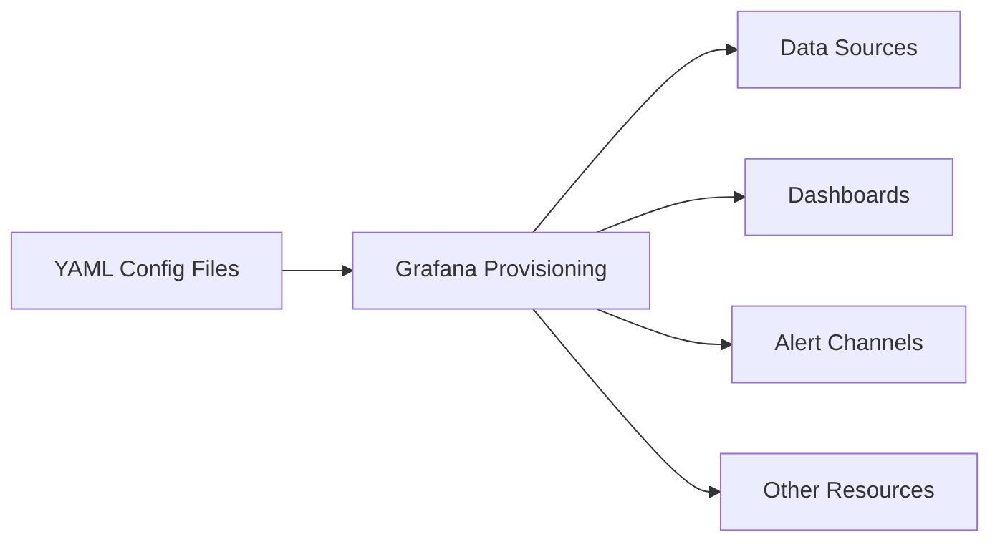

# Data Source Provisioning

## Introduction

Data Source Provisioning is a powerful feature in Grafana that allows you to automate the creation, configuration, and management of data sources. Instead of manually configuring data sources through the Grafana UI, provisioning enables you to define your data sources in YAML files, which can be version-controlled and automatically applied when Grafana starts up.

This approach is particularly valuable in environments where:
- You need to set up multiple Grafana instances with the same configurations
- You're implementing infrastructure as code practices
- You want to automate the deployment process
- You need to ensure consistent configurations across environments

In this guide, we'll explore how to implement data source provisioning in Grafana, from basic setup to advanced configurations.

## Understanding Provisioning in Grafana

Before diving into data source provisioning specifically, let's understand what provisioning means in the context of Grafana.

Provisioning in Grafana refers to the automatic setup and configuration of various components including:
- Data sources
- Dashboards
- Alert notification channels
- Organization preferences

Provisioning allows you to define these configurations in files that are read when Grafana starts, making it easier to manage and maintain consistent environments.



## Setting Up Data Source Provisioning

Let's get started with setting up data source provisioning in Grafana.

### Step 1: Create the Provisioning Directory Structure

Grafana looks for provisioning files in the `provisioning` directory, which contains subdirectories for different types of resources. By default, this directory is located at:

- `/etc/grafana/provisioning` for Linux installations
- `<GRAFANA_INSTALL_DIR>/conf/provisioning` for other installations

Create a directory structure like this:

```
/etc/grafana/provisioning/
├── datasources/
│   └── your-datasource-config.yaml
├── dashboards/
├── notifiers/
└── access-control/
```

### Step 2: Create a Data Source Configuration File

Now, let's create a YAML file to define our data source. Here's a basic template:

```yaml
apiVersion: 1

datasources:
  - name: Prometheus
    type: prometheus
    access: proxy
    url: http://prometheus:9090
    isDefault: true
    version: 1
    editable: false
```

Save this file as `prometheus.yaml` in the `provisioning/datasources/` directory.

### Step 3: Understanding the Configuration Options

Let's break down the key configuration options:

| Option | Description |
|--------|-------------|
| `name` | The name of the data source as it will appear in Grafana |
| `type` | The type of data source (prometheus, mysql, elasticsearch, etc.) |
| `access` | How Grafana accesses the data source: `proxy` or `direct` |
| `url` | The URL of the data source |
| `isDefault` | Set to `true` to make this the default data source |
| `version` | The version of the data source plugin |
| `editable` | Whether users can edit the data source via the UI |

### Step 4: Restart Grafana

After creating your configuration file, restart Grafana to apply the changes:

```bash
sudo systemctl restart grafana-server
```

When Grafana starts, it will read the configuration file and automatically create the defined data source.

## Advanced Data Source Provisioning

Now that we understand the basics, let's explore some more advanced configuration options.

### Multiple Data Sources

You can define multiple data sources in a single YAML file:

```yaml
apiVersion: 1

datasources:
  - name: Prometheus
    type: prometheus
    access: proxy
    url: http://prometheus:9090
    isDefault: true
    
  - name: InfluxDB
    type: influxdb
    access: proxy
    url: http://influxdb:8086
    database: metrics
    user: grafana
    secureJsonData:
      password: "password123"
```

### Secure Credentials

For sensitive information like passwords, you can use the `secureJsonData` field:

```yaml
apiVersion: 1

datasources:
  - name: MySQL Production
    type: mysql
    url: mysql-prod:3306
    database: grafana_metrics
    user: grafana_user
    secureJsonData:
      password: "your-secure-password"
```

When Grafana reads this file, it will encrypt the password and store it securely.

### Using Environment Variables

You can also use environment variables in your configuration:

```yaml
apiVersion: 1

datasources:
  - name: Elasticsearch
    type: elasticsearch
    access: proxy
    url: ${ELASTICSEARCH_URL}
    database: metrics
    jsonData:
      esVersion: 70
      timeField: "@timestamp"
```

For this to work, you would need to set the `ELASTICSEARCH_URL` environment variable before starting Grafana.

### Database-Specific Configuration

Different data sources have specific configuration options available in the `jsonData` field:

#### Prometheus Example:

```yaml
apiVersion: 1

datasources:
  - name: Prometheus
    type: prometheus
    access: proxy
    url: http://prometheus:9090
    jsonData:
      httpMethod: POST
      timeInterval: "5s"
      queryTimeout: "30s"
      exemplarTraceIdDestinations:
        - name: traceID
          datasourceUid: tempo
```

#### Grafana Loki Example:

```yaml
apiVersion: 1

datasources:
  - name: Loki
    type: loki
    access: proxy
    url: http://loki:3100
    jsonData:
      maxLines: 1000
      derivedFields:
        - name: "traceID"
          matcherRegex: "traceID=(\\w+)"
          url: "${__value.raw}"
          datasourceUid: "tempo"
```

## Real-World Example: Setting Up a Complete Monitoring Stack

Let's look at a real-world example where we provision multiple data sources for a complete monitoring stack:

```yaml
apiVersion: 1

datasources:
  - name: Prometheus
    type: prometheus
    access: proxy
    url: http://prometheus:9090
    isDefault: true
    
  - name: Loki
    type: loki
    access: proxy
    url: http://loki:3100
    jsonData:
      maxLines: 1000
      
  - name: Tempo
    type: tempo
    access: proxy
    url: http://tempo:3200
    uid: tempo
    
  - name: Postgres Metrics
    type: postgres
    url: db-server:5432
    database: metrics_db
    user: grafana_metrics
    secureJsonData:
      password: "db-password"
    jsonData:
      sslmode: "require"
```

This configuration sets up:
1. Prometheus for metrics monitoring
2. Loki for log aggregation
3. Tempo for distributed tracing
4. PostgreSQL for custom metrics storage

## Provisioning in Docker Environments

If you're running Grafana in Docker, you can mount your provisioning directory:

```bash
docker run -d \
  -p 3000:3000 \
  --name=grafana \
  -v $(pwd)/provisioning:/etc/grafana/provisioning \
  grafana/grafana
```

## Provisioning in Kubernetes with Helm

If you're using Kubernetes with Helm, you can include your data source configurations in your values file:

```yaml
grafana:
  datasources:
    datasources.yaml:
      apiVersion: 1
      datasources:
        - name: Prometheus
          type: prometheus
          url: http://prometheus-server
          access: proxy
          isDefault: true
```

## Best Practices for Data Source Provisioning

1. **Version Control**: Store your provisioning files in a version control system like Git
2. **Environment-Specific Configurations**: Use environment variables for values that change between environments
3. **Secrets Management**: Use a secure method to manage sensitive information like database passwords
4. **Testing**: Test your provisioning files in a development environment before deploying to production
5. **Documentation**: Comment your YAML files to describe the purpose of each data source
6. **Naming Conventions**: Use consistent naming conventions for your data sources

## Troubleshooting

If you encounter issues with provisioning, check these common problems:

### Data Source Not Appearing

If your data source doesn't appear after restarting Grafana:
- Verify the file is in the correct location
- Check the Grafana logs for provisioning errors
- Ensure the YAML syntax is valid

### Authentication Issues

If you're having authentication problems:
- Check if credentials are correctly specified
- Verify the `secureJsonData` section is properly formatted
- Look for errors in the Grafana logs

### File Permissions

Make sure the Grafana service has read permissions for the provisioning files:

```bash
sudo chown -R grafana:grafana /etc/grafana/provisioning
```

## Deleting Provisioned Data Sources

By default, data sources that were provisioned cannot be deleted through the UI. To allow deletion, set `editable: true` in your configuration.

To delete a provisioned data source, either:
1. Remove it from the provisioning file and restart Grafana, or
2. Set `deleteDatasources` in your YAML file:

```yaml
apiVersion: 1

deleteDatasources:
  - name: Prometheus
    orgId: 1
    
datasources:
  # Your current data sources here
```

## Summary

Data Source Provisioning is a powerful feature that allows you to automate the creation and management of data sources in Grafana. By using YAML configuration files, you can:

- Implement Infrastructure as Code practices
- Ensure consistent configurations across environments
- Automate the deployment process
- Maintain version control of your Grafana setup

This approach is especially valuable in enterprise environments or when managing multiple Grafana instances, saving time and reducing configuration errors.

## Additional Resources

To further enhance your understanding of Grafana provisioning:

- [Official Grafana Provisioning Documentation](https://grafana.com/docs/grafana/latest/administration/provisioning/)
- [Grafana Data Source API Documentation](https://grafana.com/docs/grafana/latest/developers/http_api/data_source/)
- [Sample Provisioning Templates Repository](https://github.com/grafana/grafana/tree/main/conf/provisioning/datasources)

## Exercises

To practice what you've learned, try these exercises:

1. Create a provisioning file for a Prometheus data source with basic authentication
2. Set up a provisioning file with multiple data sources of different types
3. Create a configuration that uses environment variables for different deployment environments
4. Implement a solution to manage secrets securely in your provisioning setup
5. Write a script that generates provisioning files based on a template

By mastering Data Source Provisioning, you'll be able to efficiently manage your Grafana deployments and implement solid DevOps practices for your monitoring infrastructure.