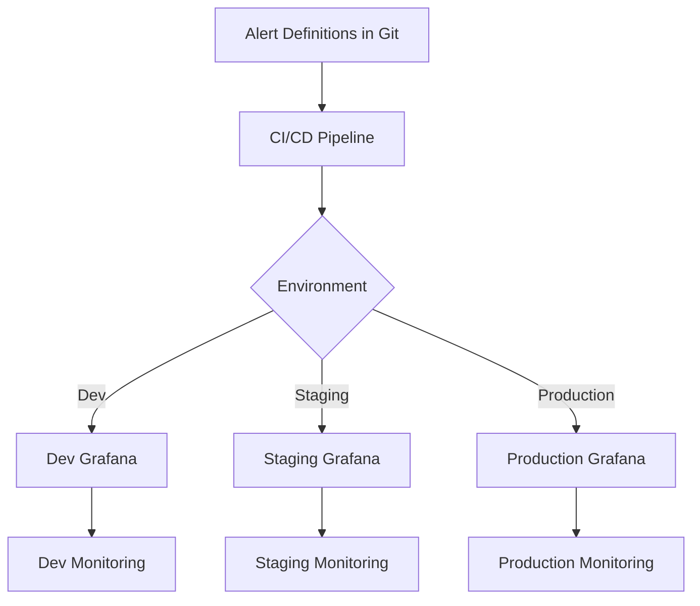

# Alert Provisioning

## Introduction

Alert provisioning in Grafana allows you to automate the creation and management of alerting rules and notification policies through configuration files rather than the UI. This approach is particularly valuable for large-scale deployments, consistent environments, and infrastructure-as-code practices. 

In this guide, we'll explore how to provision alerts in Grafana, the benefits of this approach, and practical examples to help you implement alert provisioning in your own monitoring environments.

## What is Alert Provisioning?

Alert provisioning is the practice of defining your Grafana alerting configuration as code or configuration files that can be version-controlled, automated, and deployed consistently across multiple Grafana instances. This contrasts with manual alert creation through the Grafana UI.

### Key Benefits

- **Version Control**: Track changes to your alerting configuration over time
- **Automation**: Integrate with CI/CD pipelines for automated deployments
- **Consistency**: Ensure identical alert configurations across environments
- **Scalability**: Efficiently manage large numbers of alerts
- **Disaster Recovery**: Quickly restore alert configurations if needed

## Alert Provisioning Methods

Grafana supports two primary methods for provisioning alerts:

1. **File-based provisioning**: Using YAML configuration files
2. **Terraform**: Using the Grafana Terraform provider

Let's explore each approach.

## File-Based Alert Provisioning

Grafana can load alert rules and notification policies from YAML files stored in specific directories.

### Directory Structure

For file-based provisioning, Grafana looks for configuration files in the following locations:

```
/etc/grafana/provisioning/alerting/
├── rules/
│   ├── cpu_alerts.yaml
│   └── memory_alerts.yaml
└── notification_policies/
    └── team_policies.yaml
```

### Provisioning Alert Rules

Alert rules are defined in YAML files with a specific structure. Here's an example:

```yaml
apiVersion: 1

groups:
  - name: CPU Usage Alerts
    folder: Infrastructure
    interval: 60s
    rules:
      - name: High CPU Usage
        condition: B
        data:
          - refId: A
            datasourceUid: PBFA97CFB590B2093
            model:
              expr: avg by(instance) (rate(node_cpu_seconds_total{mode!="idle"}[5m])) * 100
              refId: A
          - refId: B
            datasourceUid: __expr__
            model:
              conditions:
                - evaluator:
                    params: [80]
                    type: gt
                  operator:
                    type: and
                  query:
                    params: [A]
                  reducer:
                    type: avg
              refId: B
        noDataState: OK
        execErrState: Error
        for: 5m
        labels:
          severity: warning
          category: system
        annotations:
          summary: High CPU usage on {{ $labels.instance }}
          description: "CPU usage has been above 80% for 5 minutes. Current value: {{ $value }}%"
```

### Provisioning Notification Policies

Notification policies define how alerts are routed to notification channels. Here's an example:

```yaml
apiVersion: 1

policies:
  - receiver: default-email
    group_by: ['alertname']
    routes:
      - receiver: ops-team-slack
        group_by: ['alertname', 'instance']
        matchers:
          - severity =~ "critical|warning"
            category = "system"
        group_wait: 30s
        group_interval: 5m
        repeat_interval: 4h
        mute_time_intervals:
          - weekends
      - receiver: dev-team-slack
        group_by: ['alertname', 'job']
        matchers:
          - category = "application"
        group_wait: 45s
```

## Provisioning with Terraform

For teams already using Terraform for infrastructure management, Grafana's Terraform provider offers another way to provision alerts.

### Installing the Grafana Terraform Provider

Add the following to your Terraform configuration:

```hcl
terraform {
  required_providers {
    grafana = {
      source = "grafana/grafana"
      version = "1.28.0"
    }
  }
}

provider "grafana" {
  url  = "http://grafana.example.com"
  auth = var.grafana_api_key
}
```

### Creating Alert Rules with Terraform

Here's an example of defining an alert rule with Terraform:

```hcl
resource "grafana_rule_group" "cpu_alerts" {
  name             = "CPU Usage Alerts"
  folder_uid       = grafana_folder.infrastructure.uid
  interval_seconds = 60
  
  rule {
    name           = "High CPU Usage"
    for            = "5m"
    condition      = "B"
    no_data_state  = "OK"
    exec_err_state = "Error"
    
    data {
      ref_id = "A"
      datasource_uid = "PBFA97CFB590B2093"
      
      relative_time_range {
        from = 600
        to   = 0
      }
      
      model = jsonencode({
        expr = "avg by(instance) (rate(node_cpu_seconds_total{mode!=\"idle\"}[5m])) * 100"
        refId = "A"
      })
    }
    
    data {
      ref_id = "B"
      datasource_uid = "__expr__"
      
      relative_time_range {
        from = 0
        to   = 0
      }
      
      model = jsonencode({
        conditions = [{
          evaluator = {
            params = [80]
            type   = "gt"
          }
          operator = {
            type = "and"
          }
          query = {
            params = ["A"]
          }
          reducer = {
            type = "avg"
          }
        }]
        refId = "B"
      })
    }
    
    labels = {
      severity = "warning"
      category = "system"
    }
    
    annotations = {
      summary     = "High CPU usage on {{ $labels.instance }}"
      description = "CPU usage has been above 80% for 5 minutes. Current value: {{ $value }}%"
    }
  }
}
```

## Practical Example: Implementing Alert Provisioning for a Web Application

Let's walk through a real-world example of setting up provisioned alerts for a web application environment.

### Scenario

You manage a web application with:
- Frontend services
- Backend API services
- Database servers
- Messaging queue

### Step 1: Define Your Alert Rules Structure

Create a directory structure for your alert provisioning:

```
/provisioning/
├── alerting/
│   ├── rules/
│   │   ├── frontend_alerts.yaml
│   │   ├── backend_alerts.yaml
│   │   ├── database_alerts.yaml
│   │   └── queue_alerts.yaml
│   └── notification_policies/
│       └── team_policies.yaml
```

### Step 2: Create Alert Rules for Frontend Services

In `frontend_alerts.yaml`:

```yaml
apiVersion: 1

groups:
  - name: Frontend Monitoring
    folder: Web Application
    interval: 30s
    rules:
      - name: High Error Rate
        condition: C
        data:
          - refId: A
            datasourceUid: PBFA97CFB590B2093
            model:
              expr: sum(rate(http_requests_total{job="frontend",status=~"5.."}[5m])) / sum(rate(http_requests_total{job="frontend"}[5m])) * 100
              refId: A
          - refId: B
            datasourceUid: __expr__
            model:
              expression: $A
              type: reduce
              reducer: mean
              refId: B
          - refId: C
            datasourceUid: __expr__
            model:
              conditions:
                - evaluator:
                    params: [5]
                    type: gt
                  operator:
                    type: and
                  query:
                    params: [B]
                  reducer:
                    type: last
              refId: C
        noDataState: NoData
        execErrState: Error
        for: 2m
        labels:
          severity: critical
          team: frontend
        annotations:
          summary: "High error rate on frontend services"
          description: "Error rate is {{ $value | printf \"%.2f\" }}%, which exceeds the threshold of 5%"
      
      - name: Slow Page Load Time
        condition: C
        data:
          - refId: A
            datasourceUid: PBFA97CFB590B2093
            model:
              expr: avg(rate(page_load_time_seconds_sum{job="frontend"}[5m]) / rate(page_load_time_seconds_count{job="frontend"}[5m]))
              refId: A
          - refId: B
            datasourceUid: __expr__
            model:
              expression: $A
              refId: B
          - refId: C
            datasourceUid: __expr__
            model:
              conditions:
                - evaluator:
                    params: [3]
                    type: gt
                  operator:
                    type: and
                  query:
                    params: [B]
                  reducer:
                    type: last
              refId: C
        noDataState: NoData
        execErrState: Error
        for: 5m
        labels:
          severity: warning
          team: frontend
        annotations:
          summary: "Slow page load times detected"
          description: "Average page load time is {{ $value | printf \"%.2f\" }} seconds, which exceeds the threshold of 3 seconds"
```

### Step 3: Define Notification Routing Policy

In `team_policies.yaml`:

```yaml
apiVersion: 1

policies:
  - receiver: default-email
    group_by: ['alertname']
    routes:
      - receiver: frontend-team-slack
        group_by: ['alertname', 'instance']
        matchers:
          - team = "frontend"
        group_wait: 30s
        group_interval: 5m
        repeat_interval: 4h
      - receiver: backend-team-slack
        group_by: ['alertname', 'instance']
        matchers:
          - team = "backend"
        group_wait: 30s
        group_interval: 5m
        repeat_interval: 4h
      - receiver: db-team-slack
        group_by: ['alertname', 'instance']
        matchers:
          - team = "database"
        group_wait: 30s
        group_interval: 5m
        repeat_interval: 4h
```

### Step 4: Configure Grafana to Use Provisioned Alerts

Update your `grafana.ini` configuration:

```ini
[unified_alerting]
enabled = true

[paths]
provisioning = /etc/grafana/provisioning
```

## Using Provisioning for Consistency Across Environments

One powerful use case for alert provisioning is maintaining consistency across development, staging, and production environments.

### Templating Environment-Specific Values

You can use environment variables or template processors to customize alert thresholds for different environments:

```yaml
apiVersion: 1

groups:
  - name: CPU Usage Alerts
    folder: Infrastructure
    interval: 60s
    rules:
      - name: High CPU Usage - ${ENV}
        condition: B
        data:
          - refId: A
            datasourceUid: ${PROMETHEUS_DS_UID}
            model:
              expr: avg by(instance) (rate(node_cpu_seconds_total{env="${ENV}",mode!="idle"}[5m])) * 100
              refId: A
          - refId: B
            datasourceUid: __expr__
            model:
              conditions:
                - evaluator:
                    params: [${CPU_THRESHOLD}]
                    type: gt
                  operator:
                    type: and
                  query:
                    params: [A]
                  reducer:
                    type: avg
              refId: B
        labels:
          severity: warning
          environment: ${ENV}
```

### Workflow Diagram

Here's a visualization of a typical alert provisioning workflow:



## Best Practices for Alert Provisioning

1. **Use Version Control**: Keep all alert configurations in a Git repository.
2. **Test Alert Rules**: Validate alert rules before deploying to production.
3. **Document Alerts**: Include clear descriptions for each alert rule.
4. **Use Naming Conventions**: Follow consistent naming for alert rules and groups.
5. **Parameterize Thresholds**: Use variables for thresholds that might need adjustment.
6. **Implement CI/CD**: Automate the deployment of alert configurations.
7. **Review Regularly**: Periodically review alerts for effectiveness and false positives.

## Common Challenges and Solutions

| Challenge | Solution |
|-----------|----------|
| Managing duplicate alerts | Use linting tools to detect duplicates |
| Handling alert rule changes | Implement change review processes |
| Dealing with false positives | Regularly tune alert thresholds |
| Alert fatigue | Implement proper grouping and severity levels |
| Notifying the right teams | Use labels and routing to target notifications |

## Summary

Alert provisioning is a powerful capability in Grafana that enables you to manage alerts as code. By provisioning alerts using either YAML files or Terraform, you can:

- Automate alert configuration across multiple environments
- Version control your alerting rules
- Ensure consistency in your monitoring setup
- Scale your alerting system efficiently

This approach aligns with modern DevOps practices and helps teams maintain robust monitoring systems that can grow with their applications.

## Further Learning

Try these exercises to deepen your understanding:

1. Convert an existing dashboard alert to a provisioned alert rule
2. Set up a multi-environment alert provisioning system for a test application
3. Implement a CI/CD pipeline that validates and deploys alert configurations
4. Create a notification policy that routes different types of alerts to appropriate channels

## Additional Resources

- [Grafana Alerting Documentation](https://grafana.com/docs/grafana/latest/alerting/)
- [Grafana Terraform Provider](https://registry.terraform.io/providers/grafana/grafana/latest/docs)
- [Alert Provisioning API Reference](https://grafana.com/docs/grafana/latest/developers/http_api/alerting_provisioning/)
- [Grafana Alerting Best Practices](https://grafana.com/docs/grafana/latest/alerting/fundamentals/alerting-rules/best-practices/)