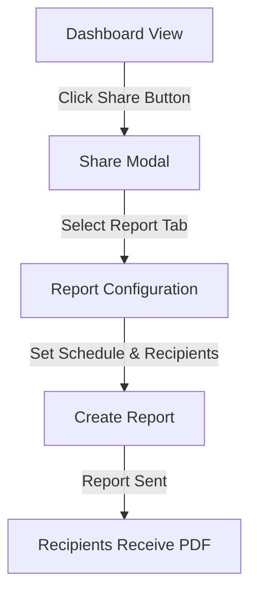

# Reporting in Grafana

## Introduction

Reporting is a powerful Grafana feature that allows you to automatically generate and distribute dashboard snapshots as PDF documents. This capability bridges the gap between Grafana's interactive dashboards and the need to share insights with stakeholders who may not have direct access to your Grafana instance.

In this guide, you'll learn how to create, schedule, and manage reports in Grafana. You'll understand the different reporting options available and how to effectively use them to share your data visualizations with others.

:::note
Reporting is an Enterprise feature in Grafana. You'll need a Grafana Enterprise license to use this functionality. The examples in this guide assume you're using Grafana 9.0 or newer.
:::

## Understanding Grafana Reporting

Grafana reporting allows you to:

- Generate PDF documents from any dashboard
- Schedule automated report generation
- Distribute reports via email
- Customize report content and layout
- Include specific time ranges and template variables

Reports capture the state of your dashboard at the time of generation, preserving all visualizations, annotations, and data exactly as they appear in the UI.

## Setting Up Reporting

Before you can create reports, you need to ensure your Grafana instance is correctly configured:

1. Verify you have a valid Grafana Enterprise license
2. Configure an SMTP server for email delivery
3. Ensure the reporting service is enabled in your Grafana configuration

### Configuring SMTP for Report Delivery

To send reports via email, add these settings to your Grafana configuration file (`grafana.ini`):

```ini
[smtp]
enabled = true
host = smtp.example.com:587
user = youremail@example.com
password = yourpassword
from_address = grafana@your-organization.com
from_name = Grafana Reporting
```

## Creating Your First Report

Let's walk through creating a basic report:

1. Navigate to any dashboard you want to report on
2. Click the "Share" button in the top navigation bar
3. Select the "Report" tab
4. Configure your report settings

Here's how the process looks in action:



### Configuring Report Settings

When setting up a report, you'll need to configure:

**Basic Information:**
- Report name
- Description (optional)
- Dashboard to report on

**Schedule:**
- One-time or recurring
- Frequency (hourly, daily, weekly, monthly)
- Time to generate report

**Format and Layout:**
- Paper size (A4, US Letter, etc.)
- Orientation (portrait or landscape)
- Scale factor for visualizations

**Recipients:**
- Email addresses for report delivery
- Optional message to include with the report

Here's an example of the configuration code that Grafana uses behind the scenes:

```json
{
  "name": "Weekly Sales Dashboard",
  "dashboardId": 3,
  "schedule": {
    "frequency": "weekly",
    "dayOfWeek": "monday",
    "timeOfDay": "09:00",
    "timeZone": "America/New_York"
  },
  "formats": ["pdf"],
  "options": {
    "orientation": "landscape",
    "layout": "grid"
  },
  "recipients": [
    {
      "type": "email",
      "address": "team@example.com"
    }
  ]
}
```

## Advanced Reporting Features

Once you're comfortable with basic reporting, you can explore these advanced features:

### Custom Time Ranges

You can specify exactly what time period your report should cover:

- Relative time (last 24 hours, last 7 days, etc.)
- Absolute time with specific start and end dates
- Dashboard's current time range

### Template Variables

If your dashboard uses template variables, you can set specific values for these variables in your reports:

```javascript
const reportOptions = {
  templateVars: {
    "env": "production",
    "server": "web-01",
    "datacenter": "us-west"
  }
}
```

### Report Branding

Customize the appearance of your reports with:

- Organization logo
- Custom headers and footers
- Branded color schemes
- Text formatting options

To add your organization's branding to reports:

1. Navigate to **Configuration → Report Settings**
2. Upload your logo image
3. Configure header and footer text
4. Save your settings

## Managing Reports

As your collection of reports grows, proper management becomes essential:

### Viewing Report History

Grafana maintains a history of all generated reports. To view this history:

1. Navigate to **Dashboards → Reports**
2. Browse the list of reports
3. Click on any report to see its history

Each entry shows:
- Generation timestamp
- Status (success or failure)
- Recipient information
- Download link for the PDF

### Editing and Deleting Reports

To modify an existing report:

1. Go to **Dashboards → Reports**
2. Find the report you want to edit
3. Click the "Edit" button
4. Make your changes
5. Save the updated report

To delete a report:

1. Go to **Dashboards → Reports**
2. Find the report you want to delete
3. Click the "Delete" button
4. Confirm deletion

## Practical Examples

Let's explore some common use cases for Grafana reporting:

### Example 1: Weekly System Performance Report

Create a weekly report that sends system performance metrics to your operations team:

```javascript
// Report configuration for weekly system performance
const weeklySystemReport = {
  name: "Weekly System Performance",
  dashboard: "system-overview",
  schedule: {
    frequency: "weekly",
    day: "monday",
    time: "06:00"
  },
  timeRange: {
    from: "now-7d",
    to: "now"
  },
  recipients: ["ops-team@example.com"]
};
```

This report would capture a full week's worth of system metrics every Monday morning and deliver it to the operations team before they start their week.

### Example 2: Monthly Executive Summary

For executive stakeholders who need regular updates:

```javascript
// Report configuration for monthly executive summary
const monthlyExecutiveReport = {
  name: "Monthly Business KPIs",
  dashboard: "executive-overview",
  schedule: {
    frequency: "monthly",
    day: "1",
    time: "07:00"
  },
  timeRange: {
    from: "now-1M/M",
    to: "now-1d/d"
  },
  recipients: ["executives@example.com"],
  message: "Monthly performance summary for review before our leadership meeting."
};
```

### Example 3: On-Demand Incident Report

When an incident occurs, you might want to generate a one-time report:

```javascript
// Report configuration for incident reporting
const incidentReport = {
  name: "Incident #1234 Analysis",
  dashboard: "service-monitoring",
  schedule: {
    type: "once",
    time: "now"
  },
  timeRange: {
    from: "2023-06-15T14:30:00Z",
    to: "2023-06-15T16:30:00Z"
  },
  recipients: ["incident-response@example.com"],
  message: "Metrics during the outage period for incident #1234."
};
```

## Troubleshooting Common Issues

Here are solutions for some common reporting problems:

### Missing Visualizations

If visualizations are missing from your reports:

```javascript
// Ensure proper rendering with these settings
const reportOptions = {
  renderTimeout: 120, // Increase rendering timeout (in seconds)
  renderWaitTime: 5000, // Wait time after dashboard loads (in milliseconds)
  layout: "grid" // Use grid layout instead of single panel
};
```

### Email Delivery Problems

If reports aren't being delivered via email:

1. Check your SMTP configuration
2. Verify recipient email addresses
3. Check Grafana server logs for SMTP errors
4. Test email delivery with a one-time report

### Large Reports Failing

For dashboards with many panels:

```javascript
// Configuration for large dashboards
const largeReportOptions = {
  renderTimeout: 300, // 5 minutes
  concurrency: 1, // Render panels one by one
  layout: "simple" // Use simpler layout
};
```

## Summary

Grafana's reporting capabilities provide a powerful way to share your dashboards and insights with stakeholders who may not have direct access to your Grafana instance. By automating the generation and distribution of PDF reports, you can ensure that everyone stays informed without needing to manually export and share dashboards.

In this guide, you've learned:

- How to set up and configure reporting in Grafana
- Creating basic and advanced reports
- Scheduling reports to run automatically
- Customizing report content and appearance
- Managing your collection of reports
- Troubleshooting common reporting issues

Reporting bridges the gap between Grafana's interactive dashboards and the need for formal documentation and communication with stakeholders outside your immediate technical team.

## Additional Resources

To further enhance your Grafana reporting skills:

- Explore Grafana's official documentation on reporting
- Practice creating reports with different time ranges and template variables
- Experiment with different dashboard layouts to optimize report readability
- Set up report templates for consistent reporting across your organization

## Exercises

To solidify your understanding of Grafana reporting:

1. Create a daily report for a dashboard of your choice, scheduled to deliver at the start of your workday.
2. Set up a weekly report that compares this week's metrics to the same period last week.
3. Create a report with specific template variable selections that focuses on a particular service or environment.
4. Configure a report with custom branding for your organization.
5. Create a one-time report for a specific incident or event that occurred in your systems.