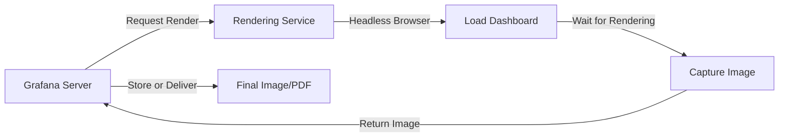

# Image Rendering in Grafana

## Introduction

Grafana's image rendering feature allows you to transform your interactive dashboards into static images and PDFs. This capability is invaluable when you need to share dashboards with stakeholders who don't have access to Grafana, include visualizations in reports, or create automated reporting workflows. In this tutorial, we'll explore how Grafana renders images, set up the rendering service, and learn various ways to use this powerful feature in real-world scenarios.

## Understanding Image Rendering in Grafana

At its core, Grafana's image rendering works by taking snapshots of dashboards or panels and converting them into static images. This process happens through a headless browser instance that loads the dashboard, waits for all visualizations to render, and then captures the result.

### How It Works



Grafana provides two methods for image rendering:

1. **Plugin Rendering Service**: A built-in rendering service included with Grafana
2. **Remote Rendering Service**: A separate service that can be deployed independently

## Setting Up Image Rendering

### Using the Built-in Rendering Service

The built-in rendering service is the simplest way to get started. It requires minimal configuration but may have limitations in high-volume environments.

To enable the built-in rendering service, add these settings to your Grafana configuration file:

```ini
[rendering]
# Enable the rendering service
server_url = 
# Set to true to enable the built-in rendering service
renderer = true
```

### Installing Dependencies

The rendering service requires some dependencies to function properly:

```bash
# For Debian/Ubuntu
apt-get install -y libx11-6 libx11-xcb1 libxcomposite1 libxcursor1 libxdamage1 \
    libxext6 libxfixes3 libxi6 libxrender1 libxtst6 libglib2.0-0 libnss3 libcups2 \
    libdbus-1-3 libxss1 libxrandr2 libgbm1 libasound2 libatk1.0-0 libatk-bridge2.0-0 \
    libpangocairo-1.0-0 libgtk-3-0

# For RHEL/CentOS
yum install -y liberation-fonts
```

### Using a Remote Rendering Service

For production environments or when you need more rendering capacity, a remote rendering service is recommended:

1. Install the renderer plugin on a separate server:

```bash
grafana-cli plugins install grafana-image-renderer
```

2. Configure Grafana to use the remote service:

```ini
[rendering]
server_url = http://remote-rendering-service:8081/render
callback_url = http://grafana-server:3000/
```

## Rendering Dashboards as Images

### Using the UI to Export Images

The simplest way to use image rendering is through the Grafana UI:

1. Open a dashboard
2. Click the "Share" button in the top navigation bar
3. Select the "Download" tab
4. Choose your desired format (PNG, PDF, or CSV)
5. Configure additional options like dimensions or scaling
6. Click "Download" to generate and download the image

### Using the API for Programmatic Rendering

For automated workflows, Grafana provides API endpoints to render dashboards:

```bash
# Render a dashboard as PNG
curl -H "Authorization: Bearer YOUR_API_KEY" \
     "http://your-grafana-instance/api/dashboards/uid/YOUR_DASHBOARD_UID/png" \
     --output dashboard.png

# Render a dashboard as PDF
curl -H "Authorization: Bearer YOUR_API_KEY" \
     "http://your-grafana-instance/api/dashboards/uid/YOUR_DASHBOARD_UID/pdf" \
     --output dashboard.pdf
```

The API supports several query parameters to customize the output:

- `width`: Width in pixels (default: 800)
- `height`: Height in pixels (default: 600)
- `scale`: Scale factor (default: 1)
- `timeout`: Rendering timeout in seconds (default: 60)
- `from` & `to`: Time range for the dashboard

Example with parameters:

```bash
curl -H "Authorization: Bearer YOUR_API_KEY" \
     "http://your-grafana-instance/api/dashboards/uid/YOUR_DASHBOARD_UID/png?width=1200&height=800&from=now-6h&to=now" \
     --output custom_dashboard.png
```

## Creating Automated Reports

### Scheduled Reports with Grafana Enterprise

Grafana Enterprise includes a reporting feature that leverages image rendering to create and distribute reports on a schedule:

1. Navigate to Dashboards → Reports
2. Click "New Report"
3. Select a dashboard to include in the report
4. Set a schedule (hourly, daily, weekly, monthly)
5. Add recipients and configure delivery options
6. Save the report configuration

### Building Custom Reporting Solutions

For Grafana Open Source users or custom workflows, you can build automated reporting using the API:

```javascript
// Example Node.js script to generate and email a dashboard image weekly
const axios = require('axios');
const nodemailer = require('nodemailer');
const fs = require('fs');
const cron = require('node-cron');

// Schedule to run every Monday at 8:00 AM
cron.schedule('0 8 * * 1', async () => {
  try {
    // Generate the dashboard image
    const response = await axios({
      method: 'get',
      url: 'http://your-grafana/api/dashboards/uid/YOUR_DASHBOARD_UID/png',
      responseType: 'arraybuffer',
      headers: {
        'Authorization': 'Bearer YOUR_API_KEY'
      }
    });
    
    fs.writeFileSync('weekly-report.png', response.data);
    
    // Send email with the image attached
    const transporter = nodemailer.createTransport({
      host: 'smtp.example.com',
      port: 587,
      secure: false,
      auth: {
        user: 'your-email@example.com',
        pass: 'your-password'
      }
    });
    
    await transporter.sendMail({
      from: 'your-email@example.com',
      to: 'recipient@example.com',
      subject: 'Weekly Dashboard Report',
      text: 'Please find attached the weekly dashboard report.',
      attachments: [{
        filename: 'weekly-report.png',
        path: './weekly-report.png'
      }]
    });
    
    console.log('Weekly report sent successfully');
  } catch (error) {
    console.error('Failed to generate or send report:', error);
  }
});
```

## Embedding Rendered Images

### Embedding in External Applications

You can embed rendered dashboard images in external applications using iframes or direct image references:

```html
<!-- Embedding as an image with auto-refresh -->


<!-- Using an iframe for more control -->
<iframe src="http://your-grafana/d-solo/YOUR_DASHBOARD_UID/dashboard-name?orgId=1&panelId=4&width=800&height=400&render=image"
        width="800"
        height="400"
        frameborder="0"></iframe>
```

### Integrating with Documentation Systems

For tools like Confluence, you can use macros or the Grafana plugin to embed rendered images:

```html
<!-- Confluence macro example -->
<ac:structured-macro ac:name="html">
  <ac:plain-text-body><![CDATA[
    
  ]]></ac:plain-text-body>
</ac:structured-macro>
```

## Troubleshooting Image Rendering Issues

### Common Problems and Solutions

1. **Images Not Rendering**:
   - Check that dependencies are installed
   - Verify network connectivity to the rendering service
   - Check browser console logs for errors

2. **Text or Elements Missing in Rendered Images**:
   - Ensure custom fonts are available to the rendering service
   - Adjust panel sizes to avoid cut-off content
   - Increase rendering timeout for complex dashboards

3. **High CPU Usage**:
   - Consider using a remote rendering service
   - Limit concurrent rendering requests
   - Optimize dashboard complexity

### Debug Logs

Enable debug logging to troubleshoot rendering issues:

```ini
[log]
filters = rendering:debug
```

Check logs for error messages related to the rendering service:

```bash
grep "rendering" /var/log/grafana/grafana.log
```

## Best Practices for Image Rendering

1. **Optimize Dashboard Performance**:
   - Limit the number of panels and queries
   - Use appropriate time ranges
   - Consider time zone differences for scheduled reports

2. **Ensure Consistent Rendering**:
   - Use fixed time ranges for reports
   - Test rendering at different screen sizes
   - Add appropriate margins around visualizations

3. **Secure Your Rendering Service**:
   - Use API keys with minimal permissions
   - Set up network isolation for the rendering service
   - Implement rate limiting to prevent abuse

## Practical Example: Creating a Weekly KPI Report

Let's implement a practical example that generates a weekly KPI report PDF from a Grafana dashboard:

1. First, create a dedicated dashboard with the KPIs you want to include
2. Set up the following script to generate and email the report every Monday:

```javascript
const axios = require('axios');
const nodemailer = require('nodemailer');
const fs = require('fs');
const cron = require('node-cron');
const moment = require('moment');

// Schedule to run every Monday at 7:00 AM
cron.schedule('0 7 * * 1', async () => {
  try {
    const now = moment();
    const weekStart = moment().subtract(7, 'days').startOf('day');
    const weekEnd = moment().subtract(1, 'days').endOf('day');
    
    // Format dates for the report title and time range
    const reportTitle = `Weekly KPI Report: ${weekStart.format('MMM D')} - ${weekEnd.format('MMM D, YYYY')}`;
    const fromTime = weekStart.unix() * 1000;
    const toTime = weekEnd.unix() * 1000;
    
    // Generate the dashboard PDF
    const response = await axios({
      method: 'get',
      url: `http://your-grafana/api/dashboards/uid/YOUR_DASHBOARD_UID/pdf?from=${fromTime}&to=${toTime}&width=1200&height=800`,
      responseType: 'arraybuffer',
      headers: {
        'Authorization': 'Bearer YOUR_API_KEY'
      }
    });
    
    const filename = `kpi-report-${weekStart.format('YYYY-MM-DD')}.pdf`;
    fs.writeFileSync(filename, response.data);
    
    // Send email with the PDF attached
    const transporter = nodemailer.createTransport({
      host: 'smtp.example.com',
      port: 587,
      secure: false,
      auth: {
        user: 'reports@example.com',
        pass: 'your-password'
      }
    });
    
    await transporter.sendMail({
      from: 'reports@example.com',
      to: ['stakeholder1@example.com', 'stakeholder2@example.com'],
      subject: reportTitle,
      html: `
        <h2>${reportTitle}</h2>
        <p>Please find attached the weekly KPI report.</p>
        <p>This report covers the period from ${weekStart.format('MMMM D')} to ${weekEnd.format('MMMM D, YYYY')}.</p>
        <p>Key highlights:</p>
        <ul>
          <li>System uptime remained at 99.9%</li>
          <li>Average response time: 230ms</li>
          <li>Total transactions: 45,892</li>
        </ul>
        <p>For more details, please see the attached report or visit the <a href="http://your-grafana/d/YOUR_DASHBOARD_UID">live dashboard</a>.</p>
      `,
      attachments: [{
        filename: filename,
        path: `./${filename}`
      }]
    });
    
    console.log(`Weekly KPI report "${reportTitle}" sent successfully`);
    
    // Clean up the file
    fs.unlinkSync(filename);
  } catch (error) {
    console.error('Failed to generate or send KPI report:', error);
  }
});
```

## Summary

Image rendering is a powerful feature in Grafana that extends the utility of your dashboards beyond the interactive UI. We've covered:

- How the rendering service works and how to set it up
- Methods for exporting dashboards as images and PDFs
- Using the API for programmatic image generation
- Creating automated reporting workflows
- Embedding rendered images in external applications
- Troubleshooting and best practices

By leveraging these capabilities, you can ensure that your valuable dashboard insights reach all stakeholders, even those without direct access to Grafana.

## Additional Resources

- [Grafana Image Rendering Documentation](https://grafana.com/docs/grafana/latest/administration/image_rendering/)
- [Grafana Reporting Documentation](https://grafana.com/docs/grafana/latest/enterprise/reporting/)
- [Grafana HTTP API Reference](https://grafana.com/docs/grafana/latest/http_api/dashboard/)

## Exercises

1. Set up the built-in rendering service on your Grafana instance and export a dashboard as a PNG file.
2. Create a simple Node.js script that uses the Grafana API to generate a PDF of a dashboard with a custom time range.
3. Design a dashboard specifically optimized for reporting, considering factors like panel placement, text size, and time ranges.
4. Implement a scheduled report that emails a rendered dashboard to a list of recipients every Monday morning.
5. Create an HTML page that embeds a rendered Grafana panel and refreshes it every 5 minutes.