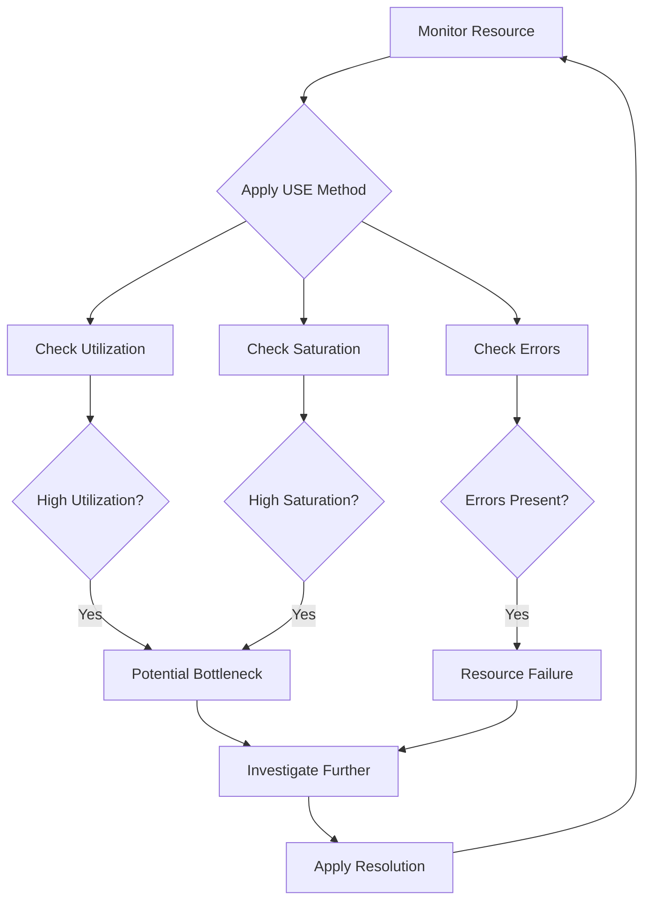

# USE Method (Utilization, Saturation, Errors)

## Introduction

The USE Method is a powerful methodology for analyzing system performance and troubleshooting issues in computer systems. Developed by Brendan Gregg, a renowned performance engineer, this approach provides a systematic way to identify performance bottlenecks by examining three key aspects of every resource: **U**tilization, **S**aturation, and **E**rrors.

In this guide, we'll explore how to implement the USE Method within Grafana to create effective monitoring dashboards that help quickly pinpoint system problems.

## What is the USE Method?

The USE Method directs you to examine:

- **Utilization**: The percentage of time a resource is busy servicing work
- **Saturation**: The degree to which a resource has extra work queued up
- **Errors**: Count of error events

For every major system resource, you should be able to answer these three questions:

1. What is the resource's **utilization**?
2. What is the resource's **saturation**?
3. Are there any **errors** related to this resource?

## Key Resources to Monitor

The USE Method typically applies to these major hardware resources:

- CPU
- Memory
- Network Interfaces
- Storage I/O
- Storage Capacity
- GPU (if applicable)

Let's see how to apply this method using Grafana.

## Implementing USE Method in Grafana

### Prerequisites

To implement the USE Method in Grafana, you'll need:

- A running Grafana instance
- Data sources configured (like Prometheus, InfluxDB, etc.)
- Node exporter or similar agents running on target systems

### Creating a USE Dashboard

#### Step 1: Set Up Dashboard Structure

Start by creating a new dashboard in Grafana and organizing it into row sections for each resource type:

```
CPU → Utilization, Saturation, Errors
Memory → Utilization, Saturation, Errors
Disk → Utilization, Saturation, Errors
Network → Utilization, Saturation, Errors
```

#### Step 2: Configure CPU Panels

Let's start with CPU monitoring panels:

##### CPU Utilization

```sql
100 - (avg by (instance) (irate(node_cpu_seconds_total{mode="idle"}[5m])) * 100)
```

This query shows the percentage of CPU time that is not idle, effectively showing utilization.

##### CPU Saturation

```sql
node_load1 / on(instance) count by(instance) (node_cpu_seconds_total{mode="idle"})
```

This gives us the load average divided by CPU count, which indicates saturation when values exceed 1.

##### CPU Errors

```sql
increase(node_context_switches_total[5m])
```

While not errors directly, excessive context switches can indicate CPU problems.

#### Step 3: Configure Memory Panels

##### Memory Utilization

```sql
(node_memory_MemTotal_bytes - node_memory_MemAvailable_bytes) / node_memory_MemTotal_bytes * 100
```

This shows the percentage of used memory.

##### Memory Saturation

```sql
node_memory_SwapTotal_bytes > 0
  and
(node_memory_SwapTotal_bytes - node_memory_SwapFree_bytes) / node_memory_SwapTotal_bytes * 100
```

This measures swap usage percentage, indicating memory saturation.

##### Memory Errors

```sql
increase(node_vmstat_pgmajfault[5m])
```

Page faults indicate memory access errors.

#### Step 4: Configure Disk I/O Panels

##### Disk Utilization

```sql
rate(node_disk_io_time_seconds_total[5m]) * 100
```

This shows the percentage of time the disk was busy.

##### Disk Saturation

```sql
rate(node_disk_io_time_weighted_seconds_total[5m])
```

This metric includes queue waiting time, indicating saturation.

##### Disk Errors

```sql
increase(node_disk_io_time_weighted_seconds_total{device=~"sd.*"}[5m])
```

Track I/O errors on disk devices.

#### Step 5: Configure Network Panels

##### Network Utilization

```sql
(sum by (instance) (rate(node_network_receive_bytes_total[5m])) + 
sum by (instance) (rate(node_network_transmit_bytes_total[5m]))) / 
(sum by (instance) (node_network_speed_bytes{device!="lo"}))
```

This shows network interface utilization as a percentage of available bandwidth.

##### Network Saturation

```sql
sum by (instance) (rate(node_network_receive_drop_total[5m]) +
rate(node_network_transmit_drop_total[5m]))
```

Dropped packets indicate network saturation.

##### Network Errors

```sql
sum by (instance) (rate(node_network_receive_errs_total[5m]) +
rate(node_network_transmit_errs_total[5m]))
```

This counts network interface errors.

## Visualizing the USE Method

To make your USE dashboard intuitive, consider using these visualization techniques:

### Traffic Light Indicators

For each metric, create a threshold to show status:
- Green: Normal operation (e.g., utilization < 70%)
- Yellow: Warning (e.g., utilization 70-90%)
- Red: Critical (e.g., utilization > 90%)

### Time Series with Thresholds

Use time series panels with colored threshold lines to show trends and indicate when metrics cross into warning or critical territory.



## Practical Example: Troubleshooting with USE

Let's walk through a typical scenario using our USE dashboard:

1. **Alert Triggered**: A service is responding slowly
2. **USE Dashboard Check**:
   - CPU Utilization is 95% (Red)
   - CPU Saturation shows load average of 3.5 on a 4-core system (Yellow)
   - No significant errors
3. **Diagnosis**: The system is CPU-bound
4. **Investigation**: Using additional tools like `top` or `perf` to identify the specific processes consuming CPU
5. **Resolution**: Scale up the instance or optimize the code

## Best Practices

1. **Set Appropriate Thresholds**: Different systems have different baseline behavior
2. **Use Relative Time Ranges**: Compare current metrics to historical patterns
3. **Combine with RED Method**: For service-level monitoring, combine USE (resources) with RED (requests, errors, duration)
4. **Add Annotations**: Mark deployments and configuration changes on your graphs
5. **Create Resource-Specific Dashboards**: Have deep-dive dashboards for each resource type

## Common Pitfalls

- **Ignoring Baseline Performance**: Always know what "normal" looks like
- **Alert Fatigue**: Don't set thresholds too low
- **Missing Context**: Include metadata like instance type and configuration details
- **Over-reliance on Single Metrics**: Always consider the three aspects together (USE)

## Example USE Dashboard in Grafana

Here's how to set up a basic CPU panel group that follows the USE method:

```javascript
const dashboard = {
  "panels": [
    {
      "title": "CPU Utilization",
      "type": "gauge",
      "gridPos": { "h": 8, "w": 8, "x": 0, "y": 0 },
      "options": {
        "thresholds": {
          "steps": [
            { "value": null, "color": "green" },
            { "value": 70, "color": "yellow" },
            { "value": 85, "color": "red" }
          ]
        }
      },
      "targets": [
        {
          "expr": "100 - (avg by (instance) (irate(node_cpu_seconds_total{mode=\"idle\"}[5m])) * 100)",
          "refId": "A"
        }
      ]
    },
    {
      "title": "CPU Saturation (Load Average / CPU Count)",
      "type": "timeseries",
      "gridPos": { "h": 8, "w": 8, "x": 8, "y": 0 },
      "options": {
        "thresholds": {
          "steps": [
            { "value": null, "color": "green" },
            { "value": 0.7, "color": "yellow" },
            { "value": 1, "color": "red" }
          ]
        }
      },
      "targets": [
        {
          "expr": "node_load1 / on(instance) count by(instance) (node_cpu_seconds_total{mode=\"idle\"})",
          "refId": "A"
        }
      ]
    },
    {
      "title": "CPU Errors (Context Switches)",
      "type": "timeseries",
      "gridPos": { "h": 8, "w": 8, "x": 16, "y": 0 },
      "targets": [
        {
          "expr": "increase(node_context_switches_total[5m])",
          "refId": "A"
        }
      ]
    }
  ]
}
```

## Summary

The USE Method provides a systematic approach to monitoring and troubleshooting system performance issues by examining Utilization, Saturation, and Errors for each system resource.

By implementing this methodology in Grafana, you can create comprehensive dashboards that help quickly identify bottlenecks and system problems before they affect your users.

Remember these key points:
- Check Utilization, Saturation, and Errors for every resource
- Set appropriate thresholds based on your system's characteristics
- Combine multiple metrics for a complete picture
- Use visual cues to highlight problems quickly

## Additional Resources

- [Brendan Gregg's USE Method](http://www.brendangregg.com/usemethod.html)
- [Grafana Documentation](https://grafana.com/docs/)
- [PromQL for USE Method](https://prometheus.io/docs/prometheus/latest/querying/basics/)

## Exercises

1. Create a basic USE dashboard for your own system using Grafana and Prometheus
2. Identify which resources are most utilized during peak load periods
3. Set up alerts based on the USE metrics with appropriate thresholds
4. Perform a mock troubleshooting exercise using only the USE dashboard
5. Extend your dashboard to include application-specific resources beyond hardware