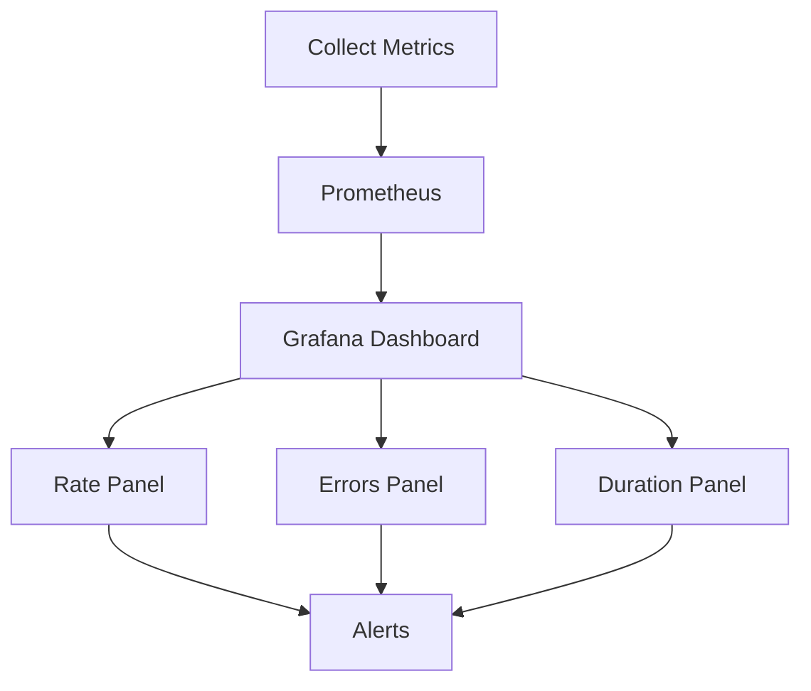
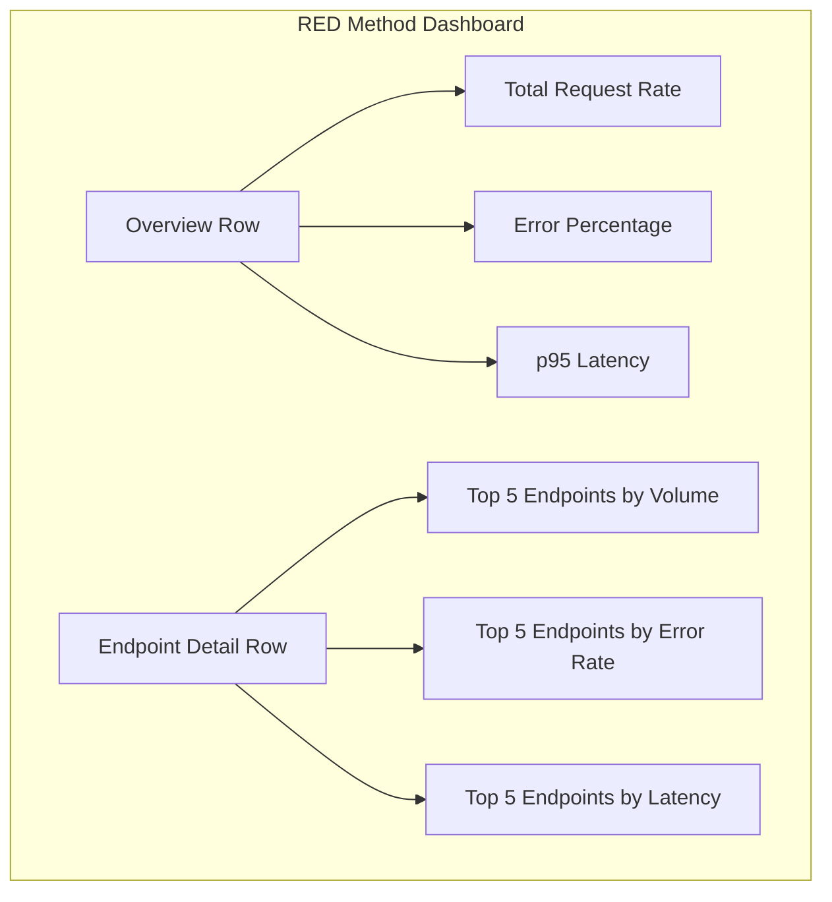

# RED Method (Rate, Errors, Duration)

## Introduction

The RED Method is a powerful monitoring pattern that helps you understand the health and performance of your services. Inspired by Google's "Four Golden Signals," the RED Method was popularized by Tom Wilkie (one of Grafana's co-founders) and focuses on three key metrics:

- **Rate**: The number of requests per second
- **Errors**: The number of failed requests per second
- **Duration**: The distribution of request latencies

This pattern is particularly effective for monitoring microservices and service-oriented architectures where understanding service behavior from a client perspective is crucial.

## Why Use the RED Method?

The RED Method provides a user-centric view of your services by measuring what matters most to your users:

1. **Simplicity**: Focuses on just three metrics that give you a comprehensive view of service health
2. **Consistency**: Can be applied uniformly across all services in your architecture
3. **Completeness**: Covers all critical aspects of service behavior
4. **User-centric**: Aligns with what users actually experience

## The Three Pillars of RED

Let's explore each component of the RED Method in detail:

### Rate (Requests per Second)

Rate measures how many requests your service receives per second. This metric helps you understand:

- Service load and traffic patterns
- Usage trends over time
- Capacity planning requirements
- Potential issues with service discovery or load balancing

**Implementation in Prometheus/Grafana:**

For a service instrumented with Prometheus, you might track the rate using a counter that increments with each request:

```javascript
// Example using a Node.js service with Prometheus client
const prometheus = require('prom-client');

// Create a counter for tracking requests
const httpRequestsTotal = new prometheus.Counter({
  name: 'http_requests_total',
  help: 'Total HTTP requests',
  labelNames: ['method', 'route', 'status_code']
});

// In your request handler
app.use((req, res, next) => {
  res.on('finish', () => {
    httpRequestsTotal.inc({
      method: req.method,
      route: req.route?.path || 'unknown',
      status_code: res.statusCode
    });
  });
  next();
});
```

In Grafana, you can visualize this with a PromQL query:

```
rate(http_requests_total[5m])
```

This shows the per-second rate of requests over a 5-minute window.

### Errors (Failed Requests per Second)

Errors track how many requests are failing. This metric helps you:

- Detect issues that affect users
- Identify problematic service dependencies
- Monitor SLAs and SLOs
- Trigger alerts when error rates exceed thresholds

**Implementation in Prometheus/Grafana:**

Using the same counter from before, you can filter for error responses:

```javascript
// The counter is already tracking status codes in the previous example
// No additional instrumentation needed if you're capturing status codes
```

In Grafana, you can visualize the error rate with:

```
rate(http_requests_total{status_code=~"5.."}[5m])
```

Or calculate the error percentage:

```
sum(rate(http_requests_total{status_code=~"5.."}[5m])) / sum(rate(http_requests_total[5m])) * 100
```

### Duration (Request Latency)

Duration measures how long your service takes to process requests. This metric helps you:

- Understand user experience (slow responses frustrate users)
- Identify performance bottlenecks
- Track performance impacts from deployments or changes
- Set realistic SLOs for response time

**Implementation in Prometheus/Grafana:**

For duration, you'll want to use a histogram to capture the distribution of latencies:

```javascript
// Create a histogram for tracking request duration
const httpRequestDurationSeconds = new prometheus.Histogram({
  name: 'http_request_duration_seconds',
  help: 'HTTP request duration in seconds',
  labelNames: ['method', 'route', 'status_code'],
  buckets: [0.01, 0.05, 0.1, 0.5, 1, 2, 5, 10] // buckets in seconds
});

// In your request handler
app.use((req, res, next) => {
  const end = httpRequestDurationSeconds.startTimer();
  res.on('finish', () => {
    end({
      method: req.method,
      route: req.route?.path || 'unknown',
      status_code: res.statusCode
    });
  });
  next();
});
```

In Grafana, you can visualize different aspects of the latency distribution:

```
# Median (50th percentile) request duration
histogram_quantile(0.5, sum(rate(http_request_duration_seconds_bucket[5m])) by (le))

# 95th percentile request duration
histogram_quantile(0.95, sum(rate(http_request_duration_seconds_bucket[5m])) by (le))

# 99th percentile request duration
histogram_quantile(0.99, sum(rate(http_request_duration_seconds_bucket[5m])) by (le))
```

## Creating a RED Method Dashboard in Grafana

Let's put all of this together into a comprehensive Grafana dashboard that monitors a service using the RED Method:



### Setting Up Your Dashboard

Here's a step-by-step guide to creating a RED Method dashboard in Grafana:

1. **Create a new dashboard** in Grafana
2. **Add a row** labeled "Service Overview"
3. **Add the following panels**:

#### Rate Panel (Requests Per Second)

Add a time series panel with:

```
sum(rate(http_requests_total[5m])) by (service)
```

Configure:
- Title: "Request Rate"
- Description: "Number of requests per second"
- Unit: "requests/sec"

#### Error Rate Panel

Add a time series panel with:

```
sum(rate(http_requests_total{status_code=~"5.."}[5m])) by (service)
```

Configure:
- Title: "Error Rate"
- Description: "Number of failed requests per second"
- Unit: "requests/sec"
- Threshold: Set color to red when values are > 0

#### Error Percentage Panel

Add a gauge panel with:

```
sum(rate(http_requests_total{status_code=~"5.."}[5m])) / sum(rate(http_requests_total[5m])) * 100
```

Configure:
- Title: "Error Percentage"
- Description: "Percentage of requests that are failing"
- Unit: "percent"
- Thresholds:
  - 0-1%: Green
  - 1-5%: Yellow
  - >5%: Red

#### Duration Panels

Add a time series panel with multiple queries:

```
# 50th percentile (median)
histogram_quantile(0.5, sum(rate(http_request_duration_seconds_bucket[5m])) by (le))

# 95th percentile
histogram_quantile(0.95, sum(rate(http_request_duration_seconds_bucket[5m])) by (le))

# 99th percentile
histogram_quantile(0.99, sum(rate(http_request_duration_seconds_bucket[5m])) by (le))
```

Configure:
- Title: "Request Duration"
- Description: "Distribution of request latencies"
- Unit: "seconds"
- Legend: `{{quantile}} percentile`

## Setting Up Alerts

The RED Method is perfect for alerting. Here are some recommended alerting strategies:

### Rate-Based Alerts

- **Sudden drop in traffic**: Alert when traffic drops more than 50% compared to the same time period in the previous day or week
- **Unexpected traffic spike**: Alert when traffic exceeds 2x the normal volume

```
# Example alert expression for traffic drop
rate(http_requests_total[5m])
  < 
0.5 * rate(http_requests_total[5m] offset 1d)
```

### Error-Based Alerts

- **High error rate**: Alert when error percentage exceeds 5% for more than 5 minutes
- **Persistent errors**: Alert when any errors occur continuously for more than 15 minutes

```
# Example alert expression for high error rate
sum(rate(http_requests_total{status_code=~"5.."}[5m])) / sum(rate(http_requests_total[5m])) > 0.05
```

### Duration-Based Alerts

- **Slow responses**: Alert when the 95th percentile latency exceeds your SLO threshold
- **Latency trend**: Alert when latency is consistently increasing over a longer period

```
# Example alert expression for slow responses
histogram_quantile(0.95, sum(rate(http_request_duration_seconds_bucket[5m])) by (le)) > 2
```

## Practical Example: Monitoring an API Gateway

Let's see how the RED Method would be applied to monitor an API gateway in a microservices architecture:

1. **Rate**: Track requests per second across all API endpoints, potentially segmented by endpoint, consumer, or backend service
2. **Errors**: Monitor 4xx and 5xx responses, distinguishing between client errors (4xx) and server errors (5xx)
3. **Duration**: Measure request latency including gateway processing time and upstream service time

### Sample Dashboard Configuration

Here's a sample Grafana dashboard layout for an API gateway:



## Using the RED Method with Other Data Sources

While Prometheus is commonly used, you can implement the RED Method with other data sources:

### Using Graphite

```
# Rate example in Graphite
summarize(sumSeries(stats.counters.myapp.requests.*.count), "1min", "sum", false)

# Error rate example in Graphite
summarize(sumSeries(stats.counters.myapp.requests.*.error.count), "1min", "sum", false)
```

### Using InfluxDB

```
# Rate example in InfluxQL
SELECT count("value") FROM "requests" WHERE time > now() - 5m GROUP BY time(1m)

# Duration example in InfluxQL
SELECT mean("duration"), percentile("duration", 95) FROM "requests" WHERE time > now() - 5m GROUP BY time(1m)
```

## RED Method vs. Other Monitoring Patterns

Let's compare the RED Method with other common monitoring approaches:

| Pattern | Focus | Best For | Limitations |
|---------|-------|----------|-------------|
| RED Method | Request-focused, client perspective | Microservices, API monitoring | Less insight into resource usage |
| USE Method | Resource utilization | Infrastructure, system monitoring | Less insight into user experience |
| Four Golden Signals | Comprehensive (includes saturation) | Balanced monitoring approach | Slightly more complex to implement |

The RED Method is most similar to Google's "Four Golden Signals" (Latency, Traffic, Errors, Saturation), but omits saturation for simplicity.

## Best Practices and Common Pitfalls

### Best Practices

1. **Consistent implementation**: Apply the RED Method uniformly across all services
2. **Meaningful segmentation**: Break down metrics by relevant dimensions (endpoint, customer tier, region)
3. **Histogram buckets**: Choose histogram buckets that align with your SLOs
4. **Comprehensive error tracking**: Track all types of failures, not just HTTP 5xx responses
5. **Contextual dashboards**: Include service dependencies and business context in your dashboards

### Common Pitfalls

1. **Overaggregation**: Aggregating metrics too broadly can hide important problems
2. **Ignoring percentiles**: Focusing only on averages masks the tail latency affecting some users
3. **Alert fatigue**: Setting thresholds too tight leads to noisy alerts
4. **Missing client errors**: Focusing only on server errors (5xx) while ignoring client errors (4xx)
5. **Inconsistent implementation**: Implementing differently across services makes comparison difficult

## Summary

The RED Method provides a simple, effective approach to monitoring services from a user-centric perspective:

- **Rate**: Shows how much your service is being used
- **Errors**: Shows how often your service fails
- **Duration**: Shows how long your service takes to respond

By consistently implementing these three key metrics across all your services, you create a uniform observability framework that helps you quickly identify and diagnose issues that affect your users.

## Exercises

1. Implement the RED Method for a sample service using Prometheus and Grafana
2. Create a Grafana dashboard with dynamic variables to switch between different services
3. Set up alerts for each of the RED metrics with appropriate thresholds
4. Extend your RED dashboard to include breakdown by endpoint and user type
5. Compare how the same service looks when monitored with both the RED Method and the USE Method

## Additional Resources

- [Tom Wilkie's original RED Method blog post](https://www.weave.works/blog/the-red-method-key-metrics-for-microservices-architecture/)
- [Grafana Labs' guide to service monitoring](https://grafana.com/blog/2018/08/02/the-red-method-how-to-instrument-your-services/)
- [Prometheus documentation](https://prometheus.io/docs/introduction/overview/)
- [Grafana dashboard examples](https://grafana.com/grafana/dashboards/)
- [SRE Book: Monitoring Distributed Systems](https://sre.google/sre-book/monitoring-distributed-systems/)