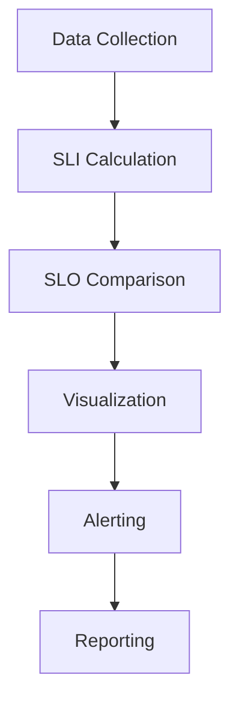

# SLA Monitoring

## Introduction

Service Level Agreements (SLAs) are formal contracts that define the expected level of service between a service provider and its customers. SLA monitoring is the process of tracking and visualizing how well your systems are meeting those agreements. In this guide, you'll learn how to implement SLA monitoring using Grafana, allowing you to proactively manage service performance and ensure compliance with your agreements.

## What is an SLA?

An SLA typically includes:

- **Service Level Indicators (SLIs)**: Metrics that measure specific aspects of service performance
- **Service Level Objectives (SLOs)**: Target values for those metrics
- **Service Level Agreements (SLAs)**: Formal commitments to maintain specific service levels, often with penalties for non-compliance

For example, a web service might have:
- **SLI**: Average response time
- **SLO**: 99% of requests complete in under 200ms
- **SLA**: 99.9% monthly uptime with financial penalties if not met

## Setting Up SLA Monitoring in Grafana

Let's explore how to implement effective SLA monitoring using Grafana's visualization capabilities.

### Prerequisites

Before getting started, you'll need:

- A running Grafana instance (v9.0+)
- Data sources configured (Prometheus, InfluxDB, etc.)
- Basic metrics collection for your services

### Step 1: Identify Your Key SLIs

First, identify the metrics that matter most for your service. Common SLIs include:

- **Availability**: Percentage of successful requests
- **Latency**: Response time for requests
- **Error Rate**: Percentage of failed requests
- **Throughput**: Number of requests per second
- **Saturation**: How "full" your service is (CPU, memory, disk usage)

### Step 2: Set Up Basic SLA Dashboards

Let's create a simple SLA dashboard that tracks service availability:

```sql
# Prometheus Query for Availability SLI
sum(rate(http_requests_total{status=~"2.."}[5m])) / sum(rate(http_requests_total[5m])) * 100
```

This query calculates the percentage of successful HTTP requests (status codes in the 200 range) over the total requests.

### Step 3: Visualize SLA Compliance

Now let's create visualizations that make SLA compliance clear at a glance:

1. **Gauge Panels**: Show current SLA compliance percentage
2. **Time Series**: Track SLA metrics over time
3. **Stat Panels**: Display uptime or success rate

Here's how to configure a gauge panel for SLA visualization:

1. Create a new panel
2. Select "Gauge" visualization
3. Add your SLI query
4. Set thresholds to match your SLO targets:
   - Green: `>99.9%` (Meeting SLA)
   - Yellow: `99.0-99.9%` (Warning)
   - Red: `<99.0%` (Breaching SLA)

## Advanced SLA Monitoring Techniques

### Error Budgets

Error budgets are a powerful concept from Site Reliability Engineering (SRE). They represent the amount of "acceptable failure" within your SLA.

For example, if your SLA is 99.9% availability:
- Your error budget is 0.1% (100% - 99.9%)
- This equals about 43 minutes of downtime per month
- When you've "spent" this budget, it's time to prioritize reliability over new features

Let's implement an error budget panel:

```sql
# Error Budget Remaining (Prometheus)
# Assuming 30-day month and 99.9% SLA
(0.001 * 30 * 24 * 60) - sum(increase(service_downtime_minutes[30d]))
```

### SLA Burn Rate

The burn rate shows how quickly you're consuming your error budget:

```sql
# SLA Burn Rate
sum(rate(http_requests_total{status=~"5.."}[1h])) / sum(rate(http_requests_total[1h])) / 0.001
```

A burn rate of 1.0 means you're consuming your error budget at exactly the expected rate. Higher values indicate faster consumption.

### Multi-Window, Multi-Burn Rate Alerts

For effective alerting, implement multi-window, multi-burn rate alerts:

```yaml
# Alert rule (conceptual example)
- alert: HighErrorBudgetBurn
  expr: sum(rate(http_errors[1h])) / sum(rate(http_requests[1h])) > 14.4 * 0.001
  for: 1h
  labels:
    severity: warning
  annotations:
    summary: "Error budget burning 14.4x faster than allowed"
```

## Creating a Comprehensive SLA Dashboard

Let's build a complete SLA monitoring dashboard:



### Dashboard Components:

1. **Service Overview**: Key metrics at a glance
2. **SLA Compliance**: Current and historical compliance rates
3. **Error Budget**: Remaining error budget and burn rate
4. **Incident Timeline**: Record of SLA violations
5. **SLI Breakdown**: Detailed view of individual indicators

## Real-World Example: Web Service SLA Monitoring

Let's implement a practical example for a web service with the following SLAs:
- 99.9% availability
- 99% of requests complete in under 200ms
- Maximum 0.1% error rate

### Step 1: Configure Data Collection

Ensure your application is reporting the necessary metrics:

```javascript
// Example Node.js code with Prometheus client
const prometheus = require('prom-client');

// Create a histogram for response times
const httpRequestDurationMicroseconds = new prometheus.Histogram({
  name: 'http_request_duration_ms',
  help: 'Duration of HTTP requests in ms',
  labelNames: ['route', 'status_code'],
  buckets: [5, 10, 25, 50, 100, 200, 500, 1000]
});

// In your request handler
app.use((req, res, next) => {
  const end = httpRequestDurationMicroseconds.startTimer();
  res.on('finish', () => {
    end({ route: req.path, status_code: res.statusCode });
  });
  next();
});
```

### Step 2: Create the SLA Dashboard in Grafana

1. Create a new dashboard
2. Add panels for each SLI:

**Availability Panel:**
```sql
# Prometheus Query
sum(rate(http_request_duration_ms_count{status_code=~"2.."}[5m])) / sum(rate(http_request_duration_ms_count[5m])) * 100
```

**Latency Panel:**
```sql
# Prometheus Query - Percentage of requests under 200ms
sum(rate(http_request_duration_ms_bucket{le="200"}[5m])) / sum(rate(http_request_duration_ms_count[5m])) * 100
```

**Error Rate Panel:**
```sql
# Prometheus Query
sum(rate(http_request_duration_ms_count{status_code=~"5.."}[5m])) / sum(rate(http_request_duration_ms_count[5m])) * 100
```

### Step 3: Set Up Alerts

Configure alerting for SLA violations:

1. Create alert rules in Grafana
2. Set appropriate thresholds based on your SLAs
3. Configure notification channels (email, Slack, PagerDuty, etc.)

Example alert rule:

```yaml
# High Error Rate Alert
- alert: HighErrorRate
  expr: sum(rate(http_request_duration_ms_count{status_code=~"5.."}[5m])) / sum(rate(http_request_duration_ms_count[5m])) > 0.001
  for: 5m
  labels:
    severity: critical
  annotations:
    summary: "Error rate exceeding SLA (> 0.1%)"
    description: "Current error rate is {{ $value | humanizePercentage }}"
```

### Step 4: Create SLA Reports

Use Grafana's reporting capabilities to generate regular SLA reports:

1. Configure scheduled reports in Grafana
2. Set up dashboards specifically for reporting
3. Include month-to-date and historical SLA compliance

## Best Practices for SLA Monitoring

1. **Focus on user experience**: Prioritize metrics that directly impact users
2. **Keep it simple**: Start with a few key indicators before expanding
3. **Set realistic SLOs**: Base them on historical performance and business needs
4. **Iterate**: Continuously refine your monitoring based on feedback
5. **Automate**: Use alerts to catch issues before they become SLA violations
6. **Document**: Keep clear records of SLA definitions and measurement methods
7. **Review regularly**: SLAs should evolve with your system and business needs

## Advanced Topics

### SLA for Microservices

For microservices architectures, consider:

1. **Service Dependencies**: Map how services affect each other's SLAs
2. **Composite SLAs**: Calculate overall SLA based on dependencies
3. **Service Mesh Metrics**: Use tools like Istio for detailed service-level metrics

### Custom SLI Aggregations

Sometimes you need more complex SLI calculations:

```sql
# Apdex Score (Application Performance Index)
(sum(rate(http_request_duration_ms_bucket{le="200"}[5m])) + sum(rate(http_request_duration_ms_bucket{le="500"}[5m]) - sum(rate(http_request_duration_ms_bucket{le="200"}[5m])) * 0.5) / sum(rate(http_request_duration_ms_count[5m]))
```

The Apdex score categorizes requests as "satisfied" (under 200ms), "tolerating" (200-500ms), or "frustrated" (over 500ms).

## Summary

SLA monitoring is essential for maintaining service quality and customer satisfaction. With Grafana, you can:

1. Visualize real-time SLA compliance
2. Track historical performance
3. Alert on potential violations
4. Generate comprehensive reports
5. Make data-driven decisions about reliability vs. feature development

By implementing proper SLA monitoring, you transform vague service expectations into clear, measurable objectives that help your team prioritize work and communicate effectively with stakeholders.

## Additional Resources

- [Google SRE Book - Service Level Objectives](https://sre.google/sre-book/service-level-objectives/)
- [Grafana Labs - Setting Up Alerts](https://grafana.com/docs/grafana/latest/alerting/)
- [Prometheus - SLI/SLO Implementation Guide](https://prometheus.io/docs/practices/histograms/)

## Exercises

1. Set up a basic SLA dashboard for a web service using the example queries
2. Implement an error budget calculation for your service
3. Create a multi-window, multi-burn rate alert for a critical SLI
4. Design an SLA report that would be meaningful to both technical and non-technical stakeholders
5. Calculate the composite SLA for a system with multiple interdependent services