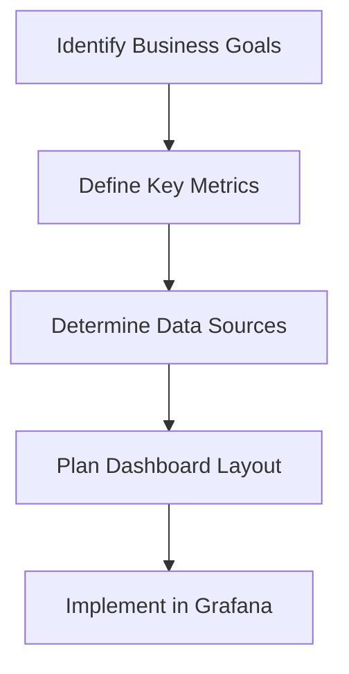
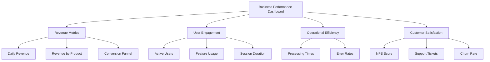
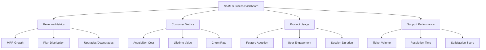

# Business Metrics

## Introduction

Business metrics are quantifiable measures used to track, monitor, and assess the success or failure of various business processes. When integrated with a monitoring system like Grafana, these metrics provide real-time insights into your organization's performance, helping teams make data-driven decisions.

This guide will walk you through implementing business metrics in Grafana, from understanding what metrics to track to creating effective dashboards that communicate the health of your business operations.

## What Are Business Metrics?

Unlike technical metrics that focus on system performance (CPU, memory, latency), business metrics measure operational and financial outcomes:

- **Revenue metrics**: Sales, conversion rates, customer lifetime value
- **User engagement**: Active users, session duration, feature adoption
- **Operational efficiency**: Order processing time, inventory turnover, support ticket resolution
- **Customer satisfaction**: NPS scores, customer retention, churn rates

Monitoring these metrics in Grafana allows you to visualize business performance alongside technical metrics, creating a holistic view of your systems and their business impact.

## Why Monitor Business Metrics in Grafana?

Grafana is traditionally known for technical monitoring, but it excels at business metrics for several reasons:

1. **Unified monitoring**: View technical and business metrics in one place
2. **Real-time visibility**: Track business KPIs as they happen, not just in monthly reports
3. **Correlation analysis**: Identify how technical issues impact business outcomes
4. **Customizable alerts**: Get notified when business metrics cross critical thresholds
5. **Shareable dashboards**: Create executive views for different stakeholders

## Setting Up Business Metrics in Grafana

### Step 1: Identify Your Key Metrics

Before diving into implementation, determine which metrics matter most to your organization:



Common categories include:

- **Product metrics**: User signups, feature usage, app downloads
- **Sales metrics**: Conversion rate, revenue, average order value
- **Marketing metrics**: Campaign performance, acquisition costs, click-through rates
- **Customer support**: Ticket volume, resolution time, satisfaction scores

### Step 2: Connect Your Data Sources

Grafana supports various data sources that can provide business metrics:

- **SQL databases**: Connect to your product database (MySQL, PostgreSQL)
- **Prometheus**: For instrumented applications with business events
- **Elasticsearch**: For log-based metrics or event data
- **API data sources**: Custom or plugin-based connections to SaaS tools
- **CSV/Excel uploads**: For manual data when needed

Example of connecting to a PostgreSQL database:

```sql
-- Create a view for daily revenue metrics
CREATE VIEW daily_revenue AS
SELECT 
    date_trunc('day', order_date) AS day,
    COUNT(*) AS order_count,
    SUM(order_total) AS revenue,
    AVG(order_total) AS average_order_value
FROM orders
GROUP BY date_trunc('day', order_date)
ORDER BY day;
```

In Grafana, you would configure the PostgreSQL data source:

```javascript
// Example PostgreSQL configuration in Grafana
{
  "name": "Business DB",
  "type": "postgres",
  "url": "your-db-host:5432",
  "database": "business_data",
  "user": "metrics_user",
  "secureJsonData": {
    "password": "your-password"
  },
  "jsonData": {
    "sslmode": "require"
  }
}
```

### Step 3: Create Business Metrics Queries

Now, craft queries that extract meaningful business data:

Example query for daily revenue visualization:

```sql
SELECT 
  day as time,
  revenue,
  order_count,
  average_order_value
FROM daily_revenue
WHERE day >= $__timeFrom() AND day <= $__timeTo()
ORDER BY day
```

For user signups:

```sql
SELECT 
  date_trunc('day', created_at) as time,
  count(*) as "New Users"
FROM users
WHERE created_at >= $__timeFrom() AND created_at <= $__timeTo()
GROUP BY date_trunc('day', created_at)
ORDER BY time
```

### Step 4: Design Effective Dashboards

Structure your business metrics dashboard with these components:

1. **Overview section**: Top-level KPIs and metrics
2. **Detailed sections**: Deeper dives into specific areas
3. **Comparison panels**: Current vs previous period metrics
4. **Breakdown panels**: Metrics segmented by category (e.g., product, region)
5. **Trend visualizations**: How metrics change over time

Here's a sample dashboard layout:



## Implementation Examples

### Example 1: E-commerce Revenue Dashboard

Let's create a dashboard that tracks key revenue metrics for an e-commerce business:

1. **Daily Revenue Panel**:

```javascript
// Panel JSON configuration (simplified)
{
  "title": "Daily Revenue",
  "type": "timeseries",
  "datasource": "Business DB",
  "targets": [
    {
      "rawSql": "SELECT day as time, revenue FROM daily_revenue WHERE day >= $__timeFrom() AND day <= $__timeTo() ORDER BY day",
      "refId": "A"
    }
  ],
  "fieldConfig": {
    "defaults": {
      "color": {
        "mode": "palette-classic"
      },
      "custom": {
        "fillOpacity": 10,
        "lineWidth": 2
      },
      "unit": "currencyUSD"
    }
  }
}
```

2. **Conversion Funnel**:

```javascript
// Panel JSON configuration (simplified)
{
  "title": "Sales Funnel",
  "type": "barchart",
  "datasource": "Business DB",
  "targets": [
    {
      "rawSql": "SELECT 'Product Views' as stage, COUNT(*) as count FROM product_views WHERE time >= $__timeFrom() AND time <= $__timeTo() UNION ALL SELECT 'Add to Cart' as stage, COUNT(*) as count FROM cart_events WHERE time >= $__timeFrom() AND time <= $__timeTo() UNION ALL SELECT 'Checkout Started' as stage, COUNT(*) as count FROM checkout_events WHERE time >= $__timeFrom() AND time <= $__timeTo() UNION ALL SELECT 'Purchases' as stage, COUNT(*) as count FROM orders WHERE order_date >= $__timeFrom() AND order_date <= $__timeTo() ORDER BY count DESC",
      "refId": "A"
    }
  ],
  "options": {
    "orientation": "horizontal"
  }
}
```

### Example 2: User Engagement Metrics

Track how users interact with your application:

1. **Daily Active Users**:

```javascript
// Panel JSON configuration (simplified)
{
  "title": "Daily Active Users",
  "type": "timeseries",
  "datasource": "Business DB",
  "targets": [
    {
      "rawSql": "SELECT date_trunc('day', login_time) as time, COUNT(DISTINCT user_id) as \"DAU\" FROM user_sessions WHERE login_time >= $__timeFrom() AND login_time <= $__timeTo() GROUP BY date_trunc('day', login_time) ORDER BY time",
      "refId": "A"
    }
  ]
}
```

2. **Feature Adoption**:

```javascript
// Panel JSON configuration (simplified)
{
  "title": "Feature Usage",
  "type": "piechart",
  "datasource": "Business DB",
  "targets": [
    {
      "rawSql": "SELECT feature_name, COUNT(DISTINCT user_id) as users FROM feature_usage WHERE event_time >= $__timeFrom() AND event_time <= $__timeTo() GROUP BY feature_name ORDER BY users DESC LIMIT 5",
      "refId": "A"
    }
  ]
}
```

## Best Practices for Business Metrics

### 1. Focus on Actionable Metrics

Choose metrics that drive decisions, not vanity metrics that look good but don't inform action.

### 2. Set Thresholds and Alerts

Configure alerts for significant deviations in business metrics:

```javascript
// Alert configuration example
{
  "name": "Revenue Drop Alert",
  "type": "threshold",
  "query": {
    "params": ["A", "5m", "now"]
  },
  "conditions": [
    {
      "evaluator": {
        "params": [0.8],
        "type": "lt"
      },
      "operator": {
        "type": "and"
      },
      "query": {
        "params": ["A"]
      },
      "reducer": {
        "params": [],
        "type": "avg"
      },
      "type": "query"
    }
  ],
  "message": "Daily revenue has dropped below 80% of the 7-day average"
}
```

### 3. Provide Context with Annotations

Add annotations for important business events:

```javascript
// Annotation query example
{
  "name": "Marketing Campaigns",
  "datasource": "Business DB",
  "enable": true,
  "iconColor": "rgba(255, 96, 96, 1)",
  "target": {
    "rawSql": "SELECT start_time as time, campaign_name as text, 'Campaign' as tags FROM marketing_campaigns WHERE start_time >= $__timeFrom() AND start_time <= $__timeTo()",
    "refId": "A"
  }
}
```

### 4. Use Variables for Flexible Analysis

Create dashboard variables to filter and segment data:

```javascript
// Dashboard variable example
{
  "name": "product",
  "type": "query",
  "datasource": "Business DB",
  "query": "SELECT DISTINCT product_name FROM products ORDER BY product_name",
  "refresh": 1,
  "includeAll": true
}
```

### 5. Create Role-Specific Views

Design different dashboard versions for various stakeholders:

- Executive view: High-level KPIs
- Marketing view: Campaign performance details
- Product view: Feature adoption and user engagement
- Sales view: Conversion rates and revenue metrics

## Advanced Business Metrics Techniques

### Cohort Analysis

Track groups of users over time to understand retention:

```sql
SELECT 
  date_trunc('month', signup_date) as cohort,
  date_part('month', age(login_date, signup_date)) as month_number,
  count(distinct user_id) as active_users
FROM 
  users u
JOIN 
  user_logins l ON u.user_id = l.user_id
WHERE 
  signup_date >= $__timeFrom() AND signup_date <= $__timeTo()
GROUP BY 
  date_trunc('month', signup_date),
  date_part('month', age(login_date, signup_date))
ORDER BY 
  cohort, month_number
```

### Forecasting

Use Grafana's forecasting to predict future business trends:

```javascript
// Panel with forecasting enabled
{
  "title": "Revenue Forecast",
  "type": "timeseries",
  "datasource": "Business DB",
  "targets": [
    {
      "rawSql": "SELECT day as time, revenue FROM daily_revenue WHERE day >= $__timeFrom() AND day <= $__timeTo() ORDER BY day",
      "refId": "A"
    }
  ],
  "fieldConfig": {
    "defaults": {
      "custom": {
        "fillOpacity": 10
      }
    },
    "overrides": [
      {
        "matcher": {
          "id": "byFrameRefID",
          "options": "A"
        },
        "properties": [
          {
            "id": "custom.transform",
            "value": "predictLinear"
          }
        ]
      }
    ]
  }
}
```

## Case Study: SaaS Business Dashboard

Let's examine how a SaaS company might implement a comprehensive business metrics dashboard in Grafana:

The company tracks these key metrics:
- Monthly Recurring Revenue (MRR)
- Customer Acquisition Cost (CAC)
- Customer Lifetime Value (LTV)
- Churn Rate
- Feature Adoption
- Support Ticket Volume and Resolution Time

Their dashboard structure:



Query for MRR calculation:

```sql
SELECT 
  date_trunc('month', payment_date) as time,
  SUM(amount) / 100 as mrr
FROM subscriptions
WHERE 
  status = 'active' AND
  payment_date >= $__timeFrom() AND 
  payment_date <= $__timeTo()
GROUP BY date_trunc('month', payment_date)
ORDER BY time
```

## Integrating Business and Technical Metrics

The true power of Grafana comes from correlating business and technical metrics:

1. **Revenue Impact of Outages**:
   - Plot revenue alongside system availability
   - Calculate financial impact of downtime

2. **User Experience vs. Engagement**:
   - Monitor session duration against page load times
   - See how performance affects user behavior

3. **Error Rates vs. Support Tickets**:
   - Correlate application errors with support volume
   - Identify which errors generate customer complaints

Example dashboard panel showing this correlation:

```javascript
// Panel JSON configuration (simplified)
{
  "title": "Revenue Impact of System Performance",
  "type": "timeseries",
  "targets": [
    {
      "datasource": "Business DB",
      "rawSql": "SELECT day as time, revenue FROM daily_revenue WHERE day >= $__timeFrom() AND day <= $__timeTo()",
      "refId": "A"
    },
    {
      "datasource": "Prometheus",
      "expr": "sum(rate(http_request_duration_seconds_count{status=~\"5..\"}[1d])) / sum(rate(http_request_duration_seconds_count[1d])) * 100",
      "refId": "B"
    }
  ],
  "options": {
    "legend": {
      "displayMode": "table",
      "placement": "bottom"
    }
  }
}
```

## Summary

Business metrics in Grafana bridge the gap between technical monitoring and business outcomes, providing:

- Real-time visibility into business performance
- Correlation between technical and business metrics
- Data-driven decision making across departments
- Early warning systems for business issues
- Shared understanding among technical and business teams

By implementing the techniques covered in this guide, you can transform Grafana from a technical monitoring tool into a comprehensive business intelligence platform that helps your organization make better decisions based on real-time data.

## Additional Resources and Exercises

### Resources

- [Grafana Dashboard Variables Documentation](https://grafana.com/docs/grafana/latest/variables/)
- [Grafana SQL Data Source Guide](https://grafana.com/docs/grafana/latest/datasources/sql/)
- [Grafana Alerting Documentation](https://grafana.com/docs/grafana/latest/alerting/)

### Exercises

1. **Beginner Exercise**: Create a simple dashboard showing daily active users and new user signups.

2. **Intermediate Exercise**: Build a conversion funnel visualization that tracks users through your application flow.

3. **Advanced Exercise**: Create a cohort analysis dashboard that shows retention rates for different user segments over time.

4. **Integration Exercise**: Correlate system performance metrics with key business KPIs to identify technical issues that impact revenue.