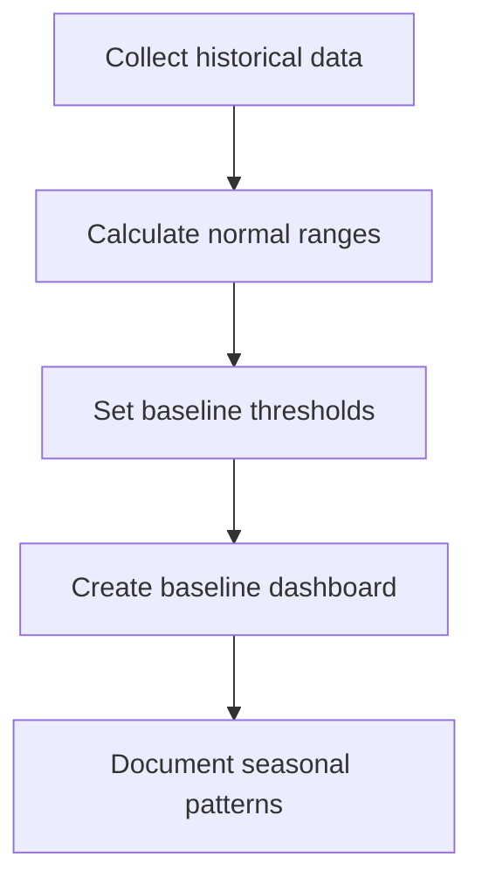

# Capacity Planning

## Introduction

Capacity planning is a critical process in systems management that involves determining the resources required to meet future demands on your infrastructure. In the context of Grafana monitoring, capacity planning helps you predict when you'll need to scale your systems, avoid performance bottlenecks, and optimize resource allocation.

This guide will explore how to implement effective capacity planning using Grafana's visualization and alerting capabilities, helping you make data-driven decisions about infrastructure investments and scaling strategies.

## Why Capacity Planning Matters

Before diving into implementation, let's understand why capacity planning is essential:

- **Prevent outages** - Identify resource constraints before they cause system failures
- **Optimize costs** - Avoid over-provisioning while ensuring sufficient resources
- **Support business growth** - Align infrastructure scaling with business objectives
- **Improve user experience** - Maintain performance levels even as demand increases
- **Enable informed budgeting** - Forecast infrastructure expenses with greater accuracy

## Key Metrics for Capacity Planning

Effective capacity planning relies on monitoring the right metrics. Here are critical measurements to track:

### Resource Utilization Metrics

- **CPU Usage** - Percentage of processing capacity used
- **Memory Consumption** - RAM usage patterns over time
- **Disk Space** - Storage capacity and growth rates
- **Network Bandwidth** - Data transfer volumes and patterns
- **Database Connections** - Connection pool usage and limits

### Performance Metrics

- **Request Latency** - Time to process requests
- **Throughput** - Number of transactions processed per time unit
- **Queue Lengths** - Backlog of pending requests
- **Error Rates** - Failures caused by resource constraints

### Business Metrics

- **User Growth** - Rate of new user acquisition
- **Transaction Volume** - Business activity levels
- **Peak Usage Periods** - Seasonal or daily high-demand times

## Setting Up Capacity Planning Dashboards in Grafana

Let's create a comprehensive capacity planning setup in Grafana.

### 1. Data Source Configuration

First, ensure you have the appropriate data sources configured. Prometheus is commonly used for infrastructure metrics, but you might also use:

- InfluxDB for time-series data
- MySQL/PostgreSQL for business metrics
- Elasticsearch for log analysis

Example Prometheus data source configuration:

```javascript
// In Grafana UI, navigate to Configuration > Data Sources > Add data source
// Select Prometheus and configure with these settings:
{
  "name": "Prometheus",
  "type": "prometheus",
  "url": "http://prometheus-server:9090",
  "access": "proxy",
  "basicAuth": false
}
```

### 2. Resource Utilization Dashboard

Create a dashboard focused on current resource utilization with trend analysis.

Here's a sample PromQL query for CPU utilization with prediction:

```sql
// Current CPU utilization
sum(rate(node_cpu_seconds_total{mode!="idle"}[5m])) by (instance) / 
sum(rate(node_cpu_seconds_total[5m])) by (instance)

// Forecast (using Grafana's built-in prediction feature)
// This can be enabled in panel visualization options
```

### 3. Growth Trend Visualization

To visualize growth trends effectively:

```javascript
// Example dashboard panel configuration for memory growth
{
  "title": "Memory Growth Projection",
  "type": "graph",
  "datasource": "Prometheus",
  "targets": [
    {
      "expr": "node_memory_MemTotal_bytes - node_memory_MemAvailable_bytes",
      "legendFormat": "Memory Used"
    }
  ],
  "options": {
    "legend": { "show": true },
    "tooltip": { "shared": true }
  }
}
```

Adding trend lines helps visualize future growth. In Grafana 9.x and later, you can use the built-in time series prediction feature to project trends.

### 4. Setting Thresholds and Alerts

Configure thresholds to identify when resources approach capacity limits:

```javascript
// Alert rule configuration example
{
  "name": "High CPU Usage Projection",
  "type": "threshold",
  "query": {
    "datasourceId": 1,
    "model": {
      "expr": "predict_linear(avg(node_cpu_seconds_total{mode!=\"idle\"}[1h]) / count(node_cpu_seconds_total{mode=\"idle\"})[1h], 86400)",
      "legendFormat": "CPU Prediction (24h)"
    }
  },
  "conditions": [
    {
      "evaluator": { "type": "gt", "params": [85] },
      "operator": { "type": "and" },
      "reducerType": "last"
    }
  ],
  "message": "CPU usage projected to exceed 85% within 24 hours"
}
```

## Implementing Capacity Planning Workflows

Let's walk through a practical capacity planning workflow using Grafana.

### Step 1: Establish Baselines

First, establish normal operating baselines for your key metrics:



### Step 2: Forecast Resource Needs

Use Grafana's visualization features to project future requirements:

```javascript
// Example for disk space projection using rate of change
rate(node_filesystem_free_bytes{mountpoint="/"}[30d])
```

This calculates the rate of change in free disk space over the past 30 days. Using this trend, you can predict when you'll run out of space.

### Step 3: Create a Capacity Planning Report

Configure Grafana to generate regular capacity planning reports:

```javascript
// Example report configuration
{
  "dashboard": "capacity-planning-overview",
  "title": "Monthly Capacity Report",
  "schedule": { "frequency": "monthly", "dayOfMonth": 1 },
  "format": "pdf",
  "recipients": ["infrastructure-team@example.com"]
}
```

### Step 4: Implement Automated Scaling Triggers

Set up alerts that can trigger automated scaling actions:

```javascript
// Alert webhook configuration to trigger scaling action
{
  "name": "Auto-Scale Trigger",
  "type": "notification",
  "settings": {
    "httpMethod": "POST",
    "url": "https://scaling-service.example.com/scale-up",
    "username": "grafana-automation",
    "password": "secure-token-here"
  }
}
```

## Real-World Example: Web Service Capacity Planning

Let's explore a practical example of capacity planning for a web service:

### Scenario
You manage a web application with growing user traffic. You need to determine when to add additional server capacity.

### Implementation

1. **Set up monitoring for key metrics:**

```javascript
// CPU Usage
sum by(instance) (rate(process_cpu_seconds_total{job="web-service"}[5m])) * 100

// Memory Usage
process_resident_memory_bytes{job="web-service"} / node_memory_MemTotal_bytes * 100

// Request Rate
sum(rate(http_requests_total{job="web-service"}[5m]))

// Response Time
histogram_quantile(0.95, sum(rate(http_request_duration_seconds_bucket{job="web-service"}[5m])) by (le, instance))
```

2. **Create a capacity planning dashboard:**

Build a dashboard with these panels:
- Current resource utilization
- Historical trends (last 30 days)
- Projected utilization (next 30 days)
- Critical thresholds (80% CPU, 85% Memory)
- User growth correlation

3. **Analyze traffic patterns:**

Use Grafana's heatmap visualization to identify usage patterns:

```javascript
// Hourly request pattern
sum by(hour) (rate(http_requests_total{job="web-service"}[5m]))
```

4. **Calculate scaling thresholds:**

Determine when to scale based on historical performance:

```javascript
// Find the request rate that corresponds to 80% CPU usage
// This becomes your scaling threshold
```

5. **Create a capacity forecast:**

Use the trend line to predict when you'll hit scaling thresholds:

```javascript
// Using predict_linear to forecast when CPU will hit 80%
predict_linear(avg(process_cpu_seconds_total{job="web-service"}[1h]) * 100, 86400 * 30)
```

## Best Practices for Grafana Capacity Planning

Follow these guidelines for effective capacity planning:

1. **Use longer timeframes for predictions** - Collect data over weeks or months to account for cyclical patterns

2. **Consider multiple metrics together** - A single metric rarely tells the complete story

3. **Account for growth factors** - User growth, feature additions, and seasonal trends all impact capacity

4. **Set conservative thresholds** - Allow time for procurement and implementation by triggering alerts early

5. **Review and refine regularly** - Capacity planning is an iterative process; adjust your models as you gather more data

6. **Document assumptions** - Note the growth assumptions behind your projections

7. **Plan for step changes** - Some events (like product launches) cause sudden rather than gradual changes

## Advanced Techniques

### Correlating Business and Technical Metrics

Connect business growth to infrastructure needs:

```javascript
// Example: Users per CPU core
sum(users_active_total) / count(node_cpu_cores_total)
```

### Anomaly Detection for Capacity Planning

Implement anomaly detection to identify unexpected resource consumption:

```javascript
// Z-score based anomaly detection
(node_memory_used_bytes - avg_over_time(node_memory_used_bytes[7d])) / stddev_over_time(node_memory_used_bytes[7d])
```

Values above 3 indicate significant deviations that may require investigation.

### Machine Learning for Prediction

For advanced forecasting, you can export Grafana data to machine learning tools or use Grafana's ML features:

```python
# Example Python code for ARIMA forecasting (external to Grafana)
import pandas as pd
import statsmodels.api as sm

# Load data from Grafana export
data = pd.read_csv('cpu_usage.csv')

# Create ARIMA model
model = sm.tsa.ARIMA(data['value'], order=(5,1,0))
model_fit = model.fit()

# Forecast next 30 days
forecast = model_fit.forecast(steps=30)
```

## Summary

Effective capacity planning with Grafana involves:

1. Monitoring key resource utilization and performance metrics
2. Establishing baselines and growth patterns
3. Creating visualizations that project future resource needs
4. Setting appropriate thresholds and alerts
5. Implementing workflows that connect projections to actions
6. Regularly reviewing and refining your capacity models

By implementing these strategies, you'll be able to anticipate infrastructure needs, prevent performance bottlenecks, optimize costs, and ensure your systems can support business growth.

## Additional Resources

- [Grafana Documentation on Alerts and Notifications](https://grafana.com/docs/grafana/latest/alerting/)
- [Prometheus Query Functions for Trend Analysis](https://prometheus.io/docs/prometheus/latest/querying/functions/)
- [Time Series Forecasting Methods](https://otexts.com/fpp2/)
- [Capacity Planning Framework](https://www.usenix.org/conference/srecon19asia/presentation/capacity-planning)

## Exercises

1. Create a dashboard that shows CPU, memory, and disk space usage with trend lines projecting 30 days into the future.

2. Set up alerts that trigger when resources are projected to exceed 80% capacity within the next two weeks.

3. Correlate a business metric (like active users) with infrastructure metrics to create a scaling formula.

4. Implement a weekly capacity planning report that shows current usage, trends, and projected dates when resources will need upgrading.

5. Build a dashboard that compares actual resource usage against previously forecasted usage to refine your prediction models.