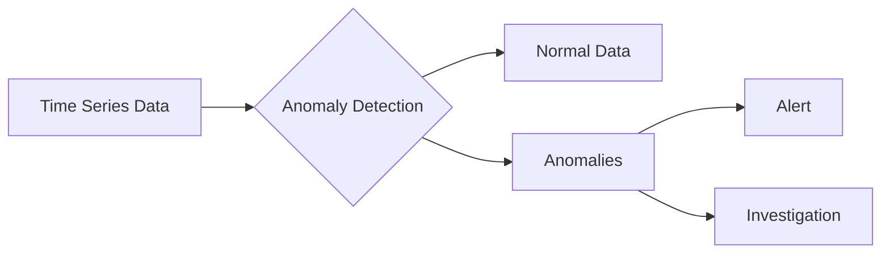

# Anomaly Detection

## Introduction

Anomaly detection is a critical monitoring pattern that helps you identify unusual behaviors, outliers, or unexpected patterns in your time-series data. In the context of Grafana monitoring, anomaly detection techniques allow you to spot potential issues before they become critical problems, often catching what traditional threshold-based alerting might miss.

Whether you're monitoring server metrics, application performance, or business KPIs, implementing effective anomaly detection can significantly improve your observability practices and reduce mean time to detection (MTTD) for incidents.

## What is an Anomaly?

An anomaly (or outlier) is a data point or pattern that deviates significantly from the expected behavior. Anomalies in monitoring data might indicate:

- Performance issues
- Security incidents
- Hardware failures
- Application errors
- Unusual user behavior



## Types of Anomalies in Monitoring

### 1. Point Anomalies

Single data points that deviate significantly from the rest of the data.

**Example:** A CPU usage spike to 95% when the normal range is 20-40%.

### 2. Contextual Anomalies

Data points that appear anomalous only in a specific context.

**Example:** A server processing 1000 requests/second might be normal during peak hours but anomalous at 3 AM.

### 3. Collective Anomalies

A collection of related data points that are anomalous as a group.

**Example:** A gradual increase in memory usage across all servers that doesn't trigger individual alerts but represents an unusual pattern when viewed collectively.

## Basic Anomaly Detection Methods in Grafana

### Static Threshold Method

The simplest form of anomaly detection uses fixed thresholds to identify values outside an acceptable range.

**Implementation in Grafana:**

1. Create a threshold alert in Grafana
2. Define your metric query
3. Set appropriate threshold conditions

```sql
SELECT mean("cpu_usage_percent") FROM "system" WHERE $timeFilter GROUP BY time($__interval)
```

Alert conditions:
```
WHEN last() OF query(A) IS ABOVE 90
```

### Advantages and Limitations:

✅ Simple to implement and understand  
✅ Works well for metrics with stable, predictable ranges  
❌ Doesn't adapt to seasonal changes or growth trends  
❌ Often leads to false positives/negatives  

### Dynamic Threshold Method

This method sets thresholds based on historical data patterns, adapting to normal variations over time.

**Implementation in Grafana using Threshold Band:**

```sql
-- Query A: Current value
SELECT mean("http_response_time") FROM "application" WHERE $timeFilter GROUP BY time($__interval)

-- Query B: Upper band (historical average + 2 standard deviations)
SELECT mean("http_response_time") + (2 * stddev("http_response_time")) FROM "application" 
WHERE time > now() - 7d AND time < now() - 1h 
GROUP BY time(1h)

-- Query C: Lower band (historical average - 2 standard deviations)
SELECT mean("http_response_time") - (2 * stddev("http_response_time")) FROM "application" 
WHERE time > now() - 7d AND time < now() - 1h 
GROUP BY time(1h)
```

Alert conditions:
```
WHEN last() OF query(A) IS OUTSIDE BAND OF query(B) AND query(C)
```

### Advantages and Limitations:

✅ Adapts to normal variations in data  
✅ Reduces false positives from seasonal patterns  
❌ Requires historical data  
❌ May not detect gradual shifts (drift)  

## Advanced Anomaly Detection with Grafana

### Holt-Winters Forecasting

Holt-Winters is a time-series forecasting method that can predict expected values based on historical trends and seasonality. Anomalies are detected when actual values differ significantly from predictions.

**Implementation using InfluxDB and Grafana:**

```sql
SELECT holt_winters(mean("cpu_usage_percent"), 24, 168) FROM "system" 
WHERE time > now() - 30d GROUP BY time(1h)
```

This query:
- Uses 24 hours of seasonality
- Uses 168 hours (1 week) of trend data
- Creates a forecast band we can alert on

### Machine Learning-Based Anomaly Detection

For more sophisticated anomaly detection, you can integrate Grafana with machine learning tools or use plugins that support ML-based detection.

**Example using Grafana k-means Plugin:**

1. Install the k-means anomaly detection plugin
2. Configure your data source
3. Set up a dashboard with the plugin
4. Configure the number of clusters and sensitivity

## Practical Implementation Guide

Let's implement a comprehensive anomaly detection system for monitoring web application performance:

### Step 1: Set Up Base Metrics

Create a dashboard with key metrics:
- Response time
- Error rate
- Request volume
- CPU and memory usage

### Step 2: Implement Multi-Stage Anomaly Detection

For each key metric, implement multiple detection methods:

1. **Static Thresholds** for critical violations:

```
WHEN max() OF query(A, 5m) IS ABOVE 500 FOR 5m
```

2. **Dynamic Thresholds** for contextual anomalies:

```sql
-- Current value
SELECT mean("response_time") FROM "webapp" WHERE $timeFilter GROUP BY time($__interval)

-- Dynamic threshold based on time of day and day of week pattern
SELECT mean("response_time") + (2.5 * stddev("response_time")) 
FROM "webapp" 
WHERE time > now() - 14d AND time < now() - 1h 
AND dayofweek = dayofweek(now()) 
AND hour >= hour(now()) - 1 AND hour <= hour(now()) + 1
GROUP BY time(1h)
```

3. **Seasonality-Aware Detection**:

```sql
-- Using Flux in InfluxDB
from(bucket: "metrics")
  |> range(start: -30d)
  |> filter(fn: (r) => r._measurement == "response_time")
  |> aggregateWindow(every: 1h, fn: mean)
  |> timedMovingAverage(every: 1h, period: 24h)
  |> yield(name: "seasonality_baseline")
```

### Step 3: Visualization and Alerting

Create a dashboard with panels that show:

1. Raw metrics
2. Anomaly bands
3. Detection events
4. Alert history

**Alert Configuration:**

```yaml
# Grafana Alert Rule (YAML representation)
name: Application Response Time Anomaly
data:
  - refId: A
    queryType: range
    datasource:
      type: influxdb
      uid: P5697886B9C044C4F
    query: from(bucket: "metrics")
      |> range(start: -1h)
      |> filter(fn: (r) => r._measurement == "response_time")
      |> mean()
  - refId: B
    queryType: range
    datasource:
      type: influxdb
      uid: P5697886B9C044C4F
    query: from(bucket: "metrics")
      |> range(start: -14d, stop: -1h)
      |> filter(fn: (r) => r._measurement == "response_time")
      |> aggregateWindow(every: 1h, fn: mean)
      |> stddev() 
      |> map(fn: (r) => ({ r with _value: r._value * 3 }))
condition: C
no_data_state: OK
exec_err_state: Error
conditions:
  - type: outside_range
    refId: C
    evaluator:
      params: [0, B]
      type: within_range
    operator:
      type: and
    reducer:
      type: avg
      params: []
    query:
      params: [A]
```

## Real-World Example: E-commerce Traffic Monitoring

Let's apply anomaly detection to an e-commerce website traffic monitoring system:

### Scenario

- You need to monitor website traffic patterns
- Detect unusual spikes or drops that might indicate problems or opportunities
- Account for known patterns like daily cycles, weekends, and promotions

### Implementation

1. **Collect baseline data:**
   - At least 4 weeks of historical traffic data
   - Tag special events (marketing campaigns, holidays)

2. **Create traffic pattern models:**

```sql
-- Normal daily pattern for each day of week
SELECT mean("visitors_per_minute") FROM "website_stats" 
WHERE time > now() - 28d AND time < now() - 1d 
GROUP BY time(10m), dayofweek
```

3. **Implement multi-level detection:**

```sql
-- Level 1: Critical thresholds
SELECT mean("error_rate") FROM "website_stats" WHERE $timeFilter GROUP BY time(1m)
-- Alert when > 5% for 3 minutes

-- Level 2: Dynamic thresholds
SELECT mean("visitors_per_minute") FROM "website_stats" WHERE $timeFilter GROUP BY time(1m)
-- Compare against day/time pattern with tolerance band

-- Level 3: Rate of change detection
SELECT non_negative_derivative(mean("response_time"), 1m) FROM "website_stats" WHERE $timeFilter GROUP BY time(1m)
-- Alert on rapid changes regardless of absolute value
```

4. **Visualize with anomaly markers:**

Create a dashboard showing:
- Traffic patterns with predicted ranges
- Highlighted anomalies
- Correlation with other metrics (server load, conversion rate)

## Best Practices for Anomaly Detection

1. **Start with a solid baseline:**
   - Collect sufficient historical data
   - Understand normal patterns
   - Document expected variations

2. **Layer your approaches:**
   - Critical static thresholds for immediate dangers
   - Dynamic thresholds for contextual anomalies
   - Trend and pattern analysis for subtle shifts

3. **Tune to reduce noise:**
   - Adjust sensitivity based on false positive rate
   - Consider business impact in alert prioritization
   - Use time-appropriate thresholds (different for business hours vs. overnight)

4. **Continuous improvement:**
   - Review detection effectiveness regularly
   - Adjust based on missed anomalies or false positives
   - Update baselines as systems evolve

5. **Context matters:**
   - Correlate anomalies across related metrics
   - Consider known events (deployments, marketing campaigns)
   - Look for anomaly clusters rather than isolated incidents

## Troubleshooting Anomaly Detection

### Common Issues and Solutions

| Problem | Possible Causes | Solutions |
|---------|----------------|-----------|
| Too many false positives | Thresholds too tight | Widen thresholds, use longer evaluation periods |
| Missing obvious anomalies | Thresholds too loose | Tighten thresholds, add rate-of-change detection |
| Alerts during known patterns | Not accounting for seasonality | Implement time-aware baselines, add maintenance windows |
| Baseline drift | System growth or changes | Regularly update baselines, use adaptive algorithms |

## Summary

Anomaly detection is a powerful monitoring pattern that goes beyond simple threshold-based alerting. By implementing appropriate anomaly detection techniques in Grafana, you can:

- Identify unusual behavior that traditional monitoring might miss
- Reduce alert noise by accounting for normal variations
- Detect subtle problems before they become critical
- Improve overall system observability

The best anomaly detection systems combine multiple approaches, from simple thresholds to sophisticated machine learning models, each appropriate for different types of metrics and patterns.

## Exercises

1. Set up a simple threshold-based anomaly detection for CPU usage on a server.
2. Implement a dynamic threshold based on time-of-day patterns for website traffic.
3. Create a dashboard that shows both raw metrics and detected anomalies.
4. Configure a multi-stage alert that uses both static and dynamic thresholds.
5. Analyze a week of your application's metrics and identify potential anomalies manually, then set up automated detection to catch similar patterns.

## Additional Resources

- [Grafana Alert Documentation](https://grafana.com/docs/grafana/latest/alerting/)
- [InfluxDB Anomaly Detection Functions](https://docs.influxdata.com/influxdb/cloud/reference/flux/stdlib/experimental/anomalydetection/)
- [Statistical Anomaly Detection Techniques](https://towardsdatascience.com/anomaly-detection-for-dummies-15f148e559c1)
- [Machine Learning for Time Series Anomaly Detection](https://www.tensorflow.org/tutorials/structured_data/time_series)
- [Practical Monitoring: Effective Strategies for the Real World](https://www.oreilly.com/library/view/practical-monitoring/9781491957349/) (Book)