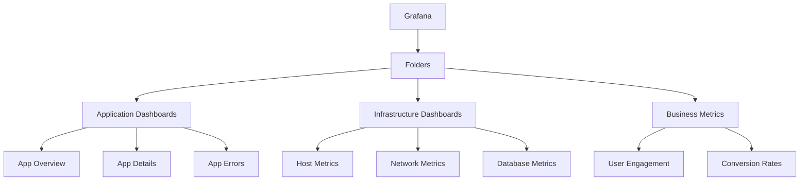
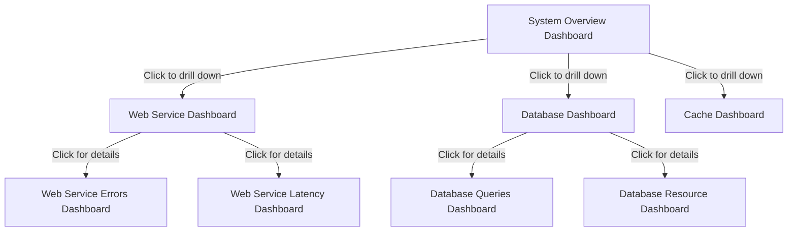

# Dashboards Organization

## Introduction

Organizing dashboards effectively is a critical skill for anyone working with Grafana. As monitoring systems grow in complexity, a well-structured approach to dashboard organization becomes essential. This guide will walk you through the principles and best practices of organizing Grafana dashboards to create maintainable, scalable, and user-friendly monitoring solutions.

## Why Dashboard Organization Matters

When you're just starting with Grafana, you might create a few dashboards without much thought to organization. However, as your monitoring needs grow, you'll likely encounter these common problems:

- **Dashboard sprawl**: Too many dashboards with no clear structure
- **Inconsistent naming**: Difficulty finding specific dashboards
- **Duplication**: Similar dashboards created by different teams
- **Maintenance challenges**: Updates requiring changes across multiple dashboards
- **Poor user experience**: Users struggling to find relevant information quickly

Good dashboard organization solves these problems and provides numerous benefits:

- Improves discoverability of monitoring information
- Reduces duplication and maintenance overhead
- Creates a consistent user experience
- Scales with growing infrastructure
- Enables team collaboration

## Core Principles of Dashboard Organization

### Hierarchical Structure

Grafana provides several organizational constructs that help create a logical hierarchy:

- **Folders**: Group related dashboards
- **Dashboard naming conventions**: Establish a consistent naming pattern
- **Tags**: Add metadata for filtering and searching
- **Dashboard variables**: Create dynamic, reusable dashboards

Let's look at implementing a hierarchical structure:



### Implementing Folders

Folders serve as the primary organizational unit in Grafana. Here's how to create and manage them:

1. Navigate to the Dashboards section
2. Click on "New Folder" 
3. Name your folder following your organization's convention
4. Set appropriate permissions for the folder

Example folder structure:

```
Grafana
├── Infrastructure
│   ├── Compute
│   ├── Network
│   ├── Storage
│   └── Databases
├── Applications
│   ├── Frontend
│   ├── Backend
│   ├── API Services
│   └── Batch Jobs
├── Business Metrics
│   ├── User Activity
│   ├── Conversions
│   └── Revenue
└── SRE
    ├── SLOs
    ├── Error Budgets
    └── Incidents
```

### Naming Conventions

Establishing a consistent naming convention makes dashboards easier to find and understand. Common patterns include:

- **[Team] - [Application] - [Purpose]**
- **[Environment] - [Service] - [Metrics Type]**
- **[Business Unit] - [Function] - [Detail Level]**

Example naming convention implementation:

| Dashboard Name | Description |
|----------------|-------------|
| SRE - API Services - Overview | High-level view of all API services for SRE team |
| Infrastructure - Databases - PostgreSQL Details | Detailed metrics for PostgreSQL databases |
| Business - User Engagement - Daily Active Users | Business metrics tracking daily active users |

### Using Tags Effectively

Tags provide additional metadata for filtering and searching dashboards:

```javascript
// Example dashboard JSON snippet showing tags
{
  "title": "API Performance Dashboard",
  "tags": ["api", "performance", "sre", "production"],
  // other dashboard properties...
}
```

Best practices for tagging:
- Use consistent tag naming (lowercase, no spaces)
- Limit the number of tags (5-10 max)
- Create tag categories (environment, team, service, etc.)
- Document your tagging strategy

## Practical Dashboard Organization Patterns

### The Overview-Detail Pattern

This pattern creates a hierarchy of dashboards from high-level overviews to detailed drill-downs:

1. **Overview Dashboard**: Shows high-level health metrics across systems
2. **Service/Component Dashboards**: Mid-level metrics for specific services
3. **Detail Dashboards**: Deep-dive metrics for troubleshooting

Implementation example:



### Dashboard Links for Navigation

Create a network of linked dashboards to enable easy navigation:

```javascript
// Dashboard JSON snippet showing dashboard links
{
  "links": [
    {
      "title": "Related Dashboards",
      "type": "dashboards",
      "tags": ["api", "performance"],
      "asDropdown": true,
      "includeVars": true,
      "keepTime": true
    },
    {
      "title": "Service Documentation",
      "type": "link",
      "url": "https://internal-docs/api-service",
      "targetBlank": true
    }
  ]
}
```

### Template Variables for Dynamic Dashboards

Use template variables to create reusable dashboards that work across different environments, services, or instances:

```javascript
// Dashboard JSON snippet showing template variables
{
  "templating": {
    "list": [
      {
        "name": "environment",
        "type": "custom",
        "options": [
          {"text": "production", "value": "production"},
          {"text": "staging", "value": "staging"},
          {"text": "development", "value": "development"}
        ],
        "current": {"text": "production", "value": "production"}
      },
      {
        "name": "service",
        "type": "query",
        "query": "label_values(service_name)",
        "refresh": 1
      }
    ]
  }
}
```

To implement in your dashboard:

1. Create template variables in the dashboard settings
2. Use these variables in your queries with syntax like `$environment` or `${service}`
3. Users can then select different values from dropdown menus

Example query using template variables:

```
sum(rate(http_requests_total{environment="$environment", service="$service"}[5m])) by (route)
```

## Implementing Dashboard Organization at Scale

### Creating Dashboard Standards

Establish dashboard standards across teams:

1. **Style guide**: Consistent colors, units, and thresholds
2. **Panel patterns**: Standard ways to display specific metrics
3. **Documentation**: Required information in dashboard descriptions
4. **Refresh rates**: Appropriate refresh intervals for different data types

### Using Dashboard Provisioning

For larger organizations, manage dashboards as code using Grafana's provisioning capabilities:

```yaml
# Example dashboard provisioning configuration (grafana.ini)
[dashboards]
# Path to the JSON files that contain the dashboard definitions
provisioning_path = /etc/grafana/provisioning/dashboards

# Example provider configuration (providers.yaml)
apiVersion: 1
providers:
- name: 'default'
  orgId: 1
  folder: 'Infrastructure'
  type: file
  disableDeletion: false
  updateIntervalSeconds: 60
  options:
    path: /etc/grafana/dashboards/infrastructure
```

This approach allows you to:
- Version control your dashboards
- Review dashboard changes through PRs
- Automate dashboard deployment
- Ensure consistency across environments

### Dashboard Management Tools

Consider using these tools for managing dashboards at scale:

1. **Grafonnet**: A library for generating Grafana dashboards using Jsonnet
2. **Grizzly**: A tool for managing Grafana resources as code
3. **Grafana Terraform Provider**: Manage Grafana through Terraform

Example Grafonnet code to generate a dashboard:

```javascript
local grafana = import 'grafonnet/grafana.libsonnet';
local dashboard = grafana.dashboard;
local row = grafana.row;
local prometheus = grafana.prometheus;
local template = grafana.template;

dashboard.new(
  'API Service Dashboard',
  tags=['api', 'service'],
  time_from='now-6h',
)
.addTemplate(
  template.new(
    'environment',
    'prometheus',
    'label_values(environment)',
    label='Environment',
    refresh='time',
  )
)
.addRow(
  row.new(title='Request Rate')
  .addPanel(
    grafana.graphPanel.new(
      'Requests per Second',
      datasource='prometheus',
      format='ops',
      min=0,
    )
    .addTarget(
      prometheus.target(
        'sum(rate(http_requests_total{environment="$environment"}[5m])) by (service)',
      )
    )
  )
)
```

## Real-World Organization Examples

### E-Commerce Monitoring Structure

This example shows how an e-commerce company might organize their dashboards:

```
Grafana
├── Business
│   ├── Sales Overview
│   ├── Product Performance
│   ├── Customer Journey
│   └── Conversion Funnel
├── Applications
│   ├── Website Overview
│   ├── Checkout Service
│   ├── Inventory System
│   └── Payment Processing
├── Infrastructure
│   ├── Kubernetes Clusters
│   ├── Database Performance
│   ├── Cache Systems
│   └── Message Queues
└── SRE
    ├── SLO Dashboard
    ├── Error Budget Tracking
    ├── Incident Response
    └── On-Call Overview
```

Each dashboard uses the naming convention `[Area] - [Service] - [Purpose]` and includes relevant tags.

### SaaS Application Monitoring

For a SaaS application, you might organize dashboards like this:

1. **Overview Dashboard**: Key metrics across all systems
   - User activity
   - System health
   - Error rates
   - Performance metrics

2. **Per-Service Dashboards**:
   - Authentication Service
   - API Gateway
   - Data Processing
   - Storage Service

3. **Customer Experience Dashboards**:
   - Sign-up flow
   - Core feature usage
   - Error experience
   - Performance by user segment

4. **Infrastructure Dashboards**:
   - Database performance
   - Kubernetes cluster metrics
   - Network performance
   - Cloud resource utilization

## Common Dashboard Organization Anti-Patterns

Avoid these common mistakes:

1. **The "Everything Dashboard"**: Cramming too much information into a single dashboard
2. **Inconsistent naming**: Using different naming patterns across dashboards
3. **No folder structure**: Putting all dashboards in the root folder
4. **Static dashboards**: Creating separate dashboards for each instance instead of using variables
5. **Undocumented dashboards**: Lack of descriptions or context for panels

## Best Practices Summary

1. **Create a logical hierarchy**: Use folders to group related dashboards
2. **Establish naming conventions**: Make dashboards easy to find and understand
3. **Implement tagging**: Add metadata for filtering and searching
4. **Build navigable paths**: Create links between related dashboards
5. **Use template variables**: Make dashboards reusable across environments
6. **Define standards**: Create consistency across all dashboards
7. **Manage as code**: Version control and automate dashboard management
8. **Document everything**: Add context to help users understand the data
9. **Review regularly**: Clean up unused or outdated dashboards
10. **Get feedback**: Continuously improve based on user experience

## Exercises

1. **Dashboard Audit**: Review your current Grafana instance and identify opportunities for better organization.
2. **Folder Structure**: Design a folder structure that matches your organization's teams and services.
3. **Template Variables**: Convert a static dashboard to use template variables for environment and service selection.
4. **Dashboard as Code**: Create a simple dashboard using Grafonnet or the Grafana Terraform provider.
5. **Navigation Network**: Implement dashboard links to create a connected network of dashboards.

## Additional Resources

- Grafana Documentation: [Dashboard Management](https://grafana.com/docs/grafana/latest/dashboards/)
- Grafana Blog: [Best Practices for Creating Dashboards](https://grafana.com/blog/2022/05/17/best-practices-for-creating-dashboards/)
- GitHub: [Grafonnet Library](https://github.com/grafana/grafonnet-lib)
- GitHub: [Grizzly Dashboard Manager](https://github.com/grafana/grizzly)
- Terraform: [Grafana Provider](https://registry.terraform.io/providers/grafana/grafana/latest/docs)

## Summary

Effective dashboard organization is essential for creating scalable, maintainable monitoring systems in Grafana. By implementing a logical folder structure, consistent naming conventions, and proper tagging, you can make it easier for users to find the information they need. Template variables and dashboard links create a more dynamic, connected experience, while provisioning and management tools help maintain consistency as your monitoring needs grow.

Remember that dashboard organization is not a one-time task but an ongoing process. Regularly review your dashboards, gather user feedback, and refine your organization strategy to ensure your Grafana instance remains valuable and usable as it scales.