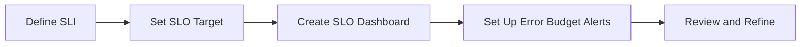

# Monitoring Best Practices

## Introduction

Effective monitoring is essential for maintaining reliable systems and applications. As your infrastructure grows in complexity, implementing proper monitoring becomes increasingly important to ensure performance, availability, and security. This guide explores best practices for monitoring with Grafana, helping you build a robust observability strategy that provides actionable insights.

Monitoring best practices involve not just collecting data, but knowing what to collect, how to visualize it, and how to act on the information. In this guide, we'll explore the principles and techniques that make monitoring effective, with practical examples using Grafana.

## The Four Golden Signals

When approaching monitoring, it's helpful to start with the "Four Golden Signals" concept from Google's Site Reliability Engineering (SRE) practices. These four metrics provide a foundation for monitoring any service:

1. **Latency** - How long it takes to service a request
2. **Traffic** - How much demand is placed on your system
3. **Errors** - The rate of failed requests
4. **Saturation** - How "full" your service is

Let's look at how to implement these in Grafana:

```promql
# Latency - 95th percentile request duration
histogram_quantile(0.95, sum(rate(http_request_duration_seconds_bucket[5m])) by (le, service))

# Traffic - Requests per second
sum(rate(http_requests_total[5m])) by (service)

# Errors - Error rate percentage
sum(rate(http_requests_total{status=~"5.."}[5m])) by (service) 
  / 
sum(rate(http_requests_total[5m])) by (service) * 100

# Saturation - CPU usage percentage
avg(rate(process_cpu_seconds_total[5m]) * 100) by (service)
```

## Effective Dashboard Design

Dashboards are your window into system behavior. Here are best practices for creating effective dashboards:

### 1. Follow a Purpose-Driven Layout

Organize your dashboard to tell a story:

- **Top row**: Overall service health and SLIs (Service Level Indicators)
- **Middle rows**: Component-specific panels grouped logically
- **Bottom rows**: Detailed metrics for debugging

### 2. Use Consistent Naming and Units

Consistency makes dashboards easier to read:

```javascript
// Good naming example in dashboard variable
name = 'node_cpu_usage_percent'
label = 'CPU Usage (%)'
unit = 'percent (0-100)'

// Bad naming example
name = 'cpu_used'
label = 'CPU'
unit = 'none'
```

### 3. Implement the RED Method for Services

For each service or microservice, track:

- **R**ate - Requests per second
- **E**rrors - Number of failed requests
- **D**uration - Amount of time to process requests

Here's how to implement this with a Grafana panel:

```promql
# Rate
sum(rate(http_requests_total{job="my-service"}[5m]))

# Errors
sum(rate(http_requests_total{job="my-service", status=~"5.."}[5m]))

# Duration
histogram_quantile(0.95, sum(rate(http_request_duration_seconds_bucket{job="my-service"}[5m])) by (le))
```

### 4. Implement the USE Method for Resources

For each infrastructure resource, track:

- **U**tilization - Percentage of time the resource is busy
- **S**aturation - Amount of work resource has to do (queue length)
- **E**rrors - Count of error events

For example, monitoring disk performance:

```promql
# Utilization - Disk I/O utilization
rate(node_disk_io_time_seconds_total{device="sda"}[5m]) * 100

# Saturation - Disk queue length
rate(node_disk_io_time_weighted_seconds_total{device="sda"}[5m])

# Errors - Disk errors
sum(rate(node_disk_errors_total{device="sda"}[5m]))
```

## Alert Design Best Practices

Alerts are your system's way of telling you something needs attention. Here are best practices for setting up effective alerts:

### 1. Alert on Symptoms, Not Causes

Alert on conditions that directly affect users:

```yaml
# Good alert - Symptom-based
alert: HighErrorRate
expr: sum(rate(http_requests_total{status=~"5.."}[5m])) / sum(rate(http_requests_total[5m])) > 0.05
for: 5m
labels:
  severity: critical
annotations:
  summary: High error rate detected (> 5%)
  description: Service {{ $labels.service }} is experiencing high error rates

# Avoid - Cause-based
alert: DatabaseConnectionPoolExhausted
expr: db_connections_used / db_connections_max > 0.8
```

### 2. Implement Multi-level Alerting

Create tiered alerts for progressive response:

```yaml
# Warning level
alert: HighLatencyWarning
expr: histogram_quantile(0.95, sum(rate(http_request_duration_seconds_bucket[5m])) by (le)) > 0.5
for: 5m
labels:
  severity: warning

# Critical level
alert: HighLatencyCritical
expr: histogram_quantile(0.95, sum(rate(http_request_duration_seconds_bucket[5m])) by (le)) > 1
for: 2m
labels:
  severity: critical
```

### 3. Include Actionable Information

Make alerts actionable by including relevant context:

```yaml
alert: ServiceHighLatency
expr: histogram_quantile(0.95, sum(rate(http_request_duration_seconds_bucket{job="my-service"}[5m])) by (le)) > 1
for: 5m
labels:
  severity: critical
  team: backend
annotations:
  summary: High latency on service
  description: Service {{ $labels.job }} has 95th percentile latency above 1s
  dashboard: https://grafana.example.com/d/service-overview
  runbook: https://wiki.example.com/runbooks/high-latency
```

## Data Collection Best Practices

### 1. Define Appropriate Scrape Intervals

Balance between data granularity and storage requirements:

```yaml
# Prometheus scrape config example
scrape_configs:
  # Critical infrastructure - frequent collection
  - job_name: 'api-gateway'
    scrape_interval: 15s
    
  # Less critical systems - reduced frequency
  - job_name: 'batch-processors'
    scrape_interval: 1m
```

### 2. Use Labels Effectively

Labels provide context and enable powerful querying:

```yaml
# Good labeling practice
http_requests_total{service="auth-api", environment="production", region="us-west", endpoint="/login", status="200"}

# Query example using labels
sum(rate(http_requests_total{service="auth-api", status=~"5.."}[5m])) by (endpoint)
```

### 3. Implement Service Discovery

Automate monitoring target discovery for dynamic environments:

```yaml
# Kubernetes service discovery example
scrape_configs:
  - job_name: 'kubernetes-pods'
    kubernetes_sd_configs:
      - role: pod
    relabel_configs:
      - source_labels: [__meta_kubernetes_pod_annotation_prometheus_io_scrape]
        action: keep
        regex: true
      - source_labels: [__meta_kubernetes_pod_annotation_prometheus_io_path]
        action: replace
        target_label: __metrics_path__
        regex: (.+)
```

## Implementing SLOs and SLIs

Service Level Objectives (SLOs) define the reliability targets for your system, while Service Level Indicators (SLIs) measure your performance against those targets.

### Setting Up SLOs in Grafana



Example implementation:

```yaml
# SLI: Availability
sli_availability = sum(rate(http_requests_total{status!~"5.."}[30d])) / sum(rate(http_requests_total[30d]))

# SLO: 99.9% availability
slo_target = 0.999

# Error budget: 0.1% of requests can fail
error_budget = 1 - slo_target

# Alert when error budget is 75% consumed
alert: ErrorBudgetBurn
expr: (1 - sli_availability) / error_budget > 0.75
```

## Creating a Multi-level Monitoring Strategy

A comprehensive monitoring strategy includes multiple layers:

### 1. Infrastructure Monitoring

Monitor the foundation of your services:

```promql
# CPU usage
avg(rate(node_cpu_seconds_total{mode!="idle"}[5m])) by (instance) * 100

# Memory usage
(node_memory_MemTotal_bytes - node_memory_MemAvailable_bytes) / node_memory_MemTotal_bytes * 100

# Disk usage
(node_filesystem_size_bytes - node_filesystem_free_bytes) / node_filesystem_size_bytes * 100
```

### 2. Application Monitoring

Monitor the behavior of your applications:

```promql
# Application throughput
sum(rate(app_requests_total[5m])) by (service)

# Application error rate
sum(rate(app_requests_total{status=~"error"}[5m])) / sum(rate(app_requests_total[5m])) by (service)

# Application latency
histogram_quantile(0.95, sum(rate(app_request_duration_seconds_bucket[5m])) by (le, service))
```

### 3. Business Metrics

Connect technical metrics to business outcomes:

```promql
# Conversion rate
sum(rate(checkout_completed_total[1h])) / sum(rate(checkout_started_total[1h]))

# Revenue per hour
sum(rate(checkout_value_total[1h]))

# Active users
sum(user_sessions_active)
```

## Building a Monitoring Culture

Technical implementation is only part of effective monitoring. Building a monitoring culture requires:

1. **Shared Responsibility**: Everyone contributes to monitoring
2. **Blameless Postmortems**: Learn from incidents without blame
3. **Regular Reviews**: Review and improve monitoring continuously
4. **Documentation**: Maintain runbooks and incident response procedures

## Practical Example: E-commerce Monitoring Dashboard

Let's build a sample dashboard for an e-commerce application:

```javascript
// Dashboard JSON example (simplified)
{
  "title": "E-commerce Overview",
  "panels": [
    // SLI Status Panel
    {
      "title": "Service Availability",
      "type": "gauge",
      "gridPos": { "x": 0, "y": 0, "w": 6, "h": 8 },
      "targets": [
        { "expr": "sum(rate(http_requests_total{status!~\"5..\"}[1h])) / sum(rate(http_requests_total[1h])) * 100" }
      ],
      "thresholds": [
        { "value": 99, "colorMode": "critical" },
        { "value": 99.9, "colorMode": "warning" },
        { "value": 99.99, "colorMode": "ok" }
      ],
      "unit": "percent"
    },
    
    // Business Metrics
    {
      "title": "Orders Per Minute",
      "type": "timeseries",
      "gridPos": { "x": 6, "y": 0, "w": 18, "h": 8 },
      "targets": [
        { "expr": "sum(rate(ecommerce_orders_total[5m]))" }
      ]
    },

    // RED Method - Request Rate
    {
      "title": "Requests Per Second",
      "type": "timeseries",
      "gridPos": { "x": 0, "y": 9, "w": 8, "h": 8 },
      "targets": [
        { "expr": "sum(rate(http_requests_total[5m])) by (service)" }
      ]
    },

    // RED Method - Errors
    {
      "title": "Error Rate (%)",
      "type": "timeseries",
      "gridPos": { "x": 8, "y": 9, "w": 8, "h": 8 },
      "targets": [
        { "expr": "sum(rate(http_requests_total{status=~\"5..\"}[5m])) by (service) / sum(rate(http_requests_total[5m])) by (service) * 100" }
      ],
      "unit": "percent"
    },

    // RED Method - Duration
    {
      "title": "Response Time (95th %ile)",
      "type": "timeseries",
      "gridPos": { "x": 16, "y": 9, "w": 8, "h": 8 },
      "targets": [
        { "expr": "histogram_quantile(0.95, sum(rate(http_request_duration_seconds_bucket[5m])) by (le, service))" }
      ],
      "unit": "seconds"
    }
  ]
}
```

## Common Monitoring Anti-patterns

Avoid these common monitoring mistakes:

1. **Alert Fatigue**: Too many non-actionable alerts lead to ignored alerts
2. **Missing Context**: Alerts without context or runbooks slow down response
3. **Monitoring Everything**: Focus on what matters, not what's easy to measure
4. **Ignoring Business Metrics**: Technical metrics alone don't show business impact
5. **Siloed Monitoring**: Separate monitoring systems make correlation difficult

## Summary

Effective monitoring is both an art and a science. By following these best practices, you can build a monitoring system that:

- Provides early warning of problems
- Helps diagnose issues quickly
- Demonstrates the business impact of technical performance
- Guides capacity planning and optimization efforts

Remember that monitoring is not a set-and-forget activity but an iterative process that evolves with your infrastructure and applications. Regularly review and refine your monitoring strategy to ensure it continues to meet your needs.

## Additional Resources

- [Grafana Labs Documentation](https://grafana.com/docs/)
- [Prometheus Query Examples](https://prometheus.io/docs/prometheus/latest/querying/examples/)
- [Google SRE Book Chapter on Monitoring](https://sre.google/sre-book/monitoring-distributed-systems/)

## Exercises

1. Set up a dashboard implementing the RED method for a service of your choice
2. Create a multi-level alert for API response time with warning and critical thresholds
3. Define SLOs for a key service and set up error budget tracking
4. Review your existing alerts and eliminate any that don't represent user-impacting symptoms
5. Create a dashboard that links technical performance to business outcomes