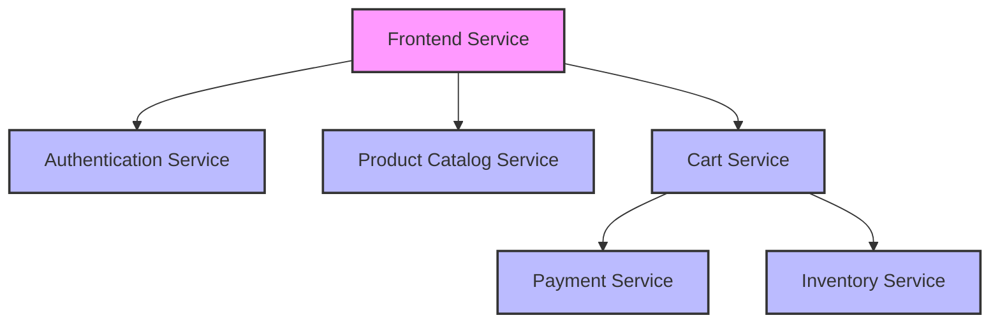

# Four Golden Signals

## Introduction

The Four Golden Signals are a monitoring methodology introduced by Google's Site Reliability Engineering (SRE) team. They represent the most critical metrics you should monitor to maintain the health and performance of your services or applications. This pattern provides a focused approach to observability by concentrating on four key metrics that, when monitored together, offer a comprehensive view of your system's health.

As you build your monitoring dashboards in Grafana, understanding and implementing the Four Golden Signals will help you identify issues quickly and ensure your services meet user expectations.

## What Are the Four Golden Signals?

The Four Golden Signals consist of:

1. **Latency** - How long it takes to service a request
2. **Traffic** - The demand on your system
3. **Errors** - The rate of failed requests
4. **Saturation** - How "full" your system is

Let's explore each of these signals in detail and learn how to implement them in Grafana.

## 1. Latency

### What is Latency?

Latency measures how long it takes to process a request. In other words, it's the time between when a user makes a request and when they receive a response. 

### Why Monitor Latency?

- Directly impacts user experience
- Helps identify performance bottlenecks
- Provides early warning of system degradation

### How to Measure Latency in Grafana

Latency should be measured at different percentiles, not just averages. A common approach is to track p50 (median), p90, p95, and p99:

```sql
# Prometheus query example for latency in PromQL
histogram_quantile(0.50, sum(rate(http_request_duration_seconds_bucket{job="api"}[5m])) by (le))
histogram_quantile(0.90, sum(rate(http_request_duration_seconds_bucket{job="api"}[5m])) by (le))
histogram_quantile(0.95, sum(rate(http_request_duration_seconds_bucket{job="api"}[5m])) by (le))
histogram_quantile(0.99, sum(rate(http_request_duration_seconds_bucket{job="api"}[5m])) by (le))
```

### Visualizing Latency

In Grafana, you can visualize latency using:

1. **Time Series Panel** - To show how latency changes over time
2. **Stat Panel** - To display current percentiles
3. **Heatmap** - To visualize latency distribution

Here's a simple PromQL query to create a latency panel in Grafana:

```sql
# For a time series panel showing latency percentiles
histogram_quantile(0.95, sum by(le) (rate(http_request_duration_seconds_bucket{service="user-api"}[5m])))
```

## 2. Traffic

### What is Traffic?

Traffic represents the demand placed on your system. It measures how much your service is being used, typically expressed as a rate of requests per second.

### Why Monitor Traffic?

- Helps understand usage patterns
- Correlates with other signals during incident analysis
- Enables capacity planning

### How to Measure Traffic in Grafana

Traffic is usually measured as a rate of requests over time:

```sql
# Prometheus query example for traffic measurement
sum(rate(http_requests_total{job="api"}[5m]))
```

### Visualizing Traffic

In Grafana, traffic can be visualized using:

1. **Time Series Panel** - To show traffic patterns over time
2. **Bar Gauge** - To display current traffic levels
3. **Stat Panel** - To show the total or average request rate

Example query:

```sql
# Traffic by endpoint
sum by(endpoint) (rate(http_requests_total{job="api"}[5m]))
```

## 3. Errors

### What are Errors?

Errors represent the rate of failed requests. These can be explicit failures (like HTTP 500 errors) or implicit failures (like wrong content being served).

### Why Monitor Errors?

- Directly impacts user experience
- Indicates system malfunctions
- Helps identify problematic components

### How to Measure Errors in Grafana

Errors are typically measured as a rate or as a percentage of total requests:

```sql
# Error rate
sum(rate(http_requests_total{job="api", status=~"5.."}[5m]))

# Error percentage
sum(rate(http_requests_total{job="api", status=~"5.."}[5m])) / sum(rate(http_requests_total{job="api"}[5m])) * 100
```

### Visualizing Errors

In Grafana, errors can be visualized using:

1. **Time Series Panel** - To show error rates over time
2. **Stat Panel** - To display current error percentage
3. **Gauge** - To visualize error rates against thresholds

## 4. Saturation

### What is Saturation?

Saturation measures how "full" your service is. It shows how much of the available resources (CPU, memory, disk, network) are being utilized relative to their capacity.

### Why Monitor Saturation?

- Predicts impending resource exhaustion
- Helps with capacity planning
- Identifies potential bottlenecks before they impact users

### How to Measure Saturation in Grafana

Saturation measurements vary by resource type:

```sql
# CPU saturation
avg by(instance) (rate(node_cpu_seconds_total{mode!="idle"}[2m]))

# Memory saturation
(node_memory_MemTotal_bytes - node_memory_MemAvailable_bytes) / node_memory_MemTotal_bytes

# Disk saturation
node_filesystem_avail_bytes / node_filesystem_size_bytes

# Connection pool saturation
max_connections - available_connections / max_connections
```

### Visualizing Saturation

In Grafana, saturation can be visualized using:

1. **Gauge Panels** - To show utilization percentages
2. **Time Series** - To show resource utilization over time
3. **Bar Gauges** - To compare utilization across instances

## Implementing the Four Golden Signals Dashboard

Now let's bring all these concepts together by creating a comprehensive Four Golden Signals dashboard in Grafana.

### Dashboard Structure

A well-organized dashboard might include:

1. A row for each Golden Signal
2. Multiple visualizations per signal
3. Consistent color schemes
4. Thresholds for alerting

### Example Dashboard JSON

Here's a simplified example of how you might structure your dashboard:

```json
{
  "annotations": {
    "list": [
      {
        "builtIn": 1,
        "datasource": "-- Grafana --",
        "enable": true,
        "hide": true,
        "iconColor": "rgba(0, 211, 255, 1)",
        "name": "Annotations & Alerts",
        "type": "dashboard"
      }
    ]
  },
  "editable": true,
  "gnetId": null,
  "graphTooltip": 0,
  "id": 1,
  "links": [],
  "panels": [
    {
      "collapsed": false,
      "datasource": null,
      "gridPos": {
        "h": 1,
        "w": 24,
        "x": 0,
        "y": 0
      },
      "id": 10,
      "panels": [],
      "title": "Latency",
      "type": "row"
    },
    {
      "aliasColors": {},
      "bars": false,
      "dashLength": 10,
      "dashes": false,
      "datasource": "Prometheus",
      "fieldConfig": {
        "defaults": {},
        "overrides": []
      },
      "fill": 1,
      "fillGradient": 0,
      "gridPos": {
        "h": 8,
        "w": 12,
        "x": 0,
        "y": 1
      },
      "hiddenSeries": false,
      "id": 2,
      "legend": {
        "avg": false,
        "current": false,
        "max": false,
        "min": false,
        "show": true,
        "total": false,
        "values": false
      },
      "lines": true,
      "linewidth": 1,
      "nullPointMode": "null",
      "options": {
        "alertThreshold": true
      },
      "percentage": false,
      "pluginVersion": "7.5.7",
      "pointradius": 2,
      "points": false,
      "renderer": "flot",
      "seriesOverrides": [],
      "spaceLength": 10,
      "stack": false,
      "steppedLine": false,
      "targets": [
        {
          "expr": "histogram_quantile(0.95, sum by(le) (rate(http_request_duration_seconds_bucket{job=\"api\"}[5m])))",
          "interval": "",
          "legendFormat": "p95",
          "refId": "A"
        },
        {
          "expr": "histogram_quantile(0.50, sum by(le) (rate(http_request_duration_seconds_bucket{job=\"api\"}[5m])))",
          "interval": "",
          "legendFormat": "p50",
          "refId": "B"
        }
      ],
      "thresholds": [],
      "timeRegions": [],
      "title": "Request Latency",
      "tooltip": {
        "shared": true,
        "sort": 0,
        "value_type": "individual"
      },
      "type": "graph",
      "xaxis": {
        "buckets": null,
        "mode": "time",
        "name": null,
        "show": true,
        "values": []
      },
      "yaxes": [
        {
          "format": "s",
          "label": null,
          "logBase": 1,
          "max": null,
          "min": null,
          "show": true
        },
        {
          "format": "short",
          "label": null,
          "logBase": 1,
          "max": null,
          "min": null,
          "show": true
        }
      ],
      "yaxis": {
        "align": false,
        "alignLevel": null
      }
    }
    // Additional panels would be defined here for the other signals
  ],
  "refresh": "5s",
  "schemaVersion": 27,
  "style": "dark",
  "tags": [],
  "templating": {
    "list": []
  },
  "time": {
    "from": "now-6h",
    "to": "now"
  },
  "timepicker": {},
  "timezone": "",
  "title": "Four Golden Signals",
  "uid": "abcdefghij",
  "version": 1
}
```

## Real-World Applications

### Case Study: E-commerce Website

For an e-commerce website, the Four Golden Signals might be implemented as:

1. **Latency**
   - Page load time
   - Checkout process duration
   - API response times

2. **Traffic**
   - Number of page views
   - Number of active sessions
   - Rate of transactions

3. **Errors**
   - Failed checkouts
   - API errors
   - 5xx HTTP responses

4. **Saturation**
   - Database connection pool usage
   - CPU usage of web servers
   - Queue depths for background jobs

### Case Study: Microservices Architecture

In a microservices environment:



Each service would have its own Four Golden Signals dashboard, and an aggregated view might also be created for the system as a whole.

## Setting Alerts Based on the Four Golden Signals

Effective monitoring isn't complete without alerting. Here's how you might set up alerts for each signal:

1. **Latency Alerts**
   - Alert when p95 latency exceeds a threshold (e.g., 500ms)
   - Alert on sudden increases in latency (e.g., 50% jump)

2. **Traffic Alerts**
   - Alert on sudden drops in traffic (might indicate an upstream issue)
   - Alert on unexpected spikes (might indicate a DDoS attack)

3. **Error Alerts**
   - Alert when error rate exceeds a threshold (e.g., 1%)
   - Alert on specific critical errors

4. **Saturation Alerts**
   - Alert when resource usage exceeds thresholds (e.g., 80% CPU, 90% memory)
   - Alert on resource exhaustion predictions

In Grafana, you can set up these alerts using Alerting rules:

```yaml
# Example alert rule for high latency
- name: HighLatency
  rules:
  - alert: APIHighLatency
    expr: histogram_quantile(0.95, sum(rate(http_request_duration_seconds_bucket{job="api"}[5m])) by (le)) > 0.5
    for: 5m
    labels:
      severity: warning
    annotations:
      summary: "High API Latency"
      description: "95th percentile latency for API requests is above 500ms for 5 minutes."
```

## Best Practices

1. **Keep It Simple**
   - Start with basic implementations of the Four Golden Signals
   - Add complexity as your understanding and needs evolve

2. **Use Consistent Units**
   - Use seconds for latency (not milliseconds in some places and seconds in others)
   - Be consistent with how you measure traffic across services

3. **Set Appropriate Thresholds**
   - Base thresholds on historical data and business requirements
   - Adjust thresholds as your system evolves

4. **Correlate Signals**
   - Look for relationships between signals (e.g., increased latency during high traffic)
   - Use these correlations for root cause analysis

5. **Iterate and Improve**
   - Regularly review your dashboards and alert thresholds
   - Add service-specific metrics to complement the Four Golden Signals

## Summary

The Four Golden Signals provide a powerful framework for monitoring your systems effectively:

- **Latency** tells you how fast your system is responding
- **Traffic** shows the demand on your system
- **Errors** reveal where your system is failing
- **Saturation** indicates how close you are to resource exhaustion

By implementing these signals in Grafana, you gain a comprehensive view of your system's health and performance. This approach helps you detect issues early, troubleshoot effectively, and ensure your services meet user expectations.

Remember that the Four Golden Signals are a starting point, not the end goal. As you become more familiar with monitoring, you can expand your dashboards to include service-specific metrics that complement these core signals.

## Additional Resources

- Google's SRE Book chapter on monitoring: [Monitoring Distributed Systems](https://sre.google/sre-book/monitoring-distributed-systems/)
- Prometheus documentation for metrics collection: [Prometheus Docs](https://prometheus.io/docs/introduction/overview/)
- Grafana dashboarding tutorials: [Grafana Tutorials](https://grafana.com/tutorials/)

## Exercises

1. Create a basic Four Golden Signals dashboard for a web application you're familiar with.
2. Identify which metrics in your current monitoring setup map to each of the Four Golden Signals.
3. Set up alerts for each of the Four Golden Signals based on historical performance data.
4. Add service-specific metrics to your dashboard that complement the Four Golden Signals.
5. Simulate an incident (e.g., high load) and observe how the Four Golden Signals react.