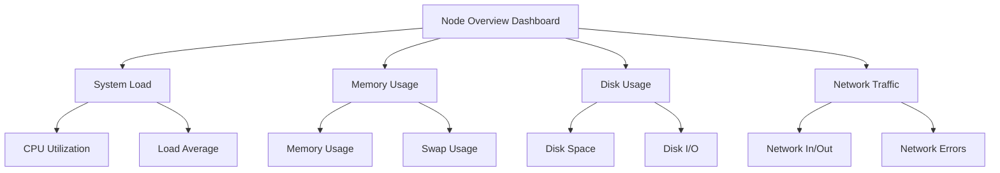

# Node Monitoring

## Introduction

Node monitoring is a fundamental aspect of infrastructure observability that focuses on tracking the health, performance, and resource utilization of individual servers or hosts in your environment. Whether you're managing a small cluster of virtual machines or a large-scale cloud infrastructure, understanding how your nodes are performing is essential for maintaining reliable systems.

In this guide, we'll explore how to implement effective node monitoring using Grafana, covering essential metrics, visualization techniques, and practical examples that will help you build comprehensive monitoring dashboards for your infrastructure.

## What is a Node?

In the context of infrastructure monitoring:

- A **node** refers to any physical or virtual machine in your environment that runs applications or services
- This includes bare-metal servers, virtual machines, cloud instances, or container hosts
- Each node has finite resources (CPU, memory, disk, network) that need to be monitored

## Why Monitor Nodes?

Effective node monitoring provides several benefits:

- **Early problem detection**: Identify resource constraints before they cause outages
- **Capacity planning**: Track resource usage trends to plan infrastructure scaling
- **Performance optimization**: Locate bottlenecks and optimize resource allocation
- **Cost management**: Identify underutilized resources to reduce infrastructure costs
- **Security**: Detect unusual resource consumption that might indicate security issues

## Key Metrics for Node Monitoring

Let's explore the essential metrics you should track for each node:

### System Load and CPU Usage

CPU metrics provide insights into processing capacity and utilization:

- **CPU Usage**: Percentage of CPU time spent on user processes, system processes, I/O wait, and idle
- **Load Average**: Number of processes waiting for CPU time (1, 5, and 15-minute averages)
- **Context Switches**: Rate at which the system switches between processes
- **Run Queue Length**: Number of processes waiting to be executed

### Memory Utilization

Memory metrics help identify potential resource constraints:

- **Total Memory**: Total RAM available on the node
- **Used Memory**: Amount of RAM currently in use
- **Free Memory**: Available RAM
- **Cached Memory**: Memory used for disk caching
- **Swap Usage**: Amount of swap space being used (high values indicate memory pressure)

### Disk Performance

Disk metrics reveal I/O bottlenecks and storage constraints:

- **Disk Usage**: Percentage of used disk space per mount point
- **Inode Usage**: Percentage of used inodes (can limit file creation even with available space)
- **I/O Operations**: Read/write operations per second
- **I/O Throughput**: Bytes read/written per second
- **I/O Wait Time**: Time spent waiting for I/O operations to complete
- **Disk Latency**: Time taken to complete read/write operations

### Network Performance

Network metrics help identify connectivity issues and bandwidth constraints:

- **Network Traffic**: Bytes received/transmitted per interface
- **Packet Rate**: Packets received/transmitted per second
- **Error Rate**: Network errors per second
- **Dropped Packets**: Number of dropped packets
- **TCP Connections**: Count of established, TIME_WAIT, and CLOSE_WAIT connections
- **Network Latency**: Time taken for packets to reach destinations

### Process Metrics

Process-level metrics provide deeper insights into what's running on nodes:

- **Process Count**: Total number of running processes
- **Top Processes**: Processes consuming the most CPU or memory
- **Process States**: Count of processes in running, sleeping, stopped, or zombie states

## Setting Up Node Monitoring with Grafana

Now that we understand what to monitor, let's set up a basic node monitoring system with Grafana and Prometheus:

### Prerequisites

- Grafana instance (version 8.x or newer)
- Prometheus for metrics collection
- Node Exporter installed on target servers

### Installing Node Exporter

Node Exporter is a Prometheus exporter that collects hardware and OS metrics from *nix systems. Install it on each node you want to monitor:

```bash
# Download Node Exporter
wget https://github.com/prometheus/node_exporter/releases/download/v1.3.1/node_exporter-1.3.1.linux-amd64.tar.gz

# Extract the binary
tar xvfz node_exporter-1.3.1.linux-amd64.tar.gz

# Move the binary to /usr/local/bin
sudo cp node_exporter-1.3.1.linux-amd64/node_exporter /usr/local/bin

# Create a service file for Node Exporter
sudo tee /etc/systemd/system/node_exporter.service > /dev/null << EOF
[Unit]
Description=Node Exporter
Wants=network-online.target
After=network-online.target

[Service]
User=node_exporter
Group=node_exporter
Type=simple
ExecStart=/usr/local/bin/node_exporter

[Install]
WantedBy=default.target
EOF

# Create user for Node Exporter
sudo useradd -rs /bin/false node_exporter

# Start Node Exporter service
sudo systemctl daemon-reload
sudo systemctl start node_exporter
sudo systemctl enable node_exporter
```

### Configuring Prometheus

Add your nodes to the Prometheus configuration file (`prometheus.yml`):

```yaml
scrape_configs:
  - job_name: 'node'
    scrape_interval: 15s
    static_configs:
      - targets: ['node1:9100', 'node2:9100', 'node3:9100']
```

After updating the configuration, restart Prometheus:

```bash
sudo systemctl restart prometheus
```

### Creating a Node Monitoring Dashboard in Grafana

Now, let's create a comprehensive node monitoring dashboard in Grafana:

1. Log in to your Grafana instance
2. Click on "Create" (+ icon) and select "Dashboard"
3. Click "Add new panel"

Let's build panels for each key metric category:

#### CPU Utilization Panel

```
# PromQL query for CPU usage
100 - (avg by (instance) (irate(node_cpu_seconds_total{mode="idle"}[5m])) * 100)
```

Format the panel:
- Title: "CPU Utilization (%)"
- Visualization: Time series
- Unit: Percent (0-100)
- Thresholds: 70% (warning), 85% (critical)

#### Memory Utilization Panel

```
# PromQL query for memory usage
100 * (1 - ((node_memory_MemFree_bytes + node_memory_Cached_bytes + node_memory_Buffers_bytes) / node_memory_MemTotal_bytes))
```

Format the panel:
- Title: "Memory Utilization (%)"
- Visualization: Time series
- Unit: Percent (0-100)
- Thresholds: 75% (warning), 90% (critical)

#### Disk Usage Panel

```
# PromQL query for disk usage
100 - ((node_filesystem_avail_bytes{mountpoint="/"} * 100) / node_filesystem_size_bytes{mountpoint="/"})
```

Format the panel:
- Title: "Disk Usage (%)"
- Visualization: Time series
- Unit: Percent (0-100)
- Thresholds: 80% (warning), 90% (critical)

#### Network Traffic Panel

```
# PromQL query for network traffic
rate(node_network_receive_bytes_total{device!="lo"}[5m])
```

```
# PromQL query for network transmit
rate(node_network_transmit_bytes_total{device!="lo"}[5m])
```

Format the panel:
- Title: "Network Traffic"
- Visualization: Time series
- Unit: bytes/sec (IEC)
- Legend: `{{device}} - {{direction}}`

## Creating a Node Overview Dashboard

Let's design a comprehensive dashboard that provides an overview of all nodes in your infrastructure:

### Dashboard Structure



### Node Overview Template

Here's a more advanced example with Grafana variables to make the dashboard dynamic:

1. Add a dashboard variable to select nodes:

```
Name: node
Label: Node
Query: label_values(node_uname_info, instance)
```

2. Create a row with general node information:

```
# PromQL query for uptime
node_time_seconds{instance="$node"} - node_boot_time_seconds{instance="$node"}
```

3. Create a stat panel showing node status:

```
# PromQL query for node status
up{job="node", instance="$node"}
```

Format as:
- Title: "Node Status"
- Value mapping: 1 = "Online", 0 = "Offline"
- Thresholds: 0 (critical), 1 (ok)

## Real-World Example: Complete Node Monitoring Dashboard

Let's put everything together into a practical example of a node monitoring dashboard:

### Dashboard JSON

Here's a simplified version of a JSON snippet that you could import into Grafana:

```json
{
  "annotations": {
    "list": [
      {
        "builtIn": 1,
        "datasource": "-- Grafana --",
        "enable": true,
        "hide": true,
        "iconColor": "rgba(0, 211, 255, 1)",
        "name": "Annotations & Alerts",
        "type": "dashboard"
      }
    ]
  },
  "editable": true,
  "gnetId": null,
  "graphTooltip": 0,
  "id": 1,
  "links": [],
  "panels": [
    {
      "datasource": null,
      "fieldConfig": {
        "defaults": {
          "mappings": [
            {
              "from": "0",
              "id": 1,
              "text": "Offline",
              "to": "0",
              "type": 1,
              "value": "0"
            },
            {
              "from": "1",
              "id": 2,
              "text": "Online",
              "to": "1",
              "type": 1,
              "value": "1"
            }
          ],
          "thresholds": {
            "mode": "absolute",
            "steps": [
              {
                "color": "red",
                "value": null
              },
              {
                "color": "green",
                "value": 1
              }
            ]
          }
        },
        "overrides": []
      },
      "gridPos": {
        "h": 5,
        "w": 4,
        "x": 0,
        "y": 0
      },
      "id": 2,
      "options": {
        "colorMode": "value",
        "graphMode": "none",
        "justifyMode": "auto",
        "orientation": "auto",
        "reduceOptions": {
          "calcs": [
            "lastNotNull"
          ],
          "fields": "",
          "values": false
        },
        "text": {},
        "textMode": "auto"
      },
      "pluginVersion": "8.0.6",
      "targets": [
        {
          "expr": "up{instance=\"$node\", job=\"node\"}",
          "interval": "",
          "legendFormat": "",
          "refId": "A"
        }
      ],
      "title": "Node Status",
      "type": "stat"
    }
  ],
  "refresh": "5s",
  "schemaVersion": 30,
  "style": "dark",
  "tags": [
    "node",
    "monitoring"
  ],
  "templating": {
    "list": [
      {
        "allValue": null,
        "current": {
          "selected": true,
          "text": "node-1:9100",
          "value": "node-1:9100"
        },
        "datasource": null,
        "definition": "label_values(node_uname_info, instance)",
        "description": null,
        "error": null,
        "hide": 0,
        "includeAll": false,
        "label": "Node",
        "multi": false,
        "name": "node",
        "options": [],
        "query": {
          "query": "label_values(node_uname_info, instance)",
          "refId": "StandardVariableQuery"
        },
        "refresh": 1,
        "regex": "",
        "skipUrlSync": false,
        "sort": 0,
        "type": "query"
      }
    ]
  },
  "time": {
    "from": "now-6h",
    "to": "now"
  },
  "timepicker": {},
  "timezone": "",
  "title": "Node Overview",
  "uid": "node-overview",
  "version": 1
}
```

## Best Practices for Node Monitoring

To get the most out of your node monitoring setup, follow these best practices:

### 1. Set Appropriate Alert Thresholds

Define alert thresholds based on your specific environment and application requirements:

- CPU: Alert at 80-90% sustained usage
- Memory: Alert at 85-95% usage
- Disk: Alert at 80-90% usage and higher for I/O wait time
- Network: Alert on error rates rather than just high traffic

### 2. Use Dashboard Variables

Make your dashboards dynamic by using Grafana variables:

- Create variables for node selection
- Use template variables for environment filtering (prod, staging, dev)
- Create time range variables for comparing different periods

### 3. Group Related Metrics

Organize your dashboard into logical sections:

- Group CPU, memory, disk, and network metrics together
- Create separate rows or panels for each subsystem
- Use consistent color schemes for similar metrics

### 4. Implement Multi-Level Monitoring

Build a hierarchical approach to monitoring:

- Top-level dashboard with overview of all nodes
- Drill-down dashboards for detailed metrics on specific nodes
- Special-purpose dashboards for investigating specific issues

### 5. Correlate Events with Metrics

Connect metrics with relevant events:

- Add annotations for deployments, restarts, and maintenance
- Include alerting annotations to show when thresholds were exceeded
- Link to logs for deeper investigation

## Troubleshooting Common Node Issues

Here are some common node issues you might detect through monitoring and how to address them:

### High CPU Usage

**Symptoms in Grafana:**
- Sustained CPU usage above 80%
- High load average relative to CPU count
- Increase in context switches

**Potential causes:**
- Resource-intensive applications
- Inefficient code or queries
- Too many processes running

**Solutions:**
- Identify top CPU consumers using `top` or process metrics
- Optimize application code or database queries
- Scale up CPU resources or distribute load

### Memory Leaks

**Symptoms in Grafana:**
- Steadily increasing memory usage without corresponding drops
- Increasing swap usage
- OOM (Out of Memory) killer activations

**Potential causes:**
- Application memory leaks
- Incorrect memory limits
- Background processes accumulating memory

**Solutions:**
- Restart leaking applications
- Profile applications to identify memory leaks
- Adjust memory limits or increase available memory

### Disk I/O Bottlenecks

**Symptoms in Grafana:**
- High I/O wait time
- Sustained high disk utilization
- Increasing latency in disk operations

**Potential causes:**
- Inefficient database queries
- Excessive logging
- Background jobs (backups, indexing)

**Solutions:**
- Identify processes causing high I/O with `iotop`
- Optimize database queries and indexes
- Schedule intensive I/O operations during off-peak hours
- Consider faster storage solutions

### Network Congestion

**Symptoms in Grafana:**
- High network utilization
- Increasing error rates or dropped packets
- Latency spikes

**Potential causes:**
- Bandwidth-intensive applications
- Network hardware issues
- DDoS attacks or unusual traffic patterns

**Solutions:**
- Identify top talkers using network monitoring tools
- Implement quality of service (QoS) policies
- Upgrade network infrastructure or bandwidth

## Advanced Node Monitoring Techniques

Once you have basic node monitoring in place, consider these advanced techniques:

### Resource Saturation Analysis

Monitor how close resources are to their limits:

- CPU saturation (runnable processes vs. CPU cores)
- Memory pressure (page faults, swap activity)
- I/O saturation (queue length, wait time)
- Network saturation (retransmits, buffer overflows)

### Baseline Deviation Alerts

Instead of fixed thresholds, alert on deviations from normal patterns:

- Use historical data to establish baselines
- Alert when metrics deviate significantly from baseline
- Implement anomaly detection for unusual patterns

### Correlation Analysis

Identify relationships between different metrics:

- Correlate CPU spikes with network activity
- Connect memory usage to application deployments
- Link disk I/O patterns to scheduled jobs

## Summary

Effective node monitoring is essential for maintaining reliable infrastructure. By tracking key metrics related to CPU, memory, disk, and network performance, you can:

- Identify and resolve issues before they impact users
- Plan capacity for future growth
- Optimize resource utilization
- Ensure system reliability and performance

The Grafana dashboards and PromQL queries provided in this guide give you a solid foundation for implementing comprehensive node monitoring in your environment. Remember to adapt the metrics, thresholds, and visualizations to your specific infrastructure requirements.

## Additional Resources

- [Grafana Documentation](https://grafana.com/docs/)
- [Prometheus Node Exporter Documentation](https://prometheus.io/docs/guides/node-exporter/)
- [PromQL Query Examples](https://prometheus.io/docs/prometheus/latest/querying/examples/)
- [Grafana Dashboard Examples](https://grafana.com/grafana/dashboards/)

## Exercises

1. Set up Node Exporter on a test server and create a basic dashboard to monitor its CPU, memory, disk, and network metrics.

2. Create a Grafana dashboard variable that allows you to filter nodes by a specific label (e.g., environment, region, or role).

3. Implement alerts for critical node metrics and test them by simulating resource constraints (e.g., using stress-ng to create CPU load).

4. Design a dashboard that shows the top 5 nodes by CPU usage, memory usage, and disk usage.

5. Create a Node Overview dashboard that provides a health status for all nodes in your infrastructure at a glance.