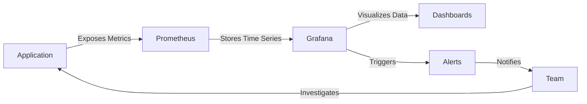

# Application Monitoring

## Introduction

Application monitoring is a critical practice in modern software development that involves tracking and analyzing the performance, health, and behavior of applications in real-time. As applications become more complex and distributed, having comprehensive visibility into how they're performing becomes essential for maintaining reliability and user satisfaction.

In this guide, we'll explore how to implement effective application monitoring using Grafana as part of a holistic monitoring strategy. You'll learn about key metrics to track, how to set up meaningful dashboards, and best practices for alerting and troubleshooting.

## Why Application Monitoring Matters

Before diving into implementation details, let's understand why application monitoring is so crucial:

- **Issue Detection**: Identify problems before they affect users
- **Performance Optimization**: Find bottlenecks and inefficiencies
- **User Experience**: Understand how application behavior impacts users
- **Resource Planning**: Make informed decisions about scaling and resource allocation
- **Business Insights**: Connect technical metrics to business outcomes

## Key Metrics for Application Monitoring

Effective application monitoring relies on tracking the right metrics. Here are the main categories you should consider:

### 1. The Four Golden Signals

Google's Site Reliability Engineering (SRE) team popularized these four critical indicators of service health:

- **Latency**: How long it takes to serve a request
- **Traffic**: The demand placed on your system
- **Errors**: The rate of failed requests
- **Saturation**: How "full" your service is (resource utilization)

### 2. RED Method

The RED method focuses specifically on service-level metrics:

- **Rate**: Requests per second
- **Errors**: Number of failed requests
- **Duration**: Distribution of response times

### 3. USE Method

The USE method applies to resources:

- **Utilization**: Percentage of time the resource is busy
- **Saturation**: Degree to which work is queuing
- **Errors**: Error events

## Setting Up Application Monitoring in Grafana

Now let's explore how to implement application monitoring using Grafana.

### Prerequisites

To follow along, you'll need:

- A running Grafana instance (v9.0+)
- An application instrumented with metrics (we'll use Prometheus as the data source)
- Basic understanding of metrics and monitoring concepts

### Instrumenting Your Application

Before you can monitor your application, you need to instrument it to expose metrics. Here's an example using a Node.js application with the Prometheus client library:

```javascript
const express = require('express');
const promClient = require('prom-client');

// Create a Registry to register metrics
const register = new promClient.Registry();
promClient.collectDefaultMetrics({ register });

// Create custom metrics
const httpRequestDurationMicroseconds = new promClient.Histogram({
  name: 'http_request_duration_seconds',
  help: 'Duration of HTTP requests in seconds',
  labelNames: ['method', 'route', 'status_code'],
  buckets: [0.1, 0.3, 0.5, 0.7, 1, 3, 5, 7, 10]
});

// Register the custom metrics
register.registerMetric(httpRequestDurationMicroseconds);

const app = express();

// Middleware to measure request duration
app.use((req, res, next) => {
  const end = httpRequestDurationMicroseconds.startTimer();
  res.on('finish', () => {
    end({ method: req.method, route: req.route?.path || req.path, status_code: res.statusCode });
  });
  next();
});

// Expose metrics endpoint
app.get('/metrics', async (req, res) => {
  res.set('Content-Type', register.contentType);
  res.end(await register.metrics());
});

app.get('/', (req, res) => {
  res.send('Hello World!');
});

app.listen(3000, () => {
  console.log('Example app listening on port 3000');
});
```

This simple application exposes metrics at `/metrics` in a format that Prometheus can scrape.

### Configuring Prometheus to Scrape Your Application

Add your application as a scrape target in your Prometheus configuration:

```yaml
scrape_configs:
  - job_name: 'my-application'
    scrape_interval: 15s
    static_configs:
      - targets: ['app-host:3000']
```

### Creating Application Dashboards in Grafana

Let's create a comprehensive dashboard that covers the key aspects of application monitoring.

1. Log in to your Grafana instance
2. Create a new dashboard (+ icon > Dashboard)
3. Add panels for the key metrics we discussed earlier

Here's an example of how to set up some essential panels:

#### Request Rate Panel

Create a Graph panel with this PromQL query:

```
sum(rate(http_request_duration_seconds_count[5m])) by (route)
```

This shows the rate of requests per second for each route in your application.

#### Error Rate Panel

Create a Graph panel with this PromQL query:

```
sum(rate(http_request_duration_seconds_count{status_code=~"5.."}[5m])) by (route) / sum(rate(http_request_duration_seconds_count[5m])) by (route)
```

This shows the error rate (percentage of 5xx responses) for each route.

#### Latency Panel

Create a Graph panel with this PromQL query:

```
histogram_quantile(0.95, sum(rate(http_request_duration_seconds_bucket[5m])) by (le, route))
```

This shows the 95th percentile of response time for each route.

#### Resource Utilization

Create panels for CPU and memory usage:

```
process_cpu_user_seconds_total{job="my-application"}
process_resident_memory_bytes{job="my-application"}
```

## Application Health Monitoring Flow

Let's visualize the flow of application monitoring data:



## Setting Up Alerts

Effective monitoring includes proactive alerting. Here's how to set up alerts in Grafana:

1. From your dashboard, click on a panel title and select "Edit"
2. Navigate to the "Alert" tab
3. Configure your alert conditions, for example:
   - Alert when error rate exceeds 1% for 5 minutes
   - Alert when 95th percentile latency exceeds 500ms for 10 minutes
4. Configure notification channels (email, Slack, PagerDuty, etc.)

Example alert rule (using Grafana Alerting):

```
Condition: max(rate(http_request_duration_seconds_count{status_code=~"5.."}[5m])) / max(rate(http_request_duration_seconds_count[5m])) > 0.01
For: 5m
Labels:
  severity: warning
Annotations:
  summary: High error rate detected
  description: Error rate is above 1% for the past 5 minutes
```

## Best Practices for Application Monitoring

1. **Monitor from the User's Perspective**
   Start with metrics that reflect the user experience (latency, errors) before diving into system-level metrics.

2. **Use the Right Level of Detail**
   Too many metrics can cause noise; too few can leave blind spots. Focus on actionable metrics.

3. **Correlate Metrics**
   Individual metrics tell part of the story; correlating multiple metrics provides deeper insights.

4. **Set Meaningful Thresholds**
   Base alert thresholds on historical data and business requirements, not arbitrary values.

5. **Implement Contextual Alerting**
   Include relevant information in alerts to help responders diagnose issues quickly.

## Real-World Example: E-Commerce Application Monitoring

Let's apply these concepts to monitoring an e-commerce application:

### Key Business Transactions to Monitor

- Product search
- Product detail view
- Add to cart
- Checkout process
- Payment processing

### Dashboard Layout

Create a hierarchical dashboard that starts with high-level health and drills down into specific components:

1. **Overview Panel**: Overall application health scorecard
2. **User Experience Metrics**: Response times, error rates by transaction type
3. **Business Impact**: Cart abandonment, conversion rate correlation with performance
4. **Component Health**: Database connection pool, cache hit ratios, API dependencies
5. **Infrastructure**: Host-level metrics for the application servers

### Example PromQL for Business Metrics

Monitoring checkout completion rate:

```
sum(rate(checkout_completed_total[5m])) / sum(rate(checkout_started_total[5m]))
```

Correlating response time with conversion:

```
sum(rate(purchase_completed_total[5m])) / sum(rate(product_viewed_total[5m]))
```

## Common Monitoring Challenges and Solutions

### Challenge: Too Many Alerts

**Solution**: Implement alert grouping and severity levels. Focus on symptoms over causes.

### Challenge: Difficult Troubleshooting

**Solution**: Create drill-down dashboards and use Grafana's Explore feature to investigate issues.

### Challenge: Incomplete Visibility

**Solution**: Combine metrics with logs and traces for full observability.

## Extending Your Monitoring Strategy

Application monitoring is one part of a comprehensive observability strategy. Consider integrating:

- **Log Management**: For detailed error information and debugging
- **Distributed Tracing**: To track requests across microservices
- **User Experience Monitoring**: To understand real user interactions
- **Synthetic Monitoring**: To proactively test critical paths

## Summary

Application monitoring is essential for maintaining reliable, performant applications. By using Grafana to visualize key metrics, you can gain valuable insights into your application's behavior, detect issues early, and ensure a positive user experience.

In this guide, we've covered:
- The importance of application monitoring
- Key metrics to track (Golden Signals, RED, USE methods)
- How to instrument applications and configure Prometheus
- Creating effective Grafana dashboards
- Setting up meaningful alerts
- Best practices and real-world examples

## Exercises

1. Instrument a simple application with Prometheus metrics
2. Create a Grafana dashboard showing the four golden signals
3. Set up an alert for high error rates
4. Extend your dashboard to include business metrics
5. Simulate a performance problem and use your monitoring tools to diagnose it

## Additional Resources

- [Grafana Documentation](https://grafana.com/docs/)
- [Prometheus Documentation](https://prometheus.io/docs/)
- [Google SRE Book - Monitoring Distributed Systems](https://sre.google/sre-book/monitoring-distributed-systems/)
- [RED Method by Tom Wilkie](https://www.weave.works/blog/the-red-method-key-metrics-for-microservices-architecture/)
- [USE Method by Brendan Gregg](https://www.brendangregg.com/usemethod.html)