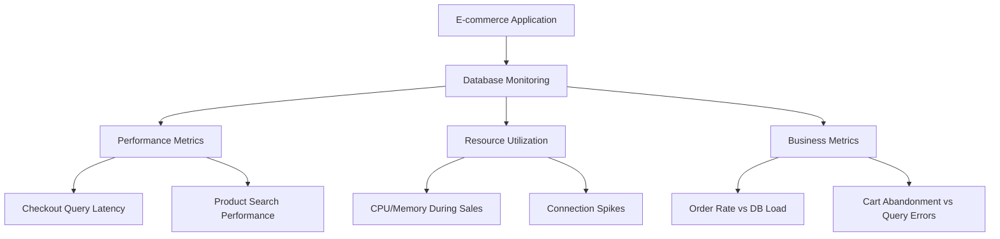

# Database Monitoring

## Introduction

Database monitoring is a critical aspect of maintaining reliable applications and services. As the backbone of most modern applications, databases require constant monitoring to ensure optimal performance, prevent outages, and quickly troubleshoot issues when they arise. This guide will walk you through how to implement effective database monitoring using Grafana.

Whether you're working with relational databases like MySQL, PostgreSQL, and SQL Server, or NoSQL solutions like MongoDB and Redis, the principles and patterns outlined here will help you build comprehensive monitoring dashboards to keep your databases healthy and performant.

## Why Monitor Databases?

Databases often become bottlenecks in application performance for several reasons:

- They handle increasingly large volumes of data
- They process complex queries from multiple sources
- They're subject to varying load patterns and peak usage times
- They're critical infrastructure that directly impacts user experience

Effective monitoring helps you:

1. Identify performance degradation before users notice
2. Plan capacity based on growth trends
3. Optimize query performance and resource utilization
4. Troubleshoot issues quickly when they occur
5. Ensure high availability and data integrity

## Key Metrics to Monitor

### Connection Metrics

- **Active connections**: Number of clients currently connected
- **Connection rate**: New connections per second
- **Connection errors**: Failed connection attempts
- **Connection pooling efficiency**: For applications using connection pools

### Performance Metrics

- **Query throughput**: Queries per second
- **Query latency**: Average and percentile response times (95th, 99th)
- **Query errors**: Failed queries and error rates
- **Slow queries**: Number and details of queries exceeding time thresholds

### Resource Utilization

- **CPU usage**: Overall and per-query CPU consumption
- **Memory usage**: Buffer/cache utilization, working set size
- **Disk I/O**: Read/write operations, latency, throughput
- **Network I/O**: Data transfer rates, packet loss, retransmits

### Storage Metrics

- **Database size**: Total size and growth rate
- **Index size**: Space consumed by indexes
- **Table size**: Size of individual tables
- **Temporary space usage**: Disk space used for temporary operations

### Replication Metrics (for clustered databases)

- **Replication lag**: Delay between primary and replicas
- **Replication errors**: Failed replication operations
- **Replication throughput**: Rate of data replication

## Setting Up Database Monitoring in Grafana

### Prerequisites

Before you begin, ensure you have:

1. A running Grafana instance (v9.0 or later recommended)
2. Access to your database with monitoring permissions
3. Prometheus, Telegraf, or another metrics collector installed
4. Required data source plugins installed in Grafana

### Step 1: Configure Data Sources

First, let's connect Grafana to your database metrics source:

1. Navigate to Configuration > Data Sources in Grafana
2. Click "Add data source"
3. Select the appropriate source type:
   - Prometheus for metric-based monitoring
   - Database-specific plugins (MySQL, PostgreSQL, etc.) for direct SQL queries
   - Loki for database logs

For Prometheus, configure the connection:

```
URL: http://your-prometheus-server:9090
Access: Server (default)
Scrape interval: 15s
```

### Step 2: Create a Dashboard

Create a new dashboard by clicking on "+" and selecting "Dashboard":

1. Add a new panel for each key metric group
2. Organize panels in logical sections
3. Use appropriate visualization types:
   - Time series for trends over time
   - Gauge for current utilization
   - Table for query details
   - Stat for key numbers

### Step 3: Configure Basic Database Overview Panels

Let's create a panel for active connections:

```sql
-- For PostgreSQL direct connection
SELECT 
  now() AS time,
  count(*) AS connections
FROM 
  pg_stat_activity
WHERE 
  state != 'idle'
```

For Prometheus with a database exporter:

```
sum(pg_stat_activity_count{state!="idle"})
```

### Step 4: Query Performance Monitoring

Let's create a panel for average query latency:

```
rate(pg_stat_statements_mean_exec_time{db="your_database"}[5m])
```

And for slow queries:

```sql
-- For MySQL direct connection
SELECT 
  time_ms,
  query,
  rows_examined,
  rows_sent
FROM 
  mysql.slow_log
WHERE 
  start_time > NOW() - INTERVAL 1 DAY
ORDER BY 
  time_ms DESC
LIMIT 10
```

## Database-Specific Monitoring Patterns

### MySQL Monitoring Pattern

For MySQL databases, focus on these additional metrics:

- **Buffer pool utilization**: Track the InnoDB buffer pool efficiency
- **Table locks**: Monitor lock contention issues
- **Handler statistics**: Understand how data is being accessed

Example Prometheus query for buffer pool hit ratio:

```
(
  rate(mysql_global_status_innodb_buffer_pool_read_requests[5m]) - 
  rate(mysql_global_status_innodb_buffer_pool_reads[5m])
) / 
rate(mysql_global_status_innodb_buffer_pool_read_requests[5m])
```

### PostgreSQL Monitoring Pattern

For PostgreSQL, these metrics are particularly important:

- **VACUUM activity**: Track autovacuum operations and tables needing vacuum
- **Bloat**: Monitor table and index bloat
- **Transaction ID wraparound**: Prevent database freezing

Example query for tracking tables needing vacuum:

```sql
SELECT
  schemaname || '.' || relname AS table_name,
  n_dead_tup AS dead_tuples,
  n_live_tup AS live_tuples,
  round(n_dead_tup::numeric / (n_live_tup + n_dead_tup) * 100, 2) AS dead_ratio
FROM
  pg_stat_user_tables
WHERE
  n_live_tup > 0
ORDER BY
  dead_ratio DESC
LIMIT 10
```

### MongoDB Monitoring Pattern

For MongoDB, focus on:

- **Operation counts**: Queries, inserts, updates, deletes
- **WiredTiger cache**: Cache utilization and eviction rates
- **Collection metrics**: Document counts and sizes

Example Prometheus query for MongoDB operation rates:

```
sum by (type) (rate(mongodb_op_counters_total[5m]))
```

## Creating Effective Alerts

Set up alerts to notify you of potential database issues:

1. **High connection count alert**:
   ```
   sum(mysql_global_status_threads_connected) > 100
   ```

2. **Replication lag alert**:
   ```
   max(mysql_slave_status_seconds_behind_master) > 300
   ```

3. **Disk space alert**:
   ```
   (node_filesystem_size_bytes{mountpoint="/var/lib/mysql"} - 
    node_filesystem_free_bytes{mountpoint="/var/lib/mysql"}) / 
    node_filesystem_size_bytes{mountpoint="/var/lib/mysql"} * 100 > 85
   ```

4. **Slow query rate alert**:
   ```
   increase(mysql_global_status_slow_queries[5m]) > 10
   ```

## Real-World Example: E-commerce Database Monitoring

Let's walk through a practical example of monitoring a database for an e-commerce application:



### Dashboard Layout Example

1. **Overview Row**:
   - Database status summary
   - Active connections trend
   - Key performance indicators

2. **Query Performance Row**:
   - Top 5 slow queries
   - Query latency by type
   - Error rate trend

3. **Resource Utilization Row**:
   - CPU usage trend
   - Memory utilization
   - Disk I/O metrics

4. **Business Impact Row**:
   - Correlation between database metrics and business KPIs
   - Database performance during peak hours
   - Historical performance during sales events

### Example Variables for the Dashboard

Create template variables to make your dashboard flexible:

```
$database: mysql_performance_schema, mysql_information_schema
$time_range: 1h, 6h, 12h, 24h, 7d
$instance: db-prod-1, db-prod-2, db-replica-1
```

## Best Practices for Database Monitoring

1. **Balance detail with clarity**: Too many metrics can be overwhelming; focus on actionable data

2. **Correlate metrics**: Look at relationships between metrics for better insights:
   ```
   correlation(rate(mysql_global_status_questions[5m]), rate(node_cpu_seconds_total{mode="user"}[5m]))
   ```

3. **Establish baselines**: Understand normal performance to detect anomalies

4. **Use annotations**: Mark deployment times, configuration changes, and maintenance events

5. **Implement proper retention policies**: Keep high-resolution data short-term and aggregated data long-term

6. **Segment by query type**: Different queries have different performance profiles

7. **Create dedicated dashboards** for different user roles:
   - DBA dashboard with technical details
   - Developer dashboard focusing on query performance
   - Executive dashboard showing system health and business impact

## Troubleshooting Common Database Issues

### High CPU Usage

1. Identify resource-intensive queries:
   ```sql
   SELECT
     query,
     calls,
     total_time,
     mean_time
   FROM
     pg_stat_statements
   ORDER BY
     total_time DESC
   LIMIT 10
   ```

2. Check for missing indexes with high table scans:
   ```
   rate(mysql_global_status_handler_read_rnd_next[5m])
   ```

### Connection Spikes

1. Identify connection sources:
   ```sql
   SELECT
     usename,
     count(*)
   FROM
     pg_stat_activity
   GROUP BY
     usename
   ORDER BY
     count(*) DESC
   ```

2. Check for connection leaks in application code

### Disk I/O Bottlenecks

1. Monitor read/write latency:
   ```
   rate(node_disk_read_time_seconds_total{device="sda"}[1m]) / rate(node_disk_reads_completed_total{device="sda"}[1m])
   ```

2. Check for queries causing excessive disk activity:
   ```
   topk(10, sum by (file_name) (rate(mysql_file_summary_by_instance_total_read[10m])))
   ```

## Advanced Techniques

### Query Performance Analysis

Use Grafana's query performance visualization to compare similar queries:

```sql
-- For PostgreSQL
SELECT
  substring(query, 1, 50) AS query_sample,
  calls,
  total_time / calls AS avg_time,
  rows / calls AS avg_rows,
  shared_blks_hit / calls AS avg_cache_hits,
  shared_blks_read / calls AS avg_cache_misses
FROM
  pg_stat_statements
WHERE
  query ILIKE '%SELECT%customer%'
ORDER BY
  total_time DESC
LIMIT 20
```

### Predictive Analysis

Set up predictive alerts based on trend analysis:

```
predict_linear(mysql_global_status_innodb_buffer_pool_pages_free[6h], 24 * 3600) < 1000
```

## Summary

Effective database monitoring with Grafana enables you to:

1. **Proactively identify issues** before they impact users
2. **Optimize database performance** through data-driven decisions
3. **Correlate database metrics** with application performance
4. **Plan for growth** by understanding resource utilization trends
5. **Troubleshoot efficiently** with detailed performance data

By following the patterns outlined in this guide, you'll create comprehensive monitoring dashboards that give you deep visibility into your database's health and performance.

## Additional Resources

- **Practice exercises**: Set up monitoring for a test database and simulate load
- **Advanced learning**: Explore specialized monitoring for your specific database
- **Community dashboards**: Import and customize pre-built database monitoring dashboards

Remember that effective monitoring is an iterative process. Start with basic metrics, add detail as needed, and continuously refine your dashboards to provide the most relevant insights.