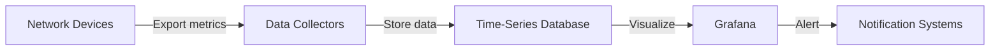

# Network Monitoring

## Introduction

Network monitoring is a critical aspect of maintaining a healthy IT infrastructure. It involves the continuous observation of network components such as routers, switches, servers, and endpoints to ensure optimal performance, detect anomalies, and troubleshoot issues before they affect users. In this guide, we'll explore how to implement effective network monitoring using Grafana as our visualization platform.

## Why Network Monitoring Matters

Networks form the backbone of modern computing environments. When network issues occur, they can impact everything from user productivity to customer experience. Effective network monitoring helps you:

- Detect and resolve issues before they impact end-users
- Establish baseline performance metrics
- Track network utilization and plan capacity
- Identify security threats and anomalies
- Ensure compliance with service level agreements (SLAs)

## Network Monitoring Basics

Before diving into implementation, let's understand some fundamental concepts in network monitoring:

### Key Network Metrics

Monitoring the right metrics is essential for network visibility:

1. **Availability**: Is the device or service responding?
2. **Latency**: How long does it take for data to travel?
3. **Packet Loss**: Are data packets being dropped?
4. **Bandwidth Utilization**: How much of your available bandwidth is being used?
5. **Error Rates**: How many errors are occurring on interfaces?
6. **Throughput**: How much data is successfully transmitted over time?

### The Monitoring Stack

A typical Grafana-based network monitoring stack includes:



- **Data Sources**: Tools like SNMP exporters, Prometheus Node Exporters, or specialized network monitoring agents
- **Storage**: Time-series databases like Prometheus, InfluxDB, or Graphite
- **Visualization**: Grafana dashboards
- **Alerting**: Grafana or external alerting systems

## Implementing Network Monitoring with Grafana

Let's walk through setting up a basic network monitoring solution with Grafana and Prometheus.

### Step 1: Set Up Data Collection

The first step is to collect network metrics. For our example, we'll use SNMP (Simple Network Management Protocol) which is widely supported by network devices.

#### Installing and Configuring the SNMP Exporter

The SNMP Exporter converts SNMP data into a format Prometheus can scrape:

```bash
# Download the SNMP exporter
wget https://github.com/prometheus/snmp_exporter/releases/download/v0.20.0/snmp_exporter-0.20.0.linux-amd64.tar.gz

# Extract the files
tar -xzf snmp_exporter-0.20.0.linux-amd64.tar.gz

# Move to the appropriate directory
cd snmp_exporter-0.20.0.linux-amd64/
```

Create a configuration file `snmp.yml` with your network device details:

```yaml
default:
  auth:
    community: public
  version: 2
  retries: 3
  timeout: 10s
  walk_params:
    max_repetitions: 25
  metrics:
  - name: ifHCInOctets
    oid: 1.3.6.1.2.1.31.1.1.1.6
    type: counter
  - name: ifHCOutOctets
    oid: 1.3.6.1.2.1.31.1.1.1.10
    type: counter
  - name: ifOperStatus
    oid: 1.3.6.1.2.1.2.2.1.8
    type: gauge
  - name: ifAdminStatus
    oid: 1.3.6.1.2.1.2.2.1.7
    type: gauge
```

Run the SNMP exporter:

```bash
./snmp_exporter --config.file=snmp.yml
```

### Step 2: Configure Prometheus to Scrape Network Metrics

Update your `prometheus.yml` file to scrape the SNMP exporter:

```yaml
global:
  scrape_interval: 15s

scrape_configs:
  - job_name: 'snmp'
    static_configs:
      - targets:
        - router1:161  # Your network device IP and SNMP port
        - switch1:161
    metrics_path: /snmp
    params:
      module: [default]
    relabel_configs:
      - source_labels: [__address__]
        target_label: __param_target
      - source_labels: [__param_target]
        target_label: instance
      - target_label: __address__
        replacement: localhost:9116  # SNMP exporter address
```

### Step 3: Create a Grafana Dashboard

Now let's create a dashboard to visualize our network metrics. In Grafana:

1. Add Prometheus as a data source
2. Create a new dashboard
3. Add panels for key metrics

Here's a PromQL query example for network interface throughput:

```
rate(ifHCInOctets{instance="router1:161",ifIndex="2"}[5m]) * 8
```

This query shows the input traffic rate in bits per second for interface 2 on router1.

## Sample Network Monitoring Dashboard

Below is an example of how to structure your Grafana dashboard for network monitoring:

### Dashboard Sections

1. **Overview Panels**
   - Network Map
   - Global Status Summary
   - Alert Status

2. **Device Status**
   - Uptime
   - CPU Utilization
   - Memory Usage

3. **Interface Metrics**
   - Throughput (In/Out)
   - Packet Loss
   - Errors and Discards

4. **Latency Metrics**
   - Round Trip Time (RTT)
   - Jitter
   - DNS Response Time

### Example Dashboard JSON

Here's a snippet of a Grafana dashboard JSON for network monitoring:

```json
{
  "panels": [
    {
      "title": "Interface Throughput",
      "type": "graph",
      "datasource": "Prometheus",
      "targets": [
        {
          "expr": "rate(ifHCInOctets{instance=~\"$device\",ifIndex=~\"$interface\"}[5m]) * 8",
          "legendFormat": "{{instance}} - {{ifDescr}} - In",
          "refId": "A"
        },
        {
          "expr": "rate(ifHCOutOctets{instance=~\"$device\",ifIndex=~\"$interface\"}[5m]) * 8",
          "legendFormat": "{{instance}} - {{ifDescr}} - Out",
          "refId": "B"
        }
      ],
      "yaxes": [
        {
          "format": "bps",
          "label": "Throughput"
        },
        {
          "format": "short",
          "show": false
        }
      ]
    },
    {
      "title": "Interface Status",
      "type": "stat",
      "datasource": "Prometheus",
      "targets": [
        {
          "expr": "ifOperStatus{instance=~\"$device\",ifIndex=~\"$interface\"}",
          "legendFormat": "{{instance}} - {{ifDescr}}",
          "instant": true
        }
      ],
      "options": {
        "colorMode": "value",
        "graphMode": "none",
        "justifyMode": "auto",
        "mappings": [
          {
            "type": "value",
            "options": {
              "1": {
                "text": "Up",
                "color": "green"
              },
              "2": {
                "text": "Down",
                "color": "red"
              }
            }
          }
        ]
      }
    }
  ]
}
```

## Advanced Network Monitoring Techniques

Once you have basic monitoring in place, consider implementing these advanced techniques:

### Network Traffic Analysis

Use Grafana to create visualizations that help identify traffic patterns and anomalies:

```
sum by (instance) (rate(ifHCInOctets[5m]) * 8)
```

This query shows the total input traffic across all interfaces per device.

### Alerting on Network Issues

Configure Grafana alerts to notify you when network metrics exceed thresholds:

1. Edit any graph panel
2. Go to the "Alert" tab
3. Define conditions, for example:
   - WHEN last() OF query(A) IS ABOVE 90
   - (This alerts when bandwidth utilization exceeds 90%)

### Network Health Scoring

Create a composite network health score by combining multiple metrics:

```
(
  (avg_over_time(up{job="snmp"}[5m]) * 100) +
  (100 - avg_over_time(rate(ifInErrors[5m])[5m]) * 100) +
  (100 - min_over_time((rate(ifHCInOctets[5m]) / 1000000000)[5m]) * 100)
) / 3
```

This creates a health score (0-100) based on uptime, error rates, and bandwidth utilization.

## Network Visualization with Grafana

Grafana offers several visualization options particularly useful for network monitoring:

### Topology Maps

Use the Grafana Topology Panel plugin to create interactive network maps:

```javascript
// Sample topology configuration
{
  "nodes": [
    { "id": "router1", "title": "Core Router", "mainStat": "{{value}}", "secondaryStat": "Mbps", "arc__failed": 0.5 },
    { "id": "switch1", "title": "Distribution Switch", "mainStat": "{{value}}", "secondaryStat": "Mbps", "arc__failed": 0.2 }
  ],
  "edges": [
    { "id": "edge1", "source": "router1", "target": "switch1", "mainStat": "{{value}}" }
  ]
}
```

### Heatmaps for Traffic Patterns

Heatmaps can visualize traffic patterns over time to identify peak usage:

```
rate(ifHCInOctets{instance=~"$device"}[5m]) * 8
```

## Troubleshooting with Grafana

When network issues occur, Grafana can help identify the root cause:

1. **Correlate Events**: Use Grafana annotations to mark when changes or incidents occurred
2. **Compare Metrics**: Use the built-in comparison feature to compare current metrics with historical data
3. **Drill Down**: Create linked dashboards that allow you to drill down from a high-level view to detailed interface metrics

## Common Network Monitoring Patterns

Here are some proven patterns for network monitoring with Grafana:

### The RED Pattern

For service-level monitoring:
- **Rate**: Requests per second
- **Errors**: Number of failed requests
- **Duration**: Distribution of response times

### The USE Pattern

For resource-level monitoring:
- **Utilization**: Percentage of time the resource is busy
- **Saturation**: Amount of work resource has to do (queue)
- **Errors**: Count of error events

## Summary

Effective network monitoring with Grafana provides visibility into your network infrastructure, helping you maintain performance, quickly identify issues, and plan for future capacity needs. By following the patterns and techniques outlined in this guide, you can build comprehensive dashboards that give you both high-level overviews and detailed insights into your network's health.

## Additional Resources

- [Grafana Official Documentation](https://grafana.com/docs/)
- [Prometheus SNMP Exporter Documentation](https://github.com/prometheus/snmp_exporter)
- [PromQL Cheat Sheet for Network Monitoring](https://promlabs.com/promql-cheat-sheet/)

## Exercises

1. Set up SNMP monitoring for a local network device and create a basic Grafana dashboard showing interface utilization.
2. Create an alert in Grafana that triggers when a network device becomes unreachable.
3. Design a dashboard that combines network metrics with application performance to show the correlation between network issues and application behavior.
4. Implement the USE pattern for a core network device, creating visualizations for utilization, saturation, and errors.