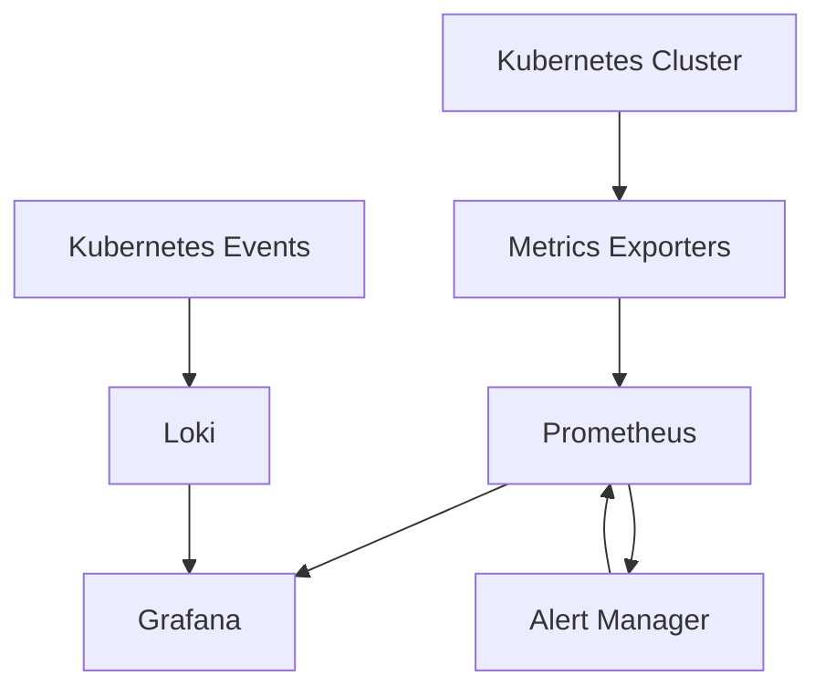

# Kubernetes Monitoring with Grafana

## Introduction

Kubernetes has become the de facto standard for container orchestration, enabling organizations to deploy, scale, and manage containerized applications efficiently. However, with the complexity and distributed nature of Kubernetes environments, monitoring becomes crucial to ensure optimal performance, resource utilization, and troubleshooting capabilities.

In this guide, we'll explore how to effectively monitor Kubernetes clusters using Grafana and Prometheus. We'll cover the fundamental monitoring concepts, set up a basic monitoring stack, and create dashboards to visualize key metrics. By the end, you'll have a solid understanding of Kubernetes monitoring patterns that you can apply to your own environments.

## Why Monitor Kubernetes?

Before diving into the technical details, let's understand why monitoring Kubernetes is essential:

1. **Resource Optimization**: Monitor CPU, memory, and storage usage to optimize resource allocation.
2. **Performance Tracking**: Track application and system performance to identify bottlenecks.
3. **Troubleshooting**: Quickly identify and resolve issues before they impact users.
4. **Capacity Planning**: Forecast resource needs based on historical data and trends.
5. **Security Monitoring**: Detect unusual patterns that might indicate security issues.

## Kubernetes Monitoring Architecture

A typical Kubernetes monitoring stack consists of several components working together:



- **Metrics Exporters**: Components that collect metrics from various parts of the Kubernetes cluster
- **Prometheus**: Time-series database that scrapes and stores metrics
- **Grafana**: Visualization platform for creating dashboards and alerts
- **Alert Manager**: Handles alerts from Prometheus and routes them to the correct receivers
- **Loki**: Log aggregation system designed to work with Grafana (optional but recommended)

## Setting Up the Monitoring Stack

Let's look at how to set up a basic monitoring stack for Kubernetes using Helm charts.

### Prerequisites

- A running Kubernetes cluster
- Helm installed
- `kubectl` configured to access your cluster

### Installing Prometheus and Grafana

```bash
# Add the Prometheus community Helm repository
helm repo add prometheus-community https://prometheus-community.github.io/helm-charts
helm repo update

# Install kube-prometheus-stack (includes Prometheus, Grafana, and Alertmanager)
helm install monitoring prometheus-community/kube-prometheus-stack \
  --namespace monitoring \
  --create-namespace
```

This command installs the kube-prometheus-stack, which includes:
- Prometheus server
- Alertmanager
- Grafana
- Various exporters like node-exporter, kube-state-metrics

### Verifying the Installation

```bash
# Check that all pods are running
kubectl get pods -n monitoring

# Expected output:
# NAME                                                     READY   STATUS    RESTARTS   AGE
# alertmanager-monitoring-kube-prometheus-alertmanager-0   2/2     Running   0          2m
# monitoring-grafana-59cb7d7c5c-z6l8p                     2/2     Running   0          2m
# monitoring-kube-prometheus-operator-6b8c6878f7-nf7gg    1/1     Running   0          2m
# monitoring-kube-state-metrics-55b6f7dcfb-szzbq          1/1     Running   0          2m
# monitoring-prometheus-node-exporter-gzlbq               1/1     Running   0          2m
# prometheus-monitoring-kube-prometheus-prometheus-0       2/2     Running   0          2m
```

### Accessing Grafana

```bash
# Forward Grafana service port to your local machine
kubectl port-forward svc/monitoring-grafana 3000:80 -n monitoring
```

Now you can access Grafana at `http://localhost:3000`. The default credentials are:
- Username: admin
- Password: prom-operator

## Key Metrics to Monitor in Kubernetes

When monitoring Kubernetes, focus on these key metric categories:

### 1. Node-level Metrics

These metrics provide insights into the health and resource utilization of your Kubernetes nodes:

- CPU utilization
- Memory usage
- Disk space
- Network traffic
- System load

### 2. Pod-level Metrics

Pod metrics help you understand how your applications are performing:

- CPU and memory requests/limits vs. actual usage
- Pod restart count
- Pod status (Running, Pending, Failed, etc.)
- Container restart count

### 3. Kubernetes API Server Metrics

These metrics indicate the health of your control plane:

- API request rate and latency
- etcd performance
- Controller manager and scheduler metrics

### 4. Custom Application Metrics

Application-specific metrics that provide insights into business logic:

- Request rate, error rate, and duration (RED method)
- Business-specific metrics (transactions, users, etc.)

## Creating Kubernetes Monitoring Dashboards

Now, let's create a basic dashboard to monitor our Kubernetes cluster. We'll do this by importing a pre-configured dashboard and then customizing it.

### Importing a Dashboard

1. In Grafana, click on "+" icon and select "Import"
2. Enter dashboard ID `10856` (Kubernetes Cluster Monitoring via Prometheus)
3. Select your Prometheus data source and click "Import"

This gives you a comprehensive dashboard to monitor your Kubernetes cluster:


### Creating Custom Dashboards

Let's create a simple custom dashboard for monitoring pod resources:

1. Click "Create" and select "Dashboard"
2. Add a new panel
3. Use the following PromQL queries:

**Pod CPU Usage**:
```
sum(rate(container_cpu_usage_seconds_total{namespace="default",container!=""}[5m])) by (pod)
```

**Pod Memory Usage**:
```
sum(container_memory_working_set_bytes{namespace="default",container!=""}) by (pod)
```

**Pod Network Traffic**:
```
sum(rate(container_network_receive_bytes_total{namespace="default"}[5m])) by (pod)
```

## Setting Up Alerts

Let's set up a basic alert for high CPU usage:

1. In Grafana, navigate to Alerting > Alert Rules
2. Click "New alert rule"
3. Configure the following:
   - Name: "High CPU Usage"
   - Query: `sum(rate(container_cpu_usage_seconds_total{namespace="default",container!=""}[5m])) by (pod) > 0.8`
   - Evaluation interval: 1m
   - For: 5m
4. Add a notification message: `Pod {{$labels.pod}} in namespace {{$labels.namespace}} has high CPU usage: {{$value}}`
5. Save the alert

## Practical Example: Monitoring a Web Application

Let's walk through monitoring a sample web application:

### 1. Deploy a Sample Application

```bash
# Create a namespace
kubectl create namespace sample-app

# Deploy a sample application
kubectl apply -f - <<EOF
apiVersion: apps/v1
kind: Deployment
metadata:
  name: sample-web-app
  namespace: sample-app
spec:
  replicas: 3
  selector:
    matchLabels:
      app: sample-web-app
  template:
    metadata:
      labels:
        app: sample-web-app
      annotations:
        prometheus.io/scrape: "true"
        prometheus.io/path: "/metrics"
        prometheus.io/port: "8080"
    spec:
      containers:
      - name: sample-web-app
        image: nginx
        ports:
        - containerPort: 80
---
apiVersion: v1
kind: Service
metadata:
  name: sample-web-app
  namespace: sample-app
spec:
  selector:
    app: sample-web-app
  ports:
  - port: 80
    targetPort: 80
EOF
```

### 2. Monitor Application Metrics

Now, create a dashboard specifically for this application:

1. Create a new dashboard
2. Add panels for:
   - Pod status
   ```
   sum(kube_pod_status_phase{namespace="sample-app"}) by (phase)
   ```
   
   - CPU usage
   ```
   sum(rate(container_cpu_usage_seconds_total{namespace="sample-app",container!=""}[5m])) by (pod)
   ```
   
   - Memory usage
   ```
   sum(container_memory_working_set_bytes{namespace="sample-app",container!=""}) by (pod)
   ```
   
   - Network traffic
   ```
   sum(rate(container_network_receive_bytes_total{namespace="sample-app"}[5m])) by (pod)
   ```

This gives you a comprehensive view of your application's performance and resource utilization.

## Best Practices for Kubernetes Monitoring

1. **Use Labels Effectively**: Properly label your Kubernetes resources to make querying and filtering easier.

2. **Configure Resource Requests and Limits**: This helps Kubernetes make better scheduling decisions and provides meaningful utilization metrics.

3. **Follow the RED Method**:
   - **R**ate: Number of requests per second
   - **E**rror rate: Percentage of requests that fail
   - **D**uration: Distribution of response times

4. **Use the USE Method for Resources**:
   - **U**tilization: Percentage of time the resource is busy
   - **S**aturation: Amount of work the resource has to perform
   - **E**rrors: Count of error events

5. **Set Up Proper Retention Policies**: Configure data retention based on your needs, balancing between storage requirements and data availability.

6. **Implement Multi-Level Alerting**: Different severity levels for different thresholds.

## Troubleshooting Common Issues

### Issue: Missing Metrics

**Solution**: Check if exporters are running and correctly configured:

```bash
kubectl get pods -n monitoring | grep exporter
```

### Issue: High Cardinality Issues

**Solution**: Review and optimize your labels to reduce the number of time series:

```bash
# Check metrics cardinality
curl -s http://prometheus-server:9090/api/v1/status/tsdb | jq .
```

### Issue: Grafana Dashboard Loading Slowly

**Solution**: Optimize queries by adding time range constraints and avoiding high-cardinality labels:

```
sum(rate(container_cpu_usage_seconds_total{namespace="default"}[5m])) by (pod)
```

Instead of:

```
sum(rate(container_cpu_usage_seconds_total{}[5m])) by (pod, container_name, namespace, node)
```

## Summary

In this guide, we've covered:

1. The importance of monitoring Kubernetes environments
2. Setting up a basic monitoring stack with Prometheus and Grafana
3. Key metrics to track at various levels of your Kubernetes cluster
4. Creating dashboards and alerts for effective monitoring
5. Best practices and troubleshooting tips

By implementing these monitoring patterns, you'll gain better visibility into your Kubernetes clusters, helping you optimize performance, troubleshoot issues, and plan for future capacity needs.

## Additional Resources

Here are some exercises to help you practice Kubernetes monitoring:

1. **Exercise**: Deploy a stateful application (like a database) and create a custom dashboard for it.
2. **Exercise**: Set up alerts for different severity levels based on resource utilization thresholds.
3. **Exercise**: Implement log monitoring alongside metrics using Loki and Grafana.

For further learning, explore:

- Prometheus Query Language (PromQL) for more advanced queries
- Service meshes like Istio for more detailed service-level monitoring
- Custom metrics using the Prometheus client libraries