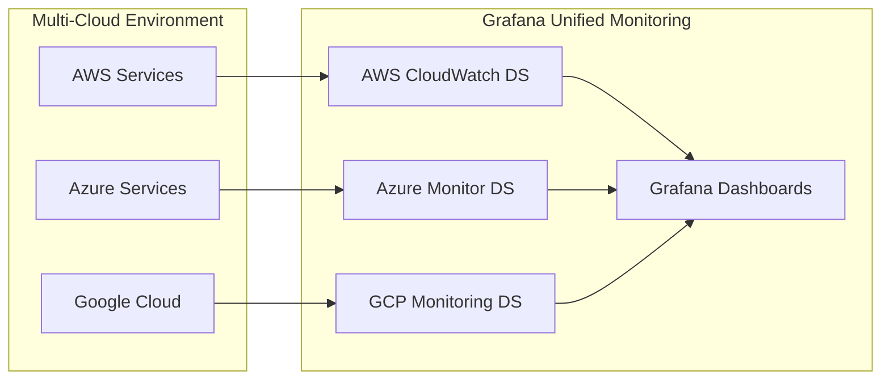

# Cloud Monitoring with Grafana

## Introduction

Cloud monitoring is a critical discipline that enables organizations to track, analyze, and optimize the performance, availability, and health of their cloud infrastructure, applications, and services. As businesses increasingly migrate to cloud platforms like AWS, Azure, and Google Cloud Platform (GCP), having robust monitoring capabilities becomes essential for maintaining reliable operations and preventing service disruptions.

Grafana excels as a visualization and monitoring platform for cloud environments, providing a unified interface to monitor metrics, logs, and traces from various cloud providers. This lesson will guide you through the fundamentals of cloud monitoring with Grafana, including architecture, implementation patterns, and best practices.

## Why Cloud Monitoring Matters

Cloud environments present unique monitoring challenges compared to traditional on-premises infrastructure:

- **Dynamic Resources**: Cloud resources scale up and down automatically, requiring monitoring solutions that can adapt.
- **Distributed Systems**: Cloud applications often span multiple services and regions, increasing complexity.
- **Shared Responsibility**: Cloud providers handle infrastructure monitoring, but application monitoring remains your responsibility.
- **Cost Optimization**: Without proper monitoring, cloud costs can escalate unexpectedly.

## Cloud Monitoring Architecture with Grafana

A typical cloud monitoring architecture with Grafana consists of several key components:

```mermaid
flowchart TB
    subgraph "Cloud Infrastructure"
        AWS[AWS Services]
        Azure[Azure Services]
        GCP[Google Cloud]
    end
    
    subgraph "Data Collection"
        CP[Cloud Provider Metrics]
        A[Agents/Exporters]
        API[API Integrations]
    end
    
    subgraph "Data Storage"
        TS[Time Series Databases]
        Logs[Log Storage]
        Traces[Tracing Backend]
    end
    
    subgraph "Visualization & Alerting"
        G[Grafana]
        Alerts[Alert Manager]
    end

    Cloud Infrastructure --> Data Collection
    Data Collection --> Data Storage
    Data Storage --> Visualization & Alerting
    
    classDef highlight fill:#f9f,stroke:#333,stroke-width:2px;
    class G highlight;
```

### Key Components:

1. **Data Sources**: Connections to cloud provider metrics APIs (CloudWatch, Azure Monitor, Google Cloud Monitoring)
2. **Collectors**: Agents or exporters that gather metrics from cloud resources
3. **Storage**: Time-series databases (Prometheus, Graphite, InfluxDB) or cloud provider's storage
4. **Visualization**: Grafana dashboards showing cloud resource performance
5. **Alerting**: Notification systems for when metrics exceed thresholds

## Setting Up Cloud Monitoring in Grafana

Let's explore how to set up cloud monitoring for the three major cloud providers.

### AWS Monitoring with Grafana

To connect Grafana to AWS CloudWatch:

1. First, ensure you have the correct IAM permissions:

```json
{
  "Version": "2012-10-17",
  "Statement": [
    {
      "Effect": "Allow",
      "Action": [
        "cloudwatch:ListMetrics",
        "cloudwatch:GetMetricStatistics",
        "cloudwatch:GetMetricData",
        "ec2:DescribeInstances",
        "tag:GetResources"
      ],
      "Resource": "*"
    }
  ]
}
```

2. Configure the AWS CloudWatch data source in Grafana:

```yaml
# In Grafana UI:
Name: AWS CloudWatch
Type: CloudWatch
Auth Provider: Access & secret key
Access Key ID: YOUR_ACCESS_KEY
Secret Access Key: YOUR_SECRET_KEY
Default Region: us-east-1
```

3. Create your first CloudWatch dashboard:

```jsx
// Example CloudWatch query in Grafana
const query = {
  region: 'us-east-1',
  namespace: 'AWS/EC2',
  metricName: 'CPUUtilization',
  dimensions: { InstanceId: 'i-12345678' },
  statistic: 'Average',
  period: '300'
};
```

#### Example AWS CloudWatch Dashboard:

```jsx
const CloudWatchDashboard = {
  annotations: {
    list: []
  },
  editable: true,
  panels: [
    {
      datasource: 'CloudWatch',
      fieldConfig: {
        defaults: {
          color: {
            mode: 'palette-classic'
          },
          custom: {
            axisLabel: '',
            axisPlacement: 'auto',
            barAlignment: 0,
            drawStyle: 'line',
            fillOpacity: 10,
            gradientMode: 'none',
            hideFrom: {
              legend: false,
              tooltip: false,
              viz: false
            },
            lineInterpolation: 'linear',
            lineWidth: 1,
            pointSize: 5,
            scaleDistribution: {
              type: 'linear'
            },
            showPoints: 'never',
            spanNulls: true,
            stacking: {
              group: 'A',
              mode: 'none'
            },
            thresholdsStyle: {
              mode: 'off'
            }
          },
          mappings: [],
          thresholds: {
            mode: 'absolute',
            steps: [
              {
                color: 'green',
                value: null
              },
              {
                color: 'red',
                value: 80
              }
            ]
          },
          unit: 'percent'
        },
        overrides: []
      },
      gridPos: {
        h: 9,
        w: 12,
        x: 0,
        y: 0
      },
      options: {
        legend: {
          calcs: [],
          displayMode: 'list',
          placement: 'bottom'
        },
        tooltip: {
          mode: 'single'
        }
      },
      targets: [
        {
          alias: '',
          dimensions: {
            InstanceId: ['i-12345678']
          },
          expression: '',
          id: '',
          matchExact: true,
          metricName: 'CPUUtilization',
          namespace: 'AWS/EC2',
          period: '',
          refId: 'A',
          region: 'us-east-1',
          statistic: 'Average'
        }
      ],
      title: 'EC2 CPU Utilization',
      type: 'timeseries'
    }
  ],
  refresh: '5s',
  schemaVersion: 30,
  style: 'dark',
  tags: ['aws', 'cloudwatch', 'ec2'],
  templating: {
    list: []
  },
  time: {
    from: 'now-6h',
    to: 'now'
  },
  timepicker: {},
  timezone: '',
  title: 'AWS EC2 Monitoring',
  version: 0
};
```

### Azure Monitoring with Grafana

To monitor Azure resources:

1. Register an application in Azure Active Directory and grant it permissions to read metrics.

2. Configure the Azure Monitor data source:

```yaml
# In Grafana UI:
Name: Azure Monitor
Type: Azure Monitor
Authentication: App Registration
Directory (tenant) ID: YOUR_TENANT_ID
Application (client) ID: YOUR_CLIENT_ID
Client Secret: YOUR_CLIENT_SECRET
```

3. Create an Azure monitoring dashboard:

```jsx
// Example Azure Monitor query in Grafana
const query = {
  subscription: 'YOUR_SUBSCRIPTION_ID',
  resourceGroup: 'your-resource-group',
  resourceName: 'your-vm-name',
  metricDefinition: 'Microsoft.Compute/virtualMachines',
  metricName: 'Percentage CPU',
  aggregation: 'Average',
  timeGrain: 'auto'
};
```

### Google Cloud Monitoring with Grafana

To monitor GCP resources:

1. Create a service account with the Monitoring Viewer role.

2. Configure the Google Cloud Monitoring data source:

```yaml
# In Grafana UI:
Name: Google Cloud Monitoring
Type: Google Cloud Monitoring
Service Account Key: PASTE_JSON_KEY_FILE_CONTENT
Default Project: your-gcp-project-id
```

3. Create a GCP monitoring dashboard:

```jsx
// Example GCP Monitoring query in Grafana
const query = {
  projectName: 'your-gcp-project',
  metricType: 'compute.googleapis.com/instance/cpu/utilization',
  filter: 'resource.labels.instance_id = "instance-1"',
  groupBy: '',
  aggregation: {
    perSeriesAligner: 'ALIGN_MEAN',
    crossSeriesReducer: 'REDUCE_NONE',
    alignmentPeriod: 'cloud-monitoring-auto'
  }
};
```

## Cloud Monitoring Best Practices

### 1. Multi-Cloud Monitoring Strategy

For organizations using multiple cloud providers, create a unified monitoring approach:



### 2. Implement the Four Golden Signals

Based on Google's Site Reliability Engineering practices, monitor:

1. **Latency**: The time it takes to service a request
2. **Traffic**: The demand on your system
3. **Errors**: The rate of failed requests
4. **Saturation**: How "full" your service is

Example Grafana query for error rate monitoring:

```jsx
// Prometheus query for error rate
const errorRateQuery = 'sum(rate(http_requests_total{status=~"5.."}[5m])) / sum(rate(http_requests_total[5m]))';
```

### 3. Cost Optimization Monitoring

Set up cost monitoring to track cloud spending:

```jsx
// AWS CloudWatch query for estimated charges
const costQuery = {
  region: 'us-east-1',
  namespace: 'AWS/Billing',
  metricName: 'EstimatedCharges',
  dimensions: { Currency: 'USD' },
  statistic: 'Maximum',
  period: '86400'
};
```

### 4. Automated Scaling Monitoring

Monitor auto-scaling events and their impact:

```jsx
// AWS CloudWatch query for Auto Scaling group metrics
const scalingQuery = {
  region: 'us-east-1',
  namespace: 'AWS/AutoScaling',
  metricName: 'GroupInServiceInstances',
  dimensions: { AutoScalingGroupName: 'my-asg' },
  statistic: 'Average',
  period: '60'
};
```

## Practical Example: Complete Cloud Monitoring Dashboard

Let's create a comprehensive dashboard that monitors key aspects of a cloud application:

```jsx
// Example Grafana dashboard configuration for cloud monitoring
const dashboardJson = {
  // Dashboard configuration would go here
  // This is simplified for readability
  panels: [
    // Infrastructure Health Panel
    {
      title: 'Infrastructure Health',
      type: 'gauge',
      datasource: 'CloudWatch',
      targets: [
        {
          // Target configuration for infrastructure health metrics
        }
      ]
    },
    // Service Response Times Panel
    {
      title: 'Service Response Times',
      type: 'timeseries',
      datasource: 'Prometheus',
      targets: [
        {
          expr: 'histogram_quantile(0.95, sum(rate(http_request_duration_seconds_bucket[5m])) by (le, service))'
        }
      ]
    },
    // Error Rates Panel
    {
      title: 'Error Rates',
      type: 'timeseries',
      datasource: 'Prometheus',
      targets: [
        {
          expr: 'sum(rate(http_requests_total{status=~"5.."}[5m])) by (service) / sum(rate(http_requests_total[5m])) by (service)'
        }
      ]
    },
    // Cloud Costs Panel
    {
      title: 'Daily Cloud Costs',
      type: 'timeseries',
      datasource: 'CloudWatch',
      targets: [
        {
          // Target configuration for AWS cost metrics
        }
      ]
    }
  ]
};
```

## Alerting on Cloud Metrics

Set up Grafana alerts to notify you when cloud metrics indicate potential issues:

```jsx
// Example alert rule configuration
const alertRule = {
  name: 'High CPU Usage',
  expr: 'avg by(instance) (aws_ec2_cpu_utilization_average) > 80',
  for: '5m',
  labels: {
    severity: 'warning',
    service: 'ec2'
  },
  annotations: {
    summary: 'EC2 instance {{$labels.instance}} has high CPU usage',
    description: 'EC2 instance {{$labels.instance}} CPU usage is above 80% for 5 minutes'
  }
};
```

Configure notification channels in Grafana:

```jsx
// Example notification channel configuration
const notificationChannel = {
  name: 'Cloud Ops Team',
  type: 'slack',
  settings: {
    url: 'https://hooks.slack.com/services/YOUR_SLACK_WEBHOOK',
    recipient: '#cloud-alerts',
    mentionChannel: 'here'
  }
};
```

## Advanced: Cloud Resource Visualization

Visualize your cloud infrastructure using Grafana's node graph panel:

```jsx
// Node graph configuration for AWS resources
const nodeGraphConfig = {
  type: 'nodeGraph',
  title: 'AWS Infrastructure Map',
  datasource: 'CloudWatch',
  targets: [
    {
      // Query that returns nodes and edges for AWS resources
    }
  ],
  options: {
    nodes: {
      mainStatField: 'Value',
      secondaryStatField: 'Name',
      colorField: 'Status'
    },
    edges: {
      mainStatField: 'Value'
    }
  }
};
```

## Summary

Cloud monitoring with Grafana provides organizations with the visibility and insights needed to maintain healthy cloud environments. By following the practices outlined in this lesson, you can:

- Establish comprehensive monitoring across multiple cloud providers
- Track the performance, availability, and cost of cloud resources
- Implement alerts to detect and respond to issues quickly
- Create informative dashboards that provide a unified view of your cloud infrastructure

Effective cloud monitoring is not a one-time setup but an ongoing process that evolves with your cloud architecture. Regularly review and refine your monitoring approach to ensure it continues to meet your organization's needs.

## Additional Resources

Here are some exercises to reinforce your learning:

1. **Exercise 1**: Set up a basic CloudWatch dashboard for an EC2 instance, monitoring CPU, memory, disk, and network usage.

2. **Exercise 2**: Create an alert rule that notifies your team when a cloud service exceeds its expected cost for the month.

3. **Exercise 3**: Implement a multi-cloud dashboard that shows the status of similar services across different cloud providers.

## Next Steps

In the next lesson, we'll explore "Container Monitoring with Grafana," where you'll learn how to monitor Kubernetes and Docker environments using Grafana's powerful visualization capabilities.