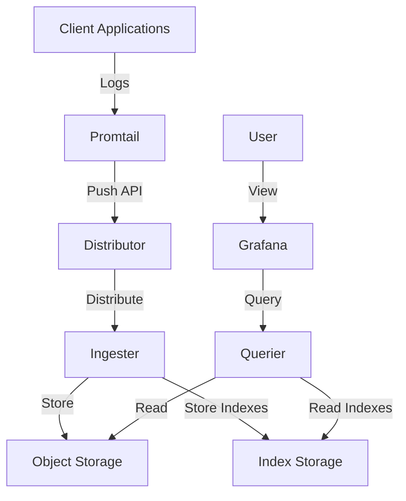

# Grafana Loki

## Introduction

Grafana Loki is a log aggregation system designed to be cost-effective and easy to operate. Unlike other logging systems that index the contents of your logs, Loki only indexes metadata about your logs, making it significantly more efficient in terms of resources. This approach is often described as "Prometheus, but for logs," as it follows similar design principles as Prometheus does for metrics.

Loki was created by Grafana Labs and is a core component of the Grafana observability stack. It works seamlessly with Grafana for visualization and Prometheus for metrics, creating a comprehensive monitoring solution.

## Key Concepts

### Log Streams and Labels

In Loki, logs are organized into **streams**. A stream is identified by a set of **labels**, which are key-value pairs that describe the source of the logs. This label-based approach is similar to how Prometheus handles metrics.

For example, a log stream might have labels like:
- `app=myapp`
- `environment=production`
- `instance=server1`

Instead of indexing the full content of every log line (which would be resource-intensive), Loki only indexes these labels. This makes Loki more efficient while still allowing powerful queries.

### LogQL

Loki uses its own query language called **LogQL**, which is inspired by Prometheus's PromQL. LogQL allows you to:

1. Select log streams using label matchers
2. Filter logs based on their content
3. Extract and process values from logs
4. Create metrics from logs

LogQL provides a powerful way to explore and analyze your logs while maintaining Loki's efficiency.

## Getting Started with Loki

### Installation

Let's start by setting up a simple Loki environment using Docker. Make sure you have Docker installed on your system.

```bash
# Create a directory for Loki configuration
mkdir loki-config
cd loki-config

# Download a basic Loki configuration file
wget https://raw.githubusercontent.com/grafana/loki/main/cmd/loki/loki-local-config.yaml -O loki-config.yaml

# Run Loki using Docker
docker run -d --name loki -v $(pwd):/mnt/config -p 3100:3100 grafana/loki:latest -config.file=/mnt/config/loki-config.yaml
```

### Basic Configuration

Here's a simplified version of a Loki configuration file:

```yaml
auth_enabled: false

server:
  http_listen_port: 3100

ingester:
  lifecycler:
    address: 127.0.0.1
    ring:
      kvstore:
        store: inmemory
      replication_factor: 1
    final_sleep: 0s
  chunk_idle_period: 5m
  chunk_retain_period: 30s

schema_config:
  configs:
    - from: 2020-05-15
      store: boltdb-shipper
      object_store: filesystem
      schema: v11
      index:
        prefix: index_
        period: 24h

storage_config:
  boltdb_shipper:
    active_index_directory: /tmp/loki/boltdb-shipper-active
    cache_location: /tmp/loki/boltdb-shipper-cache
    cache_ttl: 24h
    shared_store: filesystem
  filesystem:
    directory: /tmp/loki/chunks

limits_config:
  enforce_metric_name: false
  reject_old_samples: true
  reject_old_samples_max_age: 168h

chunk_store_config:
  max_look_back_period: 0s

table_manager:
  retention_deletes_enabled: false
  retention_period: 0s
```

This configuration sets up a simple, single-instance Loki that stores data on the local filesystem.

## Collecting Logs with Promtail

To get logs into Loki, you need a log collector. The most common collector for Loki is **Promtail**, which is designed specifically to work with Loki.

### Installing Promtail

Let's set up Promtail using Docker:

```bash
# Create a directory for Promtail configuration
mkdir promtail-config
cd promtail-config

# Download a basic Promtail configuration file
wget https://raw.githubusercontent.com/grafana/loki/main/clients/cmd/promtail/promtail-docker-config.yaml -O promtail-config.yaml

# Run Promtail using Docker
docker run -d --name promtail -v $(pwd):/mnt/config -v /var/log:/var/log grafana/promtail:latest -config.file=/mnt/config/promtail-config.yaml
```

### Promtail Configuration

Here's a simplified Promtail configuration:

```yaml
server:
  http_listen_port: 9080
  grpc_listen_port: 0

positions:
  filename: /tmp/positions.yaml

clients:
  - url: http://loki:3100/loki/api/v1/push

scrape_configs:
  - job_name: system
    static_configs:
      - targets:
          - localhost
        labels:
          job: varlogs
          __path__: /var/log/*log
```

This configuration tells Promtail to:
1. Monitor log files in `/var/log/` that end with `.log`
2. Add a label `job=varlogs` to all collected logs
3. Send the logs to a Loki instance at `http://loki:3100`

## Visualizing Logs in Grafana

Once Loki is collecting logs, you can visualize them in Grafana:

1. Open Grafana in your browser
2. Go to Configuration > Data Sources
3. Click "Add data source"
4. Select "Loki" from the list
5. Set the URL to `http://loki:3100` (adjust as needed for your setup)
6. Click "Save & Test"

Now you can create dashboards that include logs:

1. Create a new dashboard
2. Add a new panel
3. Select "Logs" as the visualization
4. Select your Loki data source
5. Enter a LogQL query, e.g., `{job="varlogs"}`

## LogQL: Loki's Query Language

LogQL allows you to search and filter your logs efficiently. Let's look at some examples:

### Basic Log Selection

To select all logs from a specific job:

```
{job="varlogs"}
```

To select logs with multiple labels:

```
{job="varlogs", host="myserver"}
```

### Filtering Logs

To find logs containing a specific string:

```
{job="varlogs"} |= "error"
```

To find logs containing "error" but not "timeout":

```
{job="varlogs"} |= "error" != "timeout"
```

### Advanced Features

You can extract and process information from your logs:

```
{job="varlogs"} |= "response_time" | regexp `response_time=(?P<response_time>[0-9]+)` | response_time > 500
```

This query:
1. Selects logs with the label `job=varlogs`
2. Filters for logs containing "response_time"
3. Uses a regular expression to extract the response time value
4. Shows only logs where the response time is greater than 500ms

### Creating Metrics from Logs

One of the most powerful features of LogQL is the ability to create metrics from logs:

```
sum by (status_code) (count_over_time({job="nginx"}[5m] |= "HTTP" | regexp `HTTP/1\.\d (?P<status_code>\d+)`))
```

This query:
1. Selects nginx logs from the last 5 minutes containing "HTTP"
2. Extracts the HTTP status code using a regular expression
3. Counts occurrences of each status code
4. Sums the counts grouped by status code

## Architecture

Let's look at Loki's architecture to understand how it works at scale:



Loki consists of several components:

1. **Distributor**: Receives logs and distributes them to ingesters
2. **Ingester**: Compresses logs into chunks and flushes them to storage
3. **Querier**: Handles queries from Grafana or API clients
4. **Storage**: Typically object storage (S3, GCS, etc.) for log chunks
5. **Index**: Database to store label indices (BoltDB or Cassandra)

This microservices architecture allows Loki to scale horizontally, handling large volumes of logs.

## Real-World Example: Monitoring a Web Application

Let's walk through a practical example of using Loki to monitor a web application:

### 1. Setup Loki and Promtail

We already covered the basic setup. For a production environment, you might use Kubernetes with Helm:

```bash
# Add Grafana Helm repository
helm repo add grafana https://grafana.github.io/helm-charts

# Install Loki stack (includes Loki, Promtail, and Grafana)
helm install loki grafana/loki-stack --set grafana.enabled=true
```

### 2. Configure Logging for Your Application

For a Node.js application, you might use Winston with a Loki transport:

```javascript
const winston = require('winston');
const LokiTransport = require('winston-loki');

const logger = winston.createLogger({
  level: 'info',
  format: winston.format.json(),
  defaultMeta: { service: 'user-service' },
  transports: [
    new winston.transports.Console(),
    new LokiTransport({
      host: 'http://loki:3100',
      labels: { job: 'user-service' },
      json: true,
      batching: true,
      interval: 5
    })
  ]
});

// Example usage
logger.info('User logged in', { userId: '123', ipAddress: '192.168.1.1' });
```

### 3. Create a Monitoring Dashboard

In Grafana, create a dashboard with:
- A panel showing error logs: `{service="user-service"} |= "error"`
- A panel showing login activity: `{service="user-service"} |= "logged in"`
- A panel with HTTP status codes as metrics:
  ```
  sum by (status_code) (count_over_time({service="user-service"} |~ "status_code=[0-9]+" [5m]))
  ```

### 4. Set Up Alerts

Create an alert in Grafana that triggers when there's a high number of error logs:

1. Edit your error log panel
2. Go to the "Alert" tab
3. Configure a condition: `count_over_time({service="user-service"} |= "error" [5m]) > 10`
4. Set a notification channel (like email or Slack)

## Best Practices

### 1. Label Optimization

Don't create too many unique label combinations. Every unique combination creates a new stream:

**Good**:
```
{app="myapp", environment="production", component="api"}
```

**Bad** (too specific, creates many streams):
```
{app="myapp", environment="production", component="api", user_id="12345", request_id="abc123"}
```

### 2. Log Volume Management

- Use log levels appropriately (don't log everything at INFO level)
- Consider sampling high-volume logs
- Implement log rotation to prevent massive log files

### 3. Query Optimization

- Start with label-based queries before filtering content
- Add time ranges to your queries to limit the search scope
- Use regular expressions sparingly as they can be resource-intensive

### 4. Retention Policies

Set appropriate retention policies based on your needs:

```yaml
# In Loki config
limits_config:
  retention_period: 168h  # 7 days
```

## Comparison with Other Logging Systems

| Feature | Loki | Elasticsearch | Splunk |
|---------|------|--------------|--------|
| Indexing Strategy | Labels only | Full text | Full text |
| Resource Requirements | Low | High | High |
| Query Language | LogQL | Lucene/DSL | SPL |
| Cost | Low | Medium-High | High |
| Setup Complexity | Low | Medium | High |

## Summary

Grafana Loki offers a unique approach to log management that prioritizes efficiency and cost-effectiveness. By indexing metadata instead of log content, Loki provides a lightweight yet powerful solution for log aggregation and analysis.

Key takeaways:
- Loki uses a label-based indexing system inspired by Prometheus
- LogQL provides powerful capabilities for filtering and analyzing logs
- Promtail is the primary agent for collecting and sending logs to Loki
- Loki integrates seamlessly with Grafana for visualization
- The architecture allows for horizontal scaling to handle large volumes of logs

With Loki, you can achieve comprehensive logging without the hefty resource requirements of traditional logging systems.

## Additional Resources

- [Official Loki Documentation](https://grafana.com/docs/loki/latest/)
- [LogQL Query Language Reference](https://grafana.com/docs/loki/latest/logql/)
- [Grafana Labs GitHub Repository](https://github.com/grafana/loki)

## Exercises

1. Set up Loki and Promtail using Docker Compose
2. Configure a simple application to send logs to Loki
3. Create a Grafana dashboard with different types of log panels
4. Write LogQL queries to extract specific information from your logs
5. Create a metric from your logs and visualize it as a graph