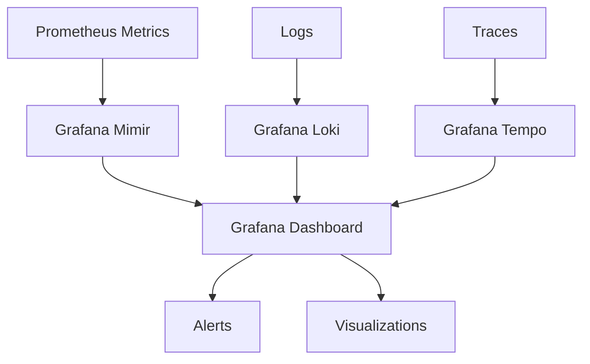

# Grafana Mimir

## Introduction

Grafana Mimir is a highly scalable, horizontally distributed time series database designed to store Prometheus metrics. It was developed by Grafana Labs as an evolution of Cortex and has become a cornerstone of modern observability stacks. Mimir allows organizations to store metrics at massive scale while maintaining query performance and high availability.

In this guide, we'll explore what Grafana Mimir is, how it fits into the Grafana ecosystem, and how to get started with it in your monitoring infrastructure.

## What is Grafana Mimir?

Grafana Mimir is an open-source project that provides:

- **Massive scale**: Store billions of metrics with high availability
- **Multi-tenancy**: Isolate metrics data between different teams or customers
- **Long-term storage**: Retain metrics for years rather than days or weeks
- **Prometheus compatibility**: Works with existing Prometheus setups
- **Horizontal scalability**: Add more nodes as your metrics volume grows

Mimir addresses a critical challenge in the monitoring world: how to scale Prometheus beyond a single instance while maintaining reliability and performance.

## How Mimir Fits in the Grafana Ecosystem

Mimir is part of the broader Grafana observability stack, which includes:

- **Grafana**: The visualization and dashboarding frontend
- **Loki**: Log aggregation system
- **Tempo**: Distributed tracing backend
- **Mimir**: Metrics storage at scale

Together, these components form what's often called the "GLMT stack" for complete observability.



## Mimir Architecture

Mimir uses a microservices architecture where each component can be scaled independently based on your specific needs.

### Key Components

1. **Distributor**: Receives incoming metrics and distributes them across ingesters
2. **Ingester**: Stores recent metrics in memory and writes them to long-term storage
3. **Query Frontend**: Splits complex queries and caches results
4. **Querier**: Executes queries against both ingesters and storage
5. **Compactor**: Optimizes stored metrics for efficient querying
6. **Ruler**: Evaluates Prometheus alerting and recording rules

This modular design allows Mimir to scale horizontally, handling billions of active series across thousands of tenants.

## Getting Started with Mimir

Let's walk through setting up a basic Mimir instance using Docker.

### Prerequisites

- Docker and Docker Compose installed
- Basic understanding of Prometheus metrics
- Familiarity with YAML configuration

### Step 1: Create a Docker Compose File

Create a file named `docker-compose.yml`:

```yaml
version: '3'
services:
  mimir:
    image: grafana/mimir:latest
    command: ["-config.file=/etc/mimir/config.yaml"]
    volumes:
      - ./config:/etc/mimir
      - ./data:/data
    ports:
      - "9009:9009"  # API
      - "8080:8080"  # Metrics endpoint
  
  prometheus:
    image: prom/prometheus:latest
    volumes:
      - ./prometheus.yml:/etc/prometheus/prometheus.yml
    command:
      - '--config.file=/etc/prometheus/prometheus.yml'
      - '--storage.tsdb.path=/prometheus'
      - '--web.console.libraries=/usr/share/prometheus/console_libraries'
      - '--web.console.templates=/usr/share/prometheus/consoles'
    ports:
      - "9090:9090"
  
  grafana:
    image: grafana/grafana:latest
    ports:
      - "3000:3000"
    environment:
      - GF_SECURITY_ADMIN_PASSWORD=admin
    volumes:
      - ./grafana/provisioning:/etc/grafana/provisioning
```

### Step 2: Create Mimir Configuration

Create a directory called `config` and inside it, create a file `config.yaml`:

```yaml
# Configuration for running Mimir in single binary mode
target: all
multitenancy_enabled: false

blocks_storage:
  backend: filesystem
  filesystem:
    dir: /data/blocks
  bucket_store:
    sync_dir: /data/tsdb-sync

compactor:
  data_dir: /data/compactor
  sharding_ring:
    kvstore:
      store: memberlist

distributor:
  ring:
    instance_addr: 127.0.0.1
    kvstore:
      store: memberlist

ingester:
  lifecycler:
    ring:
      kvstore:
        store: memberlist
      replication_factor: 1
    final_sleep: 0s
  chunk_idle_period: 5m
  chunks_directory: /data/chunks
  wal:
    enabled: true
    dir: /data/wal

ruler:
  alertmanager_url: http://alertmanager:9093

limits:
  max_global_series_per_user: 1000000
  max_global_series_per_metric: 100000

server:
  http_listen_port: 9009

store_gateway:
  sharding_ring:
    replication_factor: 1
```

### Step 3: Configure Prometheus to Remote Write to Mimir

Create a file named `prometheus.yml`:

```yaml
global:
  scrape_interval: 15s
  evaluation_interval: 15s

scrape_configs:
  - job_name: 'prometheus'
    static_configs:
      - targets: ['localhost:9090']
  
  - job_name: 'mimir'
    static_configs:
      - targets: ['mimir:8080']

remote_write:
  - url: http://mimir:9009/api/v1/push
    name: mimir
```

### Step 4: Start the Stack

Run the following command to start all services:

```bash
docker-compose up -d
```

### Step 5: Access Grafana and Add Mimir as a Data Source

1. Open Grafana at http://localhost:3000 (login with admin/admin)
2. Add a new Prometheus data source:
   - URL: `http://mimir:9009/prometheus`
   - Access: Server (default)

## Querying Data in Mimir

Mimir uses the same PromQL (Prometheus Query Language) that you're already familiar with if you've used Prometheus. Here are some example queries:

### Basic Query

```promql
# Get the CPU usage for all instances
node_cpu_seconds_total{mode="user"}
```

### Rate Calculation

```promql
# Calculate the rate of CPU usage over 5 minutes
rate(node_cpu_seconds_total{mode="user"}[5m])
```

### Aggregation

```promql
# Average CPU usage across all instances by job
avg by (job) (rate(node_cpu_seconds_total{mode="user"}[5m]))
```

## Advanced Features

### Multi-tenancy

Mimir supports multi-tenancy out of the box. Each tenant gets their own isolated metrics storage:

```yaml
multitenancy_enabled: true

limits:
  per_tenant_override_config: /etc/mimir/tenant-overrides.yaml
```

### Horizontal Scaling

To scale Mimir horizontally, you can split the services and run multiple instances:

```yaml
# Run only distributors
target: distributor

# Distributor-specific config
distributor:
  ring:
    instance_addr: ${HOSTNAME}
    kvstore:
      store: memberlist
```

### Data Retention and Storage

Mimir supports various storage backends:

```yaml
blocks_storage:
  backend: s3  # Options: filesystem, s3, gcs, azure
  s3:
    bucket_name: my-metrics
    endpoint: s3.amazonaws.com
    access_key_id: ${AWS_ACCESS_KEY_ID}
    secret_access_key: ${AWS_SECRET_ACCESS_KEY}
```

## Real-world Use Case: Monitoring a Kubernetes Cluster

Let's look at how Mimir can be used to monitor a Kubernetes cluster at scale:

1. **Deploy Prometheus Operator** to collect metrics from your cluster
2. **Configure remote write** to send metrics to Mimir
3. **Set up Grafana dashboards** to visualize the data
4. **Create alerting rules** in Mimir that scale with your infrastructure

Example `values.yaml` for Prometheus Operator with Mimir remote write:

```yaml
prometheus:
  prometheusSpec:
    remoteWrite:
      - url: http://mimir-gateway.monitoring.svc:9009/api/v1/push
        writeRelabelConfigs:
          - action: keep
            regex: '{__name__=~".+"}'
            sourceLabels: [__name__]
```

## Best Practices

1. **Start small**: Begin with a single-binary deployment before scaling out
2. **Monitor Mimir itself**: Set up alerts for Mimir components
3. **Use labels efficiently**: Cardinality explosion can impact performance
4. **Implement proper retention policies**: Define how long you need to keep metrics
5. **Regularly optimize compaction**: Tune compaction settings based on your query patterns

## Troubleshooting Common Issues

### High Memory Usage

If you see high memory usage in ingesters:

```yaml
ingester:
  max_series_per_ingester: 1000000  # Default is 5M
  max_series_per_metric: 100000     # Default is 120K
```

### Slow Queries

For slow query performance:

```yaml
query_frontend:
  cache_results: true
  split_queries_by_interval: 12h
```

## Summary

Grafana Mimir provides a robust, scalable solution for storing Prometheus metrics at scale. Its key strengths include:

- Horizontal scalability for growing metric volumes
- Multi-tenancy for organizational separation
- Long-term storage options
- Full Prometheus compatibility
- Seamless integration with the Grafana ecosystem

By leveraging Mimir, organizations can build monitoring systems that scale with their infrastructure while maintaining query performance and data reliability.

## Further Learning Resources

1. Explore the [official Mimir documentation](https://grafana.com/docs/mimir/latest/)
2. Join the [Grafana Community forums](https://community.grafana.com/)
3. Practice with the [Grafana Mimir tutorial](https://grafana.com/tutorials/)

## Exercises

1. Set up a single-binary Mimir instance and send metrics from Prometheus
2. Configure multi-tenancy and create separate workspaces for different teams
3. Implement a retention policy that keeps high-resolution data for 2 weeks and downsampled data for 1 year
4. Create a Grafana dashboard that queries Mimir for system metrics
5. Set up alerting rules in Mimir and test them with artificial load