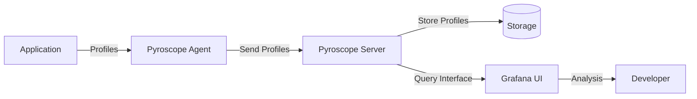

# Grafana Pyroscope

## Introduction

Grafana Pyroscope is an open-source continuous profiling platform that helps developers identify performance bottlenecks and optimize resource usage in their applications. As part of the Grafana ecosystem, Pyroscope integrates seamlessly with other observability tools like Grafana Loki for logs, Grafana Mimir for metrics, and Grafana Tempo for traces, providing a complete observability solution.

Continuous profiling allows you to collect CPU, memory, and other resource usage data from your applications over time, helping you understand which parts of your code consume the most resources. This information is invaluable for debugging performance issues, optimizing code, and reducing infrastructure costs.

## What is Continuous Profiling?

Continuous profiling is the practice of collecting profiling data from your applications at regular intervals, storing it, and making it available for analysis. Unlike traditional profiling, which is typically done ad-hoc during development, continuous profiling happens in production environments and provides historical data about application performance.



## Key Features of Grafana Pyroscope

- **Language-agnostic profiling**: Support for Go, Python, Ruby, Java, .NET, Rust, PHP, and more
- **Low overhead**: Minimal impact on application performance
- **Flame graphs**: Intuitive visualization of profiling data
- **Time-series profiling**: Track performance metrics over time
- **Integration with Grafana**: Visualize profiling data alongside metrics, logs, and traces
- **Integration with OpenTelemetry**: Collect and correlate profiles with other telemetry data

## Getting Started with Pyroscope

### Installation

You can install Pyroscope using Docker, which is the simplest method for getting started:

```bash
docker run -it -p 4040:4040 grafana/pyroscope:latest
```

For a production setup, you might want to use the Helm chart:

```bash
helm repo add grafana https://grafana.github.io/helm-charts
helm repo update
helm install pyroscope grafana/pyroscope
```

### Instrumenting Your Application

Let's look at how to instrument a simple Go application with Pyroscope:

```go
package main

import (
	"context"
	"fmt"
	"time"

	"github.com/grafana/pyroscope-go"
)

func main() {
	// Configure the Pyroscope agent
	pyroscope.Start(pyroscope.Config{
		ApplicationName: "simple.golang.app",
		ServerAddress:   "http://localhost:4040",
		Logger:          pyroscope.StandardLogger,
	})

	// Simulate some work
	for {
		cpuIntensiveTask()
		time.Sleep(100 * time.Millisecond)
	}
}

func cpuIntensiveTask() {
	// This is a function that consumes CPU
	for i := 0; i < 1000000; i++ {
		_ = i * i
	}
}
```

After running this application, you'll be able to see the CPU profile in the Pyroscope UI at `http://localhost:4040`.

### Python Integration Example

For Python applications, you can use the `pyroscope-io` package:

```python
import pyroscope
import time

# Configure Pyroscope
pyroscope.configure(
    application_name="simple.python.app",
    server_address="http://localhost:4040",
    tags={"environment": "development"}
)

def cpu_intensive_task():
    # Simulate CPU-intensive work
    for i in range(1000000):
        i * i

# Main application loop
def main():
    while True:
        cpu_intensive_task()
        time.sleep(0.1)

if __name__ == "__main__":
    main()
```

## Understanding Flame Graphs

Flame graphs are a visualization technique used to represent profiling data. They show which functions consume the most resources in your application.

### Reading a Flame Graph

- The **x-axis** represents the stack profile population, sorted alphabetically (not the passage of time).
- The **y-axis** shows the stack depth, starting from the bottom with the function that's currently running.
- Each **rectangle** represents a function in the stack.
- The **width** of a rectangle shows how often that function appears in the profiling samples.
- **Colors** are typically random and used to distinguish between different functions.

Here's how to interpret a flame graph:

1. **Wide rectangles** indicate functions that consume a lot of resources.
2. **Tall stacks** show deep call paths.
3. **Plateaus** (wide rectangles at the top) are often good targets for optimization.

## Analyzing Performance Bottlenecks

Let's walk through a typical workflow for identifying performance bottlenecks using Pyroscope:

1. **Collect baseline data**: Run your application with normal load and capture profiling data.
2. **Identify high resource usage**: Look for wide rectangles in the flame graph.
3. **Drill down**: Click on those rectangles to zoom in and see details.
4. **Compare different time periods**: Use the time selection to compare performance before and after changes.
5. **Correlate with metrics and logs**: Use Grafana to correlate profiling data with metrics and logs to understand the full context.

### Example: Finding a Memory Leak

Consider a scenario where you notice increasing memory usage in your application:

1. Take a memory profile using Pyroscope.
2. Identify which objects are consuming the most memory.
3. Look at the call stack to understand where these objects are created.
4. Check if objects are being properly cleaned up or if references are being retained.

```python
# Example of a function with a memory leak
def process_data_with_leak(data):
    # The global_cache will keep growing as we add data to it
    global global_cache
    if 'global_cache' not in globals():
        global_cache = []
    
    processed = [item * 2 for item in data]
    global_cache.extend(processed)  # Memory leak: data is never removed from cache
    return processed

# Fixed version
def process_data_fixed(data):
    # Process data without leaking memory
    return [item * 2 for item in data]
```

## Integrating with Grafana

One of the most powerful aspects of Pyroscope is its integration with Grafana, allowing you to visualize profiling data alongside metrics, logs, and traces.

### Setting Up Grafana Datasource

1. In Grafana, go to Configuration > Data Sources > Add data source.
2. Select "Pyroscope" as the data source type.
3. Enter the URL of your Pyroscope server (e.g., `http://localhost:4040`).
4. Save and test the connection.

### Creating a Dashboard

Create a dashboard with panels that show:

- CPU usage over time
- Memory usage over time
- Flame graphs for specific time periods
- Related metrics from your application

## Advanced Use Cases

### Continuous Profiling in CI/CD Pipelines

Incorporate profiling into your CI/CD pipeline to catch performance regressions before they reach production:

1. Run performance tests with Pyroscope enabled.
2. Compare profiles between the current build and the baseline.
3. Fail the build if performance degrades beyond a threshold.

### Tag-Based Profiling

Use tags to segment your profiling data by different dimensions:

```go
// Wrap a specific section of code with custom tags
pyroscope.TagWrapper(context.Background(), pyroscope.Labels("controller", "userService"), func(ctx context.Context) {
    // This code will be profiled with the "controller:userService" tag
    userService.ProcessRequest()
})
```

This allows you to filter your profiling data based on specific components of your application.

## Best Practices

### Minimizing Overhead

1. **Sample judiciously**: Lower sampling rates in production to reduce overhead.
2. **Filter profiles**: Only collect profiles for critical parts of your application.
3. **Use appropriate profiling types**: Choose CPU profiles for CPU-bound applications, memory profiles for memory-bound applications, etc.

### Analyzing Profiles Effectively

1. **Compare before and after**: Always compare profiles before and after making changes.
2. **Focus on the hot paths**: Optimize functions that appear widest in the flame graph.
3. **Look for patterns**: Recurring patterns in flame graphs often indicate systemic issues.
4. **Correlate with business metrics**: Understand how performance impacts user experience.

## Summary

Grafana Pyroscope is a powerful tool for continuous profiling that helps you identify performance bottlenecks in your applications. By collecting and analyzing profiling data over time, you can make informed decisions about where to focus your optimization efforts.

Key takeaways:

- Continuous profiling provides insights into application performance over time.
- Flame graphs make it easy to visualize which parts of your code consume the most resources.
- Pyroscope integrates with the Grafana ecosystem for comprehensive observability.
- Profiling should be a regular part of your performance optimization workflow.

## Additional Resources

- [Grafana Pyroscope Documentation](https://grafana.com/docs/pyroscope/latest/)
- [Flame Graphs - Brendan Gregg's Blog](http://www.brendangregg.com/flamegraphs.html)
- [OpenTelemetry Profiling](https://opentelemetry.io/docs/specs/otel/profiling/)

## Exercises

1. Set up Pyroscope locally and profile a simple application.
2. Identify a performance bottleneck in your application using flame graphs.
3. Create a Grafana dashboard that combines profiling data with metrics from your application.
4. Implement tag-based profiling to separate different components of your application.
5. Compare the performance of your application before and after optimization using Pyroscope.