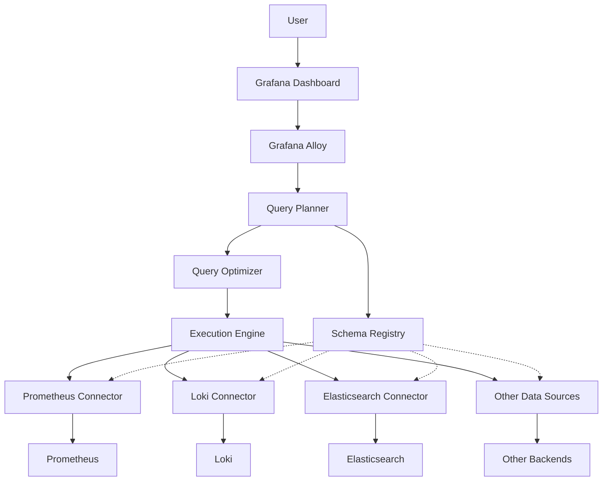

# Grafana Alloy

## Introduction

Grafana Alloy is a powerful component of the Grafana ecosystem that addresses one of the most common challenges in modern observability: working with multiple data sources seamlessly. As organizations adopt various monitoring tools and generate data in different formats, Grafana Alloy provides a unified platform to query, combine, and visualize data from diverse sources without the complexity of managing each one separately.

In this guide, we'll explore Grafana Alloy's core functionality, how it fits into the broader Grafana ecosystem, and how you can leverage it to build more comprehensive dashboards with less effort.

## What is Grafana Alloy?

Grafana Alloy acts as a meta data source that allows you to query multiple data sources through a unified interface. Rather than switching between different query languages and managing connections to various backends, Alloy provides:

- A single query interface for multiple data sources
- The ability to join and combine data from different sources
- Schema and metadata management across sources
- Performance optimization for cross-source queries

<div className="info-box">
  <strong>Key Concept:</strong> Think of Grafana Alloy as a universal translator for your observability data. It speaks the native language of each data source while providing you with a consistent way to interact with all of them.
</div>

## Getting Started with Grafana Alloy

### Prerequisites

Before diving into Grafana Alloy, ensure you have:

- Grafana instance (version 9.0 or later)
- At least two data sources configured (e.g., Prometheus, Loki, Elasticsearch)
- Basic understanding of Grafana dashboards

### Setting Up Grafana Alloy

To configure Grafana Alloy:

1. Navigate to the **Configuration** > **Data Sources** section in your Grafana instance
2. Click **Add data source**
3. Select **Grafana Alloy** from the list of available data sources
4. Configure the basic settings:

```json
{
  "name": "My Alloy Source",
  "isDefault": false,
  "jsonData": {
    "connectedSources": ["prometheus-main", "loki-logs", "elasticsearch-metrics"]
  }
}
```

5. Click **Save & Test** to verify the configuration

Once configured, Alloy will appear as a data source option when creating new panels in your dashboards.

## Querying with Grafana Alloy

Alloy provides a unified query language that abstracts the complexity of individual data source syntaxes. Here's a basic example:

```sql
SELECT 
  $__timeGroup(time, '5m') AS time,
  avg(cpu_usage) AS avg_cpu,
  max(memory_usage) AS max_memory
FROM metrics.node_stats
JOIN logs.node_events ON metrics.node_id = logs.node_id
WHERE $__timeFilter(time)
GROUP BY time
ORDER BY time
```

This query combines metrics from a time-series database with corresponding log events, which would typically require two separate queries in different languages.

### Example: Combining Metrics and Logs

Let's create a practical example where we monitor application performance while correlating with error logs:

```sql
-- Alloy query that combines Prometheus metrics with Loki logs
SELECT 
  $__timeGroup(time, '1m') AS time,
  avg(http_request_duration_seconds) AS avg_latency,
  count(error_log.level="error") AS error_count
FROM prometheus.http_requests
LEFT JOIN loki.logs AS error_log 
  ON $__timeFilter(error_log.timestamp) 
  AND error_log.service = 'api-gateway'
WHERE $__timeFilter(time)
  AND service = 'api-gateway'
GROUP BY time
ORDER BY time
```

The output would be a unified dataset that shows both performance metrics and corresponding error counts in a single result set, ready for visualization.

## Advanced Features

### Cross-Data Source Joins

One of Alloy's most powerful features is the ability to join data across disparate sources:

```sql
-- Joining metrics, logs, and tracing data
SELECT 
  trace.id,
  trace.duration,
  avg(metrics.cpu) AS avg_cpu,
  count(logs.message) AS log_count
FROM tempo.traces AS trace
JOIN prometheus.process AS metrics 
  ON metrics.service = trace.service 
  AND $__timeRange(metrics.time, trace.start_time, trace.end_time)
JOIN loki.logs AS logs 
  ON logs.trace_id = trace.id
WHERE trace.service = 'payment-service'
  AND trace.duration > 1000
GROUP BY trace.id, trace.duration
ORDER BY trace.duration DESC
LIMIT 10
```

### Data Transformation

Alloy allows you to transform data during queries:

```sql
SELECT 
  time,
  -- Convert bytes to megabytes
  memory_usage / 1024 / 1024 AS memory_mb,
  -- Calculate percentage
  cpu_usage * 100 AS cpu_percent,
  -- Categorize response times
  CASE 
    WHEN latency < 100 THEN 'fast'
    WHEN latency < 500 THEN 'acceptable'
    ELSE 'slow'
  END AS performance_category
FROM metrics.application
WHERE $__timeFilter(time)
```

## Real-World Application Example

Let's build a comprehensive service health dashboard using Grafana Alloy. We'll combine infrastructure metrics, application performance data, and error logs into a unified view.

### Step 1: Create the Alloy Query

```sql
-- Comprehensive service health query
SELECT 
  $__timeGroup(time, '5m') AS time,
  
  -- Performance metrics
  avg(metrics.http_request_duration_seconds) AS avg_response_time,
  percentile(metrics.http_request_duration_seconds, 95) AS p95_response_time,
  sum(metrics.http_requests_total) AS request_count,
  
  -- Error metrics
  sum(CASE WHEN metrics.http_status >= 400 THEN 1 ELSE 0 END) AS error_count,
  sum(CASE WHEN metrics.http_status >= 400 THEN 1 ELSE 0 END) / 
    sum(metrics.http_requests_total) * 100 AS error_rate,
  
  -- Resource utilization
  avg(resources.cpu_usage_percent) AS avg_cpu,
  max(resources.memory_usage_bytes) / 1024 / 1024 / 1024 AS max_memory_gb,
  
  -- Log-based metrics
  count(logs.level = 'error') AS log_errors,
  count(logs.level = 'warn') AS log_warnings
  
FROM prometheus.http_metrics AS metrics
JOIN prometheus.resource_metrics AS resources 
  ON metrics.instance = resources.instance 
  AND $__timeFilter(resources.time)
JOIN loki.application_logs AS logs 
  ON logs.service = 'payment-api' 
  AND $__timeFilter(logs.timestamp)
WHERE metrics.service = 'payment-api'
  AND $__timeFilter(metrics.time)
GROUP BY time
ORDER BY time
```

### Step 2: Visualize in Dashboard

Create a dashboard with multiple panels:

1. **Service Overview** - Gauge panels showing current status
2. **Request Performance** - Graph panel showing response times
3. **Error Analysis** - Time series showing error rates with log counts
4. **Resource Utilization** - Combined CPU and memory usage

The beauty of Alloy is that all these panels can use variations of a single query language, rather than requiring different syntax for each data source.

## Flow Diagram of Grafana Alloy Architecture

Here's a diagram showing how Grafana Alloy fits into the broader monitoring stack:



## Best Practices

When working with Grafana Alloy, consider these best practices:

1. **Start Simple**: Begin with queries to a single data source, then gradually add joins.

2. **Use Time Alignment**: Always ensure proper time alignment when joining time-series data:
   ```sql
   ON metrics.timestamp BETWEEN logs.timestamp - interval '5m' AND logs.timestamp + interval '5m'
   ```

3. **Optimize Large Queries**: For complex dashboards, use variables to filter data early:
   ```sql
   WHERE service = '${service}' AND environment = '${environment}'
   ```

4. **Cache Frequently Used Data**: Enable caching for queries that don't change often:
   ```json
   {
     "cacheConfig": {
       "enabled": true,
       "ttl": 300
     }
   }
   ```

5. **Monitor Query Performance**: Use Alloy's built-in query statistics to identify optimization opportunities.

## Common Challenges and Solutions

| Challenge | Solution |
|-----------|----------|
| Query timeouts | Break complex queries into smaller parts or increase timeout limits |
| Schema mismatches | Use explicit type casting or create normalized views |
| Performance issues | Add appropriate indexes or pre-aggregate data |
| Data volume | Use time bucketing and sampling for high-cardinality data |

## Summary

Grafana Alloy represents a significant advancement in the Grafana ecosystem by providing a unified approach to querying and visualizing data from multiple sources. Key benefits include:

- Simplified querying across diverse data sources
- Reduced complexity in dashboard creation
- More comprehensive visualizations that combine related data
- Improved performance through optimized query planning

By leveraging Grafana Alloy, you can create more insightful dashboards that provide a complete picture of your systems' health and performance, rather than disconnected views from individual monitoring tools.

## Additional Resources

- Practice creating cross-data source queries
- Experiment with joining metrics, logs, and traces
- Try building a unified observability dashboard for an application
- Create custom transformations to normalize data from different sources

## Exercise

Create a Grafana Alloy query that combines:
1. System metrics (CPU, memory) from Prometheus
2. Application logs from Loki
3. Request durations from a database

Then create a dashboard that shows the correlation between system load, application errors, and user experience.

With Grafana Alloy, you'll be well on your way to creating unified observability dashboards that provide genuine insights rather than disconnected data points.