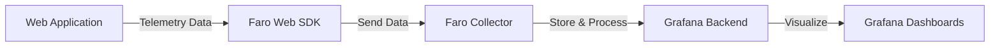

# Grafana Faro

## Introduction

Grafana Faro is an open-source frontend application observability solution within the Grafana ecosystem. It enables developers to monitor, track, and troubleshoot issues in web applications by collecting telemetry data such as errors, performance metrics, and user interactions. As websites and web applications become increasingly complex, having visibility into frontend performance and errors has become crucial for providing excellent user experiences.

In this guide, we'll explore what Grafana Faro is, how it works, and how to implement it in your web applications to gain valuable insights into your frontend performance.

## What is Grafana Faro?

Grafana Faro consists of two main components:

1. **Faro Web SDK**: A JavaScript library that collects telemetry data from your web applications
2. **Faro Collector**: A backend service that receives and processes data from the Web SDK

Together, these components provide:

- Real user monitoring (RUM)
- Error tracking
- Performance monitoring
- Custom event tracking
- User session data



## Getting Started with Grafana Faro

### Prerequisites

Before implementing Grafana Faro, you need:

- A web application you want to monitor
- A running instance of Grafana (version 9.x or newer)
- Grafana Faro Collector properly configured and running

### Installing the Faro Web SDK

First, you need to add the Faro Web SDK to your application. You can install it via npm:

```bash
npm install @grafana/faro-web-sdk
```

### Basic Configuration

Here's how to configure the Faro Web SDK in your application:

```javascript
import { initializeFaro } from '@grafana/faro-web-sdk';

// Initialize Faro with your configuration
const faro = initializeFaro({
  url: 'https://your-faro-collector-endpoint/collect',
  app: {
    name: 'my-application',
    version: '1.0.0',
    environment: 'production'
  }
});
```

This basic setup will start collecting telemetry data from your application and send it to your Faro Collector endpoint.

## Core Features of Grafana Faro

### Error Tracking

One of Faro's most valuable features is automatic error tracking. It captures unhandled errors and exceptions in your application, including detailed stack traces:

```javascript
// Errors thrown anywhere in your code will be automatically captured
try {
  // Some code that might throw an error
  nonExistentFunction();
} catch (error) {
  // You can also manually log errors
  faro.api.pushError(error);
}
```

### Performance Monitoring

Faro automatically collects Web Vitals and other performance metrics:

```javascript
// Add the web vitals plugin for core web vitals metrics
import { getWebVitalsPlugin } from '@grafana/faro-web-sdk';

const faro = initializeFaro({
  url: 'https://your-faro-collector-endpoint/collect',
  app: {
    name: 'my-application',
    version: '1.0.0'
  },
  plugins: [
    getWebVitalsPlugin()
  ]
});
```

This will collect metrics like:
- Largest Contentful Paint (LCP)
- First Input Delay (FID)
- Cumulative Layout Shift (CLS)
- Time to First Byte (TTFB)
- First Contentful Paint (FCP)

### Custom Events

You can track custom events to understand user behavior:

```javascript
// Track a button click
function handleButtonClick() {
  faro.api.pushEvent('button_clicked', {
    buttonId: 'submit-form',
    pageSection: 'checkout'
  });
}
```

### User Context

Add user context to better understand issues affecting specific users:

```javascript
// Add user context
faro.api.setUser({
  id: 'user-123',
  username: 'johndoe',
  attributes: {
    plan: 'premium',
    region: 'europe'
  }
});
```

## Advanced Configuration

### Adding Plugins

Faro supports various plugins to enhance its functionality:

```javascript
import { 
  initializeFaro, 
  getWebVitalsPlugin,
  getTracePlugin
} from '@grafana/faro-web-sdk';

const faro = initializeFaro({
  url: 'https://your-faro-collector-endpoint/collect',
  app: {
    name: 'my-application',
    version: '1.0.0'
  },
  plugins: [
    getWebVitalsPlugin(),
    getTracePlugin()
  ]
});
```

### Instrumenting Routes

For single-page applications, you can instrument route changes:

```javascript
// React Router example
import { useEffect } from 'react';
import { useLocation } from 'react-router-dom';

function RouteTracker() {
  const location = useLocation();
  
  useEffect(() => {
    // Log page view when route changes
    faro.api.pushEvent('page_view', {
      path: location.pathname,
      query: location.search
    });
  }, [location]);
  
  return null;
}
```

## Real-World Example: E-commerce Application Monitoring

Let's look at a comprehensive example of implementing Faro in an e-commerce application:

```javascript
import { initializeFaro, getWebVitalsPlugin } from '@grafana/faro-web-sdk';

// Initialize Faro with detailed configuration
const faro = initializeFaro({
  url: 'https://faro-collector.example.com/collect',
  app: {
    name: 'ecommerce-frontend',
    version: '2.5.1',
    environment: process.env.NODE_ENV
  },
  // Sample only a percentage of sessions in production to reduce data volume
  sessionSampleRate: process.env.NODE_ENV === 'production' ? 0.1 : 1.0,
  plugins: [
    getWebVitalsPlugin()
  ]
});

// Track specific business events
export function trackProductView(product) {
  faro.api.pushEvent('product_viewed', {
    productId: product.id,
    productName: product.name,
    price: product.price,
    category: product.category
  });
}

export function trackAddToCart(product, quantity) {
  faro.api.pushEvent('add_to_cart', {
    productId: product.id,
    productName: product.name,
    price: product.price,
    quantity: quantity,
    totalValue: product.price * quantity
  });
}

export function trackCheckoutStep(step, value) {
  faro.api.pushEvent('checkout_step', {
    step: step,
    value: value
  });
}

// Set user context when user logs in
export function setUserContext(user) {
  if (!user) return;
  
  faro.api.setUser({
    id: user.id,
    attributes: {
      customerTier: user.tier,
      registrationDate: user.registeredAt,
      hasActiveSubscription: user.subscription?.isActive || false
    }
  });
}

// Track performance of critical user journeys
export function measureCheckoutFlow() {
  const startTime = performance.now();
  
  return {
    complete: () => {
      const duration = performance.now() - startTime;
      faro.api.pushEvent('checkout_flow_completed', {
        durationMs: duration
      });
    },
    abandon: (reason) => {
      const duration = performance.now() - startTime;
      faro.api.pushEvent('checkout_flow_abandoned', {
        durationMs: duration,
        reason: reason
      });
    }
  };
}
```

In this example, we're tracking product views, cart additions, checkout steps, and measuring critical user journeys. This data will help identify:

- Which products users are viewing but not purchasing
- At which steps users abandon the checkout process
- How long the checkout process takes for different user segments
- How frontend errors correlate with abandoned purchases

## Visualizing Faro Data in Grafana

Once you've implemented Faro and are collecting data, you can create dashboards in Grafana to visualize:

1. **Error rates** - Track errors over time and identify error spikes
2. **Performance metrics** - Monitor Web Vitals and page load times
3. **User journeys** - See how users navigate through your application
4. **Business metrics** - Correlate technical metrics with business outcomes

A typical Faro dashboard might include panels for:

- Error rate by page
- Error rate by browser/device
- Web Vitals metrics
- Session duration
- Funnel visualization (e.g., product view → add to cart → checkout)
- Geographic distribution of users

## Troubleshooting Common Issues

### Data Not Appearing in Grafana

If you're not seeing data in Grafana:

1. Check the browser console for errors related to Faro
2. Verify your collector URL is correct
3. Ensure your Faro Collector service is running
4. Check network requests to see if data is being sent

### High Volume of Data

If Faro is sending too much data:

1. Reduce the session sample rate
2. Be more selective about which errors to capture
3. Limit custom events to critical user actions

```javascript
// Reduce data volume
const faro = initializeFaro({
  // Other config...
  sessionSampleRate: 0.1, // Only instrument 10% of sessions
  isolate: false, // Don't create isolated contexts for errors
  transportStrategy: 'buffered', // Buffer events before sending
});
```

## Summary

Grafana Faro provides powerful frontend observability capabilities that help you:

- Detect and diagnose frontend errors
- Monitor application performance
- Understand user behavior
- Correlate frontend issues with business outcomes

By implementing Faro in your web applications, you gain valuable insights that can help improve user experience, reduce errors, and optimize performance.

## Additional Resources

- [Grafana Faro Official Documentation](https://grafana.com/docs/grafana-cloud/faro/)
- [Web Vitals Explained](https://web.dev/vitals/)
- [JavaScript Error Tracking Best Practices](https://grafana.com/blog/)

## Exercises

1. Implement basic Faro error tracking in a simple web application
2. Create a custom dashboard in Grafana to visualize Faro data
3. Track a custom user journey using Faro events
4. Configure Faro to collect Web Vitals and analyze the results
5. Add user context to your Faro implementation to segment your data