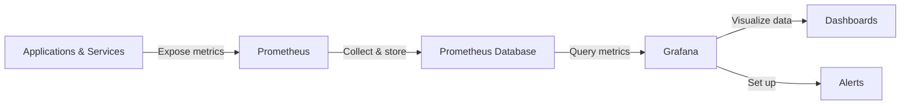

# Integration with Prometheus

## Introduction

Prometheus has become the de facto standard for metrics collection in modern infrastructure environments. When combined with Grafana's visualization capabilities, you get a powerful monitoring solution that can help you understand your systems' performance, identify issues, and make data-driven decisions.

In this guide, we'll explore how to integrate Prometheus with Grafana, allowing you to create insightful dashboards from your metrics data. We'll cover everything from setting up the connection between these two tools to creating your first dashboard and exploring Prometheus' query language (PromQL).

## What is Prometheus?

Prometheus is an open-source systems monitoring and alerting toolkit that collects and stores time-series data as metrics. It was originally developed at SoundCloud and is now a standalone project maintained by the Cloud Native Computing Foundation (CNCF).

Key features of Prometheus include:

- A multi-dimensional data model (time series identified by metric name and key-value pairs)
- A flexible query language (PromQL) to leverage this dimensionality
- No reliance on distributed storage; single server nodes are autonomous
- Time series collection via HTTP pull model
- Service discovery or static configuration for targets
- Multiple modes of graphing and dashboarding support

## Prometheus and Grafana: Better Together

While Prometheus has its own basic visualization capabilities, Grafana offers much more advanced features:



This combination allows you to:
- Visualize Prometheus metrics with Grafana's rich graphing features
- Combine Prometheus data with other data sources in the same dashboard
- Set up advanced alerting rules
- Share dashboards across your organization
- Apply Grafana's powerful transformations and calculations to your metrics

## Setting Up Prometheus as a Data Source in Grafana

### Prerequisites

Before we begin, ensure you have:
- A running Prometheus instance collecting metrics
- A running Grafana instance (version 7.x or higher recommended)
- Admin access to your Grafana instance

### Adding Prometheus as a Data Source

1. Log in to your Grafana instance with admin credentials.
2. Navigate to **Configuration → Data Sources** (or click the gear icon in the side menu).
3. Click the **Add data source** button.
4. Select **Prometheus** from the list of available data sources.
5. Configure the data source with the following settings:

```
Name: Prometheus
URL: http://your-prometheus-instance:9090
Access: Server (default)
```

6. Scroll down and click **Save & Test**.

If the connection is successful, you'll see a green "Data source is working" message.

## Basic Prometheus Querying with PromQL

Prometheus uses its own query language called PromQL (Prometheus Query Language). Here are some basic query examples to get you started:

### Simple Metric Query

To display a simple metric:

```
http_requests_total
```

This returns all time series with the metric name `http_requests_total`.

### Adding Filters

To filter by labels:

```
http_requests_total{job="api-server", instance="server-01:9090"}
```

This returns the `http_requests_total` metric only for the job "api-server" and instance "server-01:9090".

### Rate Function

To calculate the rate of requests over the last 5 minutes:

```
rate(http_requests_total{job="api-server"}[5m])
```

This is particularly useful for counter metrics that continuously increase.

## Creating Your First Prometheus Dashboard in Grafana

Now let's create a simple dashboard to monitor a web service.

### Step 1: Create a New Dashboard

1. In Grafana, click on the **+** icon in the side menu and select **Dashboard**.
2. Click **+ Add new panel**.

### Step 2: Configure Your First Panel

1. In the query editor, select your Prometheus data source.
2. Enter a PromQL query, for example:

```
sum(rate(http_requests_total[5m])) by (status_code)
```

3. This query shows the rate of HTTP requests over the last 5 minutes, grouped by status code.
4. Set the panel title to "HTTP Request Rate by Status Code".
5. Click **Apply** to add the panel to your dashboard.

### Step 3: Add More Panels

Add additional panels to your dashboard to provide a comprehensive view:

- **Memory Usage**: 
```
sum(container_memory_usage_bytes) by (container_name)
```

- **CPU Usage**:
```
sum(rate(container_cpu_usage_seconds_total[1m])) by (container_name)
```

- **Error Rate**:
```
sum(rate(http_requests_total{status_code=~"5.."}[5m])) / sum(rate(http_requests_total[5m])) * 100
```

### Step 4: Organize and Save the Dashboard

1. Arrange your panels by dragging them into a logical layout.
2. Click the save icon (disk) in the upper right corner.
3. Give your dashboard a name, like "Web Service Overview".
4. Add a description and tags if desired.
5. Click **Save**.

## Advanced Prometheus Integration Features

### Using Template Variables

Template variables make your dashboards more flexible by allowing you to select different values for label filters.

To add a template variable:

1. Go to Dashboard settings (gear icon) → Variables → Add variable.
2. Configure a variable:
```
Name: job
Label: Job
Type: Query
Data source: Your Prometheus data source
Query: label_values(up, job)
```
3. Click **Add** and then **Save**.

Now you can use this variable in your queries:

```
http_requests_total{job="$job"}
```

### Setting Up Alerts

Grafana allows you to set up alerts based on your Prometheus metrics:

1. Edit a panel and go to the **Alert** tab.
2. Click **Create Alert**.
3. Define conditions, for example:
   - Evaluate every: 1m
   - For: 5m
   - Condition: avg() of query(A,5m,now) is above 90
4. Add notifications if desired.
5. Click **Save** to create the alert.

### Recording Rules and Alerts in Prometheus

For complex queries that are executed frequently, you can create recording rules in Prometheus to pre-compute results.

Add to your `prometheus.yml`:

```yaml
rule_files:
  - "rules/recording_rules.yml"
  - "rules/alerting_rules.yml"
```

Example recording rule (`recording_rules.yml`):

```yaml
groups:
  - name: example
    rules:
      - record: job:http_requests_total:rate5m
        expr: sum(rate(http_requests_total[5m])) by (job)
```

Then you can query `job:http_requests_total:rate5m` in Grafana.

## Troubleshooting Common Issues

### No Data Shown in Grafana

If you're not seeing data in your Grafana panels:

1. Check that Prometheus is running and accessible from Grafana.
2. Verify that your PromQL query is valid by testing it in the Prometheus UI.
3. Ensure the time range in Grafana is appropriate for your data.
4. Check that metrics are being collected by Prometheus (targets are up).

### Query Returns Too Many Time Series

If your query returns too many time series, try:

1. Adding more specific label filters
2. Using aggregation operators like `sum()`, `avg()`, `max()`
3. Grouping results with `by (label)` or `without (label)`

### High Cardinality Issues

High cardinality (too many unique label combinations) can cause performance problems:

1. Avoid using high-cardinality labels in recording rules
2. Consider using `topk()` to limit the number of series
3. Use `label_replace()` to create new labels with lower cardinality

## Best Practices for Prometheus and Grafana Integration

### Dashboard Organization

- Group related panels together
- Use row dividers to organize sections
- Keep dashboards focused on specific services or use cases
- Use template variables to make dashboards reusable

### Query Optimization

- Use recording rules for expensive queries
- Limit the use of regex matching where possible
- Be mindful of the time range and resolution

### Alerting Strategy

- Alert on symptoms, not causes
- Set appropriate thresholds based on historical data
- Include useful context in alert messages
- Configure proper notification channels

## Summary

Integrating Prometheus with Grafana provides a powerful monitoring solution that combines Prometheus's efficient metrics collection and storage with Grafana's flexible and beautiful visualization capabilities.

In this guide, we've covered:
- Setting up Prometheus as a data source in Grafana
- Basic PromQL queries and their use in Grafana panels
- Creating dashboards to monitor your services
- Advanced features like template variables and alerts
- Troubleshooting common issues and best practices

By mastering this integration, you'll be able to create comprehensive monitoring solutions that help you understand your systems' performance and quickly identify and resolve issues.

## Additional Resources

- [Prometheus Documentation](https://prometheus.io/docs/introduction/overview/)
- [Grafana Prometheus Data Source Documentation](https://grafana.com/docs/grafana/latest/datasources/prometheus/)
- [PromQL Cheat Sheet](https://promlabs.com/promql-cheat-sheet/)

## Exercises

1. **Basic Integration**: Set up a local Prometheus and Grafana instance, and create a data source connection.
2. **Query Practice**: Create a dashboard with panels showing different PromQL functions (rate, increase, histogram_quantile).
3. **Dashboard Challenge**: Create a complete dashboard for monitoring a web application that includes request rates, error rates, and resource usage.
4. **Template Variables**: Modify your dashboard to use template variables for selecting different services or instances.
5. **Alert Setup**: Configure alerts for high error rates or resource usage, and test the alerting pipeline.