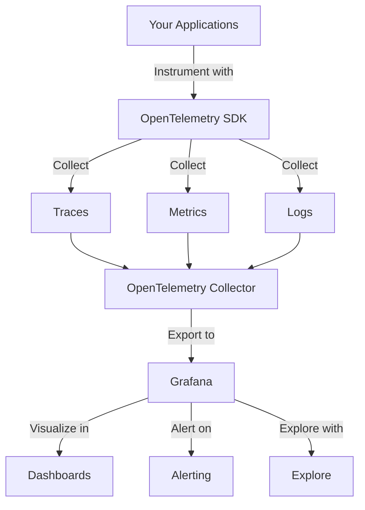
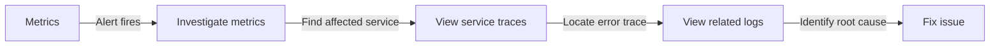

# Integration with OpenTelemetry

## Introduction

OpenTelemetry provides a unified framework for collecting and processing telemetry data from applications and infrastructure. When integrated with Grafana, it creates a powerful observability solution that helps developers monitor, troubleshoot, and optimize their applications. This guide will walk you through understanding OpenTelemetry and how to integrate it with your Grafana ecosystem.

## What is OpenTelemetry?

OpenTelemetry (often abbreviated as OTel) is an open-source observability framework that provides a collection of tools, APIs, and SDKs for collecting three primary types of telemetry data:

- **Traces**: Detailed records of requests as they flow through distributed systems
- **Metrics**: Numerical measurements collected at regular intervals
- **Logs**: Time-stamped records of discrete events



## Why Integrate OpenTelemetry with Grafana?

Integrating OpenTelemetry with Grafana offers several benefits:

1. **Vendor-neutral instrumentation**: Instrument your code once and send telemetry data to multiple backends
2. **Comprehensive observability**: Collect metrics, traces, and logs using a single framework
3. **Wide language support**: OpenTelemetry supports numerous programming languages
4. **Unified visualization**: Use Grafana to create comprehensive dashboards combining all your telemetry data
5. **Simplified troubleshooting**: Correlate metrics, logs, and traces in Grafana's Explore view

## Setting Up OpenTelemetry for Grafana

### Prerequisites

Before you begin, ensure you have:

- A running Grafana instance (version 7.0 or higher)
- Applications you want to monitor
- Basic understanding of your application architecture

### Step 1: Instrument Your Application with OpenTelemetry

Let's demonstrate how to instrument a simple Node.js application:

```javascript
// Import OpenTelemetry packages
const { NodeTracerProvider } = require('@opentelemetry/sdk-trace-node');
const { SimpleSpanProcessor } = require('@opentelemetry/sdk-trace-base');
const { OTLPTraceExporter } = require('@opentelemetry/exporter-trace-otlp-http');
const { Resource } = require('@opentelemetry/resources');
const { SemanticResourceAttributes } = require('@opentelemetry/semantic-conventions');
const { trace } = require('@opentelemetry/api');
const { registerInstrumentations } = require('@opentelemetry/instrumentation');
const { ExpressInstrumentation } = require('@opentelemetry/instrumentation-express');
const { HttpInstrumentation } = require('@opentelemetry/instrumentation-http');

// Set up the tracer provider
const provider = new NodeTracerProvider({
  resource: new Resource({
    [SemanticResourceAttributes.SERVICE_NAME]: 'my-service',
  }),
});

// Configure the OTLP exporter
const otlpExporter = new OTLPTraceExporter({
  url: 'http://localhost:4318/v1/traces', // OpenTelemetry Collector endpoint
});

// Add the exporter to the provider
provider.addSpanProcessor(new SimpleSpanProcessor(otlpExporter));
provider.register();

// Register auto-instrumentations
registerInstrumentations({
  instrumentations: [
    new HttpInstrumentation(),
    new ExpressInstrumentation(),
  ],
});

// Create an Express application
const express = require('express');
const app = express();

app.get('/', (req, res) => {
  // Create a custom span
  const tracer = trace.getTracer('express-example');
  const span = tracer.startSpan('process-request');
  
  // Perform some work
  setTimeout(() => {
    span.end();
    res.send('Hello from instrumented app!');
  }, 100);
});

app.listen(3000, () => {
  console.log('Server running on port 3000');
});
```

### Step 2: Deploy the OpenTelemetry Collector

The OpenTelemetry Collector acts as a proxy between your applications and Grafana's backends. Create a configuration file named `otel-collector-config.yaml`:

```yaml
receivers:
  otlp:
    protocols:
      http:
        endpoint: 0.0.0.0:4318
      grpc:
        endpoint: 0.0.0.0:4317

processors:
  batch:
    timeout: 1s
    send_batch_size: 1024

exporters:
  prometheus:
    endpoint: 0.0.0.0:8889
    namespace: otel
  
  loki:
    endpoint: "http://loki:3100/loki/api/v1/push"
    tenant_id: "tenant1"
    
  otlp:
    endpoint: tempo:4317
    tls:
      insecure: true

service:
  pipelines:
    traces:
      receivers: [otlp]
      processors: [batch]
      exporters: [otlp]
    metrics:
      receivers: [otlp]
      processors: [batch]
      exporters: [prometheus]
    logs:
      receivers: [otlp]
      processors: [batch]
      exporters: [loki]
```

Run the collector using Docker:

```bash
docker run -p 4317:4317 -p 4318:4318 -p 8889:8889 \
  -v $(pwd)/otel-collector-config.yaml:/etc/otelcol/config.yaml \
  otel/opentelemetry-collector:latest
```

### Step 3: Configure Grafana Data Sources

In your Grafana instance, you'll need to set up the appropriate data sources:

1. **For metrics**: Add a Prometheus data source pointing to the OTel Collector's Prometheus endpoint
2. **For logs**: Add a Loki data source
3. **For traces**: Add a Tempo data source

Here's how to configure the Prometheus data source in Grafana:

1. Navigate to Configuration > Data Sources > Add data source
2. Select Prometheus
3. Set the URL to `http://localhost:8889` (the OTel Collector's Prometheus endpoint)
4. Click "Save & Test"

### Step 4: Create Dashboards in Grafana

Now you can create dashboards to visualize your OpenTelemetry data. Let's create a simple dashboard with service metrics:

1. In Grafana, click on "Create" > "Dashboard"
2. Add a new panel
3. Use a PromQL query like `rate(otel_process_runtime_total_alloc_bytes[5m])` to visualize memory allocation rate
4. Save your dashboard

## Using Grafana Explore with OpenTelemetry

Grafana's Explore view is perfect for troubleshooting with OpenTelemetry data:

1. Go to Explore in the Grafana sidebar
2. Select your Prometheus data source
3. Query for a specific metric, e.g., `otel_http_server_duration_milliseconds_bucket`
4. Switch to your Tempo data source to view related traces
5. Use the trace ID to correlate with logs in Loki

## Connecting Metrics, Logs, and Traces

One of the most powerful features when integrating OpenTelemetry with Grafana is the ability to correlate different telemetry signals:



### Example: Troubleshooting High Latency

Imagine you receive an alert for high API latency:

1. View the latency metrics dashboard in Grafana
2. Identify the specific endpoint with high latency
3. Switch to Explore and query traces for that endpoint
4. Find traces with high duration
5. Examine spans within those traces to identify bottlenecks
6. Look at logs corresponding to the problematic service
7. Fix the issue and verify improvement through Grafana

## Advanced Configuration: Custom Attributes and Filtering

You can enhance your OpenTelemetry data with custom attributes that make it more useful in Grafana:

```javascript
// Add custom attributes to a span
const span = tracer.startSpan('process-data');
span.setAttribute('customer.id', customerId);
span.setAttribute('process.priority', 'high');
span.setAttribute('data.size', dataSize);
span.end();
```

In Grafana, you can then filter or group by these custom attributes.

## Best Practices for OpenTelemetry with Grafana

1. **Define meaningful service names**: Use clear, consistent service naming conventions
2. **Add relevant attributes**: Include attributes that will help with filtering and grouping
3. **Sample appropriately**: Use intelligent sampling for high-volume services
4. **Create focused dashboards**: Design dashboards around specific use cases or services
5. **Set up alerting**: Configure alerts based on OpenTelemetry metrics
6. **Use exemplars**: Link metrics to traces with exemplars
7. **Standardize instrumentation**: Create reusable instrumentation libraries for your organization

## Troubleshooting Your OpenTelemetry Setup

If you're not seeing data in Grafana:

1. **Check instrumentation**: Verify your application is generating telemetry data
2. **Inspect the collector**: Look at the collector logs for errors or dropped data
3. **Validate data source configuration**: Ensure Grafana data sources are correctly configured
4. **Test with simple queries**: Start with basic queries to confirm data flow

## Summary

Integrating OpenTelemetry with Grafana creates a powerful observability platform that helps you understand the behavior and performance of your applications. By collecting metrics, logs, and traces through a single framework and visualizing them in Grafana, you can gain comprehensive insights into your systems.

This integration enables you to:
- Monitor application performance with detailed metrics
- Track requests across distributed systems with traces
- Correlate different telemetry signals for efficient troubleshooting
- Create comprehensive dashboards for operational visibility

## Additional Resources

- [OpenTelemetry Documentation](https://opentelemetry.io/docs/)
- [Grafana Documentation](https://grafana.com/docs/)
- [OpenTelemetry Collector](https://opentelemetry.io/docs/collector/)
- [Grafana Tempo (Distributed Tracing)](https://grafana.com/docs/tempo/latest/)

## Exercises

1. Instrument a simple application using OpenTelemetry and visualize its metrics in Grafana
2. Set up trace sampling and explore how it affects performance and data volume
3. Create a Grafana dashboard that combines metrics, logs, and traces for a service
4. Configure alerts based on OpenTelemetry metrics
5. Practice troubleshooting a performance issue using the correlation between metrics, logs, and traces