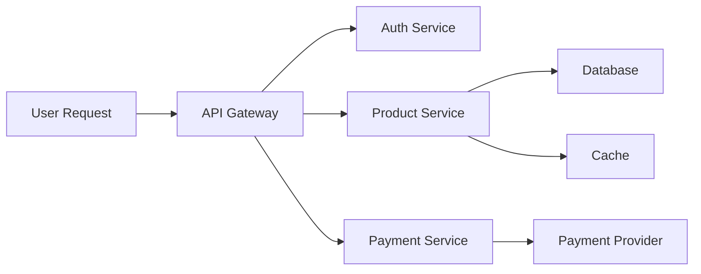
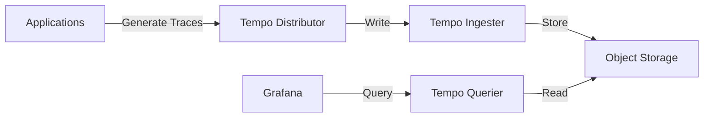

# Grafana Tempo

## Introduction

Grafana Tempo is a high-scale, cost-effective distributed tracing backend designed to help developers understand how requests flow through their distributed applications. As applications grow more complex with microservices architectures, tracking a single request as it moves through different services becomes challenging. Tempo solves this problem by collecting and storing distributed traces, making them searchable and visualizable within the Grafana interface.

Tempo stands out in the Grafana ecosystem for several key reasons:
- **Cost-efficient storage**: Uses object storage (like S3, GCS, or Azure Blob Storage) to keep costs low
- **Seamless integration**: Works perfectly with other Grafana tools like Loki and Prometheus
- **Multi-protocol support**: Compatible with Jaeger, Zipkin, OpenTelemetry, and other tracing protocols
- **Easy deployment**: Designed to be simple to operate at any scale

In this guide, we'll explore what Tempo is, how it works, and how to set it up and use it in your applications.

## What is Distributed Tracing?

Before diving into Tempo, let's understand what distributed tracing is.

Distributed tracing is a method for tracking requests as they travel through various services in a distributed system. Each trace represents a single request's journey and consists of multiple spans. A span represents a unit of work in a service, such as an API call or a database query.



In the example above, a single user request generates multiple spans across different services. Distributed tracing helps you visualize this flow and identify performance bottlenecks or errors.

## How Tempo Works

Grafana Tempo follows a straightforward architecture:

1. **Collection**: Your applications instrument code to generate traces using libraries like OpenTelemetry, Jaeger, or Zipkin
2. **Ingestion**: Tempo receives these traces through various protocols
3. **Storage**: Traces are stored in object storage for cost-effective retention
4. **Query**: Grafana provides a UI to search and visualize these traces



## Setting Up Grafana Tempo

Let's go through the basic steps to set up Tempo in your environment.

### Prerequisites

- Docker and Docker Compose (for local testing)
- Grafana (version 7.4.0 or newer)
- An application instrumented for tracing

### Step 1: Run Tempo Locally with Docker Compose

Create a file named `docker-compose.yml`:

```yaml
version: '3'
services:
  tempo:
    image: grafana/tempo:latest
    command: ["-config.file=/etc/tempo.yaml"]
    volumes:
      - ./tempo.yaml:/etc/tempo.yaml
      - ./tempo-data:/tmp/tempo
    ports:
      - "3200:3200"  # tempo
      - "4317:4317"  # otlp grpc
      - "4318:4318"  # otlp http
      - "9411:9411"  # zipkin

  grafana:
    image: grafana/grafana:latest
    volumes:
      - ./grafana-datasources.yaml:/etc/grafana/provisioning/datasources/datasources.yaml
    environment:
      - GF_AUTH_ANONYMOUS_ENABLED=true
      - GF_AUTH_ANONYMOUS_ORG_ROLE=Admin
    ports:
      - "3000:3000"
```

### Step 2: Configure Tempo

Create a file named `tempo.yaml`:

```yaml
server:
  http_listen_port: 3200

distributor:
  receivers:
    jaeger:
      protocols:
        thrift_http:
          endpoint: 0.0.0.0:14268
    zipkin:
      endpoint: 0.0.0.0:9411
    otlp:
      protocols:
        http:
          endpoint: 0.0.0.0:4318
        grpc:
          endpoint: 0.0.0.0:4317

storage:
  trace:
    backend: local
    local:
      path: /tmp/tempo
    pool:
      max_workers: 100
      queue_depth: 10000

compactor:
  compaction:
    block_retention: 24h
```

### Step 3: Configure Grafana Datasource

Create a file named `grafana-datasources.yaml`:

```yaml
apiVersion: 1

datasources:
  - name: Tempo
    type: tempo
    access: proxy
    url: http://tempo:3200
    version: 1
```

### Step 4: Start the Services

Run the following command to start both Tempo and Grafana:

```bash
docker-compose up -d
```

Now you can access Grafana at http://localhost:3000 and Tempo will be available as a datasource.

## Instrumenting Your Application for Tracing

To get the most out of Tempo, you need to instrument your applications to generate traces. Here's a simple example using OpenTelemetry with Node.js:

First, install the required packages:

```bash
npm install @opentelemetry/sdk-node @opentelemetry/auto-instrumentations-node @opentelemetry/exporter-trace-otlp-http
```

Then, create a file named `tracing.js`:

```javascript
// tracing.js
const { NodeSDK } = require('@opentelemetry/sdk-node');
const { getNodeAutoInstrumentations } = require('@opentelemetry/auto-instrumentations-node');
const { OTLPTraceExporter } = require('@opentelemetry/exporter-trace-otlp-http');

const exporter = new OTLPTraceExporter({
  url: 'http://localhost:4318/v1/traces',
});

const sdk = new NodeSDK({
  traceExporter: exporter,
  instrumentations: [getNodeAutoInstrumentations()]
});

sdk.start();
```

Now, import this file at the beginning of your application:

```javascript
// app.js
require('./tracing'); // Initialize tracing

const express = require('express');
const app = express();

app.get('/', (req, res) => {
  res.send('Hello World!');
});

app.get('/slow', async (req, res) => {
  // Simulate a slow operation
  await new Promise(resolve => setTimeout(resolve, 2000));
  res.send('Slow operation completed');
});

app.listen(3001, () => {
  console.log('Example app listening on port 3001');
});
```

When you make requests to this application, traces will be sent to Tempo and can be viewed in Grafana.

## Exploring Traces in Grafana

Once your application is generating traces and sending them to Tempo, you can explore them in Grafana:

1. Open Grafana (http://localhost:3000)
2. Navigate to Explore (from the left sidebar)
3. Select Tempo as your data source
4. Use the search functionality to find traces:
   - By trace ID (if you know it)
   - By service name
   - By duration (to find slow traces)
   - By tags/attributes

### Trace View

The trace view in Grafana displays a waterfall chart showing the timeline of spans within a trace:

- Each span shows its duration, service, and operation
- Spans are nested to show parent-child relationships
- Colors indicate different services
- You can expand spans to see more details, like tags and logs

This visualization helps you understand how long each part of your request takes and identify bottlenecks.

## Advanced Features

### Trace Discovery with Exemplars

One challenge with distributed tracing is finding relevant traces. Tempo integrates with Prometheus and Loki through "exemplars" - links from metrics or logs directly to related traces:

1. From a Prometheus graph, click on a point with an exemplar to see related traces
2. From Loki logs, click on trace ID links to jump directly to traces

This feature creates a seamless observability experience across metrics, logs, and traces.

### TraceQL - Tempo's Query Language

Tempo provides TraceQL, a powerful query language for searching traces:

```
{ .service.name = "payment-service" } | { .status = "error" }
```

This example finds traces that went through the payment service and had an error status.

### Metrics Generator

Tempo can generate metrics from your traces, allowing you to:
- Create service graphs showing traffic between services
- Calculate RED metrics (Rate, Error, Duration) automatically
- Monitor span metrics without additional instrumentation

## Real-World Examples

### Example 1: Troubleshooting Latency Issues

Imagine your e-commerce application is experiencing slow checkout times. Here's how you might use Tempo to investigate:

1. Look at Prometheus metrics to identify when latency started increasing
2. Use exemplars to find traces during that period
3. Analyze traces to see which service is taking the most time
4. Drill down into that service's spans to understand the root cause
5. Fix the issue and verify with new traces

### Example 2: Error Investigation

When users report payment failures:

1. Search for traces with error status in the payment service
2. Examine the spans to identify where errors occur
3. Check span attributes for error messages and relevant context
4. Look at spans from dependent services that might be causing the issue
5. Implement fixes and verify with new traces

## Best Practices

When working with Grafana Tempo:

1. **Use consistent naming conventions** for services and operations
2. **Add meaningful attributes** to spans to provide context
3. **Sample intelligently** - you don't need every trace in high-volume systems
4. **Set appropriate retention periods** based on your storage capacity
5. **Integrate with Prometheus and Loki** for a complete observability solution
6. **Automate instrumentation** where possible to reduce manual work

## Summary

Grafana Tempo is a powerful tool for distributed tracing that helps you understand the flow of requests through your system. Its integration with the Grafana ecosystem, cost-effective storage model, and ease of use make it an excellent choice for organizations of all sizes.

In this guide, we've covered:
- What Tempo is and how it fits into the Grafana ecosystem
- The basics of distributed tracing
- How to set up Tempo and instrument applications
- Exploring traces in Grafana
- Advanced features like exemplars and TraceQL
- Real-world troubleshooting examples

## Additional Resources

- [Grafana Tempo Official Documentation](https://grafana.com/docs/tempo/latest/)
- [OpenTelemetry Documentation](https://opentelemetry.io/docs/)
- [Distributed Tracing with Tempo (Grafana Labs Blog)](https://grafana.com/blog/2020/11/09/introducing-grafana-tempo-a-new-distributed-tracing-system/)

## Exercises

To strengthen your understanding of Tempo:

1. Set up Tempo locally using the instructions in this guide
2. Instrument a simple application with OpenTelemetry and send traces to Tempo
3. Create a multi-service application and trace requests across services
4. Practice using TraceQL to search for specific traces
5. Try setting up exemplars from Prometheus to Tempo
6. Implement span metrics generation and create a dashboard showing service performance