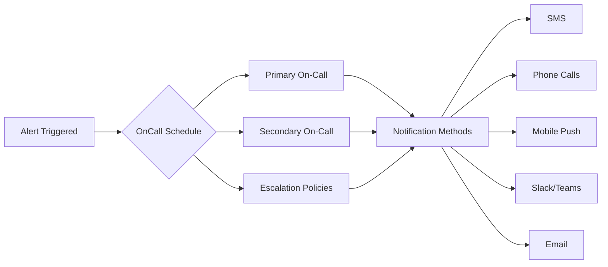

# Grafana OnCall

## Introduction

Grafana OnCall is a powerful incident response and alert management tool within the Grafana ecosystem. It helps DevOps, SRE (Site Reliability Engineering), and IT teams handle critical alerts efficiently by streamlining the alerting workflow, managing on-call schedules, and coordinating incident responses. 

Designed to minimize response times and reduce alert fatigue, Grafana OnCall bridges the gap between monitoring systems that detect issues and the teams responsible for resolving them. It's an essential component for organizations aiming to maintain high system availability and implement effective incident management practices.

## What is Grafana OnCall?

Grafana OnCall is an open-source incident response tool that:

1. **Centralizes alerts** from multiple monitoring systems
2. **Manages on-call rotations** to ensure the right people are notified at the right time
3. **Coordinates incident responses** through escalation policies and automated workflows
4. **Provides insights into alert patterns** to help teams improve their incident management processes

Originally developed as a standalone product called "Amixr," it was acquired by Grafana Labs and integrated into the Grafana ecosystem, offering both open-source and enterprise versions.

## Key Features of Grafana OnCall

### Alert Management

Grafana OnCall serves as a central hub for alerts from various monitoring systems, including:

- Grafana Alerting
- Prometheus
- Zabbix
- Nagios
- AWS CloudWatch
- Google Cloud Monitoring
- And many others through webhooks

This centralization gives teams a single interface to manage all their alerts regardless of their source.

### On-Call Scheduling

One of the most critical features of Grafana OnCall is its ability to manage on-call rotations:



Teams can create schedules that:
- Define who is on-call at any given time
- Include primary and backup responders
- Account for different time zones
- Support rotation patterns (daily, weekly, custom)
- Handle holidays and time-off

### Escalation Policies

Escalation policies ensure critical alerts never go unaddressed:

1. When an alert is triggered, it notifies the primary on-call person
2. If the alert isn't acknowledged within a defined time period, it escalates to additional team members
3. Multiple escalation steps can be configured to eventually reach team leads or managers if necessary

### Multi-Channel Notifications

Grafana OnCall supports multiple notification methods to ensure alerts reach the right person:

- Mobile push notifications (via the Grafana OnCall mobile app)
- SMS messages
- Phone calls with automated voice messages
- Slack or Microsoft Teams messages
- Email notifications

### Integration with Incident Management Tools

Grafana OnCall works seamlessly with incident management tools like:

- Jira
- ServiceNow
- PagerDuty
- OpsGenie

This integration enables a complete incident response workflow from detection to resolution.

## Setting Up Grafana OnCall

Let's walk through the basic steps to set up Grafana OnCall in your Grafana environment.

### Prerequisites

- Grafana instance (version 8.0 or higher)
- Grafana OnCall plugin installed
- Admin permissions in Grafana

### Installation

There are two main ways to install Grafana OnCall:

1. **As a Grafana plugin** (recommended for most users)
2. **As a standalone application** (for advanced use cases)

#### Plugin Installation

To install Grafana OnCall as a plugin:

1. Navigate to your Grafana instance
2. Go to Configuration > Plugins
3. Search for "OnCall"
4. Click "Install"

Alternatively, you can install it via the Grafana CLI:

```bash
grafana-cli plugins install grafana-oncall-app
```

After installation, you'll need to enable the plugin:

1. Go to Configuration > Plugins
2. Find OnCall in the list
3. Click "Enable"

### Basic Configuration

Once installed, you'll need to configure the following components:

#### 1. Integration Setup

First, set up integrations with your monitoring systems:

1. Navigate to the OnCall tab in Grafana
2. Go to "Integrations"
3. Click "Add Integration"
4. Select your monitoring system (e.g., Grafana Alerting, Prometheus)
5. Follow the specific setup instructions for that integration

Here's an example of setting up a webhook integration:

```javascript
// Example webhook payload for Grafana OnCall
{
  "alert_uid": "unique-alert-id-123",
  "title": "High CPU Usage",
  "message": "Server CPU usage is above 90% for the last 5 minutes",
  "image_url": "https://example.com/graph.png",  // Optional
  "link_to_upstream_details": "https://monitoring.example.com/alert/123",
  "severity": "critical"
}
```

#### 2. Team Configuration

Next, set up your teams:

1. Go to "Teams" in the OnCall interface
2. Click "Add Team"
3. Enter team name and description
4. Add team members with their contact information
5. Save the team configuration

#### 3. On-Call Schedules

Create on-call schedules for your teams:

1. Go to "Schedules"
2. Click "New Schedule"
3. Configure the schedule details:
   - Schedule name
   - Time zone
   - Rotation frequency (daily, weekly, custom)
   - Team members in the rotation
4. Save the schedule

Here's an example of a weekly rotation schedule:

```yaml
schedule_name: "Weekly Production Support"
timezone: "America/New_York"
rotation_type: "weekly"
starts_at: "2023-01-02T09:00:00Z"
members:
  - name: "Alice Smith"
    user_id: "alice123"
  - name: "Bob Johnson"
    user_id: "bob456"
  - name: "Charlie Brown"
    user_id: "charlie789"
handoff_day: "Monday"
handoff_time: "09:00"
```

#### 4. Escalation Chains

Set up escalation chains to ensure alerts are handled promptly:

1. Go to "Escalation Chains"
2. Click "New Escalation Chain"
3. Add escalation steps:
   - Who to notify
   - Wait time before escalation
   - Notification methods
4. Save the escalation chain

### Testing Your Setup

Before relying on your OnCall configuration in production, test it:

1. Go to "Integrations"
2. Select the integration you want to test
3. Click "Send Test Alert"
4. Verify that notifications are received as expected

## Practical Example: Setting Up a Complete OnCall Workflow

Let's walk through a complete example of setting up an on-call workflow for a web application monitoring scenario.

### Scenario

You have a web application that's monitored by Prometheus. You want to set up an on-call rotation for your team to handle any critical alerts.

### Step 1: Create a Team

First, create a team called "Web Application Support":

1. Navigate to Teams > Add Team
2. Enter team details:
   - Name: Web Application Support
   - Description: Team responsible for maintaining web application availability
3. Add team members with their contact information

### Step 2: Create an On-Call Schedule

Create a weekly rotation schedule:

1. Go to Schedules > New Schedule
2. Configure schedule details:
   - Name: Web App Weekly Rotation
   - Rotation type: Weekly
   - Start time: Monday 9:00 AM
   - Team members: Alice, Bob, Charlie (rotating weekly)

### Step 3: Create an Escalation Chain

Set up a three-tier escalation policy:

1. Go to Escalation Chains > New Escalation Chain
2. Name: Web App Critical Response
3. Add steps:
   - Step 1: Notify primary on-call via mobile app and SMS
   - Wait 15 minutes
   - Step 2: Notify primary on-call via phone call and secondary on-call via mobile app
   - Wait 15 minutes
   - Step 3: Notify team manager via phone call

### Step 4: Set Up Prometheus Integration

Integrate Prometheus alerts:

1. Go to Integrations > Add Integration
2. Select Prometheus
3. Configure the webhook URL
4. Add the webhook URL to your Prometheus alertmanager configuration:

```yaml
# Prometheus alertmanager.yml
receivers:
  - name: 'grafana-oncall'
    webhook_configs:
      - url: 'https://oncall.example.com/integrations/prometheus/abcdef123456'
        send_resolved: true
```

### Step 5: Configure Alert Routes

Create routing rules to determine which alerts go to which teams:

1. Go to Alert Routes
2. Create a new route:
   - Name: Web App Critical Issues
   - Conditions: severity = "critical" AND service = "web-app"
   - Team: Web Application Support
   - Escalation Chain: Web App Critical Response

### Step 6: Test the Workflow

Test the complete workflow:

1. Trigger a test alert from Prometheus
2. Observe how the alert is routed through Grafana OnCall
3. Verify that the correct person is notified
4. Test the escalation process

## Best Practices for Using Grafana OnCall

### 1. Alert Quality Matters

- Configure meaningful alerts that represent real issues
- Include context in alert messages (what happened, impact, possible causes)
- Set appropriate severity levels for different alert types

### 2. Design Sustainable On-Call Rotations

- Ensure fair distribution of on-call responsibilities
- Consider time zones when designing global schedules
- Build in handover processes between shifts
- Avoid overloading any individual with too many on-call hours

### 3. Document Response Procedures

- Create runbooks for common alerts
- Link procedures directly in alert notifications when possible
- Document escalation paths and when to involve different teams

### 4. Regularly Review and Improve

- Analyze alert patterns to identify noisy alerts
- Track metrics like MTTD (Mean Time To Detect) and MTTR (Mean Time To Resolve)
- Conduct post-incident reviews to improve both systems and response processes

### 5. Train Your Team

- Ensure everyone understands how to use the OnCall system
- Practice responding to incidents through drills or game days
- Cross-train team members on different systems

## Advanced Features

### 1. Outgoing Webhooks

Grafana OnCall can trigger webhooks to external systems when alerts are received, acknowledged, or resolved. This enables automated actions like:

- Creating tickets in a service desk system
- Executing runbooks through automation platforms
- Updating status pages

Example webhook configuration:

```javascript
// Outgoing webhook configuration
{
  "event_type": ["alert_received", "alert_acknowledged"],
  "url": "https://automation.example.com/webhook",
  "http_method": "POST",
  "custom_headers": {
    "Authorization": "Bearer abc123def456"
  }
}
```

### 2. Maintenance Mode

When performing scheduled maintenance, you can place services in maintenance mode to prevent alert notifications:

1. Go to Integrations
2. Select the integration to put in maintenance
3. Click "Maintenance"
4. Set the duration and reason

### 3. Alert Grouping and Deduplication

Configure how alerts are grouped to reduce notification noise:

- Group related alerts by service, host, or custom attributes
- Set auto-resolution times for transient issues
- Configure rate limiting for repetitive alerts

## Troubleshooting Common Issues

### Issue: Alerts Not Coming Through

Potential causes and solutions:

1. **Integration misconfiguration**
   - Verify webhook URLs and API keys
   - Check for typos in configuration files

2. **Network issues**
   - Ensure monitoring systems can reach Grafana OnCall
   - Check firewall rules

3. **Routing problems**
   - Verify alert routes are correctly configured
   - Check that conditions match the incoming alerts

### Issue: Notifications Not Being Sent

Potential causes and solutions:

1. **Contact information issues**
   - Verify phone numbers and email addresses
   - Check if users have verified their contact methods

2. **Service provider problems**
   - Check if SMS or call services are functioning
   - Verify API limits haven't been exceeded

## Summary

Grafana OnCall provides a comprehensive solution for managing on-call responsibilities and handling incidents efficiently. By centralizing alerts, managing on-call schedules, and coordinating responses, it helps teams:

- Reduce mean time to resolution (MTTR)
- Decrease alert fatigue
- Ensure critical issues are never missed
- Improve the on-call experience for team members

As part of the Grafana ecosystem, it integrates seamlessly with other Grafana tools, making it a powerful addition to any observability strategy.

## Additional Resources

- [Grafana OnCall Documentation](https://grafana.com/docs/oncall/latest/)
- [Grafana OnCall GitHub Repository](https://github.com/grafana/oncall)
- [Incident Management Best Practices](https://sre.google/workbook/incident-management/)

## Exercises

1. **Basic Setup Exercise:**
   - Install Grafana OnCall in your test environment
   - Configure a basic webhook integration
   - Create a simple on-call schedule for your team

2. **Escalation Policy Design:**
   - Design an escalation policy for a critical service
   - Include at least three escalation levels
   - Test the escalation by simulating an unacknowledged alert

3. **Integration Challenge:**
   - Set up Grafana OnCall to receive alerts from at least two different monitoring systems
   - Configure routing rules to direct different alert types to appropriate teams
   - Test end-to-end alert flow from each system

4. **Automation Exercise:**
   - Configure an outgoing webhook from Grafana OnCall to an automation tool
   - Create an automation that performs a simple remediation action when triggered
   - Test the complete workflow from alert to automated response