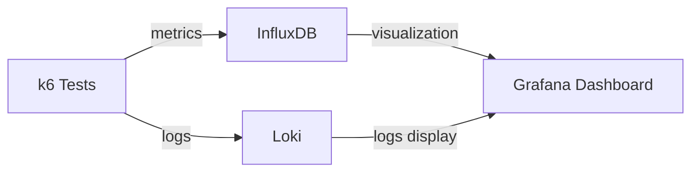

# Grafana k6

## Introduction

Grafana k6 is a powerful, developer-centric, open-source load testing tool designed to make performance testing a productive and enjoyable experience. It's part of the Grafana ecosystem and allows you to test the reliability and performance of your APIs, microservices, and websites under various load conditions.

Unlike traditional performance testing tools that are often complex and resource-intensive, k6 is designed with developers in mind. It uses JavaScript for scripting tests, making it accessible for developers who may not be performance testing specialists.

## Why Use Grafana k6?

Before diving into the how-to, let's understand why k6 is valuable:

- **Developer-first approach**: Write tests in JavaScript/TypeScript
- **Modern architecture**: CLI tool built in Go for resource efficiency
- **Extensible**: Use extensions and custom metrics
- **CI/CD friendly**: Automate testing as part of your pipeline
- **Grafana integration**: Visualize and analyze results within Grafana dashboards

## Getting Started with k6

### Installation

You can install k6 on various platforms:

#### MacOS

```bash
brew install k6
```

#### Windows

```bash
choco install k6
```

#### Linux

```bash
sudo apt-key adv --keyserver hkp://keyserver.ubuntu.com:80 --recv-keys C5AD17C747E3415A3642D57D77C6C491D6AC1D69
echo "deb https://dl.k6.io/deb stable main" | sudo tee /etc/apt/sources.list.d/k6.list
sudo apt-get update
sudo apt-get install k6
```

#### Docker

```bash
docker pull grafana/k6
```

### Your First k6 Test

Let's write a simple k6 test script to check the performance of a website. Create a file named `script.js`:

```javascript
import http from 'k6/http';
import { sleep } from 'k6';

export default function() {
  // Make an HTTP GET request
  const response = http.get('https://test.k6.io');
  
  // Log the response status code
  console.log(`Response status code: ${response.status}`);
  
  // Wait for 1 second before the next iteration
  sleep(1);
}
```

Run the test with:

```bash
k6 run script.js
```

You'll see output similar to:

```
    data_received..................: 17 kB  8.6 kB/s
    data_sent......................: 438 B  221 B/s
    http_req_blocked...............: avg=616.39ms min=0s      med=0s      max=1.85s    p(90)=1.85s    p(95)=1.85s   
    http_req_connecting............: avg=224.13ms min=0s      med=0s      max=672.4ms  p(90)=672.4ms  p(95)=672.4ms 
    http_req_duration..............: avg=270.94ms min=270.94ms med=270.94ms max=270.94ms p(90)=270.94ms p(95)=270.94ms
    http_req_receiving.............: avg=28.9ms   min=28.9ms   med=28.9ms   max=28.9ms   p(90)=28.9ms   p(95)=28.9ms  
    http_req_sending...............: avg=0.29ms   min=0.29ms   med=0.29ms   max=0.29ms   p(90)=0.29ms   p(95)=0.29ms  
    http_req_tls_handshaking.......: avg=351.53ms min=0s      med=0s      max=1.05s    p(90)=1.05s    p(95)=1.05s   
    http_req_waiting...............: avg=241.75ms min=241.75ms med=241.75ms max=241.75ms p(90)=241.75ms p(95)=241.75ms
    http_reqs......................: 1      0.504849/s
    iteration_duration.............: avg=1.98s    min=1.98s    med=1.98s    max=1.98s    p(90)=1.98s    p(95)=1.98s   
    iterations.....................: 1      0.504849/s
    vus............................: 1      min=1 max=1
    vus_max........................: 1      min=1 max=1
```

## Core Concepts

### Virtual Users (VUs)

In k6, virtual users (VUs) are like concurrent users accessing your system. Each VU runs your test script in a separate JavaScript runtime.

```javascript
export const options = {
  vus: 10,        // 10 virtual users
  duration: '30s', // for 30 seconds
};
```

### Test Lifecycle

A k6 test has four lifecycle stages:

1. **init**: Code outside the default function - runs once per VU
2. **setup**: Optional function that runs once before the test
3. **default**: The main function that runs for each VU iteration
4. **teardown**: Optional function that runs once after the test

Here's an example:

```javascript
// init code
import http from 'k6/http';
import { check, sleep } from 'k6';

export const options = {
  vus: 5,
  duration: '10s',
};

export function setup() {
  // setup code (runs once)
  console.log('Setting up the test');
  return { data: 'Test data' };
}

export default function(data) {
  // VU code (runs for each VU iteration)
  console.log('VU iteration with data:', data);
  const res = http.get('https://test.k6.io');
  check(res, { 'status is 200': (r) => r.status === 200 });
  sleep(1);
}

export function teardown(data) {
  // teardown code (runs once)
  console.log('Cleaning up after test');
}
```

## Advanced Features

### Thresholds

Thresholds are pass/fail criteria for your tests. They're useful for CI/CD integration:

```javascript
import http from 'k6/http';
import { check, sleep } from 'k6';

export const options = {
  thresholds: {
    // 99% of requests must finish within 1.5s
    http_req_duration: ['p(99)<1500'],
    // error rate must be less than 1%
    http_req_failed: ['rate<0.01'],
  },
};

export default function() {
  const res = http.get('https://test.k6.io');
  check(res, { 'status is 200': (r) => r.status === 200 });
  sleep(1);
}
```

### Test Types

k6 supports various test types:

#### Load Test

Tests system behavior under normal load:

```javascript
export const options = {
  scenarios: {
    average_load: {
      executor: 'constant-vus',
      vus: 50,
      duration: '5m',
    },
  },
};
```

#### Stress Test

Tests system behavior under peak load:

```javascript
export const options = {
  stages: [
    { duration: '2m', target: 100 }, // ramp up to 100 users
    { duration: '5m', target: 100 }, // stay at 100 for 5 minutes
    { duration: '2m', target: 0 },   // ramp down to 0 users
  ],
};
```

#### Spike Test

Tests system response to sudden traffic spikes:

```javascript
export const options = {
  stages: [
    { duration: '10s', target: 100 },   // quickly ramp up
    { duration: '1m', target: 100 },    // stay at 100
    { duration: '10s', target: 1000 },  // spike to 1000 users
    { duration: '3m', target: 1000 },   // stay at 1000
    { duration: '10s', target: 100 },   // quickly drop to normal
    { duration: '3m', target: 100 },    // stay at normal
    { duration: '10s', target: 0 },     // scale down to 0
  ],
};
```

#### Soak Test

Tests system under sustained load over a long period:

```javascript
export const options = {
  stages: [
    { duration: '2m', target: 400 },  // ramp up
    { duration: '3h', target: 400 },  // stay at 400 for 3 hours
    { duration: '2m', target: 0 },    // scale down
  ],
};
```

### Checks and Groups

Checks are like assertions, and groups help organize tests:

```javascript
import http from 'k6/http';
import { check, group, sleep } from 'k6';

export default function() {
  group('home page', function() {
    const res = http.get('https://test.k6.io/');
    check(res, {
      'status is 200': (r) => r.status === 200,
      'page contains heading': (r) => r.body.includes('Welcome to the k6.io demo site!'),
    });
    sleep(1);
  });
  
  group('about page', function() {
    const res = http.get('https://test.k6.io/about');
    check(res, {
      'status is 200': (r) => r.status === 200,
      'page has correct title': (r) => r.body.includes('<title>About - k6.io demo site</title>'),
    });
    sleep(1);
  });
}
```

## Real-world Example: API Performance Testing

Let's create a more comprehensive example testing a REST API:

```javascript
import http from 'k6/http';
import { check, group, sleep } from 'k6';
import { Counter, Rate, Trend } from 'k6/metrics';

// Custom metrics
const errors = new Counter('errors');
const timeToFirstByte = new Trend('time_to_first_byte');
const successRate = new Rate('success_rate');

export const options = {
  stages: [
    { duration: '1m', target: 50 },   // ramp up to 50 users
    { duration: '2m', target: 50 },   // stay at 50 users for 2 minutes
    { duration: '1m', target: 0 },    // ramp down to 0 users
  ],
  thresholds: {
    http_req_duration: ['p(95)<500'],  // 95% of requests must complete below 500ms
    'success_rate': ['rate>0.95'],     // 95% of requests must be successful
  },
};

const BASE_URL = 'https://test.k6.io';

export default function() {
  // GET request example
  group('Get all products', function() {
    const response = http.get(`${BASE_URL}/api/products`);
    
    // Record time to first byte
    timeToFirstByte.add(response.timings.waiting);
    
    // Check response
    const success = check(response, {
      'status is 200': (r) => r.status === 200,
      'response has data': (r) => r.json().length > 0,
    });
    
    // Update metrics
    successRate.add(success);
    if (!success) {
      errors.add(1);
      console.log(`Error getting products: ${response.status}`);
    }
  });
  
  sleep(1);
  
  // POST request example
  group('Create new product', function() {
    const payload = JSON.stringify({
      name: 'Test Product',
      price: 99.99,
      description: 'A test product created by k6'
    });
    
    const params = {
      headers: {
        'Content-Type': 'application/json',
      },
    };
    
    const response = http.post(
      `${BASE_URL}/api/products`,
      payload,
      params
    );
    
    const success = check(response, {
      'status is 201': (r) => r.status === 201,
      'has product ID': (r) => r.json().id !== undefined,
    });
    
    successRate.add(success);
    if (!success) {
      errors.add(1);
      console.log(`Error creating product: ${response.status}`);
    }
  });
  
  sleep(2);
}
```

## Integration with Grafana

One of the major advantages of k6 is its integration with the Grafana ecosystem. You can visualize your test results in real-time:



### Setup with Docker Compose

Create a `docker-compose.yml` file:

```yaml
version: '3'
services:
  influxdb:
    image: influxdb:1.8
    ports:
      - "8086:8086"
    environment:
      - INFLUXDB_DB=k6

  grafana:
    image: grafana/grafana:latest
    ports:
      - "3000:3000"
    depends_on:
      - influxdb
    environment:
      - GF_AUTH_ANONYMOUS_ENABLED=true
      - GF_AUTH_ANONYMOUS_ORG_ROLE=Admin

  k6:
    image: grafana/k6:latest
    ports:
      - "6565:6565"
    volumes:
      - ./scripts:/scripts
    command: run /scripts/script.js --out influxdb=http://influxdb:8086/k6
    depends_on:
      - influxdb
```

Then run:

```bash
docker-compose up -d influxdb grafana
docker-compose run k6
```

Access Grafana at `http://localhost:3000` and import the k6 dashboard (ID: 2587).

## Best Practices

1. **Start small and scale up**: Begin with a simple test and add complexity gradually
2. **Use realistic scenarios**: Model real user behavior, not just technical endpoints
3. **Monitor resources**: Watch both your test system and the system under test
4. **Version control your tests**: Store tests in your code repository
5. **Separate test data**: Use external data files for test data
6. **Test regularly**: Integrate performance testing into your CI/CD pipeline
7. **Analyze trends**: Look for patterns over time, not just individual test results

## Troubleshooting Common Issues

### Script Errors

If your test script fails with JavaScript errors:

```bash
k6 run --verbose script.js
```

### Resource Limitations

If your machine can't handle the load:

```bash
k6 run --max-vus 10 script.js
```

### Timeouts

For slow responses:

```javascript
export const options = {
  httpDebug: 'full',  // Log HTTP request and response details
  timeout: '60s',     // Increase the global timeout
};
```

## Summary

Grafana k6 is a powerful, developer-friendly load testing tool that helps you ensure your applications perform well under various conditions. With its JavaScript-based scripting, easy integration with the Grafana ecosystem, and various test types, it provides everything you need to implement robust performance testing in your development workflow.

By incorporating k6 into your testing process, you can:

- Catch performance issues early in development
- Establish performance baselines
- Test capacity limits of your systems
- Ensure reliability under various load conditions
- Integrate performance testing into your CI/CD pipeline

## Additional Resources

- [Official k6 Documentation](https://k6.io/docs/)
- [k6 GitHub Repository](https://github.com/grafana/k6)
- [Grafana k6 Cloud](https://k6.io/cloud/) (commercial offering)
- [k6 Community Forum](https://community.k6.io/)

## Exercises

1. Create a basic load test for a website of your choice with 10 VUs for 30 seconds.
2. Modify the test to include checks for response status and response time.
3. Set up thresholds to fail the test if 95th percentile response time exceeds 500ms.
4. Create a stress test that gradually increases load from 0 to 100 VUs and back down.
5. Integrate your test with Grafana for visualization using the Docker Compose setup provided.