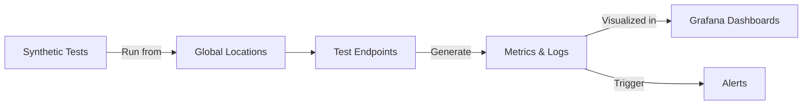

# Grafana Synthetic Monitoring

## Introduction

Grafana Synthetic Monitoring is a powerful tool in the Grafana ecosystem that allows you to proactively test your applications and APIs from multiple global locations. Unlike traditional monitoring that waits for users to encounter issues, synthetic monitoring simulates user interactions to detect problems before they impact real users. It works by scheduling regular checks that verify if your applications are functioning correctly, responding within acceptable time limits, and delivering the expected content.

In this guide, we'll explore how Synthetic Monitoring works, how to set it up, and how to use it effectively to ensure your applications are always performing optimally.

## What is Synthetic Monitoring?

Synthetic Monitoring creates artificial but realistic user interactions with your applications to test their availability, performance, and functionality. These "synthetic" tests run continuously from various locations around the world, providing you with consistent data about your application's health and performance.



### Key Benefits

- **Proactive Detection**: Find issues before your users do
- **Global Coverage**: Test from multiple geographic locations
- **Consistent Monitoring**: Regular checks at specified intervals
- **Baseline Performance**: Establish performance benchmarks
- **Alert Integration**: Immediate notifications when tests fail
- **Detailed Metrics**: Track availability, response times, and content validity

## Getting Started with Synthetic Monitoring

Synthetic Monitoring is part of Grafana Cloud, and to use it, you'll need a Grafana Cloud account. Let's walk through the setup process and create our first synthetic check.

### Prerequisites

- A Grafana Cloud account
- Endpoints or applications that you want to monitor
- Basic understanding of HTTP/HTTPS protocols (for API checks)

### Setting Up Synthetic Monitoring

1. Log into your Grafana Cloud account
2. Navigate to the Synthetic Monitoring section
3. Configure your first check by following these steps:

```javascript
// Example configuration for a basic HTTP check
const httpCheck = {
  job: "website-homepage",
  target: "https://example.com",
  frequency: 60000, // Check every minute (in milliseconds)
  timeout: 5000,    // 5-second timeout
  probes: ["NorthAmerica", "Europe", "Asia"],
  settings: {
    http: {
      method: "GET",
      ipVersion: "V4",
      validStatusCodes: [200],
      validateCertificate: true,
    }
  }
};
```

## Types of Synthetic Checks

Grafana Synthetic Monitoring offers several types of checks to monitor different aspects of your applications:

### HTTP Checks

HTTP checks verify that your websites and APIs are responding correctly. You can test for specific status codes, response times, and even check the content of responses.

```javascript
// HTTP check example with content verification
const apiCheck = {
  job: "api-health-check",
  target: "https://api.example.com/health",
  frequency: 30000, // Check every 30 seconds
  probes: ["NorthAmerica", "Europe"],
  settings: {
    http: {
      method: "GET",
      headers: { "Authorization": "Bearer ${SECURE_TOKEN}" },
      validStatusCodes: [200],
      validateResponseBody: true,
      expectedResponseMatch: "\"status\":\"healthy\""
    }
  }
};
```

### Ping Checks

Ping checks test basic network connectivity to your servers, measuring latency and packet loss.

```javascript
// Ping check example
const pingCheck = {
  job: "server-ping",
  target: "server.example.com",
  frequency: 60000,
  probes: ["NorthAmerica", "Europe", "Asia", "Australia"],
  settings: {
    ping: {
      ipVersion: "V4",
      dontFragment: false,
      packetCount: 5
    }
  }
};
```

### DNS Checks

DNS checks verify that your domain name resolution is working correctly, ensuring users can find your applications.

```javascript
// DNS check example
const dnsCheck = {
  job: "domain-dns-check",
  target: "example.com",
  frequency: 300000, // Check every 5 minutes
  probes: ["NorthAmerica", "Europe"],
  settings: {
    dns: {
      recordType: "A",
      server: "8.8.8.8", // Google's DNS server
      ipVersion: "V4",
      validateAnswerRRS: true,
      validateAuthority: false,
      validateAdditional: false
    }
  }
};
```

### TCP Checks

TCP checks test if specific ports on your servers are open and responding correctly.

```javascript
// TCP check example
const tcpCheck = {
  job: "database-connection-check",
  target: "db.example.com:5432", // PostgreSQL port
  frequency: 60000,
  probes: ["NorthAmerica", "Europe"],
  settings: {
    tcp: {
      ipVersion: "V4",
      tls: true,
      tlsServerName: "db.example.com"
    }
  }
};
```

### Traceroute Checks

Traceroute checks map the network path between the probes and your endpoints, helping identify routing issues.

```javascript
// Traceroute check example
const tracerouteCheck = {
  job: "network-path-analysis",
  target: "api.example.com",
  frequency: 3600000, // Every hour
  probes: ["NorthAmerica", "Europe"],
  settings: {
    traceroute: {
      maxHops: 30,
      maxUnknownHops: 15,
      packetCount: 3
    }
  }
};
```

## Advanced Configuration

### Using Variables in Checks

You can use variables to make your checks more dynamic and reusable:

```javascript
// Using variables in HTTP check
const dynamicApiCheck = {
  job: "${API_NAME}-health-check",
  target: "https://api.example.com/${API_PATH}",
  frequency: ${CHECK_FREQUENCY},
  probes: ${SELECTED_PROBES},
  settings: {
    http: {
      method: "GET",
      headers: { 
        "Authorization": "Bearer ${SECURE_TOKEN}",
        "x-api-version": "${API_VERSION}"
      }
    }
  }
};
```

### Setting up Alerting

Configure alerts to notify you when checks fail:

```javascript
// Alert rule configuration
const alertRule = {
  name: "API Availability Alert",
  condition: "avg(synthetic_http_duration_seconds) > 2 OR min(synthetic_http_success) < 1",
  for: "5m",
  labels: {
    severity: "critical"
  },
  annotations: {
    summary: "API is unavailable or responding slowly",
    description: "The API check has failed or exceeded the response time threshold for more than 5 minutes."
  },
  notifications: [
    {
      uid: "slack-notifications"
    }
  ]
};
```

## Real-World Examples

### Monitoring a Multi-Region Web Application

Let's say you have a web application deployed in multiple regions and want to ensure it's available globally:

```javascript
// Multi-region web app monitoring
const regions = ["us-east", "us-west", "eu-central", "ap-southeast"];

const multiRegionChecks = regions.map(region => ({
  job: `web-app-${region}`,
  target: `https://${region}.app.example.com/health`,
  frequency: 60000,
  probes: ["NorthAmerica", "Europe", "Asia", "Australia"],
  settings: {
    http: {
      method: "GET",
      validStatusCodes: [200],
      validateResponseBody: true,
      expectedResponseMatch: "\"region\":\"${region}\""
    }
  }
}));
```

### E-commerce Checkout Flow Monitoring

For an e-commerce site, you might want to test the entire checkout flow:

```javascript
// E-commerce checkout flow monitoring
const checkoutFlowCheck = {
  job: "checkout-flow-test",
  target: "https://shop.example.com",
  frequency: 300000, // Every 5 minutes
  probes: ["NorthAmerica", "Europe"],
  settings: {
    http: {
      method: "POST",
      headers: {
        "Content-Type": "application/json"
      },
      body: JSON.stringify({
        steps: [
          {
            url: "/api/cart/add",
            method: "POST",
            body: { productId: "12345", quantity: 1 }
          },
          {
            url: "/api/checkout/init",
            method: "POST"
          },
          {
            url: "/api/checkout/payment",
            method: "POST",
            body: { paymentMethod: "test" }
          },
          {
            url: "/api/checkout/confirm",
            method: "POST"
          }
        ]
      }),
      validStatusCodes: [200],
      validateResponseBody: true,
      expectedResponseMatch: "\"orderStatus\":\"success\""
    }
  }
};
```

## Visualizing Synthetic Monitoring Data

Once your checks are running, you'll want to visualize the data in Grafana dashboards. Synthetic Monitoring includes pre-built dashboards, but you can also create custom dashboards to focus on specific metrics.

Here's an example of how to query synthetic monitoring data in a Grafana dashboard:

```javascript
// Prometheus query examples for Synthetic Monitoring
const queries = [
  // Availability by probe
  'sum(synthetic_http_success) by (probe, instance)',
  
  // Response time by probe
  'avg(synthetic_http_duration_seconds) by (probe, instance)',
  
  // Status code distribution
  'sum(synthetic_http_response_code) by (code, instance)',
  
  // SSL certificate expiry
  'synthetic_ssl_tls_cert_not_after - time()'
];
```

## Best Practices

1. **Start with critical paths**: Focus first on monitoring the most important user journeys
2. **Choose appropriate intervals**: Balance frequency with resource usage
3. **Select strategic probe locations**: Pick locations relevant to your user base
4. **Set meaningful thresholds**: Establish realistic performance expectations
5. **Use multiple check types**: Combine HTTP, ping, and other checks for comprehensive coverage
6. **Include assertions**: Verify response content, not just status codes
7. **Set up detailed alerting**: Configure alerts with actionable information
8. **Review regularly**: Adjust checks as your application evolves

## Troubleshooting Common Issues

### Check Failures

If your synthetic checks are failing, follow these troubleshooting steps:

1. **Verify endpoint accessibility**: Ensure the target is publicly accessible
2. **Check authentication**: Confirm credentials are valid and properly configured
3. **Review network settings**: Check firewall rules and network paths
4. **Inspect SSL certificates**: Verify certificates are valid and trusted
5. **Analyze response content**: Check if response body matches expectations

### Performance Issues

For performance-related problems:

1. **Examine response times by region**: Look for geographic patterns
2. **Compare with real user metrics**: See if synthetic and real user data correlate
3. **Check for third-party dependencies**: Identify if external services are causing delays
4. **Review resource utilization**: Ensure your infrastructure isn't overloaded
5. **Test during different time periods**: Look for time-based patterns

## Summary

Grafana Synthetic Monitoring provides a powerful way to proactively test and monitor your applications from multiple locations around the world. By simulating user interactions, you can detect issues before they impact real users, establish performance baselines, and ensure consistent global availability.

In this guide, we've covered:
- The fundamentals of synthetic monitoring
- How to set up various types of checks
- Advanced configuration options
- Real-world monitoring scenarios
- Visualization techniques
- Best practices and troubleshooting strategies

By implementing synthetic monitoring as part of your observability strategy, you can gain confidence in your application's reliability and performance, leading to a better user experience and fewer production incidents.

## Further Learning Resources

To deepen your knowledge of Grafana Synthetic Monitoring, consider exploring:

- The official Grafana documentation on Synthetic Monitoring
- Webinars and workshops on observability strategies
- Community forums for real-world implementation stories
- Advanced alert configuration techniques
- Integration with other observability tools

## Exercises

1. Set up a basic HTTP check for your website's homepage
2. Create a multi-step check that tests a user login flow
3. Configure alerts for response time degradation
4. Build a custom dashboard that shows synthetic monitoring metrics alongside real user metrics
5. Implement checks from multiple geographic regions and compare performance