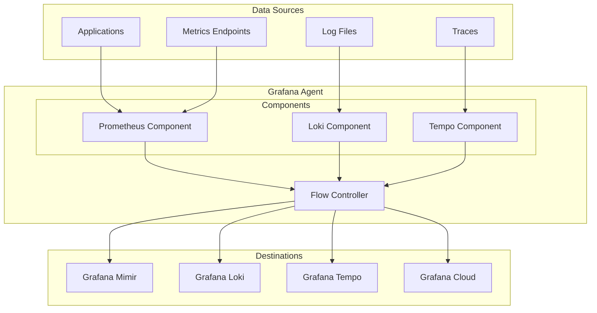

# Grafana Agent

## Introduction

Grafana Agent is a lightweight, efficient telemetry collector that's designed to gather observability data and forward it to Grafana-compatible backends. It's an integral part of the Grafana ecosystem that helps solve the challenging problem of collecting metrics, logs, and traces from various sources and reliably delivering them to observability platforms.

Compared to other collectors like Prometheus or Telegraf, Grafana Agent is specifically optimized for cloud-native environments and for forwarding data to Grafana Cloud or Grafana Enterprise Stack. It's built with efficiency and minimal resource consumption in mind, making it ideal for both Kubernetes environments and traditional infrastructure.

## Why Use Grafana Agent?

Grafana Agent offers several advantages for modern observability pipelines:

1. **Resource Efficiency**: Uses significantly less memory than a full Prometheus server when scraping the same targets
2. **Cloud Native**: Designed from the ground up for cloud environments and dynamic infrastructure
3. **Unified Collection**: Collects metrics, logs, and traces in a single agent
4. **Integration**: Seamlessly works with Grafana Loki, Mimir/Cortex, Tempo, and other Grafana backends
5. **Configurability**: Flexible configuration options for different deployment scenarios

## Grafana Agent Architecture

Grafana Agent follows a modular architecture built around different "components" that handle different types of telemetry data. Let's look at its high-level architecture:



The agent provides specialized components for each telemetry type:

- **Prometheus Component**: Collects and forwards metrics data
- **Loki Component**: Collects and forwards logs
- **Tempo Component**: Collects and forwards traces
- **Flow Controller**: Coordinates data flow and ensures efficient processing

## Grafana Agent Modes

Grafana Agent can operate in two primary modes:

1. **Static Mode**: The original, configuration-file based approach
2. **Flow Mode**: A newer, more flexible mode based on a graph of components

For beginners, Static Mode is often easier to get started with, but Flow Mode offers more flexibility and power for complex setups.

## Getting Started with Grafana Agent

Let's walk through setting up Grafana Agent in Static Mode to collect metrics from a simple system.

### Installation

You can install Grafana Agent on Linux using the official repository:

```bash
sudo apt-get update
sudo apt-get install -y software-properties-common
sudo add-apt-repository "deb https://packages.grafana.com/agent/deb stable main"
wget -q -O - https://packages.grafana.com/gpg.key | sudo apt-key add -
sudo apt-get update
sudo apt-get install -y grafana-agent
```

For macOS, you can use Homebrew:

```bash
brew install grafana-agent
```

For other platforms, you can download the binary from the [Grafana website](https://grafana.com/docs/agent/latest/installation/).

### Basic Configuration

Let's create a simple configuration file to collect system metrics. Create a file named `agent-config.yaml`:

```yaml
server:
  http_listen_port: 12345

metrics:
  global:
    scrape_interval: 15s
    external_labels:
      cluster: 'demo'
  
  configs:
    - name: local
      scrape_configs:
        - job_name: node
          static_configs:
            - targets: ['localhost:9100']
      
      remote_write:
        - url: https://prometheus-us-central1.grafana.net/api/prom/push
          basic_auth:
            username: YOUR_USERNAME
            password: YOUR_API_KEY
```

This configuration:
1. Sets up an HTTP server on port 12345
2. Configures metrics collection every 15 seconds
3. Targets the Node Exporter on localhost port 9100
4. Forwards the metrics to Grafana Cloud (replace the URL, username, and API key with your own)

### Starting Grafana Agent

With the configuration file in place, you can start Grafana Agent:

```bash
grafana-agent --config.file=agent-config.yaml
```

You should see output indicating that the agent has started and is scraping metrics.

## Collecting Different Telemetry Types

Grafana Agent can collect all three major types of telemetry data. Let's look at how to configure each.

### Metrics Collection

Metrics collection is done through the Prometheus component. Here's a more comprehensive example:

```yaml
metrics:
  global:
    scrape_interval: 15s
  
  configs:
    - name: infrastructure
      scrape_configs:
        - job_name: node
          static_configs:
            - targets: ['localhost:9100']
        
        - job_name: mysql
          static_configs:
            - targets: ['db-server:9104']
      
      remote_write:
        - url: https://prometheus-us-central1.grafana.net/api/prom/push
          basic_auth:
            username: YOUR_USERNAME
            password: YOUR_API_KEY
```

This configuration collects metrics from both the Node Exporter and a MySQL server.

### Logs Collection

For logs, you'll use the Loki component:

```yaml
logs:
  configs:
  - name: default
    positions:
      filename: /tmp/positions.yaml
    
    scrape_configs:
      - job_name: system
        static_configs:
          - targets: [localhost]
            labels:
              job: varlogs
              __path__: /var/log/*log
    
    clients:
      - url: https://logs-prod-us-central1.grafana.net/loki/api/v1/push
        basic_auth:
          username: YOUR_USERNAME
          password: YOUR_API_KEY
```

This configuration collects logs from the `/var/log` directory and forwards them to Grafana Loki.

### Traces Collection

For traces, use the Tempo component:

```yaml
traces:
  configs:
  - name: default
    receivers:
      jaeger:
        protocols:
          thrift_http:
            endpoint: 0.0.0.0:14268
    
    remote_write:
      - endpoint: tempo-us-central1.grafana.net:443
        basic_auth:
          username: YOUR_USERNAME
          password: YOUR_API_KEY
```

This sets up a Jaeger receiver for traces and forwards them to Grafana Tempo.

## Working with Grafana Agent Flow

Grafana Agent Flow is the newer mode that uses a component graph approach. Here's a simple example of a Flow configuration:

```river
prometheus.scrape "default" {
    targets = [
        {"__address__" = "localhost:9100", "job" = "node"},
    ]
    forward_to = [prometheus.remote_write.grafana.receiver]
}

prometheus.remote_write "grafana" {
    endpoint {
        url = "https://prometheus-us-central1.grafana.net/api/prom/push"
        basic_auth {
            username = "YOUR_USERNAME"
            password = "YOUR_API_KEY"
        }
    }
}
```

This Flow configuration is written in River, a domain-specific language designed for Grafana Agent Flow. It defines a component that scrapes metrics and forwards them to a remote write component.

To run Grafana Agent in Flow mode:

```bash
grafana-agent run --server.http.listen-addr=:12345 flow.river
```

## Integration with Grafana Dashboard

Once you have Grafana Agent collecting and forwarding telemetry data, you can visualize it in Grafana. Here's a simple example of creating a dashboard for node metrics:

1. Log in to your Grafana instance
2. Click on "Create" and select "Dashboard"
3. Click "Add new panel"
4. In the query editor, select your Prometheus data source
5. Enter a query like `node_cpu_seconds_total{mode="idle"}`
6. Customize the visualization as needed
7. Save your dashboard

## Use Cases and Real-World Examples

### Monitoring Kubernetes Clusters

Grafana Agent can be deployed as a DaemonSet in Kubernetes to collect metrics, logs, and traces from all nodes:

```yaml
apiVersion: apps/v1
kind: DaemonSet
metadata:
  name: grafana-agent
  namespace: monitoring
spec:
  selector:
    matchLabels:
      name: grafana-agent
  template:
    metadata:
      labels:
        name: grafana-agent
    spec:
      containers:
      - name: grafana-agent
        image: grafana/agent:v0.28.0
        args:
        - --config.file=/etc/agent/agent.yaml
        volumeMounts:
        - name: config
          mountPath: /etc/agent
      volumes:
      - name: config
        configMap:
          name: grafana-agent-config
```

This DaemonSet runs Grafana Agent on every node in your cluster, collecting telemetry data from all running workloads.

### Monitoring Microservices

For a microservice architecture, you might configure Grafana Agent to collect:

1. **Metrics**: HTTP request rates, latencies, and error rates
2. **Logs**: Application logs and access logs
3. **Traces**: Cross-service request traces

Example metrics queries for a microservice dashboard:

- Request Rate: `sum(rate(http_requests_total{service="api"}[5m])) by (endpoint)`
- Error Rate: `sum(rate(http_requests_total{service="api", status_code=~"5.."}[5m])) / sum(rate(http_requests_total{service="api"}[5m]))`
- Latency: `histogram_quantile(0.95, sum(rate(http_request_duration_seconds_bucket{service="api"}[5m])) by (le, endpoint))`

## Best Practices

When working with Grafana Agent, consider these best practices:

1. **Resource Allocation**: Allocate appropriate resources based on the volume of data collected
2. **Security**: Use secure credential management and least privilege principles
3. **High Availability**: Deploy multiple agent instances for critical environments
4. **Scrape Intervals**: Balance between data granularity and resource usage
5. **Labels**: Use consistent and meaningful labels for easier querying
6. **Filtering**: Filter data at the source to reduce storage and transfer costs

## Troubleshooting

Common issues with Grafana Agent and how to resolve them:

### Agent Not Starting

Check the logs for errors:

```bash
journalctl -u grafana-agent
```

Common causes include configuration syntax errors or permission issues.

### Missing Data

1. Verify the agent is running: `ps aux | grep grafana-agent`
2. Check if endpoints are reachable: `curl http://localhost:9100/metrics`
3. Examine agent metrics: `curl http://localhost:12345/metrics`
4. Verify remote write configuration is correct

### High Resource Usage

If the agent is consuming too many resources:

1. Increase scrape intervals
2. Reduce the number of targets
3. Apply more selective relabeling to filter metrics
4. Use resource limits in containerized environments

## Summary

Grafana Agent is a powerful and efficient tool for collecting telemetry data and forwarding it to Grafana-compatible backends. Its lightweight design makes it ideal for cloud environments, while its flexibility allows it to handle a wide range of monitoring scenarios.

Key points covered:
- Grafana Agent architecture and components
- Static vs Flow operation modes
- Configuration for metrics, logs, and traces collection
- Real-world deployment scenarios
- Best practices and troubleshooting

By integrating Grafana Agent into your observability pipeline, you can efficiently collect, process, and analyze telemetry data, providing valuable insights into your systems and applications.

## Further Learning

To deepen your understanding of Grafana Agent:

1. Explore advanced configuration options in the [official documentation](https://grafana.com/docs/agent/latest/)
2. Learn about integrating with other Grafana products like Mimir, Loki, and Tempo
3. Experiment with Grafana Agent Flow for more flexible telemetry pipelines
4. Practice setting up different exporters to collect metrics from various services

## Exercises

1. Install Grafana Agent and configure it to collect system metrics from your local machine
2. Modify the configuration to collect logs from a specific application
3. Deploy Grafana Agent to a Kubernetes cluster using Helm
4. Create a Grafana dashboard to visualize the metrics collected by the agent
5. Experiment with Grafana Agent Flow to create a custom pipeline for metrics processing