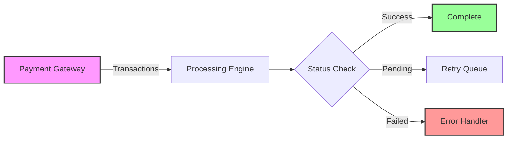

# Grafana Enterprise

## Introduction

Grafana Enterprise is the premium offering in the Grafana ecosystem, designed for organizations that need advanced monitoring, enhanced security, scalability, and dedicated support. While Grafana Open Source provides powerful visualization and monitoring capabilities, Grafana Enterprise extends these capabilities with features tailored for large-scale enterprise deployments.

In this guide, we'll explore what Grafana Enterprise offers, how it differs from the open-source version, and how to leverage its unique features to enhance your organization's observability strategy.

## What is Grafana Enterprise?

Grafana Enterprise is a commercial edition of Grafana that builds upon the open-source foundation with enterprise-grade features. It's designed for organizations that:

- Require enhanced security and access controls
- Need to scale monitoring across large teams
- Want access to premium data source plugins
- Need professional support and SLAs
- Have compliance and reporting requirements

Let's explore these features in detail.

## Key Features of Grafana Enterprise

### 1. Enhanced Authentication and Authorization

Grafana Enterprise provides advanced authentication options and fine-grained access controls:

```jsx
// Example configuration for SAML authentication in Grafana Enterprise
[auth.saml]
enabled = true
certificate_path = "path/to/certificate.cert"
private_key_path = "path/to/private_key.key"
idp_metadata_path = "path/to/metadata.xml"
assertion_attribute_name = "displayName"
assertion_attribute_login = "mail"
assertion_attribute_email = "mail"
```

This advanced authentication system allows you to:

- Configure Team Sync with auth providers
- Implement enhanced LDAP integration
- Set up SAML and OAuth authentication
- Create role-based access control (RBAC)
- Apply fine-grained dashboard and folder permissions

### 2. Enterprise Data Source Plugins

One of the most valuable features of Grafana Enterprise is access to premium data source plugins, enabling you to connect to a wide variety of enterprise data systems:

| Enterprise Data Sources | Use Case |
|-------------------------|----------|
| Splunk | Correlate logs and metrics |
| ServiceNow | IT service management dashboards |
| Dynatrace | Application performance monitoring |
| Oracle Database | Database performance monitoring |
| SAP HANA | Business intelligence visualization |
| MongoDB | NoSQL database monitoring |
| DataDog | Cross-platform observability |
| New Relic | APM integration |
| AppDynamics | Application monitoring |

To configure an enterprise data source:

```jsx
// Example for connecting to a Splunk enterprise data source
{
  "name": "Splunk Production",
  "type": "grafana-splunk-datasource",
  "url": "https://splunk.example.com:8089",
  "access": "proxy",
  "basicAuth": true,
  "basicAuthUser": "${SPLUNK_USER}",
  "secureJsonData": {
    "basicAuthPassword": "${SPLUNK_PASSWORD}"
  }
}
```

### 3. Reporting and Export Capabilities

Grafana Enterprise includes features for creating and scheduling reports:

```jsx
// Example API call to generate a dashboard report
POST /api/reports
{
  "dashboardId": 1,
  "title": "Monthly Performance Report",
  "schedule": {
    "frequency": "monthly",
    "dayOfMonth": 1,
    "timeZone": "America/New_York",
    "startDate": "2023-01-01",
    "endDate": "2024-01-01"
  },
  "formats": ["pdf"],
  "recipients": [
    {
      "type": "email",
      "address": "team@example.com"
    }
  ]
}
```

This allows you to:
- Generate PDF reports of dashboards
- Schedule recurring reports
- Email reports to stakeholders automatically
- Export dashboards to various formats

### 4. White-Labeling and Customization

For organizations that need to align Grafana with their brand identity:

```jsx
// Custom branding configuration example
[white_labeling]
app_title = "Acme Monitoring"
login_logo = "public/img/acme_logo.svg"
login_background = "public/img/acme_background.svg"
menu_logo = "public/img/acme_menu_logo.svg"
favicon = "public/img/favicon.png"
```

These customization options help create a consistent brand experience across your monitoring platform.

## Real-World Implementation of Grafana Enterprise

Let's walk through a practical example of implementing Grafana Enterprise in a large financial services organization:

### Case Study: Financial Services Monitoring

Imagine a financial institution using Grafana Enterprise to monitor their transaction processing system. They need to:

1. Integrate with multiple data sources
2. Enforce strict access controls
3. Generate automated compliance reports
4. Scale across global teams

#### Step 1: Setting up Data Source Integrations

```jsx
// Configuration for Oracle database monitoring
{
  "name": "Transaction Database",
  "type": "grafana-oracle-datasource",
  "url": "oracle.example.com:1521/FINPROD",
  "access": "proxy",
  "jsonData": {
    "connectorType": "service_name",
    "database": "FINPROD"
  },
  "secureJsonData": {
    "password": "${DB_PASSWORD}"
  }
}
```

#### Step 2: Creating Role-Based Access Controls

```jsx
// Example RBAC configuration for different teams
[
  {
    "roleUID": "transaction_team",
    "name": "Transaction Monitoring Team",
    "description": "Can view and edit transaction dashboards",
    "permissions": [
      {
        "action": "dashboards:read",
        "scope": "dashboards:uid:tx*"
      },
      {
        "action": "dashboards:write",
        "scope": "dashboards:uid:tx*"
      }
    ],
    "version": 1
  }
]
```

#### Step 3: Building a Transaction Monitoring Dashboard

Let's visualize the system with a Mermaid diagram:



#### Step 4: Setting Up Automated Reporting

With the Enterprise reporting capabilities, the organization sets up daily transaction summary reports sent to stakeholders:

```jsx
// Report configuration example
{
  "dashboardUid": "tx-summary-dash",
  "title": "Daily Transaction Summary",
  "schedule": {
    "frequency": "daily",
    "timeOfDay": "07:00",
    "timeZone": "America/New_York"
  },
  "formats": ["pdf", "csv"],
  "recipients": [
    {"type": "email", "address": "finance-team@example.com"},
    {"type": "email", "address": "compliance@example.com"}
  ]
}
```

## Enterprise Features for Enhanced Observability

### Usage Insights and Analytics

Grafana Enterprise provides visibility into how your dashboards are being used:

```jsx
// Example API call to retrieve dashboard usage statistics
GET /api/reports/usage
{
  "from": "2023-01-01",
  "to": "2023-01-31",
  "dashboardId": 123
}
```

This helps you:
- Identify the most viewed dashboards
- Understand user behavior patterns
- Optimize resource usage
- Make data-driven decisions about dashboard improvements

### High Availability and Load Balancing

For mission-critical monitoring environments, Grafana Enterprise supports:

```jsx
// High availability configuration example
[cluster]
enabled = true
advertise_address = "10.0.1.10"
gossip_port = 9094
push_pull_port = 9095
```

This configuration allows you to:
- Set up multiple Grafana instances
- Ensure failover capability
- Distribute user load
- Maintain continuous monitoring

## Comparing Grafana Open Source vs Enterprise

| Feature | Grafana Open Source | Grafana Enterprise |
|---------|---------------------|-------------------|
| Visualizations | Core visualizations | Enhanced visualizations + Data source plugins |
| Authentication | Basic auth options | Advanced auth + SSO + SAML |
| Access Control | Basic permissions | Fine-grained RBAC |
| Support | Community | SLA-backed professional support |
| Reporting | None | PDF exports and scheduling |
| White-labeling | Limited | Full customization |
| Data Sources | Open source only | Enterprise plugins included |
| Usage Analytics | Basic | Advanced insights |

## Getting Started with Grafana Enterprise

### Licensing and Installation

To get started with Grafana Enterprise:

1. Contact Grafana Labs sales for licensing
2. Obtain your license key
3. Install Grafana using your preferred method
4. Apply the license key:

```jsx
// Adding enterprise license via API
POST /api/licensing/token
{
  "token": "eyJhbGciOiJIUzI1NiIsInR5cCI6IkpXVCJ9..."
}
```

Or add it to your configuration:

```jsx
[enterprise]
license_text = "eyJhbGciOiJIUzI1NiIsInR5cCI6IkpXVCJ9..."
```

### Migrating from Open Source

If you're already using Grafana Open Source, migration to Enterprise is straightforward:

1. Back up your existing configuration
2. Install Grafana Enterprise over your existing installation
3. Apply your enterprise license
4. Configure enterprise features as needed

```bash
# Example backup commands before migration
mkdir grafana-backup
cp -r /var/lib/grafana grafana-backup/data
cp /etc/grafana/grafana.ini grafana-backup/
```

## Best Practices for Grafana Enterprise

### 1. Organization and Folder Structure

Implement a consistent folder structure for dashboards:

```
├── Executive Dashboards/
│   ├── Business KPIs
│   └── Summary Views
├── Department Dashboards/
│   ├── Engineering
│   ├── Operations
│   └── Finance
└── Technical Dashboards/
    ├── System Performance
    ├── Application Metrics
    └── Network Monitoring
```

### 2. Team Management

Use team synchronization with your identity provider:

```jsx
// Example team sync configuration with LDAP
[[servers.group_mappings]]
group_dn = "cn=grafana_admins,dc=example,dc=com"
org_role = "Admin"
grafana_admin = true

[[servers.group_mappings]]
group_dn = "cn=grafana_editors,dc=example,dc=com"
org_role = "Editor"

[[servers.group_mappings]]
group_dn = "cn=grafana_viewers,dc=example,dc=com"
org_role = "Viewer"
```

### 3. Data Source Management

Implement a consistent naming convention for data sources:

```
[Environment]-[Type]-[Purpose]

Examples:
- PROD-Oracle-FinanceDB
- DEV-Prometheus-APIMetrics
- STAGING-Elasticsearch-Logs
```

## Summary

Grafana Enterprise extends the powerful visualization and monitoring capabilities of Grafana Open Source with features designed for large organizations. With enterprise data source plugins, enhanced authentication, reporting capabilities, and professional support, it provides a comprehensive solution for organizations with complex monitoring requirements.

Key takeaways:

1. Grafana Enterprise builds on Grafana Open Source with premium features
2. Enterprise data source plugins connect to a wide range of proprietary systems
3. Enhanced security features provide fine-grained access control
4. Reporting capabilities enable automated dashboard distribution
5. White-labeling allows for brand customization
6. Professional support ensures reliability for mission-critical deployments

## Additional Resources

To continue your learning journey:

- Practice implementing RBAC for different teams in your organization
- Experiment with setting up scheduled reports for key dashboards
- Explore the enterprise data sources that align with your technology stack
- Review your current monitoring architecture and identify areas where Grafana Enterprise features could add value

Remember that Grafana Enterprise is just one part of the broader Grafana ecosystem, working alongside Grafana Cloud, Loki, Tempo, and Mimir to provide a complete observability solution.