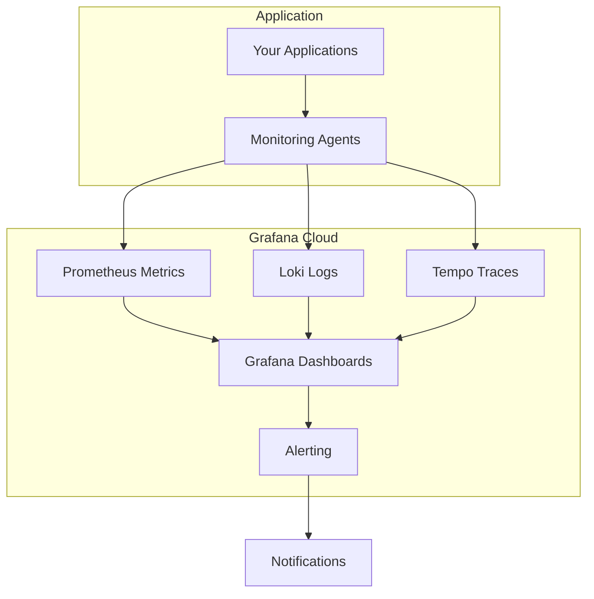

# Grafana Cloud

## Introduction

Grafana Cloud is a fully managed observability platform that provides hosted versions of Grafana, Prometheus, Loki, and other tools in the Grafana ecosystem. It offers a scalable, secure, and maintenance-free solution for organizations looking to implement comprehensive monitoring and observability without managing the underlying infrastructure themselves.

As a cloud-based offering from Grafana Labs, Grafana Cloud combines the power of multiple open-source projects into a unified, easy-to-use platform that allows teams to focus on analyzing their data rather than maintaining complex monitoring systems.

## What is Grafana Cloud?

Grafana Cloud is a Software-as-a-Service (SaaS) offering that provides:

- **Hosted Grafana**: A fully managed instance of Grafana with automatic updates and maintenance
- **Integrated data sources**: Pre-configured connections to Prometheus, Loki, and Tempo
- **Metrics, logs, and traces**: Complete observability across your entire stack
- **Team collaboration**: Built-in user management, permissions, and sharing capabilities
- **Enterprise-grade security**: SOC2 compliance, data encryption, and authentication options

Let's visualize how Grafana Cloud fits into the broader observability ecosystem:



## Getting Started with Grafana Cloud

### Creating a Grafana Cloud Account

To begin using Grafana Cloud, you'll need to sign up for an account:

1. Visit the [Grafana Cloud website](https://grafana.com/cloud)
2. Click on "Create a Free Account"
3. Choose between the Free, Pro, or Advanced plans based on your needs
4. Complete the registration process

Once your account is set up, you'll have access to your Grafana Cloud portal, which serves as the central hub for managing your observability stack.

### Understanding Grafana Cloud Tiers

Grafana Cloud offers several pricing tiers to accommodate different needs:

- **Free tier**: Perfect for individuals or small projects with limited metrics, logs, and traces
- **Pro tier**: Designed for teams with greater data needs and longer retention requirements
- **Advanced tier**: Enterprise-grade offering with high-volume data ingestion and premium features
- **Enterprise tier**: Custom solutions for large organizations with specific requirements

Each tier provides different limits for metrics, logs, traces, and retention periods.

## Key Components of Grafana Cloud

### Hosted Grafana

The core of Grafana Cloud is a fully managed Grafana instance. This provides:

- Always up-to-date software with the latest features
- Pre-configured data sources for quick setup
- Built-in dashboards and templates
- Automated backups and high availability

Here's how to create your first dashboard in Grafana Cloud:

```javascript
// This is a simple JSON model for a Grafana dashboard
// You would typically create dashboards through the UI, but this shows the structure
{
  "dashboard": {
    "id": null,
    "title": "My First Dashboard",
    "tags": ["demo", "getting-started"],
    "timezone": "browser",
    "panels": [
      {
        "id": 1,
        "type": "graph",
        "title": "CPU Usage",
        "datasource": "Prometheus",
        "targets": [
          {
            "expr": "rate(node_cpu_seconds_total{mode=\"user\"}[1m])",
            "legendFormat": "{{instance}} - CPU User",
            "refId": "A"
          }
        ]
      }
    ],
    "refresh": "10s"
  }
}
```

### Grafana Metrics (Prometheus)

Grafana Cloud includes a hosted Prometheus service for metric collection and storage:

- Scalable time-series database for metrics
- PromQL support for powerful querying
- Long-term storage options with configurable retention
- Agent configurations for different platforms

Example of sending metrics to Grafana Cloud using Prometheus:

```bash
# Example Prometheus configuration to remote_write to Grafana Cloud
global:
  scrape_interval: 15s

scrape_configs:
  - job_name: 'node'
    static_configs:
      - targets: ['localhost:9100']

remote_write:
  - url: https://prometheus-prod-10-prod-us-east-0.grafana.net/api/prom/push
    basic_auth:
      username: '12345'
      password: 'your-grafana-cloud-api-key'
```

### Grafana Logs (Loki)

Grafana Cloud includes Loki, a log aggregation system designed to work seamlessly with Grafana:

- Efficient log storage using labels
- LogQL query language for searching and filtering logs
- Integration with existing logging agents
- Correlation between logs and metrics

Example of sending logs to Grafana Cloud using Promtail:

```yaml
# promtail-config.yaml
server:
  http_listen_port: 9080

positions:
  filename: /tmp/positions.yaml

clients:
  - url: https://logs-prod-us-central1.grafana.net/loki/api/v1/push
    basic_auth:
      username: '12345'
      password: 'your-grafana-cloud-api-key'

scrape_configs:
  - job_name: system
    static_configs:
      - targets:
          - localhost
        labels:
          job: varlogs
          __path__: /var/log/*log
```

### Grafana Traces (Tempo)

Grafana Cloud Tempo provides distributed tracing capabilities:

- OpenTelemetry and Jaeger compatible
- Trace visualization and analysis
- Service graphs and dependency mapping
- Integration with metrics and logs for context

Example of sending traces to Grafana Cloud using OpenTelemetry:

```javascript
// Example code for setting up OpenTelemetry with Grafana Tempo in a Node.js application
const { NodeTracerProvider } = require('@opentelemetry/node');
const { SimpleSpanProcessor } = require('@opentelemetry/tracing');
const { CollectorTraceExporter } = require('@opentelemetry/exporter-collector');

const provider = new NodeTracerProvider();

const exporter = new CollectorTraceExporter({
  serviceName: 'my-service',
  url: 'https://tempo-us-central1.grafana.net:443/api/traces',
  headers: {
    'Authorization': 'Basic ' + Buffer.from('12345:your-grafana-cloud-api-key').toString('base64')
  }
});

provider.addSpanProcessor(new SimpleSpanProcessor(exporter));
provider.register();
```

### Synthetic Monitoring

Grafana Cloud includes synthetic monitoring to proactively check the availability and performance of your applications:

- HTTP checks for API endpoints
- Browser checks for web applications
- Global probe locations
- Integration with alerting system

Here's how to define a basic HTTP check:

```javascript
// Example synthetic monitoring HTTP check configuration
{
  "job": "My API Check",
  "target": "https://api.example.com/health",
  "frequency": 60000,
  "timeout": 3000,
  "probes": [
    "Europe-Frankfurt",
    "NorthAmerica-NewYork"
  ],
  "settings": {
    "http": {
      "method": "GET",
      "headers": {
        "Content-Type": "application/json"
      },
      "validStatusCodes": [200],
      "validHTTPVersions": ["HTTP/1.1", "HTTP/2.0"]
    }
  }
}
```

## Practical Use Cases

### Monitoring Kubernetes Clusters

Grafana Cloud is particularly well-suited for monitoring Kubernetes environments:

1. Install the Grafana Agent on your Kubernetes cluster:

```bash
helm repo add grafana https://grafana.github.io/helm-charts
helm repo update
helm install grafana-agent grafana/grafana-agent \
  --set grafana.cloud.apiKey=your-api-key \
  --set grafana.cloud.instanceId=your-instance-id
```

2. Configure the agent to collect metrics, logs, and traces from your cluster
3. Use pre-built Kubernetes dashboards in Grafana Cloud
4. Set up alerts for common Kubernetes issues like pod restarts or resource constraints

### Application Performance Monitoring

Implement comprehensive application monitoring:

1. Instrument your application with OpenTelemetry to collect traces
2. Configure log shipping to Loki for application logs
3. Set up custom metrics using Prometheus client libraries
4. Create dashboards that combine all three signals:

```javascript
// Example dashboard layout for a service
{
  "title": "User Service Dashboard",
  "panels": [
    {
      "title": "Request Rate",
      "type": "graph",
      "gridPos": {"x": 0, "y": 0, "w": 12, "h": 8},
      "targets": [
        {
          "expr": "sum(rate(http_requests_total{service=\"user\"}[5m])) by (endpoint)",
          "datasource": "Prometheus"
        }
      ]
    },
    {
      "title": "Error Logs",
      "type": "logs",
      "gridPos": {"x": 12, "y": 0, "w": 12, "h": 8},
      "targets": [
        {
          "expr": "{app=\"user-service\"} |= \"ERROR\"",
          "datasource": "Loki"
        }
      ]
    },
    {
      "title": "Service Latency",
      "type": "trace",
      "gridPos": {"x": 0, "y": 8, "w": 24, "h": 8},
      "targets": [
        {
          "query": "service.name=\"user-service\"",
          "datasource": "Tempo"
        }
      ]
    }
  ]
}
```

### Infrastructure Monitoring

Monitor your entire infrastructure with Grafana Cloud:

1. Deploy agents to collect system metrics from servers
2. Gather metrics from network devices using SNMP exporters
3. Monitor cloud resources from AWS, Azure, or GCP
4. Create comprehensive dashboards showing the health of your infrastructure

## Advanced Features

### Grafana Alerting

Grafana Cloud includes a powerful alerting system:

- Define alerts based on metrics, logs, or traces
- Configure notification channels (Slack, email, PagerDuty, etc.)
- Create alert rules with complex conditions
- Manage alert states and silences

Example of an alert rule definition:

```yaml
# Example alert rule configuration
groups:
  - name: example
    rules:
      - alert: HighErrorRate
        expr: rate(http_requests_total{status_code=~"5.."}[5m]) / rate(http_requests_total[5m]) > 0.1
        for: 10m
        labels:
          severity: critical
        annotations:
          summary: High HTTP error rate
          description: "Error rate is {{ $value | humanizePercentage }} for the past 10 minutes"
```

### Grafana Oncall

Manage on-call rotations and incident response:

- Define on-call schedules and rotations
- Escalation policies for unacknowledged alerts
- Integration with Grafana alerting
- Mobile apps for on-the-go incident management

### Custom Plugins and Integrations

Extend Grafana Cloud with additional plugins:

- Data source plugins for connecting to additional data
- App plugins for specialized use cases
- Visualization plugins for custom charts and graphs

## Best Practices

### Efficient Data Collection

To optimize your Grafana Cloud usage:

- Filter unnecessary data at the source
- Use appropriate scrape intervals (not too frequent, not too rare)
- Implement metric cardinality limits
- Apply log sampling for high-volume logs

### Dashboard Organization

Maintain clean, usable dashboards:

- Use folders to organize dashboards by team or service
- Include documentation with dashboard descriptions
- Apply consistent naming conventions
- Design for different screen sizes with repeating rows and variables

### Security Configuration

Secure your Grafana Cloud environment:

- Implement SAML or OAuth authentication
- Configure appropriate user roles and permissions
- Rotate API keys regularly
- Audit user activity using Grafana Cloud logs

## Troubleshooting Common Issues

### Data Not Appearing

If metrics, logs, or traces aren't showing up:

1. Verify agent configurations and connectivity
2. Check for authentication issues (API keys)
3. Confirm proper labeling of data
4. Review Grafana Cloud quotas and limits

### Query Performance Issues

If queries are slow or timing out:

1. Optimize PromQL queries to reduce complexity
2. Add appropriate time range constraints
3. Consider using recording rules for complex calculations
4. Break complex dashboards into simpler ones

## Summary

Grafana Cloud provides a comprehensive, fully-managed observability platform that combines metrics, logs, and traces in a unified experience. Key benefits include:

- Simplified setup and maintenance with managed services
- Integrated observability across metrics, logs, and traces
- Scalable architecture that grows with your needs
- Enterprise-grade security and compliance
- Collaborative features for team environments

By leveraging Grafana Cloud, teams can focus on gaining insights from their data rather than managing complex monitoring infrastructure.

## Additional Resources

- **Documentation**: Explore the [official Grafana Cloud documentation](https://grafana.com/docs/grafana-cloud/) for detailed guides
- **Tutorials**: Follow along with [Grafana Labs tutorials](https://grafana.com/tutorials/) for hands-on learning
- **Community**: Join the [Grafana community](https://community.grafana.com/) to connect with other users
- **Webinars**: Watch [recorded webinars](https://grafana.com/videos/) about Grafana Cloud features and use cases

## Exercise: Setting Up Your First Grafana Cloud Dashboard

Try these exercises to get hands-on experience:

1. Sign up for a free Grafana Cloud account
2. Connect a data source (Prometheus, Loki, or Tempo)
3. Create a simple dashboard with metrics from your system
4. Configure an alert based on a threshold
5. Experiment with different visualization options and dashboard layouts