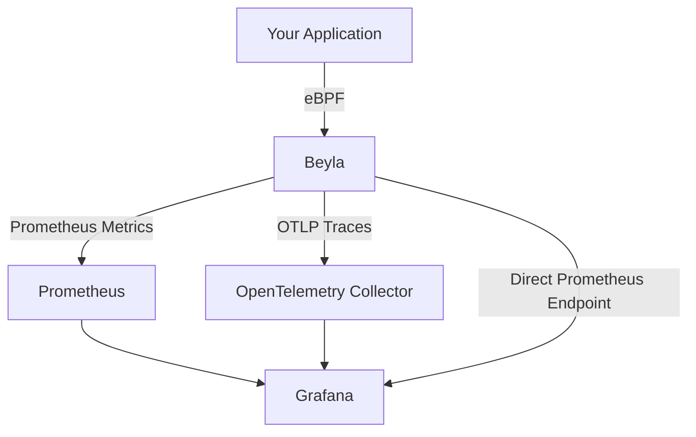

# Grafana Beyla

## Introduction

Grafana Beyla is an open-source, zero-code auto-instrumentation tool that brings modern observability to your applications without requiring any code changes. It automatically generates metrics and traces from your services by leveraging eBPF (extended Berkeley Packet Filter) technology to observe application behavior at the kernel level.

Unlike traditional instrumentation methods that require modifying your source code or adding libraries, Beyla works by attaching to running processes and automatically detecting HTTP, gRPC, and database calls. This makes it ideal for environments where you cannot modify the application code or when you need to quickly implement observability across numerous services.

## Why Beyla Matters

In today's complex microservices environments, gaining visibility into your applications' performance is crucial. Traditional methods often require:

- Adding instrumentation libraries to your code
- Modifying application code to include metrics and tracing
- Redeploying applications after instrumentation changes

Beyla eliminates these requirements by providing:

- Zero-code instrumentation
- Support for multiple programming languages (Go, Java, Python, Node.js, Ruby, and more)
- Automatic service discovery
- Integration with the Prometheus and OpenTelemetry ecosystems

## Key Features

- **eBPF-based instrumentation**: Uses Linux kernel capabilities to observe applications without overhead
- **Auto-discovery**: Automatically finds and instruments services running on a host
- **Multi-language support**: Works with various programming languages without language-specific agents
- **Kubernetes integration**: Seamlessly works in containerized environments
- **Protocol support**: Automatically detects HTTP, HTTPS, gRPC, and SQL database communications
- **OpenTelemetry compatibility**: Outputs data in standardized formats

## Getting Started with Beyla

### Prerequisites

Before using Beyla, ensure you have:

- A Linux system with a kernel version 4.18 or newer
- Root privileges (required for eBPF functionality)
- Applications you want to monitor

### Installation

You can install Beyla using Docker, Kubernetes, or directly on your host.

#### Docker Installation

```bash
docker run --name beyla \
  --pid=host --cgroupns=host --privileged \
  -v /sys:/sys \
  -p 8999:8999 \
  grafana/beyla:latest
```

#### Kubernetes Installation

Create a file named `beyla-daemonset.yaml`:

```yaml
apiVersion: apps/v1
kind: DaemonSet
metadata:
  name: beyla
  namespace: monitoring
spec:
  selector:
    matchLabels:
      name: beyla
  template:
    metadata:
      labels:
        name: beyla
    spec:
      hostPID: true
      containers:
      - name: beyla
        image: grafana/beyla:latest
        securityContext:
          privileged: true
        volumeMounts:
        - name: sys
          mountPath: /sys
      volumes:
      - name: sys
        hostPath:
          path: /sys
```

Apply the configuration:

```bash
kubectl apply -f beyla-daemonset.yaml
```

#### Direct Installation

Download the latest release from GitHub and run it:

```bash
wget https://github.com/grafana/beyla/releases/latest/download/beyla_linux_amd64
chmod +x beyla_linux_amd64
sudo ./beyla_linux_amd64
```

## Basic Configuration

Beyla can be configured using environment variables or a configuration file. Here's a basic configuration example:

### Environment Variables

```bash
# Target the process by name
BEYLA_EXECUTABLE_NAME="my-service"

# Configure OpenTelemetry metrics exporter
OTEL_EXPORTER_OTLP_ENDPOINT="http://otel-collector:4317"
OTEL_EXPORTER_OTLP_PROTOCOL="grpc"

# Enable Prometheus metrics endpoint
BEYLA_PROMETHEUS_PORT=8999
```

### Configuration File

Create a file named `beyla-config.yaml`:

```yaml
executable:
  name: "my-service"

telemetry:
  metrics:
    prometheus:
      port: 8999
  traces:
    otlp:
      endpoint: "http://otel-collector:4317"
      protocol: "grpc"
```

Run Beyla with the configuration file:

```bash
./beyla_linux_amd64 --config beyla-config.yaml
```

## Practical Example: Monitoring a Go Web Service

Let's walk through a complete example of monitoring a simple Go web service with Beyla.

### Step 1: Create a Simple Go Web Service

Create a file named `main.go`:

```go
package main

import (
	"fmt"
	"log"
	"net/http"
	"time"
)

func handler(w http.ResponseWriter, r *http.Request) {
	time.Sleep(100 * time.Millisecond)  // Simulate processing time
	fmt.Fprintf(w, "Hello, Beyla!")
}

func main() {
	http.HandleFunc("/", handler)
	log.Println("Starting server on :8080")
	log.Fatal(http.ListenAndServe(":8080", nil))
}
```

Build and run the application:

```bash
go build -o mywebservice main.go
./mywebservice
```

### Step 2: Configure and Run Beyla

Create a file named `beyla-config.yaml`:

```yaml
executable:
  name: "mywebservice"

telemetry:
  metrics:
    prometheus:
      port: 8999
```

Run Beyla in a separate terminal:

```bash
sudo ./beyla_linux_amd64 --config beyla-config.yaml
```

### Step 3: Generate Some Traffic

In another terminal, send some requests to your service:

```bash
for i in {1..10}; do curl http://localhost:8080/; done
```

### Step 4: View the Metrics

Access the Prometheus metrics endpoint:

```bash
curl http://localhost:8999/metrics
```

Output (partial):

```
# HELP http_server_duration_milliseconds Measures the duration of the inbound HTTP request
# TYPE http_server_duration_milliseconds histogram
http_server_duration_milliseconds_bucket{http_method="GET",http_route="/",http_status_code="200",service_name="mywebservice",le="0"} 0
http_server_duration_milliseconds_bucket{http_method="GET",http_route="/",http_status_code="200",service_name="mywebservice",le="5"} 0
http_server_duration_milliseconds_bucket{http_method="GET",http_route="/",http_status_code="200",service_name="mywebservice",le="10"} 0
http_server_duration_milliseconds_bucket{http_method="GET",http_route="/",http_status_code="200",service_name="mywebservice",le="25"} 0
http_server_duration_milliseconds_bucket{http_method="GET",http_route="/",http_status_code="200",service_name="mywebservice",le="50"} 0
http_server_duration_milliseconds_bucket{http_method="GET",http_route="/",http_status_code="200",service_name="mywebservice",le="75"} 0
http_server_duration_milliseconds_bucket{http_method="GET",http_route="/",http_status_code="200",service_name="mywebservice",le="100"} 5
http_server_duration_milliseconds_bucket{http_method="GET",http_route="/",http_status_code="200",service_name="mywebservice",le="250"} 10
# ... more metrics ...
```

### Step 5: Visualize in Grafana

To visualize these metrics in Grafana:

1. Add your Prometheus instance as a data source in Grafana
2. Create a new dashboard
3. Add panels to display HTTP request rates, durations, and error counts

Here's an example of a Grafana query to show request durations:

```
histogram_quantile(0.95, sum(rate(http_server_duration_milliseconds_bucket{service_name="mywebservice"}[5m])) by (http_route, le))
```

## Visualizing Beyla's Architecture

Here's a diagram showing how Beyla works in a typical deployment:



## Advanced Configuration

### Filtering Which Services to Instrument

You can configure Beyla to target specific processes based on different criteria:

```yaml
executable:
  # By executable name
  name: "myservice"
  
  # OR by command line arguments
  cmdline: "server --port=8080"
  
  # OR by process ID
  pid: 12345
```

### Configuring Kubernetes Integration

For Kubernetes environments, you can use pod annotations:

```yaml
apiVersion: apps/v1
kind: Deployment
metadata:
  name: my-application
spec:
  template:
    metadata:
      annotations:
        beyla.grafana.com/instrument: "true"
        beyla.grafana.com/service-name: "my-custom-service-name"
```

### Custom Metrics and Labels

Add custom labels to your metrics:

```yaml
telemetry:
  metrics:
    prometheus:
      port: 8999
      labels:
        environment: "production"
        team: "platform"
```

## Troubleshooting Common Issues

### No Metrics Generated

If no metrics are being generated, check:

1. **Kernel Version Compatibility**: Ensure your Linux kernel is version 4.18 or newer
   ```bash
   uname -r
   ```

2. **Process Targeting**: Verify Beyla is targeting the correct process
   ```bash
   ps aux | grep your_process_name
   ```

3. **Permissions**: Beyla needs to run with sufficient privileges
   ```bash
   sudo ./beyla_linux_amd64 --config beyla-config.yaml
   ```

### High CPU Usage

If Beyla is consuming too much CPU:

1. Narrow down the processes being monitored
2. Increase the sampling rate in configuration

```yaml
telemetry:
  sampling:
    ratio: 0.5  # Sample 50% of requests
```

## Integration with Grafana Cloud

Beyla seamlessly integrates with Grafana Cloud:

```yaml
telemetry:
  metrics:
    prometheus:
      port: 8999
  traces:
    otlp:
      endpoint: "https://otlp-gateway-<your-stack>.grafana.net/otlp"
      headers:
        Authorization: "Basic <your-base64-encoded-credentials>"
```

## Summary

Grafana Beyla revolutionizes the application observability landscape by providing zero-code, auto-instrumentation capabilities through eBPF technology. It enables developers and operators to quickly gain insights into application performance without modifying code or adding dependencies.

Key takeaways:
- Beyla uses eBPF to automatically instrument applications
- It works with multiple programming languages
- No code changes are required to implement observability
- It integrates with the broader Grafana ecosystem

## Exercises

1. Install Beyla and monitor a simple web application of your choice
2. Set up Beyla in a Kubernetes environment using a DaemonSet
3. Configure Beyla to send metrics to Prometheus and traces to Jaeger
4. Create a Grafana dashboard that visualizes Beyla-collected metrics
5. Experiment with different configuration options to target specific processes

## Additional Resources

- [Grafana Beyla GitHub Repository](https://github.com/grafana/beyla)
- [eBPF Documentation](https://ebpf.io/what-is-ebpf/)
- [OpenTelemetry Documentation](https://opentelemetry.io/docs/)
- [Prometheus Documentation](https://prometheus.io/docs/introduction/overview/)