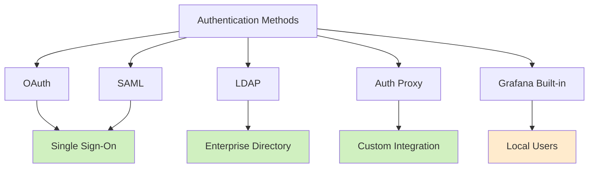

# Security Best Practices

## Introduction

Security is a crucial aspect of any Grafana deployment. As a powerful monitoring and visualization platform that often handles sensitive metrics and logs, implementing robust security measures is essential. This guide covers best practices to secure your Grafana installation, protecting both the platform itself and the valuable data it contains.

## Why Grafana Security Matters

Grafana instances often serve as centralized dashboarding solutions that connect to multiple data sources containing sensitive operational metrics. An unsecured Grafana installation could lead to:

- Unauthorized access to sensitive metrics and logs
- Potential gateway access to connected databases and data sources
- Exposure of internal system architecture and configurations
- Credential theft via stored data source connections

## Authentication Best Practices

### Strong Authentication Methods

Grafana supports multiple authentication methods. Here are the recommended approaches:



#### OAuth Integration

OAuth provides secure delegate authentication with services like Google, GitHub, or Azure AD:

```javascript
// Example OAuth configuration in grafana.ini
[auth.google]
enabled = true
client_id = YOUR_GOOGLE_CLIENT_ID
client_secret = YOUR_GOOGLE_CLIENT_SECRET
scopes = openid email profile
auth_url = https://accounts.google.com/o/oauth2/auth
token_url = https://accounts.google.com/o/oauth2/token
api_url = https://www.googleapis.com/oauth2/v1/userinfo
allowed_domains = yourdomain.com
allow_sign_up = true
```

#### Password Policy Enforcement

For built-in authentication, enforce strong password policies:

```ini
# In grafana.ini
[security]
# Minimum password length
min_password_length = 12

# Disable basic authentication
disable_basic_auth = true
```

### Multi-Factor Authentication (MFA)

Enable MFA to add an additional layer of security:

```ini
# In grafana.ini
[auth]
# Enable multi-factor authentication
disable_login_form = false
oauth_auto_login = false

[auth.mfa]
enabled = true
```

## Authorization and Access Control

### Role-Based Access Control (RBAC)

Implement the principle of least privilege by assigning appropriate roles:

1. **Viewers**: Can only view dashboards
2. **Editors**: Can edit dashboards but not manage users or data sources
3. **Admins**: Have full control over the Grafana instance

```javascript
// Example API call to set user permissions
const setUserRole = async (userId, orgId, role) => {
  await fetch(`/api/orgs/${orgId}/users/${userId}`, {
    method: 'PATCH',
    headers: { 'Content-Type': 'application/json' },
    body: JSON.stringify({ role: role }) // role can be "Viewer", "Editor", or "Admin"
  });
};
```

### Folder and Dashboard Permissions

Set granular permissions on folders and dashboards to control access:

1. Navigate to the dashboard or folder
2. Click the gear icon ⚙️ to access settings
3. Select "Permissions"
4. Add user or team permissions:
   - View
   - Edit
   - Admin

### Data Source Permissions

Restrict access to sensitive data sources:

```ini
# In grafana.ini
[datasources]
datasource_permissions = true
```

## Network Security

### TLS/SSL Configuration

Always use HTTPS with valid certificates:

```ini
# In grafana.ini
[server]
protocol = https
cert_file = /path/to/cert.pem
cert_key = /path/to/cert.key
```

### Reverse Proxy Setup

Place Grafana behind a reverse proxy like Nginx for additional security:

```nginx
# Example Nginx configuration
server {
    listen 443 ssl;
    server_name grafana.yourdomain.com;

    ssl_certificate /path/to/cert.pem;
    ssl_certificate_key /path/to/key.pem;

    location / {
        proxy_pass http://localhost:3000;
        proxy_set_header Host $host;
        proxy_set_header X-Real-IP $remote_addr;
        proxy_set_header X-Forwarded-For $proxy_add_x_forwarded_for;
        proxy_set_header X-Forwarded-Proto $scheme;
    }
}
```

### IP-Based Access Restrictions

Limit access to trusted IP ranges:

```ini
# In grafana.ini
[auth.anonymous]
enabled = false

[security]
allow_embedding = false
cookie_secure = true
cookie_samesite = strict
```

## Data Source Security

### Credentials Management

Use service accounts with minimal privileges for data source connections:

```yaml
# Example Prometheus data source configuration
apiVersion: 1
datasources:
  - name: Prometheus
    type: prometheus
    access: proxy
    url: http://prometheus:9090
    jsonData:
      timeInterval: 15s
      httpMethod: POST
    secureJsonData:
      httpHeaderValue1: "Bearer your-token-here"
```

### Query Limiting

Prevent resource exhaustion with query limits:

```ini
# In grafana.ini
[analytics]
reporting_enabled = false

[metrics]
enabled = true
interval_seconds = 10
```

## Secure Deployment Practices

### Container Security

If running Grafana in containers, follow these best practices:

1. Use official Grafana images
2. Run as non-root user
3. Use read-only file systems where possible

```dockerfile
# Example Dockerfile with security enhancements
FROM grafana/grafana:latest

USER grafana

VOLUME ["/var/lib/grafana", "/etc/grafana"]

# Add your configuration
COPY ./grafana.ini /etc/grafana/grafana.ini

# Run with reduced capabilities
RUN setcap 'cap_net_bind_service=+ep' /usr/sbin/grafana-server
```

### Regular Updates

Keep Grafana and its plugins updated to patch security vulnerabilities:

```bash
# For binary installations
grafana-cli update-all

# For Docker deployments
docker pull grafana/grafana:latest
docker-compose up -d
```

## Monitoring and Auditing

### Audit Logging

Enable audit logs to track user actions:

```ini
# In grafana.ini
[log]
level = info

[log.frontend]
enabled = true

[auditing]
enabled = true
log_backend = file
```

Example audit log output:

```
t=2023-10-15T14:52:06+0000 lvl=info msg="User logged in" logger=context userId=1 orgId=1 uname=admin
t=2023-10-15T14:53:12+0000 lvl=info msg="Dashboard created" logger=context userId=1 orgId=1 uname=admin dashboard="System Overview"
```

### Security Monitoring

Monitor Grafana itself using Grafana:

1. Set up metrics endpoints
2. Create alerts for suspicious activities
3. Monitor failed login attempts

```ini
# In grafana.ini
[metrics]
enabled = true
basic_auth_username = metrics
basic_auth_password = secure-password
```

## Common Security Pitfalls

### Avoid These Common Mistakes

1. Using default admin credentials
2. Exposing Grafana directly to the internet without proper security
3. Granting excessive permissions to users or service accounts
4. Storing unencrypted secrets in dashboards or queries
5. Neglecting regular updates and security patches

## Implementing a Security Checklist

Use this checklist to regularly audit your Grafana installation:

- [ ] Changed default admin password
- [ ] Enforced HTTPS/TLS
- [ ] Implemented proper authentication (OAuth, SAML, or LDAP)
- [ ] Enabled multi-factor authentication
- [ ] Configured role-based access control
- [ ] Set up granular dashboard and folder permissions
- [ ] Restricted data source access
- [ ] Implemented network security measures
- [ ] Used service accounts with minimal privileges
- [ ] Enabled audit logging
- [ ] Regularly updated Grafana and plugins
- [ ] Monitored failed login attempts

## Summary

Securing your Grafana installation is essential for protecting your monitoring infrastructure and sensitive data. By implementing authentication best practices, proper authorization controls, network security measures, and regular auditing, you can significantly reduce the risk of unauthorized access and data breaches.

Remember that security is an ongoing process rather than a one-time setup. Regularly review your security posture and stay updated with the latest security recommendations from the Grafana team.

## Additional Resources

- [Grafana Security Documentation](https://grafana.com/docs/grafana/latest/setup-grafana/configure-security/)
- [OWASP Top Ten](https://owasp.org/www-project-top-ten/)
- [CIS Benchmarks](https://www.cisecurity.org/benchmark/grafana/)

## Exercises

1. Set up Grafana with OAuth authentication using a provider of your choice.
2. Create a folder structure with different permission levels for different teams.
3. Configure audit logging and create a dashboard to visualize security events.
4. Perform a security audit on your Grafana instance using the provided checklist.
5. Design a disaster recovery plan for your Grafana deployment.