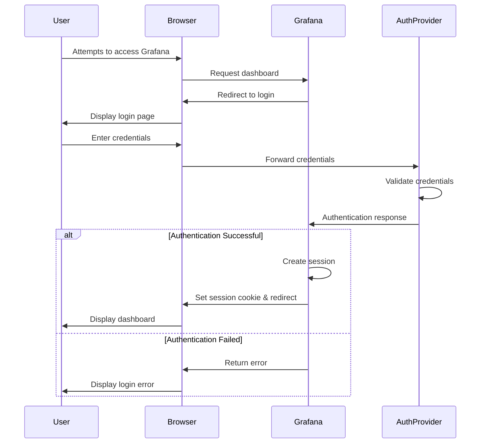

# Authentication Security in Grafana

## Introduction

Authentication is the cornerstone of security in any application, and Grafana is no exception. As a powerful visualization and monitoring platform, Grafana often contains sensitive operational data and metrics that need protection. This guide explores the authentication mechanisms available in Grafana, best practices for implementation, and common security pitfalls to avoid.

Authentication in Grafana answers a fundamental security question: "Are you who you claim to be?" By implementing robust authentication, you ensure that only authorized users can access your Grafana instance and its valuable dashboards and data.

## Authentication Options in Grafana

Grafana supports multiple authentication methods, giving you flexibility while maintaining security. Let's explore the most common options:

### Built-in Authentication

The simplest form of authentication in Grafana is its built-in user management system.

```bash
# Default admin credentials (should be changed immediately)
Username: admin
Password: admin
```

While convenient for getting started, built-in authentication has limitations for enterprise environments and should be configured properly:

```yaml
# grafana.ini configuration example for built-in auth
[auth]
# Disable login form
disable_login_form = false

# Set to true to disable the possibility to create users from the UI
disable_signout = false

# Set to true to automatically assign new users to the default organization 
# (id 1)
auto_assign_org = true

# Default role for new users
auto_assign_org_role = Viewer
```

### LDAP/Active Directory Integration

For organizations using directory services, LDAP integration provides centralized user management:

```yaml
# ldap.toml configuration example
[[servers]]
host = "ldap.example.com"
port = 389
use_ssl = false
start_tls = true
bind_dn = "cn=admin,dc=grafana,dc=org"
bind_password = "grafana"
search_filter = "(sAMAccountName=%s)"
search_base_dns = ["dc=grafana,dc=org"]

[servers.attributes]
name = "givenName"
surname = "sn"
username = "sAMAccountName"
member_of = "memberOf"
email = "email"
```

### OAuth Integration

Grafana supports various OAuth providers like Google, GitHub, and Azure AD:

```yaml
# grafana.ini configuration for GitHub OAuth
[auth.github]
enabled = true
allow_sign_up = true
client_id = YOUR_GITHUB_APP_CLIENT_ID
client_secret = YOUR_GITHUB_APP_CLIENT_SECRET
scopes = user:email,read:org
auth_url = https://github.com/login/oauth/authorize
token_url = https://github.com/login/oauth/access_token
api_url = https://api.github.com/user
team_ids =
allowed_organizations =
```

### Single Sign-On (SSO)

For enterprise environments, SSO provides seamless authentication across applications:

```yaml
# SAML configuration example
[auth.saml]
enabled = true
certificate_path = "/path/to/certificate.cert"
private_key_path = "/path/to/private_key.pem"
idp_metadata_path = "/path/to/metadata.xml"
max_issue_delay = 90s
metadata_valid_duration = 48h
assertion_attribute_name = displayName
assertion_attribute_login = mail
assertion_attribute_email = mail
```

## Authentication Flow in Grafana

Understanding the authentication flow helps in configuring and troubleshooting security issues:



## Security Best Practices

### 1. Enforce Strong Password Policies

Configure password requirements to ensure strong credentials:

```yaml
# grafana.ini password policy configuration
[security]
# How long inactivity before being logged out
login_remember_days = 7
# Minimum password length
min_password_length = 12
# Require numbers in password
password_require_number = true
# Require uppercase letters in password
password_require_uppercase = true
# Require lowercase letters in password
password_require_lowercase = true
# Require symbols in password
password_require_special = true
```

### 2. Implement Multi-Factor Authentication (MFA)

Add an extra layer of security with MFA:

```yaml
# grafana.ini MFA configuration
[auth]
# Set to true to enable multi-factor authentication
multi_factor_authentication_enabled = true
```

Once configured, users will see MFA options in their profile settings, where they can set up authenticator apps like Google Authenticator or Microsoft Authenticator.

### 3. Use TLS/SSL for All Communications

Always secure your Grafana instance with HTTPS:

```yaml
# grafana.ini HTTPS configuration
[server]
protocol = https
http_addr = 127.0.0.1
http_port = 3000
domain = grafana.example.com
cert_file = /path/to/cert.pem
cert_key = /path/to/cert.key
```

### 4. Implement Proper Session Management

Configure session timeouts and cookie security:

```yaml
# grafana.ini session configuration
[session]
provider = redis
provider_config = addr=127.0.0.1:6379,pool_size=100,db=0,ssl=false
cookie_secure = true
cookie_samesite = lax
session_life_time = 86400
```

### 5. Rotate Service Account Credentials Regularly

Create a schedule for rotating API keys and service account credentials:

```bash
# Example of creating a new API key via Grafana API
curl -X POST -H "Content-Type: application/json" -H "Authorization: Bearer admin_token" \
  --data '{"name":"service-account-new","role":"Editor"}' \
  https://grafana.example.com/api/auth/keys
```

## Common Authentication Vulnerabilities

### 1. Default Credentials

Never leave default credentials active in production:

```bash
# First action after installation should be changing default admin password
grafana-cli admin reset-admin-password newStrongPassword123!
```

### 2. Insecure Password Storage

Ensure Grafana is configured to use secure password hashing:

```yaml
# grafana.ini password security
[security]
# Method for storing passwords: pbkdf2, bcrypt, argon2, argon2id
password_algorithm = argon2id
```

### 3. Missing Rate Limiting

Implement rate limiting to prevent brute force attacks:

```yaml
# grafana.ini rate limiting
[auth]
# Max number of login attempts per 5 min
login_maximum_inactive_lifetime_duration = 7d
login_maximum_lifetime_duration = 30d
# Rate limiter for failed logins
rate_limit_valid_auth_token = 10
```

### 4. Improper Access Control

After authentication, ensure proper authorization:

```yaml
# Organization roles configuration
[users]
auto_assign_org_role = Viewer
```

## Real-World Example: Securing a Production Grafana Instance

Let's walk through a complete example of securing a production Grafana deployment:

1. Initial setup with secure authentication:

```yaml
# Production-ready grafana.ini authentication section
[security]
admin_user = grafana_admin
admin_password = $2a$10$JwogvOiCsCS9k8j0UNn6auO.qfG3R1uhWx.5K1G7mKHbmRVCM7BhK
disable_gravatar = true
cookie_secure = true
cookie_samesite = strict
strict_transport_security = true
strict_transport_security_max_age_seconds = 63072000
strict_transport_security_preload = true
strict_transport_security_subdomains = true
x_content_type_options = true
x_xss_protection = true

[auth]
disable_login_form = false
oauth_auto_login = false
disable_signout = false
signout_redirect_url =
oauth_state_cookie_max_age = 600
login_maximum_inactive_lifetime_duration = 7d
login_maximum_lifetime_duration = 30d
token_rotation_interval_minutes = 10
login_cookie_name = grafana_session
login_cookie_secure = true
login_cookie_samesite = lax

[auth.generic_oauth]
enabled = true
name = OAuth
allow_sign_up = true
client_id = your_client_id
client_secret = your_client_secret
scopes = openid profile email
auth_url = https://your-oauth-provider.com/oauth2/authorize
token_url = https://your-oauth-provider.com/oauth2/token
api_url = https://your-oauth-provider.com/userinfo
role_attribute_path = contains(groups[*], 'grafana-admin') && 'Admin' || contains(groups[*], 'grafana-editor') && 'Editor' || 'Viewer'
```

2. Implementing MFA and session management:

```yaml
[auth]
multi_factor_authentication_enabled = true

[session]
provider = redis
provider_config = addr=redis:6379,pool_size=100,db=0,ssl=true
cookie_secure = true
cookie_samesite = strict
session_life_time = 28800
```

3. Setting up proper logging for authentication events:

```yaml
[log]
mode = console file
level = info
filters = auth:debug
```

4. Configuring Grafana behind a reverse proxy for additional security:

```nginx
server {
    listen 443 ssl;
    server_name grafana.example.com;

    ssl_certificate /etc/nginx/ssl/grafana.crt;
    ssl_certificate_key /etc/nginx/ssl/grafana.key;
    ssl_protocols TLSv1.2 TLSv1.3;
    ssl_ciphers HIGH:!aNULL:!MD5;

    location / {
        proxy_pass http://grafana:3000;
        proxy_set_header Host $host;
        proxy_set_header X-Real-IP $remote_addr;
        proxy_set_header X-Forwarded-For $proxy_add_x_forwarded_for;
        proxy_set_header X-Forwarded-Proto $scheme;
    }
}
```

## Auditing and Monitoring Authentication

Regularly review authentication logs to detect suspicious activities:

```bash
# Example grep command to find failed login attempts
grep "Invalid username or password" /var/log/grafana/grafana.log
```

Set up alerts for multiple failed login attempts:

```yaml
# Alert rule example (in Grafana alerting)
- name: Authentication Failures
  rules:
  - alert: MultipleAuthFailures
    expr: sum(increase(grafana_api_login_failure_total[5m])) by (instance) > 5
    for: 5m
    labels:
      severity: warning
    annotations:
      summary: Multiple authentication failures detected
      description: There have been more than 5 failed login attempts in the last 5 minutes
```

## Practical Exercises

1. **Exercise 1**: Configure OAuth authentication with Google
   - Register a new OAuth application in Google Cloud Console
   - Configure Grafana to use Google OAuth
   - Test authentication flow

2. **Exercise 2**: Implement and test multi-factor authentication
   - Enable MFA in Grafana configuration
   - Set up MFA for an admin account
   - Test the authentication workflow

3. **Exercise 3**: Set up a security audit for authentication events
   - Configure detailed logging for authentication events
   - Create a dashboard to visualize authentication failures
   - Implement alerts for suspicious authentication patterns

## Summary

Authentication security in Grafana is a multi-faceted process that requires attention to:

1. Selecting the right authentication method for your environment
2. Implementing strong password policies and MFA
3. Securing communication channels with TLS/SSL
4. Proper session management and credential rotation
5. Regular monitoring and auditing of authentication activities

By following the practices outlined in this guide, you'll significantly enhance the security posture of your Grafana deployment, protecting valuable metrics and dashboards from unauthorized access.

## Additional Resources

- [Official Grafana Authentication Documentation](https://grafana.com/docs/grafana/latest/auth/)
- [OWASP Authentication Best Practices](https://owasp.org/www-project-web-security-testing-guide/latest/4-Web_Application_Security_Testing/04-Authentication_Testing/)
- [NIST Digital Identity Guidelines](https://pages.nist.gov/800-63-3/)

Remember that security is an ongoing process, not a one-time setup. Regularly review and update your authentication mechanisms to address new threats and vulnerabilities as they emerge.