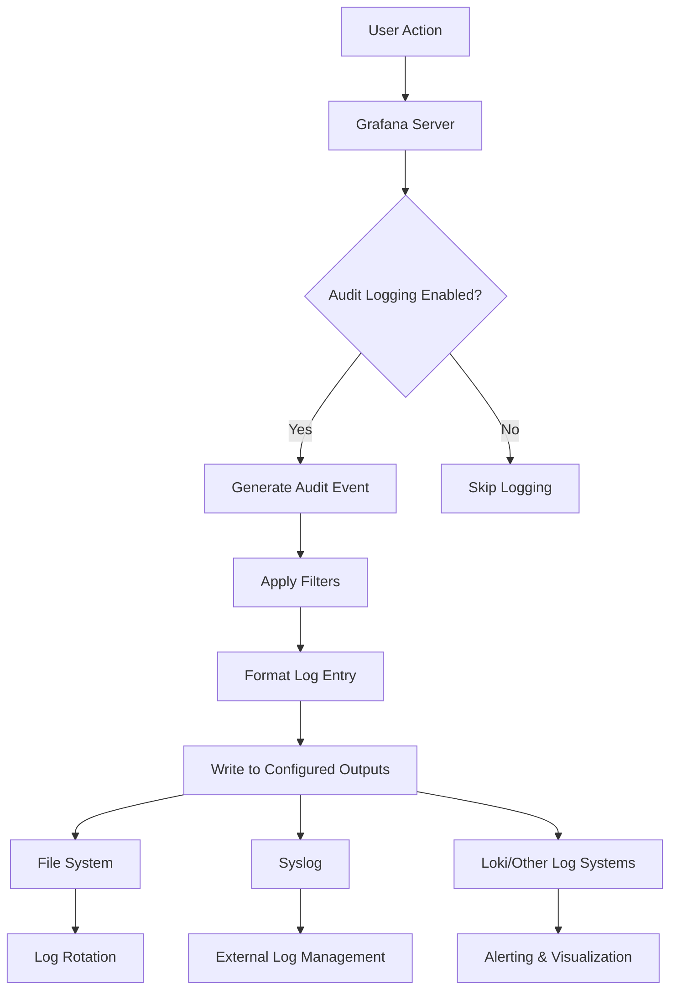

# Audit Logging

## Introduction

Audit logging is a critical security feature in Grafana that records user activities and system events. These logs provide a chronological record of who did what, when, and from where. In security-focused environments, audit logs serve as an essential tool for monitoring system usage, detecting suspicious activities, investigating security incidents, and demonstrating compliance with regulatory requirements.

This guide will walk you through everything you need to know about Grafana's audit logging capabilities, from basic configuration to advanced usage patterns.

## Why Audit Logging Matters

Before diving into the technical details, let's understand why audit logging is crucial for your Grafana deployment:

- **Security Monitoring**: Detect unauthorized access or suspicious activities
- **Incident Response**: Investigate security breaches with a detailed activity trail
- **Compliance Requirements**: Meet regulatory standards like GDPR, HIPAA, SOC2, or PCI DSS
- **Operational Insights**: Understand how users interact with your dashboards and data
- **Accountability**: Track changes to critical dashboards and configurations

## Basic Audit Logging Configuration

Grafana provides audit logging functionality that can be enabled and configured through the main configuration file. Here's how to get started:

### Enabling Audit Logs

To enable audit logging in Grafana, you need to modify your `grafana.ini` configuration file:

```ini
[audit]
# Set to true to enable audit logs
enabled = true

# Specify where to store the logs
log_outputs = file

# Define the log file location (default is data/audit.log)
log_file = data/audit.log
```

### Understanding Log Format

Once enabled, Grafana will generate audit logs in JSON format. Each log entry contains fields like:

```json
{
  "timestamp": "2023-07-15T14:23:45Z",
  "user": {
    "userId": 1,
    "login": "admin",
    "email": "admin@example.org"
  },
  "action": "login-successful",
  "resource": {
    "type": "user"
  },
  "origin": {
    "ipAddress": "192.168.1.100",
    "userAgent": "Mozilla/5.0..."
  },
  "result": "success"
}
```

## Types of Events Logged

Grafana's audit logging system captures various types of events:

### Authentication Events

- User login attempts (successful and failed)
- User logout
- API key usage
- Token-based authentication

### User Management

- User creation, updates, deletion
- User permission changes
- Team membership changes

### Dashboard Activities

- Dashboard creation and modification
- Dashboard permissions updates
- Dashboard deletion

### Data Source Operations

- Data source creation and configuration
- Data source deletion
- Data source permission changes

### Admin Actions

- Organization changes
- System settings updates
- Plugin installation or removal

## Advanced Configuration

For more granular control over audit logging, Grafana offers advanced configuration options:

### Log Rotation

To prevent audit logs from growing indefinitely, configure log rotation:

```ini
[audit]
# Maximum days to keep audit logs
max_file_age = 30

# Maximum size of single log file before rotation (in MB)
max_file_size_mb = 100

# Maximum number of old log files to retain
max_files = 10
```

### Filtering Logged Events

You can filter which events are logged based on their severity or type:

```ini
[audit]
# Log all events (debug, info, warning, error)
log_all = false

# Specify which levels to include
log_levels = info, warning, error
```

### Sending Logs to External Systems

For centralized log management, configure Grafana to send audit logs to external systems:

```ini
[audit]
# Send logs to multiple destinations
log_outputs = file,syslog

# Syslog configuration
syslog_tag = grafana-audit
syslog_facility = local7
syslog_format = rfc5424
```

## Visualizing Audit Logs

Since Grafana excels at data visualization, you can create dashboards to monitor your audit logs:

### Setting Up a Data Source

1. Create a log data source pointing to your audit logs
2. Configure proper JSON parsing for the audit log format

### Creating an Audit Log Dashboard

Here's a simple example of how to query audit logs with Loki:

```
{filename="/var/log/grafana/audit.log"} | json
| action="login-failed"
| line_format "{{.timestamp}} - User {{.user.login}} failed login from {{.origin.ipAddress}}"
```

### Essential Panels for Audit Monitoring

Consider including these visualizations in your audit dashboard:

- Failed login attempts over time
- Actions by user (pie chart)
- Geographic map of access locations
- Table of recent administrative changes
- Time series of overall system activity

## Real-World Examples

Let's explore some practical scenarios where audit logging proves invaluable:

### Example 1: Detecting Suspicious Login Attempts

Imagine you notice multiple failed login attempts for various users in your audit logs:

```json
{
  "timestamp": "2023-07-15T02:13:21Z",
  "user": {"login": "admin"},
  "action": "login-failed",
  "origin": {"ipAddress": "203.0.113.100"},
  "error": {"reason": "invalid-password"}
}
// Multiple similar entries with different usernames
```

This pattern could indicate a brute force attack. Your response might include:

1. Temporarily block the IP address
2. Implement rate limiting
3. Enable multi-factor authentication
4. Review user account security policies

### Example 2: Tracking Configuration Changes

When troubleshooting a data visualization issue, audit logs can reveal recent changes:

```json
{
  "timestamp": "2023-07-14T15:42:10Z", 
  "user": {"login": "data_analyst", "userId": 4},
  "action": "datasource-updated",
  "resource": {"type": "datasource", "id": 3, "name": "Production Database"},
  "result": "success",
  "changes": [
    {"fieldName": "jsonData.timeInterval", "oldValue": "1m", "newValue": "5m"}
  ]
}
```

This log shows a data analyst changed the time interval setting on a production data source, which might explain the visualization differences.

## Implementing Audit Logging Best Practices

To maximize the effectiveness of your audit logging system:

### 1. Set Appropriate Retention Periods

Balance storage constraints with compliance requirements:
- Regulatory frameworks may require specific retention periods
- Consider storing older logs in cold storage
- Document your retention policy

### 2. Establish Regular Review Procedures

Don't just collect logs—review them:
- Schedule weekly security reviews
- Create alerts for suspicious patterns
- Assign responsibility for log monitoring

### 3. Protect Your Audit Logs

Audit logs themselves need protection:
- Use write-only access for log storage
- Implement cryptographic signing to detect tampering
- Consider separate authentication for audit log access

### 4. Document What You're Logging

Maintain clear documentation about:
- Which events are captured
- What fields each log contains
- How long logs are retained
- Who has access to view logs

## Audit Logging Flow

The following diagram illustrates how audit logging works in Grafana:



## Troubleshooting Audit Logging

Common issues and their solutions:

### Missing Logs

If you're not seeing expected audit entries:

1. Verify audit logging is enabled in `grafana.ini`
2. Check file permissions on the log directory
3. Confirm log filters aren't excluding your events
4. Restart Grafana after configuration changes

### Performance Impact

If audit logging affects performance:

1. Use file-based logging instead of database storage
2. Implement log rotation to keep files small
3. Consider reducing the verbosity level
4. Use a dedicated disk for audit logs

## Summary

Audit logging is an essential security feature in Grafana that provides visibility into user activities and system events. By properly configuring and monitoring audit logs, you can enhance your security posture, investigate incidents more effectively, and demonstrate compliance with regulatory requirements.

Key takeaways:
- Enable audit logging in your Grafana deployment
- Configure appropriate retention and rotation settings
- Monitor logs regularly for suspicious activities
- Create dashboards to visualize important audit metrics
- Incorporate audit log reviews into your security procedures

## Additional Resources

To deepen your understanding of Grafana audit logging:

- [Grafana Official Documentation on Audit Logs](https://grafana.com/docs/grafana/latest/setup-grafana/configure-security/audit-logging/)
- OWASP Logging Cheat Sheet for security best practices
- CIS Benchmarks for Grafana security configurations

## Exercises

1. Enable audit logging in a test Grafana instance and generate various types of events.
2. Create a Loki data source that ingests your Grafana audit logs.
3. Build a dashboard that visualizes login attempts, configuration changes, and administrative actions.
4. Simulate a security incident and practice using audit logs to investigate.
5. Develop an audit log review checklist for your organization.