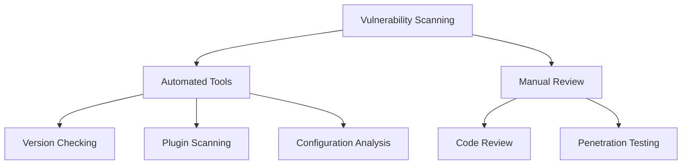
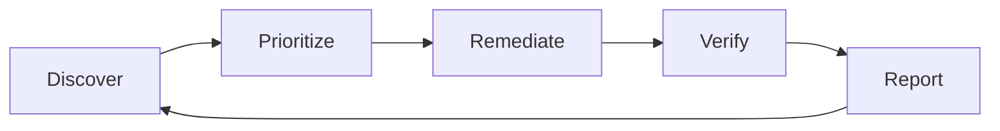

# Vulnerability Management

## Introduction

Vulnerability management is a critical security process that involves identifying, evaluating, treating, and reporting on security vulnerabilities in your Grafana deployment. As organizations increasingly rely on Grafana for data visualization and monitoring, ensuring its security becomes paramount to protect sensitive data and maintain system integrity.

This guide will walk you through establishing an effective vulnerability management program specifically for Grafana environments, helping you minimize security risks while maintaining optimal performance.

## Why Vulnerability Management Matters for Grafana

Grafana, as a popular open-source platform, is regularly updated to address security vulnerabilities. Without proper vulnerability management:

- Unpatched instances could be exploited by attackers
- Security breaches might compromise dashboard data
- Unauthorized access could lead to data theft or manipulation
- System availability could be impacted by security incidents

## Key Components of Grafana Vulnerability Management

### 1. Vulnerability Scanning and Identification

The first step in vulnerability management is discovering what vulnerabilities exist in your Grafana deployment.



#### Automated Scanning

You can use various tools to scan your Grafana instance for known vulnerabilities:

```bash
# Example using Grafana version check API
curl -s http://your-grafana-instance/api/health | jq
```

Output:
```json
{
  "commit": "8d69755cc4",
  "database": "ok",
  "version": "9.3.6"
}
```

This information can be cross-referenced with the [Grafana Security Advisories](https://grafana.com/security/) to identify if your version has known vulnerabilities.

### 2. Vulnerability Assessment and Prioritization

Once vulnerabilities are identified, they need to be assessed for severity and potential impact.

#### CVSS Scoring

The Common Vulnerability Scoring System (CVSS) is widely used to assess the severity of vulnerabilities. Grafana security advisories typically include CVSS scores.

Example of analyzing a vulnerability:

```javascript
// Example function to determine vulnerability priority based on CVSS score
function determinePriority(cvssScore) {
  if (cvssScore >= 9.0) return "Critical - Remediate immediately";
  if (cvssScore >= 7.0) return "High - Remediate within 7 days";
  if (cvssScore >= 4.0) return "Medium - Remediate within 30 days";
  return "Low - Remediate within 90 days";
}

// Using the function
const vulnerabilityScore = 8.2;
console.log(determinePriority(vulnerabilityScore));
```

Output:
```
High - Remediate within 7 days
```

### 3. Vulnerability Remediation

After assessing vulnerabilities, you need to address them through various remediation strategies:

#### Upgrading Grafana

The most common remediation is upgrading to a patched version:

```bash
# For Docker deployments
docker pull grafana/grafana:latest
docker stop grafana
docker rm grafana
docker run -d --name=grafana -p 3000:3000 grafana/grafana:latest

# For Linux installations
sudo apt-get update
sudo apt-get install grafana
sudo systemctl restart grafana-server
```

#### Implementing Mitigations

When immediate upgrades aren't possible, temporary mitigations might be required:

```javascript
// Example Grafana configuration for restricting access as a mitigation
{
  "security": {
    "cookie_secure": true,
    "strict_transport_security": true,
    "content_security_policy": true,
    "allow_embedding": false,
    // Restrict access to internal networks only while patching
    "ip_range": ["10.0.0.0/8", "172.16.0.0/12", "192.168.0.0/16"]
  }
}
```

### 4. Continuous Monitoring

Vulnerability management is an ongoing process. You should implement continuous monitoring of your Grafana instance.

#### Setting Up Alerting for Security Issues

You can use Grafana's own alerting capabilities to monitor for security issues:

```yaml
# Example Grafana alert rule for version monitoring
groups:
  - name: GrafanaSecurityAlerts
    rules:
      - alert: GrafanaOutdatedVersion
        expr: grafana_info{version!="9.5.2"} == 1
        for: 24h
        labels:
          severity: warning
        annotations:
          summary: "Grafana running outdated version"
          description: "Grafana instance is running version {{ $labels.version }} which may contain security vulnerabilities."
```

## Practical Example: Addressing a Real Grafana Vulnerability

Let's walk through addressing CVE-2023-1410, a real vulnerability that affected Grafana:

1. **Identification**: You discover through monitoring that your Grafana version 9.3.2 is vulnerable to CVE-2023-1410, a high-severity issue where snapshot APIs were not respecting RBAC permissions.

2. **Assessment**: The vulnerability has a CVSS score of 7.5, making it a high-priority issue.

3. **Remediation Plan**:
   - Schedule an upgrade to Grafana 9.3.8 or newer
   - Temporarily restrict snapshot functionality

4. **Implementation**:

```bash
# Update Grafana to patched version
sudo apt-get update
sudo apt-get install grafana=9.3.8
sudo systemctl restart grafana-server

# Verify the upgrade was successful
curl -s http://your-grafana-instance/api/health | grep version
```

5. **Verification**: After upgrading, you should test that the vulnerability has been addressed and that no new issues were introduced.

## Building a Vulnerability Management Process

To establish an effective vulnerability management program for Grafana, follow these steps:

1. **Inventory**: Maintain an inventory of all Grafana instances in your environment
2. **Scanning Schedule**: Set up regular vulnerability scans (weekly is recommended)
3. **Prioritization Framework**: Develop criteria for prioritizing vulnerabilities
4. **Patching Policy**: Create a policy for patch deployment timeframes
5. **Testing Procedure**: Establish procedures for testing patches before production deployment
6. **Documentation**: Document all vulnerabilities and remediation actions
7. **Metrics**: Track key metrics like mean time to remediate (MTTR)



## Integration with Broader Security Monitoring

Your Grafana vulnerability management should be integrated with your broader security monitoring ecosystem.

### Using Grafana for Security Visualization

Ironically, Grafana itself is an excellent tool for visualizing security metrics, including vulnerability management data:

```javascript
// Example Prometheus query to track vulnerability remediation
const query = 'sum(grafana_vulnerability_count) by (severity)';

// This can be visualized in a Grafana dashboard
// showing count of vulnerabilities by severity over time
```

## Summary

Effective vulnerability management for Grafana requires a systematic approach to discovering, assessing, remediating, and monitoring security vulnerabilities. By implementing the practices outlined in this guide, you can significantly reduce the risk of security incidents while maintaining the availability and integrity of your Grafana deployment.

Remember that vulnerability management is not a one-time activity but an ongoing process that requires continuous attention and improvement.

## Additional Resources

- [Grafana Security Advisories](https://grafana.com/security/)
- [Grafana Release Notes](https://grafana.com/docs/grafana/latest/release-notes/)
- [OWASP Vulnerability Management Guide](https://owasp.org/www-project-vulnerability-management-guide/)

## Exercises

1. Set up a test Grafana instance and perform a vulnerability scan using an open-source security scanner.
2. Create a Grafana dashboard to visualize the security posture of your Grafana instances.
3. Develop a vulnerability response playbook specific to your organization's Grafana deployment.
4. Practice upgrading a Grafana instance and verify that the upgrade addressed specific CVEs.
5. Configure security-related alerts in Grafana to monitor for potential security issues.