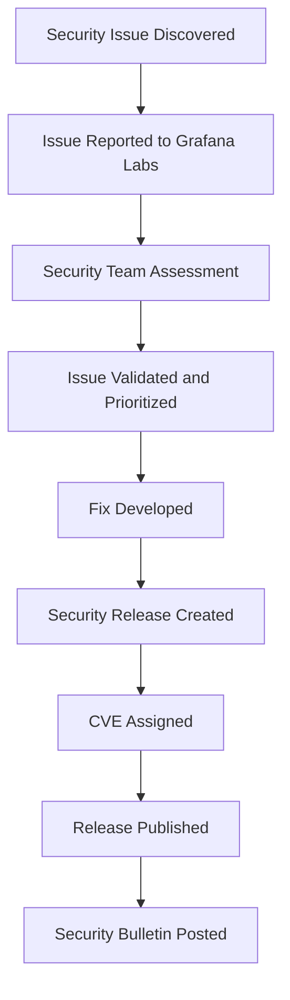

# Security Updates

## Introduction

Security updates are critical for maintaining the integrity, confidentiality, and availability of your Grafana deployments. As with any software platform, security vulnerabilities are discovered over time, and Grafana Labs regularly releases patches and updates to address these issues. This guide will help you understand the importance of security updates in Grafana, how to stay informed about them, and implement best practices for keeping your Grafana instances secure.

## Why Security Updates Matter

Failing to apply security updates can leave your Grafana instance vulnerable to:

- **Data breaches** - Unauthorized access to sensitive metrics and dashboards
- **Service disruption** - Attacks that can render your monitoring platform inoperable
- **Lateral movement** - Using Grafana as an entry point to access other systems
- **Compliance violations** - Many regulatory frameworks require timely security patches

## Understanding Grafana's Security Release Process

Grafana Labs follows a structured process for handling security issues:



### Types of Security Updates

Grafana security updates typically fall into several categories:

1. **Critical updates** - Address severe vulnerabilities that require immediate attention
2. **Feature-related fixes** - Security improvements to specific Grafana features
3. **Dependency updates** - Address vulnerabilities in third-party libraries
4. **Authentication/authorization fixes** - Resolve issues with access control mechanisms
5. **API security improvements** - Enhance the security of Grafana's APIs

## Staying Informed About Security Updates

To maintain a secure Grafana deployment, it's essential to stay informed about security updates:

### Official Channels

- **Grafana Security Bulletins** - Subscribe to the [official security mailing list](https://grafana.com/security/)
- **Release Notes** - Check each version's release notes for security information
- **Grafana Blog** - Major security releases are announced on the Grafana blog
- **GitHub Security Advisories** - Follow the [Grafana GitHub repository](https://github.com/grafana/grafana/security/advisories)

### Example: Checking Current Grafana Version

To verify your current Grafana version, navigate to the bottom of the side menu in your Grafana UI, or use the API:

```bash
# Using curl to check Grafana version via API
curl -s http://your-grafana-instance/api/health | grep version

# Example output:
# {"commit":"a603c40622","database":"ok","version":"9.5.2","scheduler":{"healthy":true}}
```

## Implementing Security Updates

### Update Process Overview

The general process for updating Grafana includes:

1. **Backup** - Always create a backup before updating
2. **Review** - Check release notes for any breaking changes
3. **Test** - Apply updates in a testing environment first
4. **Schedule** - Plan updates during maintenance windows
5. **Apply** - Perform the update on production systems
6. **Verify** - Confirm the update was successful

### Update Methods

#### Binary Installation Update

```bash
# For Debian/Ubuntu systems
sudo apt-get update
sudo apt-get install grafana

# For RPM-based systems (RHEL, CentOS)
sudo yum update grafana
```

#### Docker Container Update

```bash
# Pull the latest version or specific version
docker pull grafana/grafana:latest
# OR
docker pull grafana/grafana:9.5.2

# Stop and remove the existing container
docker stop grafana
docker rm grafana

# Start a new container with the updated image
docker run -d --name=grafana -p 3000:3000 grafana/grafana:latest
```

#### Kubernetes Update

```yaml
# In your deployment.yaml, update the image tag
apiVersion: apps/v1
kind: Deployment
metadata:
  name: grafana
spec:
  replicas: 1
  template:
    spec:
      containers:
      - name: grafana
        image: grafana/grafana:9.5.2  # Update this version
```

Then apply the changes:

```bash
kubectl apply -f deployment.yaml
```

## Security Update Best Practices

### 1. Establish a Vulnerability Management Program

Create a structured approach to handling Grafana security updates:

- Define roles and responsibilities
- Document the update process
- Set update timeframes based on vulnerability severity
- Maintain an inventory of all Grafana deployments

### 2. Use Version Pinning Carefully

While pinning to specific versions provides stability, it can lead to security risks:

```yaml
# Good practice - pin to minor version but allow patches
grafana/grafana:9.5

# Risky practice - pinning to specific version may miss security patches
grafana/grafana:9.5.0
```

### 3. Automate Update Checks

Create a simple script to check for available updates:

```bash
#!/bin/bash
# Script to check if Grafana needs security updates

CURRENT_VERSION=$(curl -s http://your-grafana-instance/api/health | grep -o '"version":"[^"]*"' | cut -d '"' -f 4)
LATEST_VERSION=$(curl -s https://api.github.com/repos/grafana/grafana/releases/latest | grep -o '"tag_name": "[^"]*"' | cut -d '"' -f 4 | cut -c 2-)

echo "Current version: $CURRENT_VERSION"
echo "Latest version: $LATEST_VERSION"

if [ "$CURRENT_VERSION" != "$LATEST_VERSION" ]; then
    echo "Update available!"
else
    echo "Grafana is up to date."
fi
```

### 4. Implement Configuration Management

Use tools like Ansible, Chef, or Puppet to manage Grafana configurations and updates:

```yaml
# Example Ansible task for updating Grafana
- name: Update Grafana
  apt:
    name: grafana
    state: latest
    update_cache: yes
  notify: restart grafana
```

### 5. Perform Post-Update Verification

After applying security updates, verify that Grafana is functioning properly:

- Check the Grafana health endpoint
- Verify dashboards are loading correctly
- Test alerting functionality
- Ensure all plugins are compatible

```bash
# Basic post-update health check
curl -s http://your-grafana-instance/api/health

# Expected response:
# {"commit":"a603c40622","database":"ok","version":"9.5.2","scheduler":{"healthy":true}}
```

## Real-World Example: Responding to a Critical Security Update

Let's walk through a scenario where a critical vulnerability has been discovered in Grafana:

1. **Alert Received**: You receive an alert about CVE-2023-XXXX, a critical vulnerability affecting Grafana versions below 9.5.1.

2. **Assessment**: You check your inventory and find you have Grafana 9.4.7 running in production.

3. **Planning**: You create an update plan:
   - Schedule an emergency maintenance window
   - Prepare backup procedures
   - Test the update in your staging environment

4. **Testing**: In staging, you run:

```bash
# Update to the patched version
sudo apt-get update
sudo apt-get install grafana=9.5.1
sudo systemctl restart grafana-server

# Verify the update
curl -s http://staging-grafana/api/health | grep version
```

5. **Production Update**: After successful testing, you apply the same update to production during the maintenance window.

6. **Verification**: You confirm the update was successful and all dashboards and alerts are functioning properly.

7. **Documentation**: You document the security incident, actions taken, and update your inventory.

## Summary

Maintaining current security updates for your Grafana deployments is a critical aspect of a robust security program. By understanding the update process, staying informed about security bulletins, implementing best practices, and establishing a systematic approach to updates, you can significantly reduce security risks to your monitoring platform.

Regular security updates not only protect your Grafana instance but also safeguard the valuable data it hosts and visualizes. Make security updates a priority in your Grafana administration tasks.

## Additional Resources

- [Grafana Security Page](https://grafana.com/security/)
- [Grafana Release Notes](https://grafana.com/docs/grafana/latest/release-notes/)
- [Docker Security Best Practices](https://grafana.com/docs/grafana/latest/installation/docker/)
- [Grafana Upgrade Guide](https://grafana.com/docs/grafana/latest/installation/upgrading/)

## Practice Exercises

1. Check the current version of your Grafana installation and determine if any security updates are available.

2. Create a simple bash script that checks your Grafana version against the latest release and sends an email alert if an update is needed.

3. Develop a rollback plan for Grafana updates that includes backup procedures and validation steps.

4. Set up a test environment where you can safely practice the update process before applying it to production.

5. Research and document the last three security vulnerabilities that affected Grafana and understand what types of protections they required.