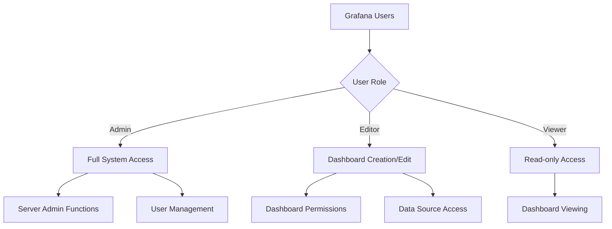
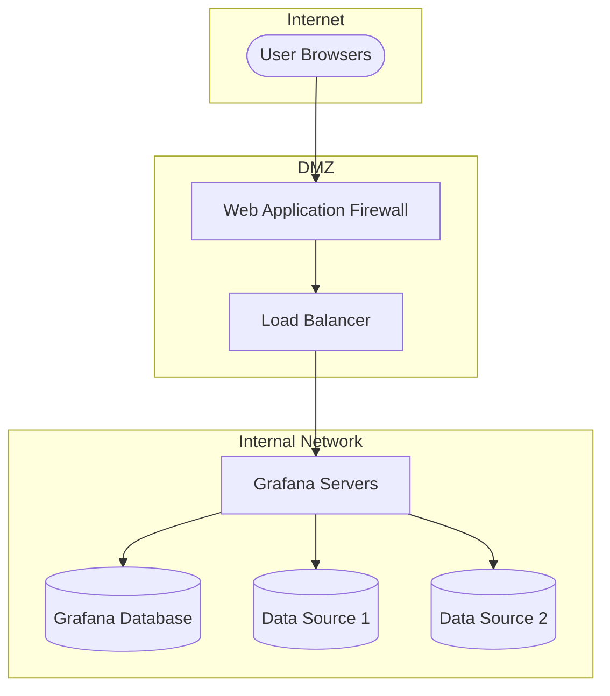

# Security Compliance in Grafana

## Introduction

Security compliance in Grafana refers to the process of ensuring your Grafana implementation adheres to organizational security policies, industry standards, and regulatory requirements. As organizations increasingly rely on Grafana for visualizing critical metrics and operational data, ensuring its security becomes paramount to protecting sensitive information and maintaining regulatory compliance.

In this guide, we'll explore the fundamentals of security compliance in Grafana, including authentication mechanisms, access controls, audit logging, and compliance frameworks that can help you establish a secure monitoring environment.

## Why Security Compliance Matters

Security compliance isn't just about checking boxes for auditors. It provides several tangible benefits:

- **Risk Reduction**: Identifying and addressing security vulnerabilities before they can be exploited
- **Data Protection**: Safeguarding sensitive information from unauthorized access
- **Operational Continuity**: Ensuring monitoring systems remain available and trustworthy
- **Legal Requirements**: Meeting industry and governmental regulatory standards

## Key Compliance Areas in Grafana

### Authentication and Authorization

Proper authentication and authorization are the foundation of Grafana security compliance.

#### Authentication Options

Grafana supports multiple authentication methods to accommodate different security requirements:

```javascript
// Example configuration in grafana.ini for OAuth authentication
[auth.google]
enabled = true
client_id = YOUR_CLIENT_ID
client_secret = YOUR_CLIENT_SECRET
scopes = https://www.googleapis.com/auth/userinfo.profile https://www.googleapis.com/auth/userinfo.email
auth_url = https://accounts.google.com/o/oauth2/auth
token_url = https://accounts.google.com/o/oauth2/token
api_url = https://www.googleapis.com/oauth2/v1/userinfo
allowed_domains = mycompany.com
allow_sign_up = true
```

Key authentication methods include:

1. **Built-in Grafana Authentication**: Username/password with configurable password policies
2. **LDAP/Active Directory**: Integration with enterprise directory services
3. **OAuth**: Authentication through providers like Google, GitHub, or custom OAuth servers
4. **SAML**: Enterprise-grade single sign-on compatibility
5. **JWT Authentication**: Token-based authentication for microservices architectures

#### Role-Based Access Control (RBAC)

Grafana Enterprise offers enhanced RBAC capabilities essential for compliance:



Best practices for RBAC implementation:

- Apply the principle of least privilege
- Create role-specific access patterns
- Regularly audit user permissions
- Use folder-based permissions for logical grouping of dashboards

### Data Source Security

Data sources in Grafana often connect to sensitive systems. Securing these connections is critical:

```javascript
// Example secure data source configuration with encrypted credentials
{
  "id": 1,
  "orgId": 1,
  "name": "Production Database",
  "type": "mysql",
  "typeLogoUrl": "",
  "access": "proxy",
  "url": "db.example.com:3306",
  "password": "", // Stored encrypted in Grafana's database
  "user": "grafana_reader",
  "database": "metrics",
  "basicAuth": false,
  "isDefault": true,
  "jsonData": {
    "maxOpenConns": 100,
    "maxIdleConns": 10,
    "connMaxLifetime": 14400,
    "tlsAuth": true,
    "tlsSkipVerify": false
  },
  "secureJsonData": {
    "tlsCACert": "...",
    "tlsClientCert": "...",
    "tlsClientKey": "..."
  },
  "readOnly": false
}
```

Compliance considerations for data sources:

1. **Encrypted Credentials**: Ensure passwords and keys are properly encrypted
2. **Transport Layer Security**: Use TLS/SSL for all data source connections
3. **Proxy Access Mode**: Use Grafana's proxy mode to avoid exposing credentials to browsers
4. **Minimal Privileges**: Connect with read-only database users whenever possible

### Audit Logging

Audit logging is essential for security compliance, allowing organizations to track user activities and detect suspicious behavior:

```ini
# Grafana audit logging configuration in grafana.ini
[log]
level = info

[log.frontend]
enabled = true

[audit]
enabled = true
log_output = file
max_files = 5
max_file_size_mb = 100
```

A comprehensive audit log includes:

- User login attempts (successful and failed)
- Configuration changes
- Dashboard creation, modification, and deletion
- User and permission changes
- Data source access and configuration

Implementing a SIEM (Security Information and Event Management) system to collect and analyze Grafana audit logs provides advanced security monitoring capabilities.

### Secure Deployment Architecture

A compliance-ready Grafana deployment follows security best practices:



Key architectural considerations include:

1. **Network Segmentation**: Deploy Grafana in a secure network zone
2. **Web Application Firewall**: Protect Grafana from common web attacks
3. **TLS Encryption**: Require HTTPS for all Grafana access
4. **Rate Limiting**: Prevent brute force and DoS attacks
5. **High Availability**: Ensure continuous monitoring capabilities

## Implementing Compliance Frameworks

### CIS Benchmarks

The Center for Internet Security (CIS) provides benchmarks for securing applications. While there isn't a specific CIS benchmark for Grafana, you can apply general web application security benchmarks:

1. Ensure Grafana runs as a non-privileged user
2. Configure proper file permissions on configuration files
3. Implement network security controls
4. Enable logging and monitoring

### SOC 2 Compliance

If your organization requires SOC 2 compliance, Grafana deployments should address:

1. **Access Control**: Implement strong authentication and authorization
2. **Change Management**: Track all changes to Grafana configurations
3. **Incident Response**: Have procedures for security incidents
4. **Risk Assessment**: Regularly evaluate security risks in your Grafana deployment

### GDPR Considerations

For organizations subject to GDPR, consider:

1. **Data Minimization**: Only collect necessary data in dashboards
2. **Access Controls**: Restrict access to dashboards containing personal data
3. **Retention Policies**: Implement appropriate data retention periods
4. **Audit Trails**: Maintain records of data access

## Compliance Monitoring with Grafana

Ironically, Grafana itself can be used to monitor compliance metrics:

```javascript
// Example Prometheus query for failed login attempts
sum(increase(grafana_unsuccessful_login_total[24h])) by (instance)
```

Consider creating dedicated compliance dashboards that track:

1. Failed login attempts
2. Configuration changes
3. Permission modifications
4. API usage patterns
5. Response times and availability metrics

## Common Compliance Pitfalls

When implementing security compliance in Grafana, avoid these common mistakes:

1. **Overlooking Updates**: Failing to keep Grafana and plugins updated
2. **Weak Default Settings**: Not changing default credentials and settings
3. **Insufficient Logging**: Inadequate audit trail configuration
4. **Excessive Permissions**: Granting users more access than necessary
5. **Unencrypted Communications**: Not enforcing HTTPS and secure connections

## Compliance Checklist

Use this checklist as a starting point for your Grafana security compliance program:

- [ ] Implement strong authentication mechanisms
- [ ] Configure role-based access control
- [ ] Secure all data source connections
- [ ] Enable comprehensive audit logging
- [ ] Deploy behind a web application firewall
- [ ] Encrypt all communications with TLS
- [ ] Establish a regular update procedure
- [ ] Create backup and recovery processes
- [ ] Document security policies and procedures
- [ ] Conduct regular security assessments

## Practical Example: Building a Compliance-Ready Grafana Instance

Let's walk through setting up a basic compliance-ready Grafana instance:

1. **Secure Installation**:

```bash
# Create a dedicated non-privileged user
sudo useradd -r -m -s /sbin/nologin grafana

# Set proper permissions
sudo chown -R grafana:grafana /etc/grafana
sudo chmod 640 /etc/grafana/grafana.ini
```

2. **Configure Authentication**:

```ini
# grafana.ini security settings
[security]
admin_user = admin
admin_password = $2a$...  # Use strong hashed password
disable_gravatar = true
cookie_secure = true
cookie_samesite = lax
allow_embedding = false

[auth]
disable_login_form = false
oauth_auto_login = false
disable_signout_menu = false
signout_redirect_url =
```

3. **Set Up Audit Logging**:

```ini
# grafana.ini audit settings
[audit]
enabled = true
log_output = file  # Options: file, console, loki
max_files = 5
max_file_size_mb = 100
```

4. **Configure TLS**:

```ini
# grafana.ini server settings
[server]
protocol = https
http_addr = 127.0.0.1
http_port = 3000
domain = grafana.example.com
cert_file = /etc/grafana/cert.pem
cert_key = /etc/grafana/cert.key
```

## Summary

Security compliance in Grafana requires a holistic approach that addresses authentication, authorization, data source security, audit logging, and deployment architecture. By implementing the practices outlined in this guide, you can ensure your Grafana installation meets organizational security requirements and industry regulations.

Remember that security compliance is not a one-time task but an ongoing process. Regularly review and update your security controls as new versions of Grafana are released and as your organization's compliance requirements evolve.

## Additional Resources

To further enhance your knowledge about Grafana security compliance:

- Grafana Labs' official security documentation
- OWASP Web Application Security Best Practices
- Cloud Security Alliance (CSA) Guidelines
- Industry-specific compliance frameworks (HIPAA, PCI DSS, etc.)

## Exercises

1. Conduct a security assessment of your current Grafana installation using the compliance checklist provided.
2. Create a dashboard to monitor security-related metrics from Grafana's logs and metrics.
3. Implement a role-based access control scheme that follows the principle of least privilege.
4. Set up a test environment to practice responding to security incidents in Grafana.
5. Review your data source connections to ensure they follow security best practices.