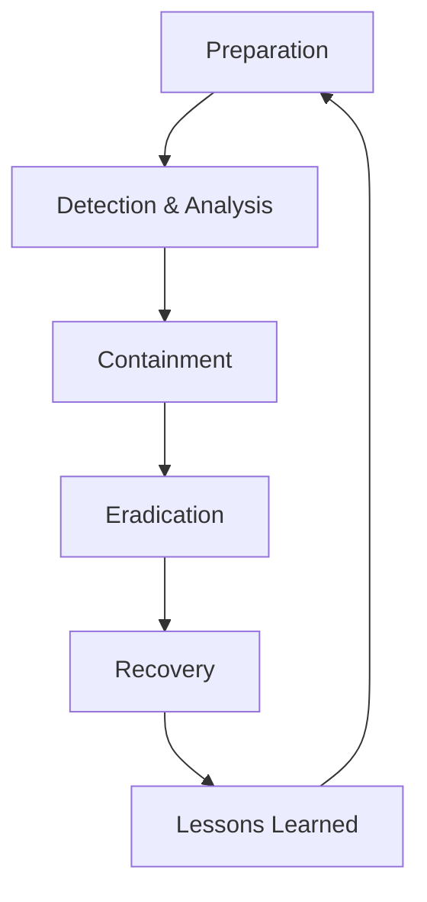

# Incident Response in Grafana Security

## Introduction

Incident Response (IR) is a structured approach to handling security breaches, unauthorized access, or any suspicious activity in your Grafana environment. In today's complex digital landscape, having a robust incident response strategy is not optional—it's essential. This guide will walk you through establishing an effective incident response process for your Grafana deployment, leveraging Grafana's built-in features to detect, contain, eradicate, and recover from security incidents.

## What is Incident Response?

Incident Response is a systematic methodology for addressing and managing the aftermath of a security breach or attack. The goal is to limit damage, reduce recovery time and costs, and implement preventive measures to avoid similar incidents in the future.

### The Incident Response Lifecycle



1. **Preparation**: Establish procedures, tools, and team roles before incidents occur
2. **Detection & Analysis**: Identify and investigate potential security incidents
3. **Containment**: Limit the damage of an incident
4. **Eradication**: Remove the threat from the environment
5. **Recovery**: Restore systems to normal operation
6. **Lessons Learned**: Document the incident and improve procedures

## Setting Up Incident Response in Grafana

### Step 1: Preparation

#### Creating an Incident Response Plan

Before an incident occurs, you need a documented plan that outlines:

- Team roles and responsibilities
- Communication channels
- Escalation procedures
- Documentation requirements
- Contact information for key stakeholders

#### Configuring Grafana for Better Security Monitoring

```jsx
// Example: Setting up stricter security settings in Grafana configuration
{
  "security": {
    "disable_gravatar": true,
    "cookie_secure": true,
    "cookie_samesite": "strict",
    "allow_embedding": false,
    "strict_transport_security": true,
    "content_security_policy": true
  }
}
```

#### Setting Up Key Dashboards

Create dedicated security monitoring dashboards that track:

- Failed login attempts
- API usage patterns
- Configuration changes
- User permission changes
- Data source access

### Step 2: Detection & Analysis

#### Leveraging Grafana Alerting for Incident Detection

Grafana's alerting system can be configured to detect potential security incidents:

```jsx
// Example alert rule for detecting multiple failed login attempts
{
  "name": "Multiple Failed Logins",
  "type": "threshold",
  "query": {
    "refId": "A",
    "datasourceId": 1,
    "model": {
      "expr": "sum(increase(grafana_failed_logins_total{instance=\"$instance\"}[5m])) by (instance) > 5",
      "format": "time_series"
    }
  },
  "conditions": [
    {
      "type": "query",
      "refId": "A",
      "evaluator": {
        "type": "gt",
        "params": [5]
      },
      "reducer": {
        "type": "avg"
      }
    }
  ],
  "noDataState": "no_data",
  "execErrState": "alerting",
  "for": "5m"
}
```

#### Creating a Loki Query to Detect Suspicious Activities

```jsx
{logql: '{job="grafana"} |= "Invalid username or password" | rate[5m] > 0.2'}
```

#### Analyzing Logs with Grafana Loki

When a potential incident is detected:

1. Correlate logs across different systems
2. Establish a timeline of events
3. Identify the scope and impact of the incident

```jsx
// Example Loki query to investigate a specific user's actions
{logql: '{job="grafana"} |= "username=admin" | json | user="admin" | line_format "{{.message}}"'}
```

### Step 3: Containment

Once an incident is confirmed, swift action is needed to contain it:

#### User Access Control

```jsx
// API call to disable a compromised user account
PUT /api/admin/users/1/disable
Authorization: Bearer your-api-key
```

#### Network Isolation

If necessary, restrict access to Grafana:

```jsx
// Example nginx configuration to limit access during an incident
location /grafana/ {
  allow 192.168.1.0/24;  # Internal network
  deny all;              # Block all other access
  proxy_pass http://grafana:3000/;
}
```

#### Session Termination

Force logout of all sessions when credential compromise is suspected:

```jsx
// API call to invalidate all user sessions
POST /api/admin/users/1/revoke-auth-token
Authorization: Bearer your-api-key
```

### Step 4: Eradication

After containing the incident, remove the threat:

#### Reset Credentials

```jsx
// Example API call to reset a user's password
PUT /api/admin/users/1/password
Authorization: Bearer your-api-key
Content-Type: application/json

{
  "password": "newComplexPassword123!"
}
```

#### Patch Vulnerabilities

Keep Grafana updated to protect against known vulnerabilities:

```bash
# Update Grafana in Docker environment
docker pull grafana/grafana:latest
docker stop grafana
docker rm grafana
docker run -d --name=grafana -p 3000:3000 grafana/grafana:latest
```

#### Review and Remove Malicious Dashboards or Queries

Search for and remove any dashboards or saved queries that might have been created by an attacker.

### Step 5: Recovery

Restore systems to normal operation:

#### Restore from Backups if Necessary

```bash
# Restore Grafana database from backup
cat grafana-backup.sql | docker exec -i grafana-db psql -U grafana
```

#### Verify System Integrity

Create a dashboard to monitor system health and ensure everything is functioning normally.

#### Re-enable Services Gradually

Bring systems back online in a controlled manner, monitoring for any signs of persistent issues.

### Step 6: Lessons Learned

After recovering from the incident:

#### Document the Incident

Create a detailed report including:
- Timeline of events
- Actions taken
- Root cause analysis
- Recommendations for prevention

#### Improve Detection

Update your Grafana alerting rules based on the incident:

```jsx
// Enhanced alert rule based on lessons learned
{
  "name": "Suspicious Dashboard Creation",
  "type": "threshold",
  "query": {
    "refId": "A",
    "datasourceId": 1,
    "model": {
      "expr": "rate(grafana_api_dashboard_save_total{status=\"success\"}[5m]) > 0.2",
      "format": "time_series"
    }
  },
  "conditions": [
    {
      "type": "query",
      "refId": "A",
      "evaluator": {
        "type": "gt",
        "params": [0.2]
      },
      "reducer": {
        "type": "avg"
      }
    }
  ],
  "noDataState": "no_data",
  "execErrState": "alerting",
  "for": "5m"
}
```

## Practical Example: Responding to Unauthorized Access

Let's walk through a complete example of responding to unauthorized access to your Grafana instance:

### Scenario

Your Grafana alerting system notifies you of multiple failed login attempts followed by a successful login from an unusual IP address outside business hours.

### Response Process

1. **Detection**: Alert triggered by multiple failed logins from IP 203.0.113.42

```jsx
// The alert query that detected the incident
{logql: '{job="grafana"} |= "Failed login" | json | count_over_time[10m] > 10'}
```

2. **Analysis**: Investigate logs to confirm successful login after failures

```jsx
// Loki query to analyze the activity
{logql: '{job="grafana"} |= "203.0.113.42" | json | line_format "{{.timestamp}} {{.level}}: {{.message}}"'}
```

3. **Containment**: Disable the potentially compromised account and force logout

```jsx
// API calls to contain the incident
PUT /api/admin/users/42/disable
Authorization: Bearer your-api-key

POST /api/admin/users/42/revoke-auth-token
Authorization: Bearer your-api-key
```

4. **Eradication**: Block the suspicious IP at the firewall level

```bash
# Example firewall rule to block the suspicious IP
iptables -A INPUT -s 203.0.113.42 -j DROP
```

5. **Recovery**: Reset the user's password and re-enable the account after verification

```jsx
// Reset password
PUT /api/admin/users/42/password
Authorization: Bearer your-api-key
Content-Type: application/json

{
  "password": "newSecurePassword456!"
}

// Re-enable account after verification
PUT /api/admin/users/42/enable
Authorization: Bearer your-api-key
```

6. **Lessons Learned**: Implement two-factor authentication for all admin accounts

```jsx
// Update Grafana configuration to enforce 2FA for admins
{
  "auth": {
    "disable_login_form": false,
    "disable_signout_menu": false
  },
  "auth.security": {
    "enforce_2fa_for_admins": true
  }
}
```

## Building an Incident Response Toolkit for Grafana

Create a collection of ready-to-use queries, dashboards, and scripts:

### Essential Grafana Queries for Incident Response

```jsx
// Query 1: Recent configuration changes
{logql: '{job="grafana"} |= "Updated configuration"'}

// Query 2: Unusual data source access patterns
{logql: '{job="grafana"} |= "data source access" | rate[5m] > 0.5'}

// Query 3: Privilege escalation attempts
{logql: '{job="grafana"} |= "role changed" |= "Admin"'}
```

### Creating an Incident Response Dashboard

Build a dedicated dashboard with panels showing:
- Failed login attempts by source IP
- API usage patterns
- Configuration changes
- User activity heatmap

## Summary

An effective incident response strategy is critical for maintaining the security and integrity of your Grafana environment. By implementing the steps outlined in this guide—preparation, detection, containment, eradication, recovery, and learning—you'll be well-equipped to handle security incidents efficiently and minimize their impact.

Remember that incident response is not a one-time effort but an ongoing process that requires regular review and updates based on emerging threats and lessons learned from previous incidents.

## Additional Resources

- **Practice Exercises**:
  1. Create a simulated incident in a test environment and practice your response
  2. Review your Grafana logs and identify potential security events
  3. Develop custom alerting rules for your specific environment

- **Further Learning**:
  - Study the NIST Special Publication 800-61 on Computer Security Incident Handling
  - Explore Grafana's alerting documentation for advanced configuration options
  - Learn about security information and event management (SIEM) principles