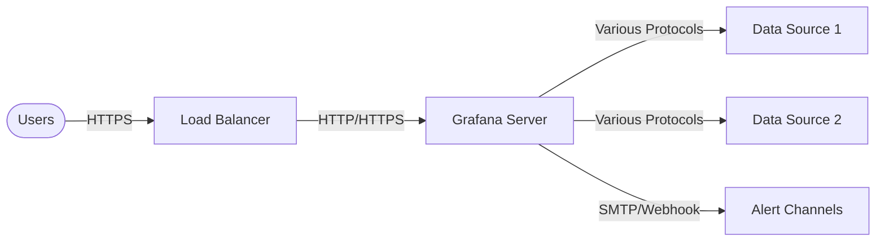
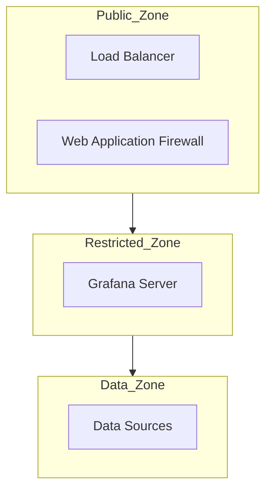

# Network Security in Grafana

## Introduction

Network security is a critical aspect of maintaining a robust Grafana deployment. As Grafana serves as a central visualization and monitoring platform for your infrastructure data, it's essential to protect it from unauthorized access and potential network-based attacks. This guide will walk you through the fundamentals of securing your Grafana instance at the network level, covering concepts from basic configuration to advanced protection mechanisms.

## Understanding Grafana's Network Architecture

Before implementing security measures, it's important to understand how Grafana communicates over the network. Grafana typically:

- Serves a web interface on HTTP/HTTPS
- Connects to various data sources (Prometheus, InfluxDB, etc.)
- May interact with alerting systems and notification channels
- Can be accessed by multiple users with different permission levels



## Basic Network Security Configuration

### Configuring HTTPS/TLS

By default, Grafana serves content over HTTP, which transmits data in plaintext. Enabling HTTPS encrypts this traffic, protecting sensitive information.

To configure HTTPS in Grafana, modify your `grafana.ini` configuration file:

```ini
[server]
protocol = https
cert_file = /path/to/cert.pem
cert_key = /path/to/cert.key
```

Alternatively, if using environment variables:

```bash
GF_SERVER_PROTOCOL=https
GF_SERVER_CERT_FILE=/path/to/cert.pem
GF_SERVER_CERT_KEY=/path/to/cert.key
```

### Binding to Specific Network Interfaces

Limit which network interfaces Grafana listens on to reduce exposure:

```ini
[server]
http_addr = 192.168.1.10
```

This restricts Grafana to listen only on the specified IP address rather than all interfaces (0.0.0.0).

## Implementing a Reverse Proxy

A common pattern for securing Grafana is to place it behind a reverse proxy like Nginx or Apache. This setup provides several security benefits:

- TLS termination
- Additional authentication options
- Request filtering
- Enhanced logging

Here's a basic Nginx configuration example:

```nginx
server {
    listen 443 ssl;
    server_name grafana.yourdomain.com;

    ssl_certificate /etc/nginx/ssl/grafana.crt;
    ssl_certificate_key /etc/nginx/ssl/grafana.key;

    ssl_protocols TLSv1.2 TLSv1.3;
    ssl_prefer_server_ciphers on;
    ssl_ciphers 'EECDH+AESGCM:EDH+AESGCM:AES256+EECDH:AES256+EDH';

    location / {
        proxy_pass http://localhost:3000;
        proxy_set_header Host $host;
        proxy_set_header X-Real-IP $remote_addr;
        proxy_set_header X-Forwarded-For $proxy_add_x_forwarded_for;
        proxy_set_header X-Forwarded-Proto $scheme;
    }
}
```

## Network Access Controls

### Firewall Configuration

Implement firewall rules to restrict access to your Grafana instance. Only allow traffic from trusted IP ranges.

For Linux systems using `iptables`:

```bash
# Allow HTTPS traffic (port 443)
iptables -A INPUT -p tcp --dport 443 -s 192.168.1.0/24 -j ACCEPT

# Allow Grafana's direct port if needed (default 3000)
iptables -A INPUT -p tcp --dport 3000 -s 127.0.0.1 -j ACCEPT

# Drop all other incoming traffic to Grafana ports
iptables -A INPUT -p tcp --dport 3000 -j DROP
```

### Network Segmentation

Place Grafana in a protected network segment with controlled access:



## Securing Data Source Connections

### TLS for Data Sources

Ensure communications between Grafana and its data sources are encrypted:

```ini
[database]
ssl_mode = require

[datasources.prometheus]
tls_auth = true
tls_ca_cert = /path/to/ca.pem
```

### Access Control for Data Sources

Limit connectivity to data sources using network ACLs:

```bash
# Allow Grafana to access Prometheus
iptables -A OUTPUT -p tcp -d prometheus.server -m tcp --dport 9090 -j ACCEPT

# Block other outbound connections by default
iptables -A OUTPUT -p tcp -j LOG --log-prefix "BLOCKED OUTPUT: "
iptables -A OUTPUT -p tcp -j DROP
```

## Monitoring Network Security

### Implementing Network Traffic Monitoring

Use Grafana itself to monitor network security by creating dashboards for:

1. Failed login attempts
2. Unusual traffic patterns
3. Firewall rule triggers

Here's a sample Prometheus query to track HTTP status codes, which can indicate security issues:

```promql
sum(rate(grafana_http_request_duration_seconds_count{status=~"4..|5.."}[5m])) by (status)
```

Display this in a Grafana panel to visualize potential security events:

```javascript
// Panel configuration JSON snippet
{
  "targets": [
    {
      "expr": "sum(rate(grafana_http_request_duration_seconds_count{status=~\"4..|5..\"}[5m])) by (status)",
      "legendFormat": "Status {{status}}",
      "refId": "A"
    }
  ],
  "type": "timeseries",
  "title": "HTTP Error Rates"
}
```

### Log Analysis

Configure Grafana to log network-related events for security analysis:

```ini
[log]
level = info
filters = alerting:debug security:debug

[log.frontend]
enabled = true
```

## Advanced Network Security Features

### IP-based Access Restrictions

Limit which IP addresses can access your Grafana instance:

```ini
[auth]
# Comma-separated list of IP addresses or CIDR notations
whitelist_ip = 192.168.1.0/24,10.0.0.1
```

### Rate Limiting

Protect against brute force attacks by implementing rate limiting:

```ini
[security]
limit_req_rate = 10
limit_req_burst = 30
```

This configuration limits each IP to 10 requests per second with a burst allowance of 30 requests.

## Securing Grafana with OAuth and Proxies

For enterprise environments, integrating Grafana with OAuth providers and authentication proxies adds an additional layer of network security:

```ini
[auth.proxy]
enabled = true
header_name = X-WEBAUTH-USER
header_property = username
auto_sign_up = true
```

With this configuration, Grafana trusts authentication performed by the proxy server.

## Summary

Network security for Grafana involves multiple layers of protection:

1. Enabling HTTPS to encrypt traffic
2. Implementing proper firewall rules
3. Using reverse proxies for enhanced control
4. Securing connections to data sources
5. Monitoring for security events
6. Implementing advanced authentication mechanisms

By applying these measures, you can significantly reduce the attack surface of your Grafana deployment and ensure that your monitoring infrastructure remains secure and reliable.

## Additional Resources

- Practice configuring a reverse proxy for your local Grafana instance
- Set up a test environment to experiment with firewall rules
- Create a dashboard to monitor failed login attempts
- Implement TLS for communication with a test data source

## Exercise: Hardening Your Grafana Instance

Try to identify potential network security vulnerabilities in a default Grafana installation and document how you would address each one. Consider:

1. Default open ports
2. Unencrypted communications
3. Lack of authentication for certain endpoints
4. Data source connection security

For each issue, specify the configuration changes you would make to mitigate the risk.