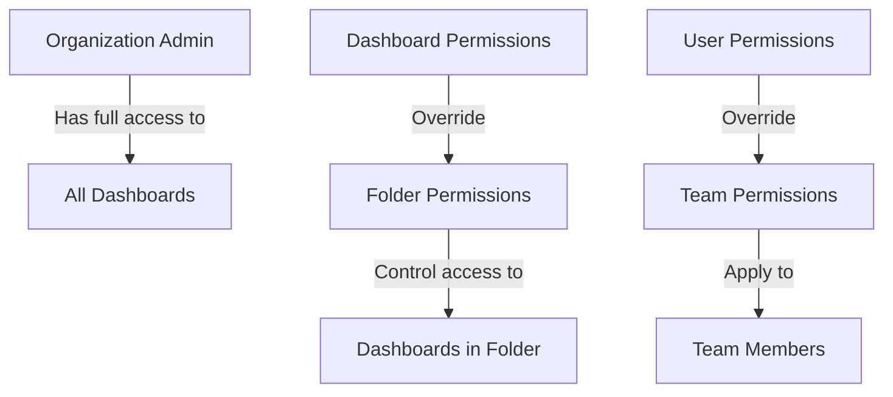

# Dashboard Security

## Introduction

Dashboard security is a critical aspect of Grafana administration that ensures your visualizations and data are accessible only to authorized users. As dashboards often contain sensitive operational, business, or customer data, implementing proper security measures is essential for maintaining data privacy, regulatory compliance, and preventing unauthorized access.

In this guide, you'll learn the fundamental concepts of Grafana dashboard security, including permission models, access controls, and best practices to protect your visualizations while maintaining usability.

## Core Dashboard Security Concepts

### The Grafana Permission Model

Grafana implements a hierarchical permission model that controls access to dashboards and their underlying data:



The permission hierarchy flows from organization-level permissions down to individual dashboard permissions, with more specific permissions overriding broader ones.

### Permission Levels

Grafana offers several permission levels for dashboards:

| Permission | Description |
|------------|-------------|
| Admin | Can edit and manage dashboard settings and permissions |
| Edit | Can edit dashboard but not manage permissions |
| View | Can only view dashboard |

## Implementing Dashboard Security

### Setting Up Folder-Based Permissions

Organizing dashboards into folders allows for easier permission management:

```jsx
// Create a folder with specific permissions
// This is done via the Grafana UI or API
```

Example using the Grafana API:

```bash
# Create a folder
curl -X POST -H "Content-Type: application/json" -H "Authorization: Bearer your-api-key" \
  http://your-grafana-instance/api/folders \
  -d '{"title":"Restricted Dashboards"}'

# Set permissions on the folder
curl -X POST -H "Content-Type: application/json" -H "Authorization: Bearer your-api-key" \
  http://your-grafana-instance/api/folders/1/permissions \
  -d '{"items":[{"userId":2,"permission":1},{"teamId":1,"permission":2}]}'
```

### Dashboard-Specific Permissions

For finer control, set permissions at the individual dashboard level:

1. Navigate to the dashboard you want to secure
2. Click the dashboard settings (gear icon) 
3. Select "Permissions"
4. Add specific users, teams, or roles with appropriate permission levels

### Using Teams for Access Control

Teams provide an efficient way to manage permissions for groups of users:

```jsx
// Example of team-based access control logic
function hasAccessToDashboard(user, dashboard) {
  return user.teams.some(team => dashboard.teamPermissions.includes(team.id));
}
```

## Advanced Security Features

### Enabling Dashboard Encryption

For sensitive dashboards, enable encryption:

```yaml
# In grafana.ini
[security]
dashboard_encryption_enabled = true
encryption_provider = secretKey
encryption_key = your-secret-key
```

### Implementing Row-Level Security

For multi-tenant environments, row-level security ensures users only see data relevant to them:

```sql
-- Example PostgreSQL query with user-based filtering
SELECT metric, value, timestamp 
FROM performance_data
WHERE tenant_id = ${__user.tenant_id}
```

### Template Variables for Dynamic Access Control

Use template variables to dynamically filter dashboard data based on user attributes:

```jsx
// Dashboard query utilizing user information
const query = `
  SELECT * FROM metrics 
  WHERE department = '${user.department}'
  AND access_level <= ${user.accessLevel}
`;
```

## Real-World Implementation Example

Let's implement a comprehensive security model for a multi-department organization:

1. Create department-specific folders:
   - Finance Dashboards
   - Operations Dashboards
   - Executive Dashboards

2. Assign folder permissions:

```jsx
// Pseudo-code for permissions setup
financeFolder.permissions = [
  { team: "Finance Team", permission: "Edit" },
  { team: "Executives", permission: "View" },
  { role: "Admin", permission: "Admin" }
];

operationsFolder.permissions = [
  { team: "Operations Team", permission: "Edit" },
  { team: "Support Team", permission: "View" },
  { role: "Admin", permission: "Admin" }
];

executiveFolder.permissions = [
  { team: "Executives", permission: "View" },
  { role: "Admin", permission: "Admin" }
];
```

3. Set up dashboard template variables for dynamic filtering:

```jsx
// Create a template variable that uses user information
const departmentVar = {
  name: "department",
  type: "custom",
  query: "${__user.department}",
  current: { value: "${__user.department}", text: "Current Department" }
};
```

4. Apply the template variable in dashboard queries:

```sql
SELECT 
  host,
  cpu_usage,
  memory_usage,
  timestamp
FROM
  system_metrics
WHERE
  department = '$department'
ORDER BY
  timestamp DESC
LIMIT 100
```

## Security Best Practices

1. **Use the least privilege principle**: Grant only the permissions necessary for users to perform their functions.

2. **Regularly audit permissions**: Review dashboard access controls periodically to ensure they align with current organizational needs.

3. **Implement strong authentication**: Use SAML, OAuth, or LDAP to integrate with your organization's authentication system.

4. **Enable feature toggles**: Restrict features like Explore or dashboard creation to appropriate user roles:

```ini
# In grafana.ini
[feature_toggles]
publicDashboards = false

[auth]
disable_login_form = true
```

5. **Sanitize template variables**: Prevent injection attacks by validating and sanitizing variables:

```jsx
// Sanitize user input from template variables
function sanitizeInput(input) {
  // Remove potentially harmful characters
  return input.replace(/[;'"\\{}\[\]()]/g, '');
}

const safeVariable = sanitizeInput(rawVariable);
```

## Audit and Compliance

### Setting Up Audit Logs

Enable comprehensive audit logs to track dashboard access and modifications:

```ini
# In grafana.ini
[log]
level = info

[log.frontend]
enabled = true

[audit]
enabled = true
log_to_file = true
log_file = /var/log/grafana/audit.log
```

### Example Audit Log Entry

```json
{
  "timestamp": "2023-11-10T14:22:45Z",
  "user": "john.doe",
  "action": "dashboard-viewed",
  "resource": {
    "type": "dashboard",
    "id": 42,
    "title": "Production System Metrics"
  },
  "context": {
    "ip": "192.168.1.102",
    "userAgent": "Mozilla/5.0..."
  }
}
```

## Summary

Implementing proper dashboard security in Grafana is essential for protecting sensitive data while ensuring appropriate access. By utilizing folder permissions, dashboard-specific controls, and features like template variables for dynamic filtering, you can create a secure and scalable dashboard environment.

Remember these key points:
- Organize dashboards into folders for easier permission management
- Use teams to efficiently manage group access
- Implement the principle of least privilege
- Regularly audit your permissions structure
- Enable encryption for sensitive dashboards
- Utilize template variables for dynamic access control

## Additional Resources

- [Grafana Official Documentation on Permissions](https://grafana.com/docs/grafana/latest/permissions/)
- [Grafana Enterprise Row-Level Security](https://grafana.com/docs/grafana/latest/enterprise/datasource_permissions/)
- [Authentication Options in Grafana](https://grafana.com/docs/grafana/latest/auth/)

## Exercises

1. Create a folder structure for your organization and implement appropriate permissions.
2. Set up a dashboard with template variables that filter data based on user attributes.
3. Configure audit logging and analyze the generated logs to identify access patterns.
4. Implement row-level security for one of your data sources to restrict data access.
5. Review your current dashboard permissions and adjust them following the least privilege principle.