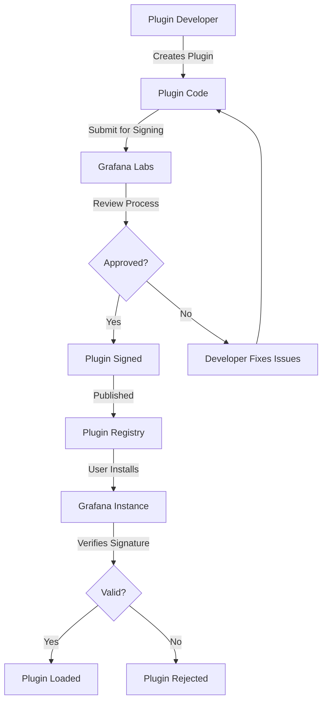

# Plugin Security in Grafana

## Introduction

Plugins extend Grafana's functionality, allowing you to connect to various data sources, create custom visualizations, and add new features. However, plugins can also introduce security risks if not properly vetted and managed. This guide explores security considerations for Grafana plugins, helping you understand potential vulnerabilities and how to mitigate them.

## Why Plugin Security Matters

Grafana plugins often have extensive permissions, including:

- Access to data sources and sensitive information
- Ability to execute code within the Grafana environment
- Potential for cross-site scripting (XSS) and other web vulnerabilities
- Connection to external services and APIs

A compromised plugin can lead to data breaches, unauthorized access, or service disruption. Understanding plugin security is essential for maintaining a secure Grafana deployment.

## Plugin Signing and Verification

### Understanding Plugin Signatures

Grafana uses a signature system to verify plugin authenticity and integrity. Official and approved plugins are signed by Grafana Labs.



### Checking Plugin Signatures

To check if a plugin is signed:

```bash
grafana-cli plugins list-remote
```

Look for the "signed" status next to each plugin.

### Configuring Plugin Signature Enforcement

You can configure how Grafana handles unsigned plugins in your `grafana.ini` file:

```ini
[plugins]
# Options: strict, warning, none
allow_loading_unsigned_plugins =
# If strict, only signed plugins will load
# If warning, unsigned plugins will load with a warning
# If none, all plugins will load without signature verification
```

For production environments, the recommended setting is `strict`.

## Installing Plugins Securely

### Use Official Sources

Always install plugins from official sources:

1. Grafana Plugins Catalog
2. Using `grafana-cli`
3. Directly from GitHub (only for trusted repositories)

### Example: Installing a Plugin Using grafana-cli

```bash
# Securely install a plugin with signature verification
grafana-cli --pluginUrl https://grafana.com/api/plugins/plugin-id/versions/1.0.0/download plugins install plugin-id

# To check installed plugins and their status
grafana-cli plugins ls
```

### Plugin Management Best Practices

- Regularly update plugins to get security patches
- Remove unused plugins to reduce attack surface
- Create a testing environment to validate plugins before production deployment
- Review plugin permissions and capabilities

## Plugin Access Control

### Understanding Plugin Permissions

Plugins may request various permissions:

- `process/exec`: Ability to execute system commands
- `filesystem/read/write`: Access to read/write files
- `network/http`: Make HTTP requests
- `app/hostname`: Access to know hostname information

### Configuring Plugin Access Rules

You can restrict plugin permissions in your `grafana.ini` file:

```ini
[plugin.your-plugin-id]
allow_network = true
allow_file_access = false
allow_exec = false
```

For even more granular control, you can use app_mode configuration:

```ini
[plugin.your-plugin-id]
app_mode = development
development_mode = true
```

## Data Source Plugin Security

Data source plugins deserve special attention as they access external systems and handle credentials.

### Credential Storage Best Practices

- Use Grafana's built-in secret management
- Avoid storing credentials in plugin settings 
- Consider using proxy authentication when possible

### Example: Secure vs. Insecure Data Source Configuration

```javascript
// Insecure approach - hardcoded credentials in plugin code
const config = {
  apiKey: "1234567890abcdef",
  endpoint: "https://api.example.com"
};

// Secure approach - using Grafana's secure variables
const config = {
  apiKey: datasource.secureJsonData.apiKey,
  endpoint: datasource.url
};
```

## Common Plugin Vulnerabilities

### Cross-Site Scripting (XSS)

Plugins that don't properly sanitize user input can be vulnerable to XSS attacks.

Example vulnerability in a plugin:

```javascript
// Vulnerable code
panel.html(`User input: ${query.input}`);

// Secure code
panel.text(`User input: ${query.input}`); 
// Or using a sanitization library
panel.html(sanitize(query.input));
```

### Injection Attacks

SQL, NoSQL, or command injection can occur if plugin input is not properly validated.

```javascript
// Vulnerable code
const query = `SELECT * FROM users WHERE name = '${userInput}'`;

// Secure code using parameterized queries
const query = 'SELECT * FROM users WHERE name = ?';
db.query(query, [userInput]);
```

### Dependency Vulnerabilities

Plugins often rely on third-party libraries that may have vulnerabilities.

Best practices:

1. Regularly scan plugin dependencies for vulnerabilities
2. Use tools like npm audit or Snyk for JavaScript-based plugins
3. Keep dependencies updated

```bash
# For a Node.js-based plugin
npm audit
npm outdated
```

## Building Secure Plugins

If you're developing plugins, follow these security best practices:

### Input Validation

All user inputs should be validated:

```javascript
function validateInput(input) {
  // Example validation logic
  if (typeof input !== 'string' || input.length > 100) {
    throw new Error('Invalid input');
  }
  
  // Check for potentially dangerous patterns
  if (/[<>]/.test(input)) {
    throw new Error('Invalid characters detected');
  }
  
  return input;
}

// Use the validation before processing any input
const safeInput = validateInput(rawInput);
```

### Output Encoding

Always encode outputs to prevent XSS:

```javascript
// Using a library like DOMPurify
import DOMPurify from 'dompurify';

// Before inserting user-controllable content into HTML
const sanitizedHTML = DOMPurify.sanitize(userContent);
element.innerHTML = sanitizedHTML;
```

### Secure API Communication

When communicating with external APIs:

```javascript
// Use HTTPS
const apiUrl = 'https://api.example.com/data';

// Validate TLS certificates
const options = {
  rejectUnauthorized: true, // Reject invalid certificates
  ca: fs.readFileSync('trusted-ca.pem') // Optionally specify trusted CA
};

// Set timeout to prevent hanging connections
fetch(apiUrl, { 
  timeout: 10000,
  headers: {
    'Authorization': `Bearer ${token}`,
    'Content-Type': 'application/json'
  }
})
.then(response => {
  // Validate response before processing
  if (!response.ok) {
    throw new Error(`API error: ${response.status}`);
  }
  return response.json();
})
.catch(error => {
  // Handle errors properly
  console.error('API request failed:', error);
  // Don't expose detailed error messages to users
});
```

## Auditing Plugin Security

### Manual Security Review

Perform these checks on plugins:

1. Review the source code if available
2. Check for proper input validation and output encoding
3. Verify secure handling of credentials
4. Examine network requests and data handling

### Automated Scanning

Use security scanning tools:

```bash
# For JavaScript-based plugins
npm audit

# For Go-based plugins
gosec ./...

# For general web vulnerabilities (if plugin has a standalone component)
owasp-zap --target http://localhost:3000/plugins/your-plugin
```

## Incident Response for Plugin Security Issues

If you discover a security issue in a plugin:

1. Disable the affected plugin immediately
2. Check logs for evidence of exploitation
3. Report the issue to the plugin developer
4. Report to Grafana Labs if it's an official plugin
5. Document the incident and remediation steps

## Summary

Plugin security is a critical aspect of maintaining a secure Grafana deployment. Key takeaways include:

- Always verify plugin signatures and use official sources
- Configure appropriate plugin permissions
- Regularly update and audit plugins
- Follow secure coding practices when developing plugins
- Be prepared to respond to plugin security incidents

By implementing these security measures, you can enjoy the extended functionality that plugins provide while minimizing security risks.

## Additional Resources

- [Grafana Plugin Development Documentation](https://grafana.com/docs/grafana/latest/developers/plugins/)
- [OWASP Web Security Testing Guide](https://owasp.org/www-project-web-security-testing-guide/)
- [Node.js Security Best Practices](https://nodejs.org/en/docs/guides/security/)

## Exercises

1. **Plugin Audit**: Select three plugins in your Grafana environment and check if they are signed, up-to-date, and properly configured.

2. **Configuration Practice**: Create a proper `grafana.ini` configuration that enforces plugin signatures and restricts permissions for a specific plugin.

3. **Security Review**: Download the source code of an open-source Grafana plugin and try to identify potential security vulnerabilities. Document your findings and how you would address them.

4. **Secure Plugin Development**: Create a simple Grafana plugin following the security best practices outlined in this guide.