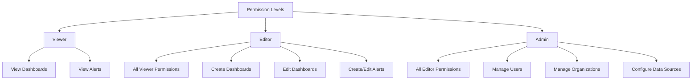
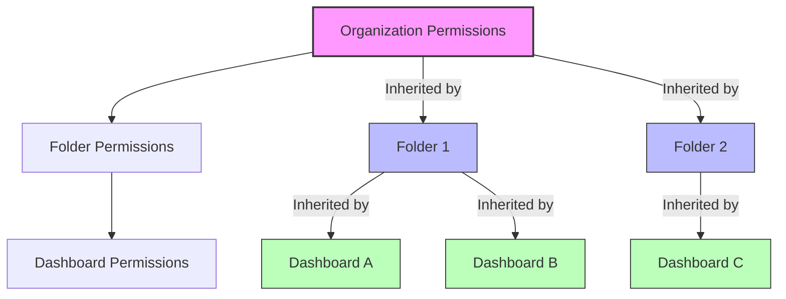

# User Permissions in Grafana

## Introduction

User permissions in Grafana are a fundamental aspect of security management that control what actions users can perform within the platform. When building dashboards and monitoring solutions, understanding how to properly configure permissions ensures that your Grafana instance remains secure while allowing teams to collaborate effectively.

In this guide, we'll explore Grafana's permission system, including basic and advanced permission concepts, role-based access control (RBAC), and best practices for implementing a secure permission structure.

## Understanding Permission Basics

### What Are Permissions?

Permissions in Grafana define what actions users can take and what resources they can access. These include:

- **Viewing** dashboards and panels
- **Editing** dashboards and panels
- **Creating** new dashboards
- **Administering** users and organizations
- **Accessing** specific data sources

Grafana implements a hierarchical permission system where access can be granted at the organization, folder, dashboard, and data source levels.

### Permission Levels

Grafana uses several permission levels:

1. **Viewer** - Can view dashboards but cannot modify them
2. **Editor** - Can create and modify dashboards
3. **Admin** - Has full control, including user management

Here's how these roles compare:



## Basic Permission Configuration

### Assigning User Roles

To assign a role to a user in the Grafana UI:

1. Navigate to **Configuration → Users**
2. Find the user you want to modify
3. Click the role dropdown and select the appropriate role
4. Save your changes

The following screenshot demonstrates where to find these settings:

```jsx
// Example UI component showing where to find user role settings
function UserRoleSettings() {
  return (
    <div className="user-settings-example">
      <div className="header">Configuration → Users</div>
      <table>
        <thead>
          <tr>
            <th>Username</th>
            <th>Email</th>
            <th>Role</th>
            <th>Actions</th>
          </tr>
        </thead>
        <tbody>
          <tr>
            <td>john.smith</td>
            <td>john.smith@example.com</td>
            <td>
              <select>
                <option>Viewer</option>
                <option selected>Editor</option>
                <option>Admin</option>
              </select>
            </td>
            <td>
              <button>Update</button>
            </td>
          </tr>
        </tbody>
      </table>
    </div>
  );
}
```

### API-Based Permission Management

You can also manage permissions programmatically using the Grafana API:

```bash
# Add user to team with specific role
curl -X POST -H "Content-Type: application/json" -H "Authorization: Bearer YOUR_API_KEY" \
  http://your-grafana-instance/api/teams/1/members \
  -d '{"userId": 2, "role": "Editor"}'

# Output: {"message":"Member added to Team"}
```

## Advanced Permission Features

### Role-Based Access Control (RBAC)

Starting with Grafana 9.0, Role-Based Access Control (RBAC) provides a more fine-grained permission system. RBAC allows you to:

- Create custom roles with specific permissions
- Assign multiple roles to users
- Define permissions at a very granular level

To enable RBAC in your `grafana.ini` configuration file:

```ini
[rbac]
enabled = true
```

### Creating Custom Roles

Custom roles allow you to define precise permission sets for different types of users:

```bash
# Create a custom role via API
curl -X POST -H "Content-Type: application/json" -H "Authorization: Bearer YOUR_API_KEY" \
  http://your-grafana-instance/api/access-control/roles \
  -d '{
    "name": "DashboardCreator",
    "description": "Can create but not delete dashboards",
    "version": 1,
    "permissions": [
      {"action": "dashboards:create", "scope": "dashboards:*"},
      {"action": "dashboards:write", "scope": "dashboards:*"},
      {"action": "dashboards:read", "scope": "dashboards:*"}
    ]
  }'

# Output: {"id":12,"name":"DashboardCreator","description":"Can create but not delete dashboards","version":1,"global":false,"updated":"2023-05-19T14:33:22Z","created":"2023-05-19T14:33:22Z"}
```

### Permission Inheritance

Permissions in Grafana typically follow an inheritance model. For example, permissions can be set at:

1. Organization level
2. Folder level
3. Dashboard level

Permissions defined at a lower level override permissions from higher levels.



## Configuring Dashboard Permissions

### Dashboard-Specific Permissions

To set permissions for a specific dashboard:

1. Navigate to the dashboard
2. Click the gear icon to open settings
3. Select "Permissions" tab
4. Click "Add Permission" button
5. Choose the user or team and permission level

Here's an example of setting dashboard permissions through the API:

```bash
# Add dashboard permission
curl -X POST -H "Content-Type: application/json" -H "Authorization: Bearer YOUR_API_KEY" \
  http://your-grafana-instance/api/dashboards/id/1/permissions \
  -d '{
    "items": [
      {
        "userId": 2,
        "permission": 1
      }
    ]
  }'

# Output: {"message":"Dashboard permissions updated","id":1,"title":"Main Dashboard"}
```

Where permission levels are:
- 1: View
- 2: Edit
- 4: Admin

### Folder Permissions

Organizing dashboards into folders allows for easier permission management:

1. Navigate to Dashboards → Manage
2. Click on a folder or create a new one
3. Click the cog icon to manage folder settings
4. Select "Permissions" tab
5. Add permissions for users or teams

```jsx
// Example UI component showing folder permission configuration
function FolderPermissions() {
  return (
    <div className="folder-permissions-example">
      <h3>Permissions for: Production Dashboards</h3>
      <table>
        <thead>
          <tr>
            <th>User/Team</th>
            <th>Permission</th>
            <th>Actions</th>
          </tr>
        </thead>
        <tbody>
          <tr>
            <td>DevOps Team</td>
            <td>Admin</td>
            <td><button>Remove</button></td>
          </tr>
          <tr>
            <td>Support Team</td>
            <td>Editor</td>
            <td><button>Remove</button></td>
          </tr>
          <tr>
            <td>All Users</td>
            <td>Viewer</td>
            <td><button>Remove</button></td>
          </tr>
        </tbody>
      </table>
      <button>+ Add Permission</button>
    </div>
  );
}
```

## Teams and User Groups

### Creating and Managing Teams

Teams in Grafana allow you to group users and assign permissions collectively:

1. Navigate to Configuration → Teams
2. Click "New Team"
3. Add users to the team
4. Assign permissions to the team rather than individual users

```bash
# Create a new team via API
curl -X POST -H "Content-Type: application/json" -H "Authorization: Bearer YOUR_API_KEY" \
  http://your-grafana-instance/api/teams \
  -d '{"name": "Backend Monitoring", "email": "backend@example.com"}'

# Output: {"teamId":2,"name":"Backend Monitoring","email":"backend@example.com","message":"Team created"}
```

### Team-Based Permissions

Assigning permissions to teams rather than individual users makes permission management more scalable:

```bash
# Assign permissions to a team for a folder
curl -X POST -H "Content-Type: application/json" -H "Authorization: Bearer YOUR_API_KEY" \
  http://your-grafana-instance/api/folders/1/permissions \
  -d '{
    "items": [
      {
        "teamId": 2,
        "permission": 2
      }
    ]
  }'

# Output: {"message":"Folder permissions updated","id":1,"title":"Production Dashboards"}
```

## Data Source Permissions

### Restricting Data Source Access

You can limit which users can access specific data sources:

1. Navigate to Configuration → Data Sources
2. Select the data source
3. Go to the "Permissions" tab
4. Add permission rules for users or teams

To enable data source permissions, you must first configure this in your `grafana.ini`:

```ini
[datasources]
# Restrict users to only use data sources they have been given access to
datasource_permissions = true
```

### Query-Level Permissions

Some data sources support query-level permissions through query variables:

```sql
-- Example Postgres query with row-level security
SELECT * FROM metrics 
WHERE project_id IN (
  SELECT project_id FROM user_projects WHERE user_id = $__user.id
)
```

## Service Accounts

### Creating Service Accounts

Service accounts allow you to create non-user identities for automated processes:

1. Navigate to Configuration → Service Accounts
2. Click "Add service account"
3. Configure the service account name and role
4. Generate a token for the service account

```bash
# Create a service account via API
curl -X POST -H "Content-Type: application/json" -H "Authorization: Bearer YOUR_API_KEY" \
  http://your-grafana-instance/api/serviceaccounts \
  -d '{
    "name": "Automation Account",
    "role": "Editor"
  }'

# Output: {"id":2,"name":"Automation Account","login":"sa-automation","role":"Editor","tokens":0}
```

### Token Management

Service account tokens are used for authentication and have specific permissions:

```bash
# Create token for service account
curl -X POST -H "Content-Type: application/json" -H "Authorization: Bearer YOUR_API_KEY" \
  http://your-grafana-instance/api/serviceaccounts/2/tokens \
  -d '{
    "name": "Deployment Token",
    "role": "Editor"
  }'

# Output: {"id":1,"name":"Deployment Token","key":"eyJrIjoiWHg5WmxUdXJQYnFreEZkSk5KOGRrOUpYb2tDVlV3UnciLCJuIjoiRGVwbG95bWVudCBUb2tlbiIsImlkIjoxfQ=="}
```

## Best Practices for Permission Management

### Principle of Least Privilege

Always assign the minimum permissions necessary for users to perform their tasks:

- Viewers for those who only need to see dashboards
- Editors for those who need to create and modify dashboards
- Admin only for trusted administrators

### Audit and Review

Regularly review user permissions to ensure they remain appropriate:

```bash
# Get all users with their roles
curl -H "Authorization: Bearer YOUR_API_KEY" \
  http://your-grafana-instance/api/users

# Output: [{"id":1,"name":"Admin","login":"admin","email":"admin@example.com","role":"Admin"}]
```

### Using Default Permissions

Set appropriate default permissions at the organization level:

1. Navigate to Configuration → Preferences
2. Set default role for new users
3. Configure home dashboard for different roles

### Permission Documentation

Maintain documentation of your permission structure:

```jsx
// Example permission matrix component
function PermissionMatrix() {
  return (
    <div className="permission-matrix">
      <table>
        <thead>
          <tr>
            <th>Team/Group</th>
            <th>Production Dashboards</th>
            <th>Development Dashboards</th>
            <th>User Analytics</th>
          </tr>
        </thead>
        <tbody>
          <tr>
            <td>DevOps</td>
            <td>Admin</td>
            <td>Admin</td>
            <td>Viewer</td>
          </tr>
          <tr>
            <td>Developers</td>
            <td>Viewer</td>
            <td>Editor</td>
            <td>No Access</td>
          </tr>
          <tr>
            <td>Product Managers</td>
            <td>Viewer</td>
            <td>Viewer</td>
            <td>Admin</td>
          </tr>
        </tbody>
      </table>
    </div>
  );
}
```

## Troubleshooting Permission Issues

### Common Permission Problems

Here are solutions to common permission issues:

#### User Cannot See Dashboard

1. Check if the user has at least Viewer permissions for the dashboard
2. Verify the user is a member of a team with access
3. Check folder permissions if the dashboard is in a folder

#### User Cannot Edit Dashboard

```bash
# Check dashboard permissions
curl -H "Authorization: Bearer YOUR_API_KEY" \
  http://your-grafana-instance/api/dashboards/id/1/permissions

# Output: {"items":[{"id":1,"dashboardId":1,"userId":1,"permission":4,"permissionName":"Admin"}]}
```

#### Data Source Connection Failed

If a user cannot access a data source, verify:

1. The user has permission to access the data source
2. The data source permissions are enabled in `grafana.ini`
3. The service account or API key has appropriate scopes

## Summary

User permissions in Grafana provide a powerful system for controlling access to dashboards, folders, and data sources. By understanding the basic roles (Viewer, Editor, Admin) and leveraging advanced features like RBAC, teams, and service accounts, you can create a secure and manageable permission structure.

Remember these key points:

- Follow the principle of least privilege
- Use teams to manage permissions at scale
- Leverage folder structure for logical permission grouping
- Document your permission structure
- Regularly audit permissions

By implementing these practices, you'll create a secure Grafana environment that balances security with usability and enables effective collaboration among your teams.

## Additional Resources

- Grafana Official Documentation: [Permissions Overview](https://grafana.com/docs/grafana/latest/administration/roles-and-permissions/)
- Grafana API: [Permission Endpoints](https://grafana.com/docs/grafana/latest/developers/http_api/)

## Exercises

1. Create a permission structure for a hypothetical organization with Development, QA, and Production dashboards.
2. Set up a team-based permission system for a folder structure.
3. Create a service account with limited permissions for an automated dashboard deployment process.
4. Configure row-level security in a SQL data source based on user attributes.
5. Design and implement a permission audit workflow for your Grafana instance.