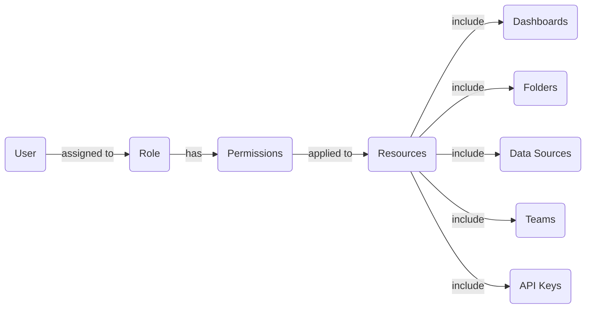

# Role-Based Access Control

## Introduction

Role-Based Access Control (RBAC) is a security mechanism that regulates system access based on the roles assigned to individual users within an organization. In Grafana, RBAC allows administrators to define permissions at a granular level, ensuring users have appropriate access to resources based on their responsibilities.

Unlike simple user-based permissions, RBAC creates a layer of abstraction between users and permissions through roles, making access management more scalable and easier to audit. This is especially important in environments where multiple teams access the same Grafana instance but require different levels of access to dashboards, data sources, and administrative functions.

## Understanding RBAC Concepts

Before diving into the implementation details, let's understand the key concepts in Grafana's RBAC model:

### Core RBAC Components

1. **Users**: Individual accounts that access the Grafana system
2. **Roles**: Collections of permissions that define what actions can be performed
3. **Permissions**: Specific actions that can be performed on resources
4. **Resources**: Objects in Grafana that can be accessed or modified (dashboards, folders, data sources, etc.)

### How RBAC Works in Grafana



In this model, permissions are not assigned directly to users but to roles. Users are then assigned to appropriate roles, which grants them the associated permissions. This abstraction makes it easier to manage access as your organization grows.

## Basic RBAC Setup in Grafana

RBAC is available in Grafana Enterprise and in Grafana OSS (with limitations). Let's start with the basics of setting up RBAC.

### Prerequisites

- Grafana v8.0 or later
- Administrator access to Grafana
- For full RBAC functionality: Grafana Enterprise license

### Enabling RBAC

RBAC can be enabled through Grafana's configuration:

```ini
[rbac]
enabled = true
```

This setting can be added to your `grafana.ini` file or set as an environment variable:

```bash
GF_RBAC_ENABLED=true
```

## Default Roles in Grafana

Grafana comes with several built-in roles that cover common use cases:

| Role | Description |
|------|-------------|
| Admin | Full access to all resources |
| Editor | Can create and modify dashboards and alerts |
| Viewer | Can view dashboards but cannot modify them |
| Grafana Admin | Can perform Grafana-specific admin tasks |

### Viewing Built-in Roles

You can view all available roles through the API or UI. Here's how to get roles using the API:

```bash
curl -X GET -H "Authorization: Bearer your-api-key" http://your-grafana-instance/api/access-control/roles
```

The response will include all available roles:

```json
{
  "page": 1,
  "perPage": 100,
  "totalCount": 4,
  "roles": [
    {
      "version": 1,
      "uid": "basic_viewer",
      "name": "basic:viewer",
      "displayName": "Basic Viewer",
      "description": "View everything in the organization",
      "group": "Basic",
      "updated": "2022-03-20T15:24:00Z",
      "created": "2022-03-20T15:24:00Z"
    },
    // Other roles...
  ]
}
```

## Creating Custom Roles

For more specific access control needs, you can create custom roles. This is most easily done through the Grafana UI, but can also be accomplished via the API.

### Using the UI

1. Navigate to **Administration** → **Users and access** → **Roles**
2. Click **New role**
3. Fill in the role details:
   - Name: Unique identifier for the role
   - Description: Helpful explanation of the role's purpose
4. Select the permissions to assign to this role
5. Click **Create**

### Using the API

To create a custom role via the API:

```bash
curl -X POST -H "Content-Type: application/json" -H "Authorization: Bearer your-api-key" \
  http://your-grafana-instance/api/access-control/roles \
  -d '{
    "name": "custom:dashboard-creator",
    "description": "Can create and edit dashboards in specific folders",
    "permissions": [
      {
        "action": "dashboards:create",
        "scope": "folders:uid:nErXDvCkzz"
      },
      {
        "action": "dashboards:write",
        "scope": "folders:uid:nErXDvCkzz"
      },
      {
        "action": "dashboards:read",
        "scope": "folders:uid:nErXDvCkzz"
      }
    ]
  }'
```

This example creates a role that can create, edit, and view dashboards within a specific folder.

## Understanding Permissions and Scopes

Grafana's RBAC system uses a combination of **actions** and **scopes** to define permissions:

- **Actions**: What can be done (e.g., `dashboards:create`, `datasources:read`)
- **Scopes**: Where the action can be performed (e.g., specific folders or dashboards)

### Common Permission Actions

Here are some frequently used permission actions:

| Action | Description |
|--------|-------------|
| `dashboards:create` | Create new dashboards |
| `dashboards:write` | Edit existing dashboards |
| `dashboards:read` | View dashboards |
| `folders:create` | Create folders |
| `datasources:read` | View data sources |
| `datasources:write` | Edit data sources |
| `users:read` | View users |
| `users:write` | Edit users |

### Scope Formats

Scopes can be defined in several formats:

- Global scope: `*` (applies to all resources of that type)
- Resource-specific: `folders:uid:nErXDvCkzz` (applies to a specific folder)
- ID-based: `dashboards:id:42` (applies to a dashboard with ID 42)

## Assigning Roles to Users

After creating roles, you need to assign them to users. This can be done through the UI or API.

### Using the UI

1. Navigate to **Administration** → **Users and access** → **Users**
2. Find the user you want to assign roles to and click on their row
3. Go to the **Roles** tab
4. Add or remove roles as needed
5. Click **Update**

### Using the API

To assign a role to a user via the API:

```bash
curl -X POST -H "Content-Type: application/json" -H "Authorization: Bearer your-api-key" \
  http://your-grafana-instance/api/access-control/users/{userId}/roles \
  -d '{
    "roleUid": "custom:dashboard-creator"
  }'
```

Replace `{userId}` with the actual user ID and `custom:dashboard-creator` with your role UID.

## Practical Examples

Let's look at some common RBAC scenarios in Grafana:

### Example 1: Team-Based Dashboard Access

Imagine you have different teams (Development, Operations, Security) that need different levels of access to dashboards.

1. Create team-specific folders:
   - `Development Dashboards`
   - `Operations Dashboards`
   - `Security Dashboards`

2. Create custom roles:

```bash
# Create Developer role
curl -X POST -H "Content-Type: application/json" -H "Authorization: Bearer your-api-key" \
  http://your-grafana-instance/api/access-control/roles \
  -d '{
    "name": "custom:developer",
    "description": "Developer access to specific dashboards",
    "permissions": [
      {
        "action": "dashboards:read",
        "scope": "folders:uid:dev-folder-uid"
      },
      {
        "action": "dashboards:write",
        "scope": "folders:uid:dev-folder-uid"
      }
    ]
  }'
```

3. Assign roles to appropriate team members

### Example 2: Read-Only Data Source Access

For security reasons, you might want most users to only read data sources, not modify them:

```bash
# Create data source viewer role
curl -X POST -H "Content-Type: application/json" -H "Authorization: Bearer your-api-key" \
  http://your-grafana-instance/api/access-control/roles \
  -d '{
    "name": "custom:datasource-viewer",
    "description": "Can view but not modify data sources",
    "permissions": [
      {
        "action": "datasources:read",
        "scope": "*"
      }
    ]
  }'
```

### Example 3: Dashboard Creator without Admin Access

Create a role for users who should be able to create dashboards but not modify system settings:

```bash
# Create dashboard creator role
curl -X POST -H "Content-Type: application/json" -H "Authorization: Bearer your-api-key" \
  http://your-grafana-instance/api/access-control/roles \
  -d '{
    "name": "custom:dashboard-creator",
    "description": "Can create dashboards in any folder",
    "permissions": [
      {
        "action": "dashboards:create",
        "scope": "*"
      },
      {
        "action": "dashboards:write",
        "scope": "*"
      },
      {
        "action": "dashboards:read",
        "scope": "*"
      },
      {
        "action": "folders:read",
        "scope": "*"
      }
    ]
  }'
```

## Managing RBAC with Service Accounts

For automated systems that need to access Grafana, service accounts provide a secure way to implement RBAC without using personal accounts:

1. Create a service account:

```bash
curl -X POST -H "Content-Type: application/json" -H "Authorization: Bearer your-api-key" \
  http://your-grafana-instance/api/serviceaccounts \
  -d '{
    "name": "dashboard-automation",
    "role": "Editor"
  }'
```

2. Generate a token for the service account:

```bash
curl -X POST -H "Content-Type: application/json" -H "Authorization: Bearer your-api-key" \
  http://your-grafana-instance/api/serviceaccounts/{serviceAccountId}/tokens \
  -d '{
    "name": "automation-token"
  }'
```

3. Assign specific roles to the service account for more granular control

## Best Practices for RBAC in Grafana

Follow these best practices to maintain a secure and manageable RBAC setup:

### Principle of Least Privilege

Assign users the minimum permissions needed to perform their tasks. This reduces the potential impact of account compromise.

### Regular Audits

Periodically review roles and permissions to ensure they align with current organizational needs:

```bash
# Get all role assignments for audit
curl -X GET -H "Authorization: Bearer your-api-key" \
  http://your-grafana-instance/api/access-control/users/role-assignments
```

### Role Naming Conventions

Adopt a consistent naming convention for custom roles to make management easier:

- `team:role` (e.g., `engineering:viewer`, `marketing:editor`)
- `function:role` (e.g., `dashboard:creator`, `alert:manager`)

### Documentation

Maintain documentation of your RBAC structure, including:
- Role definitions and their intended use
- Custom permission sets
- Assignment policies

## Troubleshooting RBAC Issues

If users report access problems, use these troubleshooting steps:

### Checking User Roles

Verify what roles are assigned to a user:

```bash
curl -X GET -H "Authorization: Bearer your-api-key" \
  http://your-grafana-instance/api/access-control/users/{userId}/roles
```

### Role Permission Verification

Check what permissions a role has:

```bash
curl -X GET -H "Authorization: Bearer your-api-key" \
  http://your-grafana-instance/api/access-control/roles/{roleUID}
```

### Enabling Debug Logging

For deeper troubleshooting, enable RBAC debug logging in `grafana.ini`:

```ini
[log]
filters = rbac:debug
```

## Summary

Role-Based Access Control in Grafana provides a flexible and powerful way to manage access to resources based on user roles. By abstracting permissions through roles, you can create a scalable security model that:

- Enforces the principle of least privilege
- Simplifies user management
- Improves security auditing
- Aligns access with organizational structure

Whether you're managing a small team or a large enterprise, implementing RBAC helps ensure that users have appropriate access to the resources they need without compromising security.

## Additional Resources

- [Grafana Official RBAC Documentation](https://grafana.com/docs/grafana/latest/administration/roles-and-permissions/access-control/)
- [Grafana API Reference for RBAC](https://grafana.com/docs/grafana/latest/developers/http_api/access_control/)

## Exercises

1. **Basic Setup Exercise**: Enable RBAC in your Grafana instance and explore the default roles.

2. **Custom Role Creation**: Create a custom role that can only view and create dashboards in a specific folder.

3. **Permission Audit**: Write a script to generate a report of all user role assignments in your Grafana instance.

4. **Service Account Implementation**: Create a service account for an automated dashboard creation process with appropriate permissions.