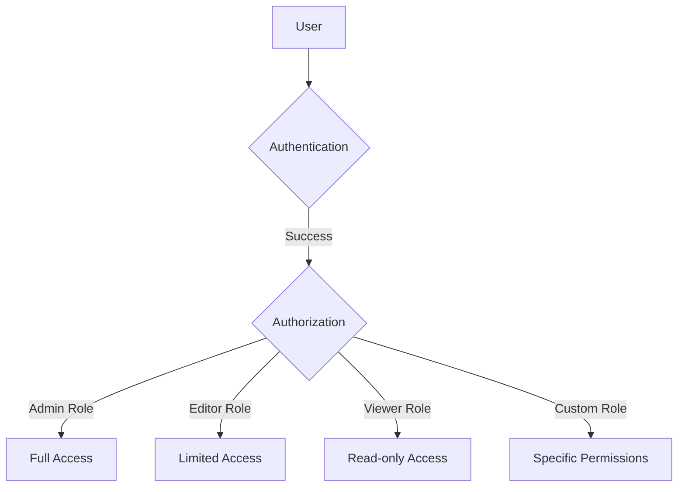

# Sensitive Data Handling

## Introduction

When working with Grafana, you'll often encounter sensitive data that requires special handling to maintain security and compliance. Sensitive data includes personally identifiable information (PII), authentication credentials, API keys, and other confidential information that could be harmful if exposed. This guide will help you understand how to properly manage sensitive data within your Grafana deployment.

## What Constitutes Sensitive Data in Grafana?

Grafana instances frequently handle several types of sensitive data:

- **Authentication credentials**: Database passwords, API keys, service account tokens
- **Personal information**: User emails, names, and other PII
- **Monitoring data**: Information about internal systems, IP addresses, and infrastructure details
- **Business metrics**: Financial data, user statistics, and other proprietary information
- **Configuration secrets**: Encryption keys, certificates, and security settings

## Sensitive Data Storage Best Practices

### Environment Variables

One of the safest methods for handling sensitive information is through environment variables. Instead of hardcoding credentials in configuration files, reference environment variables.

```bash
# Setting environment variables
export GF_SECURITY_ADMIN_PASSWORD=securepassword
export GF_DATABASE_PASSWORD=dbpassword

# Starting Grafana with these variables
grafana-server
```

In your Grafana configuration file (`grafana.ini`), you can reference these variables:

```ini
[database]
password = ${GF_DATABASE_PASSWORD}

[security]
admin_password = ${GF_SECURITY_ADMIN_PASSWORD}
```

### Secrets Management

For production environments, consider using dedicated secrets management tools:

- **HashiCorp Vault**: Securely store and manage access to tokens, passwords, and certificates
- **AWS Secrets Manager/Azure Key Vault/Google Secret Manager**: Cloud-based secret management solutions
- **Kubernetes Secrets**: If running Grafana in Kubernetes

### Example: Integrating with HashiCorp Vault

Here's how to set up Grafana to use HashiCorp Vault for secrets:

```bash
# Install Vault agent
sudo apt-get install vault

# Configure Vault agent
cat > vault-agent-config.hcl << EOF
vault {
  address = "https://vault.example.com:8200"
}

auto_auth {
  method "approle" {
    config = {
      role_id_file_path = "/etc/vault/roleid"
      secret_id_file_path = "/etc/vault/secretid"
    }
  }
}

template {
  source = "/etc/grafana/grafana.ini.tpl"
  destination = "/etc/grafana/grafana.ini"
}
EOF

# Create a template for Grafana config
cat > grafana.ini.tpl << EOF
[database]
password = "{{ with secret "secret/data/grafana/db" }}{{ .Data.data.password }}{{ end }}"

[security]
admin_password = "{{ with secret "secret/data/grafana/admin" }}{{ .Data.data.password }}{{ end }}"
EOF
```

## Encryption of Sensitive Data

Grafana provides mechanisms to encrypt sensitive data at rest.

### Data Source Proxy Secrets

Grafana encrypts data source credentials using an encryption key specified in your configuration:

```ini
[security]
# Encryption key used to encrypt secrets and other sensitive data
secret_key = your-secret-key-here
```

Always change the default secret key to a strong, unique value in production environments.

### Database Encryption

For database-level encryption:

1. Set up TLS for your database connection
2. Configure encryption at rest for your database (depends on your database provider)
3. Use column-level encryption for sensitive fields if supported

## Safe API Key Management

Grafana uses API keys for authentication with various services. Here are best practices for managing them:

### Token Rotation

Regularly rotate API keys to limit potential damage from compromised credentials:

```javascript
// Example function to automatically rotate API keys (pseudo-code)
function rotateApiKeys() {
  // Get all current API keys
  const keys = grafanaApi.getApiKeys();
  
  // For each key that's older than 90 days
  keys.filter(key => key.age > 90).forEach(key => {
    // Create a new key with the same permissions
    const newKey = grafanaApi.createApiKey({
      name: `${key.name}_new`,
      role: key.role
    });
    
    // Update services using this key
    updateServicesWithNewKey(key.name, newKey.key);
    
    // Delete the old key
    grafanaApi.deleteApiKey(key.id);
  });
}
```

### Service Account Tokens

Instead of API keys, consider using service account tokens which provide better auditing capabilities:

```bash
# Create a service account using Grafana CLI
grafana-cli admin create-service-account "Monitoring System" monitoring-system --role Editor
```

## Access Control for Sensitive Data

Proper access control ensures sensitive data is only accessible to authorized users.

### Role-Based Access Control

Configure RBAC to limit access to sensitive dashboards and data sources:



### Example RBAC Configuration

Here's how to implement RBAC in Grafana:

```ini
[auth]
# Enable RBAC
rbac = true

# Set default role
rbac_default_role = Viewer
```

Create custom roles with specific permissions:

```javascript
// Example API call to create a custom role (using Grafana HTTP API)
fetch('http://your-grafana-instance/api/access-control/roles', {
  method: 'POST',
  headers: {
    'Content-Type': 'application/json',
    'Authorization': 'Bearer your-admin-token'
  },
  body: JSON.stringify({
    name: 'DataAnalyst',
    description: 'Can view and query financial dashboards',
    permissions: [
      {
        action: 'dashboards:read',
        scope: 'dashboards:uid:finance-*'
      },
      {
        action: 'datasources:query',
        scope: 'datasources:uid:sales-db'
      }
    ]
  })
})
```

## Data Masking and Anonymization

For sensitive data that appears in dashboards or logs, implement data masking:

### Log Redaction

Configure log redaction to automatically mask sensitive information:

```ini
[log]
filters = filters.conf
```

In `filters.conf`:

```ini
# Redact email addresses
filter = \b[A-Za-z0-9._%+-]+@[A-Za-z0-9.-]+\.[A-Z|a-z]{2,}\b
pattern = email
replace = [EMAIL REDACTED]

# Redact IP addresses
filter = \b\d{1,3}\.\d{1,3}\.\d{1,3}\.\d{1,3}\b
pattern = ip_address
replace = [IP REDACTED]
```

### Dashboard Data Anonymization

When displaying sensitive data in dashboards, use transformation functions to mask it:

```sql
-- Example SQL query with data masking
SELECT 
  CONCAT(LEFT(username, 2), '***') AS masked_username,
  COUNT(action) AS action_count
FROM user_activity
GROUP BY masked_username
```

## Secure Data Transmission

Protect data in transit using encryption:

### TLS Configuration

Always enable HTTPS for your Grafana instance:

```ini
[server]
protocol = https
cert_file = /path/to/cert.pem
cert_key = /path/to/cert.key
```

### Example Docker Compose with HTTPS

```yaml
version: '3'
services:
  grafana:
    image: grafana/grafana:latest
    ports:
      - "443:3000"
    volumes:
      - ./certs:/certs
      - ./grafana.ini:/etc/grafana/grafana.ini
    environment:
      - GF_SERVER_PROTOCOL=https
      - GF_SERVER_CERT_FILE=/certs/cert.pem
      - GF_SERVER_CERT_KEY=/certs/cert.key
```

## Auditing and Monitoring

Set up comprehensive auditing to track access to sensitive data:

### Enable Audit Logs

```ini
[auditing]
enabled = true
log_outputs = file
# Specify what to log
max_backups = 30
max_days = 90
```

### Example: Monitoring for Suspicious Access

Create an alert rule to detect multiple failed login attempts:

```yaml
# Alert rule definition
apiVersion: 1
groups:
  - name: Security
    rules:
      - alert: MultipleFailedLogins
        expr: sum(increase(grafana_failed_logins_total[5m])) by (username) > 5
        for: 1m
        labels:
          severity: critical
        annotations:
          summary: Multiple failed login attempts
          description: "{{ $labels.username }} has {{ $value }} failed login attempts in the last 5 minutes"
```

## Compliance Requirements

Different industries have specific compliance requirements for handling sensitive data:

| Regulation | Requirements for Grafana |
|------------|--------------------------|
| GDPR       | Data minimization, Right to be forgotten, Data protection |
| HIPAA      | PHI encryption, Access controls, Audit trails |
| PCI DSS    | Cardholder data protection, Network security, Vulnerability management |
| SOC 2      | Security, Availability, Processing integrity, Confidentiality, Privacy |

### Implementing GDPR Compliance

```javascript
// Example function to handle GDPR "right to be forgotten" requests
async function handleUserDeletion(userId) {
  try {
    // 1. Delete user account
    await grafanaApi.deleteUser(userId);
    
    // 2. Anonymize user data in logs
    await anonymizeUserInLogs(userId);
    
    // 3. Remove user from all dashboards
    await removeUserFromDashboards(userId);
    
    // 4. Document the deletion for compliance
    await logComplianceAction({
      action: 'user_deletion',
      userId: userId,
      timestamp: new Date(),
      reason: 'GDPR request'
    });
    
    return { success: true };
  } catch (error) {
    console.error('Error handling user deletion:', error);
    return { success: false, error };
  }
}
```

## Data Retention Policies

Implement data retention policies to limit exposure of sensitive data:

### Configuring Data Retention

```ini
[dashboards]
versions_to_keep = 5

[users]
login_maximum_inactive_lifetime_days = 30
login_maximum_lifetime_days = 90
```

## Common Security Pitfalls

Avoid these common mistakes when handling sensitive data in Grafana:

1. **Hardcoding credentials** in dashboard queries or configuration files
2. **Storing sensitive data in dashboard text panels** or annotations
3. **Excessive permissions** for service accounts and API keys
4. **Inconsistent access controls** across different parts of the application
5. **Neglecting to rotate credentials** on a regular basis

## Real-World Example: Healthcare Monitoring System

Let's walk through configuring a Grafana instance for a healthcare monitoring system that needs to handle patient data securely:

```ini
# grafana.ini for healthcare monitoring
[server]
protocol = https
cert_file = /certs/healthcare-cert.pem
cert_key = /certs/healthcare-key.pem
enforce_domain = true
cookie_secure = true
cookie_samesite = strict

[security]
secret_key = ${GF_SECURITY_KEY}
disable_gravatar = true
cookie_secure = true
strict_transport_security = true
content_security_policy = true
x_content_type_options = true
x_xss_protection = true

[auth]
disable_login_form = false
oauth_auto_login = false
disable_signout_menu = false

[users]
allow_sign_up = false
auto_assign_org_role = Viewer
login_maximum_inactive_lifetime_days = 30
login_maximum_lifetime_days = 90

[analytics]
reporting_enabled = false
check_for_updates = true

[auditing]
enabled = true
log_outputs = file,syslog
```

## Summary

Proper handling of sensitive data in Grafana requires a multi-layered approach:

1. **Identify** sensitive data in your environment
2. **Encrypt** data at rest and in transit
3. **Control access** using RBAC and least privilege principles
4. **Audit** access and changes to sensitive data
5. **Rotate** credentials regularly
6. **Mask** sensitive data in logs and dashboards
7. **Comply** with relevant regulations
8. **Monitor** for security incidents

By implementing these practices, you can create a secure Grafana environment that protects sensitive data while still enabling powerful monitoring and visualization capabilities.

## Additional Resources

- [Grafana Security Documentation](https://grafana.com/docs/grafana/latest/setup-grafana/configure-security/)
- [OWASP Top Ten Project](https://owasp.org/www-project-top-ten/)
- [NIST Cybersecurity Framework](https://www.nist.gov/cyberframework)
- [GDPR Compliance Checklist](https://gdpr.eu/checklist/)

## Practice Exercises

1. Set up a Grafana instance with HTTPS and proper authentication
2. Configure role-based access control for different user types
3. Implement data masking for a dashboard containing user information
4. Create an audit trail for sensitive operations
5. Develop a credential rotation plan for your Grafana data sources