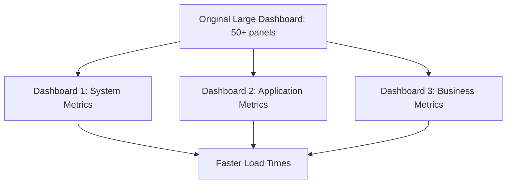

# Performance Optimization

## Introduction

Performance optimization in Grafana is the process of improving the speed, efficiency, and resource utilization of your dashboards, queries, and overall Grafana instance. As monitoring needs grow and dashboards become more complex, ensuring that Grafana performs well becomes increasingly important. This guide will walk you through various techniques and best practices to optimize Grafana's performance, enhancing the user experience and making your monitoring infrastructure more efficient.

## Why Performance Matters

Poor performance in Grafana can lead to several issues:

- Slow dashboard loading times frustrate users
- High resource consumption on your servers
- Timeouts on complex queries
- Difficulty in real-time monitoring during critical situations
- Poor user adoption of your monitoring solutions

By implementing performance optimization techniques, you can create a more responsive, reliable, and scalable monitoring system.

## Dashboard Optimization Techniques

### 1. Limit the Time Range

One of the simplest ways to improve dashboard performance is to limit the default time range of your dashboards.

```jsx
// Example in provisioning YAML
apiVersion: 1
dashboards:
  - name: 'Performance Dashboard'
    time_options: ['5m', '15m', '1h', '6h', '12h', '24h', '2d', '7d', '30d']
    refresh_intervals: ['5s', '10s', '30s', '1m', '5m', '15m', '30m', '1h']
    time_from: '6h'
```

### 2. Use Template Variables Efficiently

Template variables allow for flexibility in your dashboards but can impact performance when used inefficiently.

**Good Practice:**
```sql
-- Efficient template variable query
SELECT DISTINCT host FROM metrics WHERE datacenter = '$datacenter' LIMIT 100
```

**Avoid:**
```sql
-- Inefficient template variable query that retrieves too much data
SELECT host FROM metrics
```

### 3. Implement Dashboard Caching

Grafana offers caching mechanisms to reduce the load on your data sources.

```jsx
// In grafana.ini
[panels]
enable_cache = true
cache_ttl = 60  # Cache time-to-live in seconds
```

### 4. Optimize Panel Count and Layout

Too many panels on a single dashboard can significantly slow down loading times.

**Best Practices:**
- Limit dashboards to 20-25 panels
- Use row collapsing for less important metrics
- Consider splitting very large dashboards into multiple focused ones



## Query Optimization

### 1. Time Series Aggregation

When dealing with large time ranges, use aggregation to reduce data points.

**Prometheus Example:**
```jsx
// Before optimization
rate(http_requests_total[5m])

// After optimization - aggregates by instance
sum by (instance) (rate(http_requests_total[5m]))
```

### 2. Limit Returned Series

For metrics with high cardinality, limit the number of series returned.

**PromQL Example:**
```jsx
// Before
http_requests_total{job="api"}

// After - limiting to top 5 busiest endpoints
topk(5, sum by(endpoint) (rate(http_requests_total{job="api"}[5m])))
```

### 3. Optimize SQL Queries

When using SQL-based data sources, ensure your queries are efficient.

**MySQL Example:**
```sql
-- Before optimization
SELECT * FROM server_metrics WHERE time > NOW() - INTERVAL 24 HOUR

-- After optimization
SELECT 
  time, 
  cpu_usage,
  memory_usage
FROM server_metrics
WHERE time > NOW() - INTERVAL 24 HOUR
ORDER BY time
LIMIT 1000
```

### 4. Use Correct Functions for Your Use Case

Different visualization needs require different query approaches.

**Time Series Example:**
```jsx
// For spotting anomalies, use raw data with reasonable limits
query = 'cpu_usage{instance="$instance"}'

// For trends, use aggregation
query = 'avg_over_time(cpu_usage{instance="$instance"}[1h])'
```

## Server-Side Optimization

### 1. Resource Allocation

Ensure your Grafana server has adequate resources.

**Recommended Minimum Specifications:**
- 2 CPU cores
- 4GB RAM
- SSD storage

For larger installations:
- 4-8 CPU cores
- 8-16GB RAM
- Consider horizontal scaling

### 2. Database Optimization

Grafana uses a database to store its configuration. Optimizing this database can improve performance.

**MySQL Example:**
```sql
-- Add indexes to frequently queried tables
ALTER TABLE dashboard ADD INDEX (org_id, folder_id, title);
```

### 3. Configure Image Rendering Appropriately

If you use server-side image rendering, optimize its settings.

```jsx
// In grafana.ini
[rendering]
server_max_concurrent_renderings = 5
```

### 4. Use Persistent Connections

Configure your data sources to use persistent connections when possible.

```jsx
// In grafana.ini
[database]
max_idle_conn = 10
max_open_conn = 30
```

## Real-World Example: Optimizing a System Monitoring Dashboard

Let's walk through optimizing a system monitoring dashboard that's experiencing performance issues.

### Initial State:
- Dashboard has 40+ panels
- Default time range is 7 days
- Many raw metrics without aggregation
- Several complex RegEx-based variables

### Optimization Steps:

1. **Restructure Dashboard**
   Split into three focused dashboards: System Overview, Detailed Metrics, and Alerts/Events

2. **Optimize Queries**
   ```jsx
   // Before
   node_cpu_seconds_total{job="node_exporter"}
   
   // After
   avg by (instance, mode) (rate(node_cpu_seconds_total{job="node_exporter"}[5m]))
   ```

3. **Improve Variables**
   ```jsx
   // Before - slow, complex regex
   label_values(node_cpu_seconds_total{job="node_exporter", instance=~".*"}, instance)
   
   // After - faster, targeted query
   label_values(node_up{job="node_exporter"}, instance)
   ```

4. **Set Appropriate Time Window**
   Change default time range from 7 days to 24 hours with quick access to longer ranges via time picker

5. **Implement Caching**
   Add query caching with a 30-second TTL for most panels

6. **Results:**
   - Dashboard load time reduced from 12s to 2.5s
   - Server CPU usage during dashboard loading reduced by 70%
   - More focused, easier to navigate dashboards

## Advanced Techniques

### 1. Use the Logs Data Source Wisely

When working with logs, use appropriate filtering.

```jsx
// Bad practice
{job="application"}

// Good practice
{job="application", level=~"error|warning"} | json
```

### 2. Implement Data Source Proxying

Configure Grafana to proxy data source requests to reduce browser-to-data-source connections.

```jsx
// In data source configuration
{
  "name": "Prometheus",
  "type": "prometheus",
  "url": "http://prometheus:9090",
  "access": "proxy",  // Use proxy instead of direct
}
```

### 3. Utilize AlertManager for Alerts

Instead of repeatedly querying for alert conditions in panels, use AlertManager.

```jsx
// Alert rule definition
{
  "name": "High CPU Usage",
  "type": "prometheus",
  "query": "instance:node_cpu_utilization:rate5m > 0.8",
  "for": "5m",
  "labels": {
    "severity": "warning"
  },
  "annotations": {
    "summary": "High CPU usage detected",
    "description": "CPU usage for {{$labels.instance}} is above 80% for more than 5 minutes."
  }
}
```

## Performance Testing Tools

To objectively measure your optimizations, use these tools:

1. **Grafana's Built-in Metrics**
   Enable Grafana's internal metrics endpoint:

   ```jsx
   // In grafana.ini
   [metrics]
   enabled = true
   ```

2. **Query Inspector**
   Use Grafana's Query Inspector to check execution times for panels

3. **Browser Developer Tools**
   Analyze network requests and rendering performance

## Troubleshooting Common Performance Issues

### Issue: Dashboard Takes Too Long to Load

**Possible causes and solutions:**
- Too many panels → Split dashboard
- Inefficient queries → Optimize with aggregation
- Large time range → Reduce default time range

### Issue: High Cardinality Problems

**Possible causes and solutions:**
- Too many unique series → Use `topk()` or `bottomk()`
- Inefficient labels → Redesign your metrics collection

### Issue: Server Resource Constraints

**Possible causes and solutions:**
- Insufficient CPU/RAM → Upgrade hardware or scale horizontally
- Database bottlenecks → Optimize database queries and indexing

## Summary

Performance optimization in Grafana involves a combination of dashboard design, query efficiency, and server configuration. By implementing the techniques covered in this guide, you can significantly improve the user experience and resource efficiency of your Grafana installation.

Remember these key points:
- Limit panel count and time ranges
- Optimize queries with aggregation and filtering
- Configure appropriate caching
- Allocate sufficient server resources
- Regularly test and measure performance

## Additional Resources

- Experiment with the official Grafana [Play site](https://play.grafana.org) to test optimization techniques
- Review the Grafana documentation on provisioning and configuration
- Join the Grafana community forums to share experiences and get advice

## Practice Exercises

1. Take an existing dashboard and identify 3 specific optimizations you could apply
2. Benchmark a dashboard's load time before and after applying aggregation to queries
3. Create a monitoring dashboard for your Grafana instance itself, tracking key performance metrics
4. Experiment with different panel refresh rates to find the optimal balance between freshness and performance