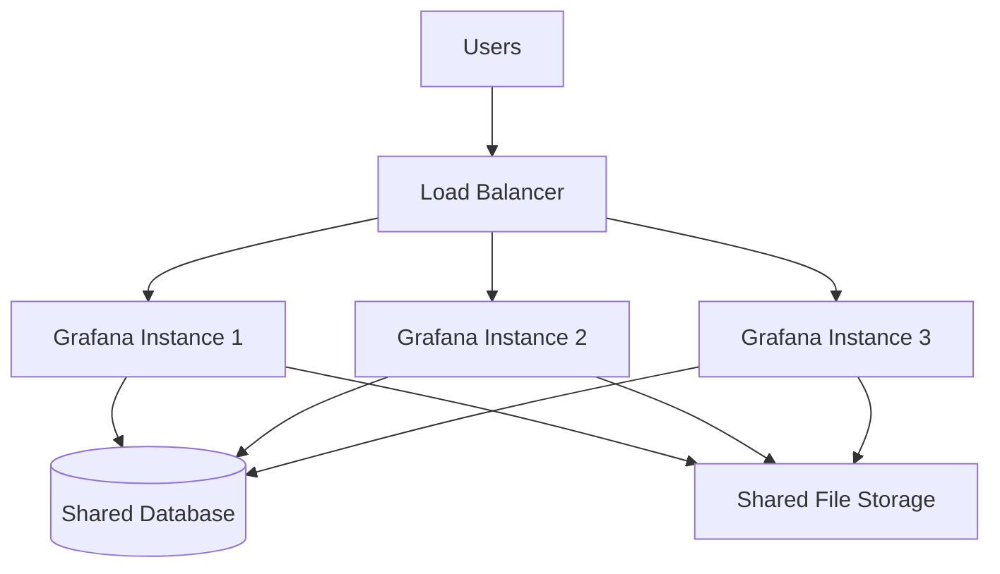
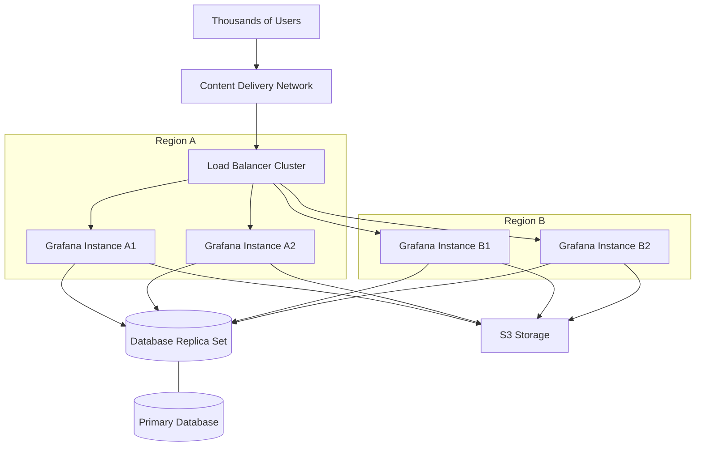

# High Availability Setup

## Introduction

High Availability (HA) is a critical aspect of any production-level monitoring system. When you rely on Grafana for visualizing metrics and creating dashboards that support critical business decisions, any downtime can have significant impacts. This guide will walk you through setting up Grafana in a high-availability configuration to ensure your monitoring system remains operational even if individual components fail.

High availability in Grafana means implementing redundancy at multiple levels to eliminate single points of failure. By configuring multiple Grafana instances behind a load balancer, you can achieve continuous uptime, increased capacity, and better fault tolerance.

## Key Concepts in Grafana High Availability

Before diving into the setup process, let's understand some key concepts:

### Stateless Architecture

Grafana instances are designed to be stateless, which means they don't store session information locally. This makes it ideal for horizontal scaling across multiple servers.

### Shared Database

All Grafana instances in an HA setup connect to the same database (MySQL, PostgreSQL) to maintain consistent state across the cluster.

### Shared Storage

For elements like plugins, dashboards, and other assets, a shared storage solution ensures all instances access the same resources.

### Load Balancer

A load balancer distributes user traffic across multiple Grafana instances, providing fault tolerance and increased capacity.

## Prerequisites

Before setting up Grafana for high availability, ensure you have:

- Multiple servers or virtual machines for Grafana instances
- A supported database (MySQL or PostgreSQL)
- Shared file storage (NFS, S3, or similar)
- A load balancer (NGINX, HAProxy, cloud load balancer)
- Grafana Enterprise license (for some HA features)

## Basic Architecture

Here's a diagram illustrating a typical Grafana high availability setup:



## Step-by-Step Implementation

### Step 1: Set Up a Shared Database

First, configure a shared database that all Grafana instances will use:

```bash
# Example PostgreSQL setup
sudo apt update
sudo apt install postgresql

# Create database and user
sudo -u postgres psql

postgres=# CREATE USER grafana WITH PASSWORD 'your_secure_password';
postgres=# CREATE DATABASE grafana WITH OWNER grafana;
postgres=# \q
```

Ensure the database is accessible from all Grafana servers with proper security measures.

### Step 2: Configure Shared File Storage

Set up shared storage for Grafana's plugins, provisioning, and other assets:

```bash
# Example using NFS
# On the NFS server
sudo apt update
sudo apt install nfs-kernel-server

# Create shared directory
sudo mkdir -p /nfs/grafana
sudo chown nobody:nogroup /nfs/grafana
sudo chmod 777 /nfs/grafana

# Edit exports file
sudo nano /etc/exports
# Add the following line:
/nfs/grafana *(rw,sync,no_subtree_check)

# Apply changes
sudo exportfs -a
sudo systemctl restart nfs-kernel-server
```

On each Grafana server:

```bash
# Install NFS client
sudo apt install nfs-common

# Create mount point
sudo mkdir -p /var/lib/grafana/shared

# Mount the shared directory
sudo mount nfs-server-ip:/nfs/grafana /var/lib/grafana/shared

# Add to fstab for persistence
echo "nfs-server-ip:/nfs/grafana /var/lib/grafana/shared nfs defaults 0 0" | sudo tee -a /etc/fstab
```

### Step 3: Install and Configure Grafana on Each Server

Install Grafana on all servers:

```bash
sudo apt-get install -y apt-transport-https
sudo apt-get install -y software-properties-common wget
wget -q -O - https://packages.grafana.com/gpg.key | sudo apt-key add -
echo "deb https://packages.grafana.com/oss/deb stable main" | sudo tee -a /etc/apt/sources.list.d/grafana.list
sudo apt-get update
sudo apt-get install grafana
```

Configure each Grafana instance to use the shared database and storage by editing `/etc/grafana/grafana.ini`:

```ini
[database]
type = postgres
host = your-db-server:5432
name = grafana
user = grafana
password = your_secure_password

[paths]
data = /var/lib/grafana/shared/data
logs = /var/lib/grafana/shared/logs
plugins = /var/lib/grafana/shared/plugins
provisioning = /var/lib/grafana/shared/provisioning

[server]
# Give each server a unique name
instance_name = grafana-server-01
```

### Step 4: Configure the Load Balancer

Set up a load balancer to distribute traffic. Here's an example using NGINX:

```bash
sudo apt update
sudo apt install nginx

# Create configuration file
sudo nano /etc/nginx/sites-available/grafana
```

Add the following configuration:

```nginx
upstream grafana {
    server grafana-server-1:3000;
    server grafana-server-2:3000;
    server grafana-server-3:3000;
}

server {
    listen 80;
    server_name grafana.yourdomain.com;

    location / {
        proxy_pass http://grafana;
        proxy_set_header Host $http_host;
        proxy_set_header X-Real-IP $remote_addr;
        proxy_set_header X-Forwarded-For $proxy_add_x_forwarded_for;
        proxy_set_header X-Forwarded-Proto $scheme;
    }
}
```

Enable the configuration:

```bash
sudo ln -s /etc/nginx/sites-available/grafana /etc/nginx/sites-enabled/
sudo nginx -t
sudo systemctl restart nginx
```

### Step 5: Start Grafana Services

Start Grafana on all servers:

```bash
sudo systemctl enable grafana-server
sudo systemctl start grafana-server
```

Verify that all instances are running:

```bash
sudo systemctl status grafana-server
```

## Advanced Configuration Options

### Session Management

For better user experience, configure sticky sessions in your load balancer:

```nginx
upstream grafana {
    server grafana-server-1:3000;
    server grafana-server-2:3000;
    server grafana-server-3:3000;
    hash $remote_addr consistent;
}
```

### Alerting HA Setup

For Grafana's alerting system in HA mode, configure the following in `grafana.ini`:

```ini
[unified_alerting]
ha_peers = grafana-server-1:9094,grafana-server-2:9094,grafana-server-3:9094
ha_listen_address = your-server-ip:9094
```

### Monitoring Your HA Setup

It's essential to monitor your Grafana HA setup itself. Configure each Grafana instance to expose metrics:

```ini
[metrics]
enabled = true
```

Then, set up Prometheus to scrape these metrics and create a dashboard in Grafana to monitor the health of your Grafana cluster.

## Performance Considerations

When running Grafana in HA mode, consider these performance optimizations:

1. **Database Performance**: Ensure your database is properly sized and optimized
2. **Connection Pooling**: Adjust max_open_conn and max_idle_conn settings
3. **Caching**: Configure Redis for caching to reduce database load

```ini
[database]
max_open_conn = 100
max_idle_conn = 50

[remote_cache]
type = redis
connstr = addr=redis-server:6379,pool_size=100,db=0,ssl=false
```

## Real-World Example: Scaling Grafana for Large Enterprise

Let's look at a real-world example of scaling Grafana for a large enterprise with thousands of users and dashboards:



In this enterprise setup:
- Multiple regions provide geographic redundancy
- Multiple instances per region handle load and provide redundancy
- Database replication ensures data consistency and backup
- Cloud storage like S3 provides scalable shared storage
- CDN caches static assets for faster loading

## Troubleshooting

### Common Issues and Solutions

1. **Database Connection Issues**

If Grafana instances can't connect to the database:

```bash
# Check database connectivity
pg_isready -h your-db-server -p 5432

# Check Grafana logs
sudo tail -f /var/log/grafana/grafana.log
```

2. **File Permission Problems**

If you encounter permission issues with shared storage:

```bash
# Fix permissions
sudo chown -R grafana:grafana /var/lib/grafana/shared
```

3. **Load Balancer Health Checks**

If instances are being marked as unhealthy:

```bash
# Check Grafana health endpoint
curl http://localhost:3000/api/health
```

## Summary

Setting up Grafana in a high-availability configuration ensures your monitoring system remains operational even during failures. By implementing a shared database, shared storage, and load balancing across multiple Grafana instances, you create a robust and reliable monitoring platform.

Remember these key takeaways:
- High availability eliminates single points of failure
- Shared database and storage ensure consistent state across instances
- Load balancing distributes traffic and provides redundancy
- Regular testing of failover scenarios is essential
- Monitoring your HA setup itself is crucial

## Exercises

1. Set up a basic Grafana HA environment with two instances using Docker Compose
2. Create a failover test by shutting down one Grafana instance and verify continued operation
3. Configure Prometheus to monitor your Grafana HA setup and create an alert for instance failures
4. Implement Redis caching for your Grafana HA setup and measure performance improvements

## Additional Resources

- [Grafana High Availability Documentation](https://grafana.com/docs/grafana/latest/setup-grafana/set-up-for-high-availability/)
- [Database Configuration Guide](https://grafana.com/docs/grafana/latest/setup-grafana/configure-grafana/database/)
- [Load Balancing Best Practices](https://grafana.com/docs/grafana/latest/setup-grafana/configure-security/configure-authentication/enhanced-ldap/)
- [Monitoring Grafana](https://grafana.com/docs/grafana/latest/setup-grafana/set-up-for-high-availability/enable-prometheus-metrics/)